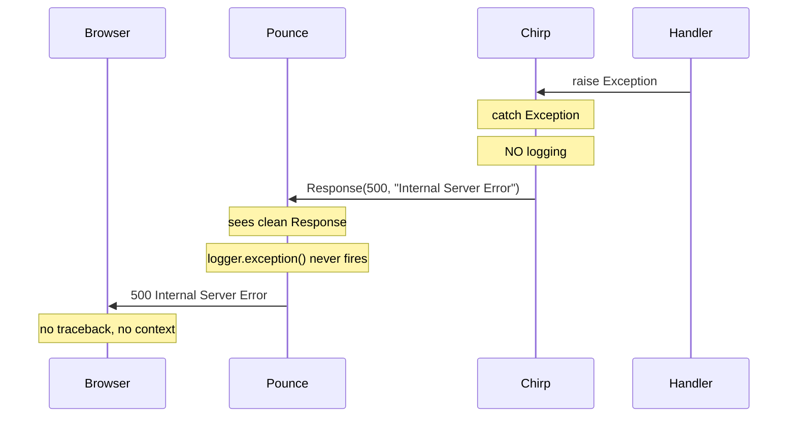
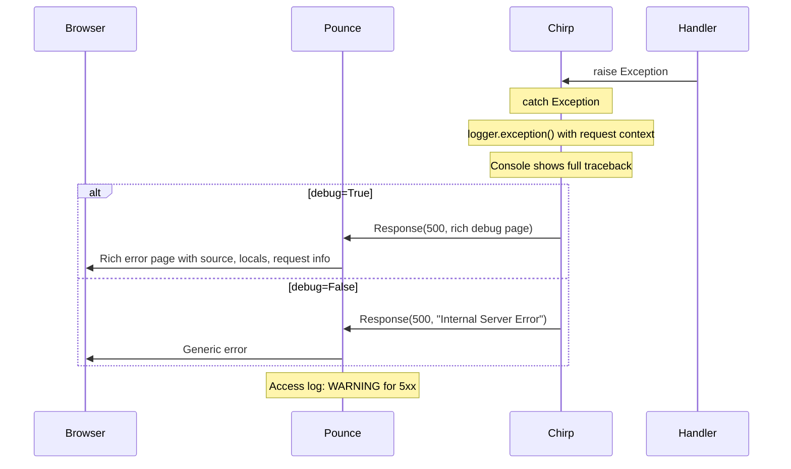

# S-Tier Error DX for Chirp + Pounce

## The Problem

When chirp catches an exception in a route handler, it converts it to a 500 Response and **never logs the traceback**. Pounce sees a clean 500 Response (not an exception), so its `logger.exception()` never fires. The traceback is captured by nobody. The developer sees `GET / 500 30 98.9ms` and nothing else.




**Chirp has zero logging today** -- no `import logging` anywhere in `src/chirp/`. This is the critical gap.

**What we have to build on:**

- Chirp already has fragment-aware error responses (`request.is_fragment`)
- Chirp has custom error handler registration (`@app.error(404)`)
- Kida already has rich error messages with source locations, caret pointers, fuzzy "did you mean?" suggestions, and expression/value context on runtime errors
- Pounce already logs ASGI-level exceptions with `logger.exception()`

---

## Phase 1: Always Log (chirp) -- The Critical Fix

The one change that would have saved hours of debugging. Tracebacks must always reach the console, regardless of debug mode. Debug mode controls what the **browser** sees, not whether the **console** is informed.

### 1a. Add a chirp logger

Create a module-level logger in the error pipeline. Add `import logging` and create `logger = logging.getLogger("chirp")` at the top of [src/chirp/server/errors.py](src/chirp/server/errors.py).

### 1b. Log all 500s with request context

In `handle_internal_error()` ([errors.py:85-111](src/chirp/server/errors.py)), add `logger.exception()` **before** the debug/production branching:

```python
async def handle_internal_error(exc, request, ...):
    logger.exception(
        "500 %s %s",
        request.method,
        request.path,
    )
    # ... existing debug/production response logic ...
```

This is the one-line fix. The traceback is included automatically by `logger.exception()`.

### 1c. Log 4xx errors at DEBUG level

In `handle_http_error()` ([errors.py:53-82](src/chirp/server/errors.py)), add a debug-level log so 404s/405s are visible when `log_level=debug`:

```python
logger.debug("%d %s %s — %s", exc.status, request.method, request.path, exc.detail)
```

### 1d. Log streaming/SSE errors

In `send_streaming_response()` ([sender.py:83-96](src/chirp/server/sender.py)), add `logger.exception()` in the except block (currently it only emits an HTML comment).

In `handle_sse()` ([realtime/sse.py](src/chirp/realtime/sse.py)), add exception handling around the event generator that logs before closing the stream.

### 1e. Wire up logging to pounce's logger

Pounce already configures the `pounce` logger hierarchy. Since chirp uses `logging.getLogger("chirp")`, the output goes to stderr by default (Python root logger). For pounce-served apps, configure `chirp` logger alongside `pounce` logger in pounce's `configure_logging()` ([pounce/logging.py:25-47](src/pounce/logging.py)) so both share formatting and level.

---

## Phase 2: Rich Debug Error Page (chirp) -- The S-Tier DX

When `debug=True`, the browser should show a Phoenix/Werkzeug-quality error page.

### 2a. Independent error renderer

**Critical lesson from Django**: the error page must NOT depend on the user's kida environment. If the error IS in the template system, the error page would fail too.

Create [src/chirp/server/debug_page.py](src/chirp/server/debug_page.py) with a self-contained renderer (plain f-strings or a minimal hardcoded template). It renders the error page without importing kida.

### 2b. Traceback with source context

Extract frames from the traceback and render each with:

- 5 lines of source context around the error line (use `linecache`)
- Highlighted error line
- Local variables for each frame (from `frame.f_locals`)
- Application frames visually distinguished from framework/stdlib frames

Filter strategy (Phoenix-inspired): show all frames but **highlight app frames** (frames from the user's working directory, not from site-packages).

### 2c. Request context panel

Display alongside the traceback:

- Method, path, HTTP version
- Headers (with sensitive value masking for Authorization, Cookie, etc.)
- Query parameters
- Form data (if parsed)
- Route that matched (handler name, pattern)

### 2d. Template error integration

When the exception is a kida `TemplateSyntaxError` or `TemplateRuntimeError`, render the **kida error format** prominently:

- Template name and line number
- Source snippet with caret pointer (kida already generates this)
- Expression and values context (for runtime errors)
- "Did you mean?" suggestions (kida provides these)

This leverages kida's existing rich error data rather than reinventing it.

### 2e. Fragment-aware debug page

For htmx fragment requests (`request.is_fragment`):

- Render a compact error fragment (not a full page) with the same information
- Include `data-status="500"` attribute for CSS targeting
- Keep the existing page layout intact -- the error appears where the fragment would have

For full-page requests:

- Render the complete error page with dark theme, styled panels, collapsible frames

### 2f. Editor integration (Phoenix-inspired)

Support a `CHIRP_EDITOR` environment variable. When set, stack frame file paths become clickable links:

- `vscode://file/{path}:{line}` for VS Code
- `txmt://open?url=file://{path}&line={line}` for TextMate
- Custom pattern support: `CHIRP_EDITOR="vscode://file/__FILE__:__LINE__"`

---

## Phase 3: htmx + SSE Error Handling (chirp) -- Production-Ready

### 3a. Error response headers for htmx

When chirp returns an error response to an htmx request, include headers that help the client handle it:

- `HX-Retarget: #chirp-error` -- redirect error content to a dedicated container
- `HX-Reswap: innerHTML` -- replace (not append) the error content
- `HX-Trigger: chirpError` -- fire a client-side event for custom handling

This requires a dedicated `<div id="chirp-error">` in the page layout (document this as a recommended pattern).

### 3b. SSE error events

In `handle_sse()` ([realtime/sse.py](src/chirp/realtime/sse.py)), when the event generator raises:

1. Log the exception (Phase 1d)
2. Send an `event: error` SSE event with the error detail (debug mode: full message; production: generic)
3. Close the stream cleanly

This gives htmx client-side JS a hook to display the error (e.g., via `htmx:sseError` or a custom event listener).

### 3c. Swap-on-error configuration

Document the recommended htmx configuration for chirp apps:

```javascript
htmx.config.responseHandling = [
    {code: "204", swap: false},
    {code: "[23]..", swap: true},
    {code: "422", swap: true},   // validation errors
    {code: "[45]..", swap: false, error: true},
];
```

This is documentation + an optional helper (e.g., `chirp.error_handling_script()` template function).

---

## Phase 4: Pounce Enhancements -- Observability

### 4a. Enhanced access log for 5xx

In `access_log()` ([pounce/logging.py:50-81](src/pounce/logging.py)), use `WARNING` level for 5xx responses instead of `INFO`. This makes errors stand out visually and enables log-level filtering:

```python
level = logging.WARNING if status >= 500 else logging.INFO
access_logger.log(level, ...)
```

### 4b. Framework error header

Define an ASGI extension or response header (`X-Error-Logged: chirp`) that frameworks can set to signal "I already logged this error." Pounce can then avoid duplicate logging when it detects the framework has handled the error. This is a convention, not enforcement.

### 4c. Structured logging option

Add a `log_format: str = "text"` option to `ServerConfig` ([pounce/config.py](src/pounce/config.py)). When set to `"json"`, output structured JSON logs:

```json
{"timestamp": "...", "level": "ERROR", "logger": "pounce", "method": "GET", "path": "/", "status": 500, "duration_ms": 98.9, "message": "ASGI app error"}
```

This is a lower-priority enhancement for production observability.

---

## Architecture After




---

## Scope and Phasing

- **Phase 1** (always-log): 1-2 hours. Unblocks all debugging immediately. Ship first.
- **Phase 2** (debug page): 1-2 days. The main DX investment. Independent error renderer + source context + request panel + kida integration + editor links.
- **Phase 3** (htmx/SSE): Half day. Error headers + SSE error events + documentation.
- **Phase 4** (pounce): Half day. Access log levels + structured logging option.

Phase 1 is a prerequisite for everything else. Phases 2-4 are independent and can be done in any order.
