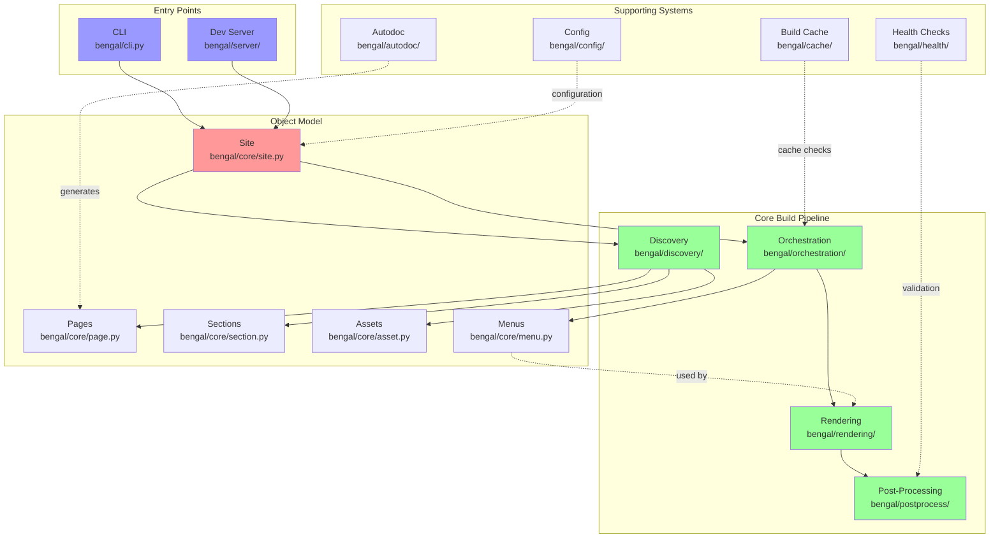
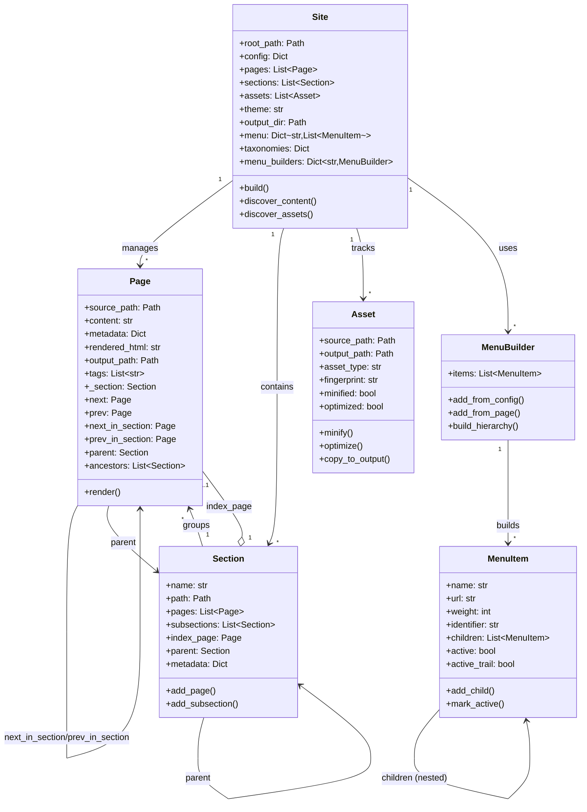
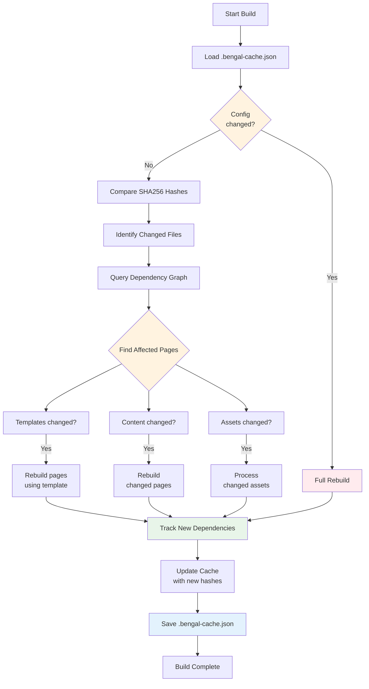
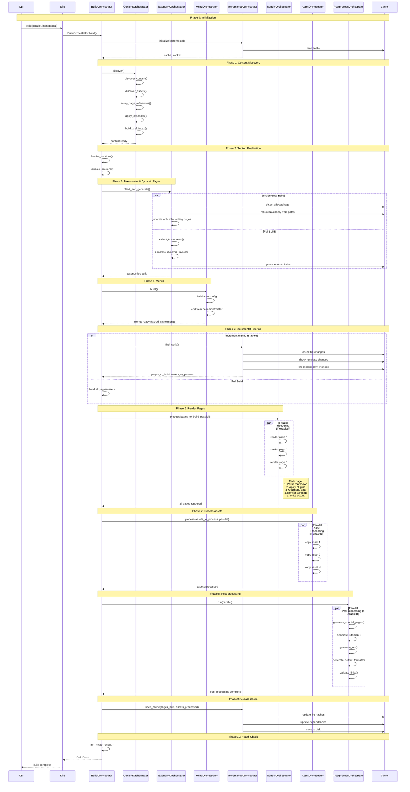
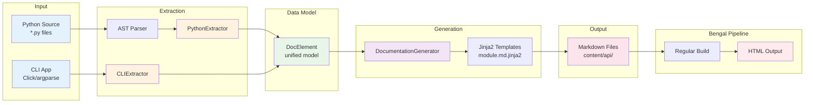

# Bengal SSG - Architecture Documentation

## Overview

Bengal SSG follows a modular architecture with clear separation of concerns to avoid "God objects" and maintain high performance even with large sites.

**Key Differentiators:**
- **AST-based Python Autodoc**: Generate Python API documentation without importing code (175+ pages/sec)
- **Incremental Builds**: 18-42x faster rebuilds with intelligent caching (verified)
- **Performance**: Built for speed with parallel processing and smart optimizations
- **Rich Content Model**: Taxonomies, navigation, menus, and cascading metadata
- **Developer Experience**: Great error messages, health checks, and file-watching dev server

## High-Level Architecture



**Key Flows:**
1. **Build**: CLI → Site → Discovery → Orchestration → [Menus + Rendering] → Post-Process
2. **Menu Building**: Orchestration builds menus → Rendering uses menus in templates
3. **Cache**: Build Cache checks file changes and dependencies before rebuilding
4. **Autodoc**: Generate Python/CLI docs → treated as regular content pages
5. **Dev Server**: Watch files → trigger incremental rebuilds → serve output

## Core Components

### 1. Object Model

#### Site Object (`bengal/core/site.py`)
- **Purpose**: Central data model that holds all site content and delegates build coordination
- **Primary Role**: Data container and coordination entry point
- **Key Attributes**:
  - `root_path`: Site root directory
  - `config`: Site configuration dictionary
  - `pages`: List of all Page objects
  - `sections`: List of all Section objects
  - `assets`: List of all Asset objects
  - `taxonomies`: Dict of taxonomies (tags, categories)
  - `menu`: Dict[str, List[MenuItem]] - All built menus by name
  - `menu_builders`: Dict[str, MenuBuilder] - Menu builders for active marking
  - `theme`: Theme name or path
  - `output_dir`: Output directory path
  - `build_time`: Timestamp of last build
- **Key Methods**:
  - `build()`: Entry point that **delegates to BuildOrchestrator**
  - `from_config()`: Factory method to create Site from config file
  - `discover_content()`: Wrapper that delegates to ContentOrchestrator
  - `discover_assets()`: Wrapper that delegates to AssetOrchestrator
  - `mark_active_menu_items()`: Mark active menu items for current page
- **Architecture Pattern**: Site is a **data container**, not a "God object" - actual build logic lives in specialized orchestrators

#### Page Object (`bengal/core/page.py`)

**Purpose**: Represents a single content page with source, metadata, rendered HTML, and navigation.

**Key Properties**:

| Category | Property | Description |
|----------|----------|-------------|
| **Content** | `title`, `date`, `slug`, `url` | Basic page metadata and URL path (date uses `bengal.utils.dates`) |
| | `description`, `keywords`, `draft` | SEO and publishing metadata |
| | `toc`, `toc_items` | Auto-generated table of contents |
| **Navigation** | `next`, `prev` | Sequential navigation across all pages |
| | `next_in_section`, `prev_in_section` | Section-specific navigation |
| | `parent`, `ancestors` | Hierarchical navigation for breadcrumbs |
| **Type Checking** | `is_home`, `is_section`, `is_page` | Boolean type checks |
| | `kind` | Type as string ('home', 'section', or 'page') |
| **Comparison** | `eq()`, `in_section()` | Page equality and section membership |
| | `is_ancestor()`, `is_descendant()` | Hierarchical relationships |
| **Rendering** | `render()` | Render page with template |
| | `validate_links()`, `extract_links()` | Link processing and validation |

#### Section Object (`bengal/core/section.py`)

**Purpose**: Represents folder-based grouping of pages with hierarchical organization and metadata inheritance.

| Feature | Properties/Methods | Description |
|---------|-------------------|-------------|
| **Navigation** | `regular_pages`, `sections` | Get immediate children (pages or subsections) |
| | `regular_pages_recursive`, `url` | Recursive descendants and section URL |
| **Methods** | `aggregate_content()` | Collect metadata from all pages |
| | `walk()` | Iterative hierarchy traversal (no recursion) |
| | `apply_section_template()` | Generate section index page |
| **Cascade** | Frontmatter inheritance | Define `cascade` in `_index.md` to apply metadata to all descendants; child values override parent; accumulates through hierarchy |

#### Asset Object (`bengal/core/asset.py`)

**Purpose**: Handles static files (images, CSS, JS) with optimization and cache busting.

| Method | Description |
|--------|-------------|
| `minify()` | Minify CSS/JS files |
| `optimize()` | Optimize images |
| `hash()` | Generate fingerprint for cache busting |
| `copy_to_output()` | Copy to output directory |

#### Menu System (`bengal/core/menu.py`)
- **Purpose**: Provides hierarchical navigation menus
- **Components**:
  - **MenuItem**: Dataclass representing a menu item
    - Supports nesting (parent/child relationships)
    - Weight-based sorting
    - Active state detection
    - Active trail marking (parent items)
  - **MenuBuilder**: Constructs menu hierarchies
    - Parses config-defined menus
    - Integrates page frontmatter menus
    - Builds hierarchical structure
    - Marks active items per page
- **Features**:
  - Config-driven (TOML/YAML)
  - Page frontmatter integration
  - Multiple menus (main, footer, custom)
  - Nested/dropdown support
  - Automatic active detection

#### Page Navigation System
- **Purpose**: Provides rich navigation between pages and through site hierarchy
- **Automatic Setup**: Page references are automatically configured during `discover_content()`
- **Navigation Types**:
  - **Sequential Navigation**: `page.next` and `page.prev` for moving through all pages
  - **Section Navigation**: `page.next_in_section` and `page.prev_in_section` for section-specific navigation
  - **Hierarchical Navigation**: `page.parent` and `page.ancestors` for breadcrumbs and hierarchy
- **Template Usage**:
  ```jinja2
  {# Previous/Next links #}
  
    <a href="{{ url_for(page.prev) }}">← {{ page.prev.title }}</a>
  
  
  {# Breadcrumbs #}
  
    <a href="{{ url_for(ancestor) }}">{{ ancestor.title }}</a> /
  
  
  {# Section pages #}
  
    
      {{ child.title }}
    
  
  ```

#### Cascade System (Frontmatter Inheritance)

**Purpose**: Apply metadata from section index pages to all descendant pages.

**How It Works**: Define `cascade` in `_index.md` frontmatter; all pages in that section inherit the metadata; page values override cascaded values; cascades accumulate through hierarchy.

**Example**:
```yaml
# content/products/_index.md
---
title: "Products"
cascade:
  type: "product"
  layout: "product-page"
  show_price: true
---
```

**Use Cases**: Consistent layouts, default types, section-wide settings, DRY frontmatter.

#### Object Model Relationships



**Key Relationships:**
- **Site** is the root object that manages everything
- **Sections** organize **Pages** hierarchically
- **Pages** have rich navigation (next/prev, parent, ancestors)
- **Cascade** flows metadata from Sections → Pages
- **Menus** are built from config + page frontmatter

### 2. Cache System

Bengal implements an intelligent caching system for incremental builds. Benchmarks show 18-42x faster rebuilds on sites with 10-100 pages.

#### Build Cache (`bengal/cache/build_cache.py`)

**Purpose**: Tracks file changes between builds using SHA256 hashing and dependency graphs. Persisted as `.bengal-cache.json`.

| Method | Description |
|--------|-------------|
| `is_changed(path)` | Check if file has changed since last build |
| `add_dependency(source, dependency)` | Record file dependencies (page → template/partial) |
| `get_affected_pages(changed_file)` | Find all pages needing rebuild based on dependency graph |
| `update_page_tags(path, tags)` | Update taxonomy inverted index, returns affected tags |
| `get_pages_for_tag(tag)` | Get all page paths for a specific tag (O(1) lookup) |
| `get_all_tags()` | Get all known tags from previous build |
| `save()` / `load()` | Persist cache between builds |

**Inverted Index Pattern**: The cache stores a bidirectional mapping between pages and tags:
- **Forward index**: `page_tags` (page path → set of tags)
- **Inverted index**: `tag_to_pages` (tag slug → set of page paths)

This enables efficient taxonomy reconstruction without persisting object references:
```python
# Only paths stored in cache, never object references
cache.tag_to_pages['python'] = {'content/post1.md', 'content/post2.md'}

# During build: Reconstruct with current Page objects
current_page_map = {p.source_path: p for p in site.pages}
pages_for_tag = [current_page_map[path] for path in cache.get_pages_for_tag('python')]
```

**Key Design Principle**: "Never persist object references across builds" - cache stores paths and hashes, relationships are reconstructed from current objects each build.

#### Dependency Tracker (`bengal/cache/dependency_tracker.py`)
- **Purpose**: Tracks dependencies during the build process
- **Tracks**:
  - Page → template dependencies
  - Page → partial dependencies
  - Page → config dependencies
  - Taxonomy (tag) → page relationships
- **Usage**: Integrated with rendering pipeline to build dependency graph

#### Incremental Build Flow



**Cache Decision Logic:**
1. **Load cache** from `.bengal-cache.json` (or create if first build)
2. **Check config** - if `bengal.toml` changed → full rebuild
3. **Compare hashes** - SHA256 of all tracked files
4. **Query dependency graph** - find pages affected by changes
5. **Selective rebuild** - only pages that changed or depend on changed files
6. **Track dependencies** - during rendering, record what each page uses
7. **Update cache** - save new hashes and dependency graph
8. **Save cache** - persist to disk for next build

**Result**: 18-42x faster rebuilds measured on 10-100 page sites.

**Implemented Features:**
- Template dependency tracking (pages → templates/partials)
- Taxonomy dependency tracking (tags → pages) with inverted index pattern
- Config change detection (forces full rebuild)
- Verbose mode (`--verbose` flag shows what changed)
- Asset change detection (selective processing)
- Object reference safety (cache stores paths, not objects)

**Performance Measurements (October 2025):**
- Small sites (10 pages): 18.3x speedup (0.223s → 0.012s)
- Medium sites (50 pages): 41.6x speedup (0.839s → 0.020s)
- Large sites (100 pages): 35.6x speedup (1.688s → 0.047s)

Performance on larger sites (1000+ pages) has not been benchmarked yet.

**CLI Usage:**
```bash
# Incremental build
bengal build --incremental

# With detailed change information
bengal build --incremental --verbose
```

#### Build Pipeline Flow



**Pipeline Phases:**

0. **Initialization**: Load cache, set up dependency tracker
1. **Content Discovery**: Find pages/sections/assets, setup references, apply cascades, build xref index
2. **Section Finalization**: Ensure all sections have index pages, validate structure
3. **Taxonomies**: Collect tags/categories (incremental: detect affected tags + rebuild from cache paths), generate tag pages and pagination
4. **Menus**: Build navigation from config + page frontmatter (stored in `site.menu`)
5. **Incremental Filtering**: Determine what needs rebuilding (pages, assets, affected dependencies)
6. **Rendering**: Parse markdown → apply plugins → render templates (uses `site.menu`) → write HTML
7. **Assets**: Copy/process static files from site and theme
8. **Post-processing**: Generate sitemap, RSS, output formats, validate links (can run in parallel)
9. **Cache Update**: Save file hashes, dependencies, and taxonomy inverted index for next incremental build
10. **Health Check**: Validate build output, check for broken links, performance metrics

**Key Architecture Patterns:**

- **Delegation**: `Site.build()` immediately delegates to `BuildOrchestrator.build()`
- **Specialized Orchestrators**: Each build concern has a dedicated orchestrator class
- **Bulk Filtering**: Incremental builds filter upfront (Phase 5), then process filtered lists
- **Parallelization**: Phases 6, 7, and 8 can process items in parallel for performance
- **Menu Access**: Menus built once in Phase 4, accessed from `site.menu` during rendering

### 3. Rendering Pipeline

The rendering pipeline is divided into clear stages:

```
Parse → Build AST → Apply Templates → Render Output → Post-process
```

#### Rendering Flow Detail

```mermaid
flowchart TD
    Start[Markdown File] --> VarSub[Variable Substitution<br/>Preprocessing]
    VarSub --> Parse[Parse Markdown<br/>Mistune]
    
    Parse --> Plugins{Mistune Plugins}
    Plugins --> P1[Built-in: table, strikethrough,<br/>task_lists, url, footnotes, def_list]
    Plugins --> P2[Custom: Documentation Directives<br/>admonitions, tabs, dropdowns, code_tabs]
    
    P1 --> AST[Abstract Syntax Tree]
    P2 --> AST
    
    AST --> HTML1[Generate HTML]
    HTML1 --> PostProc[Post-Processing]
    PostProc --> XRef[Cross-Reference Links [[...]]]
    PostProc --> Anchors[Heading Anchors & IDs]
    PostProc --> TOC[TOC Extraction]
    
    XRef --> HTML2[HTML with Links & Anchors]
    Anchors --> HTML2
    TOC --> HTML2
    
    HTML2 --> APIEnhance{API Reference Page?}
    APIEnhance -->|Yes| Badges[Inject Badges<br/>@async, @property, etc.]
    APIEnhance -->|No| HTML3[Enhanced HTML]
    Badges --> HTML3
    
    HTML3 --> Links[Extract Links<br/>for Validation]
    Links --> Context[Build Template Context]
    
    Context --> ContextData{Context Includes}
    ContextData --> Page[page object]
    ContextData --> Site[site object]
    ContextData --> Config[config]
    ContextData --> Functions[80+ template functions]
    ContextData --> Content[content HTML]
    ContextData --> TOCData[toc, toc_items]
    
    Page --> Jinja[Jinja2 Template Engine]
    Site --> Jinja
    Config --> Jinja
    Functions --> Jinja
    Content --> Jinja
    TOCData --> Jinja
    
    Jinja --> Template[Apply Template]
    Template --> FinalHTML[Final HTML]
    
    FinalHTML --> Output[Atomic Write to public/]
    
    style VarSub fill:#ffe6e6
    style Parse fill:#e1f5ff
    style P1 fill:#fff4e6
    style P2 fill:#fff4e6
    style PostProc fill:#f0e6ff
    style APIEnhance fill:#e6ffe6
    style Jinja fill:#e8f5e9
    style FinalHTML fill:#f3e5f5
```

**Key Features:**
- **Three-Stage Processing**: Pre-processing (variables) → Parsing (plugins) → Post-processing (xrefs, anchors)
- **Variable Substitution**: `{{ page.title }}` replaced BEFORE Mistune parsing (natural code block protection)
- **Plugin Architecture**: Built-in Mistune plugins + custom documentation directives during parsing
- **Post-Processing**: Cross-references, heading anchors, and TOC extracted AFTER HTML generation
- **API Enhancement**: Special badge injection for API reference pages (@async, @property markers)
- **Rich Context**: Templates have access to entire site, page navigation, taxonomies, 80+ functions
- **Atomic Writes**: Crash-safe file writing with atomic operations

#### Template Functions (`bengal/rendering/template_functions/`)
- **Purpose**: Provide 80+ custom filters and functions for templates
- **Organization**: Modular design with self-registering modules across 16 focused modules
- **Architecture**: Each module has single responsibility (no monolithic classes)
- **Built on Utilities**: Many functions now delegate to `bengal/utils/` modules for consistent behavior
- **Testing**: 335+ tests with 71-98% coverage across function modules
- **Documentation**: See template function modules for detailed documentation
- **Modules (16 total)**:
  - **Strings (11 functions)**: `truncatewords`, `slugify`, `markdownify`, `strip_html`, `excerpt`, `reading_time`, etc. (uses `bengal.utils.text`)
  - **Collections (8 functions)**: `where`, `where_not`, `group_by`, `sort_by`, `limit`, `offset`, `uniq`, `flatten`
  - **Math (6 functions)**: `percentage`, `times`, `divided_by`, `ceil`, `floor`, `round`
  - **Dates (3 functions)**: `time_ago`, `date_iso`, `date_rfc822` (uses `bengal.utils.dates`)
  - **URLs (3 functions)**: `absolute_url`, `url_encode`, `url_decode`
  - **Content (6 functions)**: `safe_html`, `html_escape`, `html_unescape`, `nl2br`, `smartquotes`, `emojify` (uses `bengal.utils.text`)
  - **Data (8 functions)**: `get_data`, `jsonify`, `merge`, `has_key`, `get_nested`, `keys`, `values`, `items` (uses `bengal.utils.file_io`)
  - **Advanced Strings (5 functions)**: `camelize`, `underscore`, `titleize`, `wrap_text`, `indent_text`
  - **Files (3 functions)**: `read_file`, `file_exists`, `file_size` (uses `bengal.utils.file_io`)
  - **Advanced Collections (3 functions)**: `sample`, `shuffle`, `chunk`
  - **Images (6 functions)**: `image_url`, `image_dimensions`, `image_srcset`, `image_srcset_gen`, `image_alt`, `image_data_uri`
  - **SEO (4 functions)**: `meta_description`, `meta_keywords`, `canonical_url`, `og_image`
  - **Debug (3 functions)**: `debug`, `typeof`, `inspect`
  - **Taxonomies (4 functions)**: `related_posts`, `popular_tags`, `tag_url`, `has_tag` (uses `bengal.utils.text`)
  - **Pagination (3 functions)**: `paginate`, `page_url`, `page_range`
  - **Cross-reference (5 functions)**: `ref`, `doc`, `anchor`, `relref`, etc.

#### Parser (`bengal/rendering/parser.py`)
- **Multi-Engine Architecture**: Supports multiple Markdown parsers with unified interface
- **Base Parser Interface**: `BaseMarkdownParser` ABC defines contract for all parsers
- **Factory Pattern**: `create_markdown_parser(engine)` returns appropriate parser instance
- **Thread-Local Caching**: Parser instances reused per thread for performance
- **Uses Utilities**: Delegates to `bengal.utils.text.slugify()` for heading ID generation
- **Supported Engines**:
  - **`python-markdown`** (default): Feature-rich (3.78s for 78 pages)
  - **`mistune`** (recommended): Faster parser with full doc features (2.18s for 78 pages, 42% faster)
- **Configuration**: Select engine via `bengal.toml`:
  ```toml
  [build]
  markdown_engine = "mistune"  # or "python-markdown"
  ```

##### Mistune Plugins (`bengal/rendering/plugins/`)
- **Modular Plugin System**: Each plugin in focused ~100-200 line file
- **Core Plugins**:
  - `variable_substitution.py`: {{ variable }} in markdown content
  - `cross_references.py`: [[link]] syntax for internal references
- **Documentation Directives** (`directives/`):
  - `admonitions.py`: Callout boxes (note, warning, tip, etc.)
  - `tabs.py`: Tabbed content sections
  - `dropdown.py`: Collapsible sections
  - `code_tabs.py`: Multi-language code examples
- **Clean API**: Only 3 main exports, rest is internal
- **Extensible**: Add new plugins without touching existing code
- **See**: `bengal/rendering/plugins/README.md` for details

##### Mistune Parser (`MistuneParser`)
- **Performance**: 52% faster rendering, 42% faster total builds
- **Built-in Features**:
  - GFM tables, footnotes, definition lists
  - Task lists, strikethrough, autolinks
  - Code blocks (fenced + inline)
- **Custom Plugins**:
  - **Admonitions**: `!!! note "Title"` syntax (7+ types)
  - **Directives**: Fenced directives for rich content (` ```{name} `)
    - **Tabs**: Multi-tab content with markdown support
    - **Dropdowns**: Collapsible sections
    - **Code-tabs**: Multi-language code examples (partial support)
  - **Variable Substitution**: `{{ page.metadata.xxx }}` in markdown content
  - **TOC Generation**: Extracts h2-h4 headings with slugs
  - **Heading IDs**: Auto-generated with permalink anchors
- **Nesting Support**: Full recursive markdown parsing inside directives
- **Plugin Architecture**: Extensible via `mistune.DirectivePlugin`
- **Location**: Core parser in `bengal/rendering/parser.py`, plugins in `bengal/rendering/mistune_plugins.py`

##### Variable Substitution in Markdown Content

**Purpose**: Insert dynamic frontmatter values into markdown content (DRY principle).  
**Architecture**: Single-pass Mistune plugin at AST level; code blocks stay literal automatically.

**Supported Syntax**:
```markdown
Welcome to {{ page.metadata.product_name }} version {{ page.metadata.version }}.
Connect to {{ page.metadata.api_url }}/users
```

**What's Supported**: `{{ page.metadata.xxx }}`, `{{ page.title }}`, `{{ site.config.xxx }}`  
**Not Supported**: Conditionals (``), loops (``), complex logic → use templates instead

**Design Rationale**: Separation of concerns (like Hugo) - content uses simple variables, templates handle logic. Code blocks remain literal without escaping.

##### Parser Performance Comparison
| Parser | Time (78 pages) | Throughput | Features |
|--------|----------------|------------|----------|
| python-markdown | 3.78s | 20.6 pages/s | 100% (attribute lists) |
| **mistune** | **2.18s** | **35.8 pages/s** | 95% (no attribute lists) |

Mistune is recommended for most use cases due to faster performance.

#### Template Engine (`bengal/rendering/template_engine.py`)
- Jinja2-based templating
- Supports nested templates and partials
- 75 custom template functions organized in focused modules
- Multiple template directories (custom, theme, default)
- Template dependency tracking for incremental builds
- Tracks includes, extends, and imports automatically

#### Renderer (`bengal/rendering/renderer.py`)
- Applies templates to pages
- Determines which template to use based on page metadata
- Fallback rendering for error cases

#### Pipeline Coordinator (`bengal/rendering/pipeline.py`)
- Orchestrates all stages for each page
- Handles output path determination
- Writes final output to disk
- Integrates with DependencyTracker for incremental builds
- Tracks template usage during rendering

### 4. Autodoc System

Bengal includes an **automatic documentation generation system** that extracts API documentation from Python source code using AST-based static analysis.

#### Overview

The autodoc system extracts documentation without importing code, making it:
- **Fast** (175+ pages/sec measured)
- **Reliable** (no import errors, no side effects)
- **Environment-independent** (works without installing dependencies)
- **Currently Supports**: Python (AST-based), CLI (Click framework only)
- **Planned**: OpenAPI/REST API documentation, argparse/typer CLI support

**Performance**: 175+ pages/sec (0.57s for Bengal's 99 modules)

#### Architecture (`bengal/autodoc/`)

The autodoc system follows a clean extractor → generator → template architecture:



**Key Design Principles:**
- **No Imports**: AST-based extraction means no dependency installation needed
- **Unified Model**: DocElement provides consistent structure across extractors
- **Extensible**: New extractors (OpenAPI, GraphQL) can use same pipeline
- **Two-Pass**: Generate Markdown first, then render with Bengal's full pipeline

#### Base Classes (`bengal/autodoc/base.py`)

**DocElement**: Unified data model for all documented elements
- Used by all extractors (Python, OpenAPI, CLI)
- Represents functions, classes, methods, endpoints, commands, etc.
- Fields: name, qualified_name, description, element_type, metadata, children, examples
- Supports serialization for caching

**Extractor**: Abstract base class for documentation extractors
- `extract(source)`: Extract DocElements from source
- `get_template_dir()`: Template directory name
- `get_output_path(element)`: Output path determination
- Pluggable architecture for different source types

#### Python Extractor (`bengal/autodoc/extractors/python.py`)

**PythonExtractor**: AST-based Python API documentation extractor
- **No imports**: Parses source via `ast` module
- **Type hints**: Extracts from annotations (PEP 484/585)
- **Signatures**: Builds complete function/method signatures
- **Docstrings**: Integrates with docstring parser
- **Inheritance**: Tracks base classes and method resolution
- **Decorators**: Detects @property, @classmethod, @staticmethod, etc.

**Extracted Elements**:
- Modules (with submodules)
- Classes (with methods, properties, attributes)
- Functions (standalone and methods)
- Type hints and signatures
- Docstrings and metadata

**Example**:
```python
# Source code
class Site:
    """Orchestrates website builds."""
    
    def build(self, parallel: bool = True) -> BuildStats:
        """Build the entire site.
        
        Args:
            parallel: Enable parallel processing
            
        Returns:
            BuildStats with timing information
        """
        ...

# Extracted DocElement
DocElement(
    name='build',
    qualified_name='bengal.core.site.Site.build',
    element_type='method',
    metadata={
        'signature': 'def build(self, parallel: bool = True) -> BuildStats',
        'args': [{'name': 'parallel', 'type': 'bool', 'default': 'True'}],
        'returns': {'type': 'BuildStats'},
    }
)
```

#### Docstring Parser (`bengal/autodoc/docstring_parser.py`)

**DocstringParser**: Extracts structured data from docstrings
- **Auto-detection**: Recognizes Google, NumPy, Sphinx styles
- **Sections**: Extracts Args, Returns, Raises, Examples, See Also, etc.
- **Type info**: Parses type specifications from docstrings
- **Examples**: Extracts code examples from docstrings
- **Metadata**: Parses Deprecated, Added, Notes, Warnings

**Supported Styles**:
```python
# Google Style
def foo(x: int) -> str:
    """Short description.
    
    Args:
        x: Parameter description
        
    Returns:
        Return value description
        
    Raises:
        ValueError: When x is negative
    """

# NumPy Style
def bar(x):
    """
    Short description.
    
    Parameters
    ----------
    x : int
        Parameter description
        
    Returns
    -------
    str
        Return value description
    """

# Sphinx Style
def baz(x):
    """
    Short description.
    
    :param x: Parameter description
    :type x: int
    :returns: Return value description
    :rtype: str
    """
```

#### Documentation Generator (`bengal/autodoc/generator.py`)

**DocumentationGenerator**: Renders DocElements to Markdown
- **Template-based**: Uses Jinja2 templates
- **Two-layer rendering**:
  - Layer 1: DocElements → Markdown (`.md.jinja2` templates)
  - Layer 2: Markdown → HTML (standard Bengal templates)
- **Parallel processing**: Can generate docs concurrently
- **Caching**: Avoids regenerating unchanged modules
- **Cross-references**: Resolves `[[ClassName.method]]` links

**Template Resolution**:
1. Custom templates (`templates/autodoc/python/`)
2. Theme templates (`themes/{name}/autodoc/python/`)
3. Default templates (`bengal/autodoc/templates/python/`)

#### Configuration (`bengal/autodoc/config.py`)

Autodoc is configured via `bengal.toml`:

```toml
[autodoc.python]
enabled = true
source_dirs = ["src/mylib", "bengal"]
output_dir = "content/api"
docstring_style = "auto"  # auto, google, numpy, sphinx
exclude = ["*/tests/*", "*/test_*.py"]
include_private = false
include_undocumented = false
```

**Settings**:
- `enabled`: Enable Python autodoc
- `source_dirs`: List of directories to document
- `output_dir`: Where to write markdown files
- `docstring_style`: Docstring format detection
- `exclude`: Glob patterns to exclude
- `include_private`: Include `_private` members
- `include_undocumented`: Include items without docstrings

#### CLI Integration

```bash
# Generate API docs from config
bengal autodoc

# Override source/output
bengal autodoc --source mylib --output content/api

# Show extraction stats
bengal autodoc --stats --verbose
```

#### Templates (`bengal/autodoc/templates/`)

**Default Templates**:
- `python/module.md.jinja2`: Module documentation
- `python/class.md.jinja2`: Class documentation (future)
- `python/function.md.jinja2`: Function documentation (future)

**Template Context**:
```jinja2
{# templates/autodoc/python/module.md.jinja2 #}
---
title: "{{ element.name }}"
type: api-reference
---

# {{ element.name }}

{{ element.description }}

## Classes


### {{ cls.name }}

{{ cls.description }}


#### {{ method.name }}

```python
{{ method.metadata.signature }}
```

{{ method.description }}


**Arguments:**

- `{{ arg.name }}` ({{ arg.type }}): {{ arg.description }}




**Returns:** {{ method.metadata.returns.type }} - {{ method.metadata.returns.description }}



```

#### CLI Extractor (`bengal/autodoc/extractors/cli.py`)

**Status**: ✅ **Partially Implemented**

The CLI extractor supports:
- ✅ **Click**: Full support for Click command groups, commands, options, and arguments
- 📋 **argparse**: Planned (framework accepted but extraction not implemented)
- 📋 **typer**: Planned (framework accepted but extraction not implemented)

**Usage**:
```bash
bengal autodoc-cli --app myapp.cli:main --framework click
```

#### Planned Extractors

**Not Yet Implemented**:
- `OpenAPIExtractor`: REST API documentation from OpenAPI specs or FastAPI apps
- `GraphQLExtractor`: GraphQL schema documentation
- Full argparse/typer CLI support

#### Performance Characteristics

**Benchmark Results** (October 2025):
- **99 modules** documented in 0.57s
- **Extraction**: 0.40s (247 modules/sec)
- **Generation**: 0.16s (618 pages/sec)
- **Overall**: 175 pages/sec

**Advantages vs Traditional Tools**:
- Fast AST-based extraction (no imports needed)
- No import errors or side effects
- Works without installing project dependencies
- Integrates with Bengal's incremental build cache

#### Integration with Bengal Pipeline

Autodoc-generated markdown files are treated as regular content:
- Discovered by content discovery
- Rendered with templates
- Included in search index
- Accessible via menus
- Full access to taxonomies, navigation, etc.

**Example Flow**:
```bash
# 1. Generate API docs
bengal autodoc
  → Creates content/api/*.md files

# 2. Build site (includes API docs)
bengal build
  → Discovers content/api/*.md
  → Renders with templates
  → Generates public/api/*.html

# 3. Serve with dev server
bengal serve
  → API docs included
  → Watch mode regenerates on source changes
```

#### Migration from Other Tools

**Note**: Migration tools are not yet implemented. Users migrating from Sphinx or other documentation generators will need to manually configure Bengal's autodoc system.

#### Real-World Usage

**Bengal's own docs** (examples/showcase):
- 99 modules documented
- 81 classes, 144 functions
- 0.57s generation time
- Full site build < 1 second
- Complete API reference at `/api/`

### 5. Discovery System

#### Content Discovery (`bengal/discovery/content_discovery.py`)
- Walks content directory recursively
- Creates Page and Section objects
- Parses frontmatter
- Organizes content into hierarchy
- **Includes autodoc-generated markdown files**
- **Uses Utilities**: Delegates to `bengal.utils.file_io.read_text_file()` for robust file reading with encoding fallback

#### Asset Discovery (`bengal/discovery/asset_discovery.py`)
- Finds all static assets
- Preserves directory structure
- Creates Asset objects with metadata

### 6. Configuration System

#### Config Loader (`bengal/config/loader.py`)
- Supports TOML and YAML formats
- Auto-detects config files
- Provides sensible defaults
- Flattens nested configuration for easy access
- **Uses Utilities**: Delegates to `bengal.utils.file_io` for robust file loading with error handling

### 7. Post-Processing

#### Sitemap Generator (`bengal/postprocess/sitemap.py`)
- Generates XML sitemap for SEO
- Includes all pages with metadata
- Configurable priority and change frequency

#### RSS Generator (`bengal/postprocess/rss.py`)
- Generates RSS feed
- Includes recent posts
- Supports custom descriptions

#### Link Validator (`bengal/rendering/link_validator.py`)
- Validates internal and external links
- Reports broken links
- Can be extended for comprehensive validation

### 8. Development Server

#### Dev Server (`bengal/server/dev_server.py`)
- Built-in HTTP server
- File system watching with watchdog
- Automatic rebuild on changes
- Hot reload support (future enhancement)

### 9. Health Check System (`bengal/health/`)

Bengal includes a comprehensive health check system that validates builds across all components.

#### Health Check (`bengal/health/health_check.py`)
- **Purpose**: Orchestrates validators and produces unified health reports
- **Features**:
  - Modular validator architecture
  - Fast execution (< 100ms per validator)
  - Configurable per-validator enable/disable
  - Console and JSON report formats
  - Integration with build stats
- **Usage**:
  ```python
  from bengal.health import HealthCheck
  
  health = HealthCheck(site)
  report = health.run(build_stats=stats)
  print(report.format_console())
  ```

#### Base Validator (`bengal/health/base.py`)
- **Purpose**: Abstract base class for all validators
- **Interface**: `validate(site) -> List[CheckResult]`
- **Features**:
  - Independent execution (no validator dependencies)
  - Error handling and crash recovery
  - Performance tracking per validator
  - Configuration-based enablement

#### Health Report (`bengal/health/report.py`)
- **Purpose**: Unified reporting structure for health check results
- **Components**:
  - `CheckStatus`: SUCCESS, INFO, WARNING, ERROR
  - `CheckResult`: Individual check result with recommendation
  - `ValidatorReport`: Results from a single validator
  - `HealthReport`: Aggregated report from all validators
- **Formats**:
  - Console output (colored, formatted)
  - JSON output (machine-readable)
  - Summary statistics (pass/warning/error counts)

#### Validators (`bengal/health/validators/`)

**All Validators (10 total)**:

| Validator | Validates |
|-----------|-----------|
| **OutputValidator** | Page sizes, asset presence, file structure |
| **ConfigValidatorWrapper** | Configuration validity (integrates existing validator) |
| **MenuValidator** | Menu structure integrity, circular reference detection |
| **LinkValidatorWrapper** | Broken links detection (internal and external) |
| **NavigationValidator** | Page navigation (next/prev, breadcrumbs, ancestors) |
| **TaxonomyValidator** | Tags, categories, generated pages correctness |
| **RenderingValidator** | HTML quality, template function usage, output integrity |
| **DirectiveValidator** | Directive syntax, completeness, and performance |
| **CacheValidator** | Incremental build cache integrity and consistency |
| **PerformanceValidator** | Build performance metrics and bottleneck detection |

#### Configuration
Health checks can be configured via `bengal.toml`:
```toml
[health_check]
# Globally enable/disable health checks
validate_build = true

# Per-validator configuration
[health_check.validators]
output = true
config = true
menu = true
links = true
navigation = true
taxonomy = true
rendering = true
cache = true
performance = true
```

#### Integration
Health checks run automatically after builds in strict mode and can be triggered manually:
```python
# Automatic validation in strict mode
site.config["strict_mode"] = True
stats = site.build()

# Manual validation
from bengal.health import HealthCheck
health = HealthCheck(site)
report = health.run(build_stats=stats)
```

### 10. CLI (`bengal/cli.py`)
- Click-based command-line interface
- Commands:
  - `bengal build`: Build the site
  - `bengal build --incremental`: Incremental build (only changed files)
  - `bengal build --parallel`: Parallel build (default)
  - `bengal build --strict`: Fail on template errors (recommended for CI)
  - `bengal build --debug`: Show debug output and full tracebacks
  - `bengal autodoc`: Generate API documentation
  - `bengal serve`: Start dev server
  - `bengal clean`: Clean output
  - `bengal new site/page`: Create new content
  - `bengal --version`: Show version

### 11. Utilities (`bengal/utils/`)

Bengal provides a comprehensive set of utility modules that consolidate common operations across the codebase, eliminating duplication and providing consistent, well-tested implementations.

#### Text Utilities (`bengal/utils/text.py`)
- **Purpose**: Text processing and manipulation
- **Functions (12 total)**:
  - `slugify()` - URL-safe slug generation with configurable separators
  - `strip_html()` - Remove HTML tags and decode entities
  - `truncate_words()` - Intelligent word-based truncation
  - `truncate_chars()` - Character-based truncation with suffix
  - `truncate_middle()` - Ellipsis in the middle (for long paths)
  - `generate_excerpt()` - Create previews from content
  - `normalize_whitespace()` - Collapse and normalize spaces
  - `escape_html()` - Escape HTML special characters
  - `unescape_html()` - Unescape HTML entities
  - `pluralize()` - Simple pluralization (with custom forms)
  - `humanize_bytes()` - Format bytes as KB/MB/GB
  - `humanize_number()` - Format numbers with thousand separators
- **Usage**: Used by template functions, parser, and throughout rendering pipeline
- **Coverage**: 91% with 74 comprehensive tests

#### File I/O Utilities (`bengal/utils/file_io.py`)
- **Purpose**: Robust file reading/writing with consistent error handling
- **Functions (7 total)**:
  - `read_text_file()` - Read text with UTF-8/latin-1 fallback
  - `load_json()` - Load JSON with validation
  - `load_yaml()` - Load YAML with graceful PyYAML detection
  - `load_toml()` - Load TOML with validation
  - `load_data_file()` - Smart loader (auto-detects JSON/YAML/TOML)
  - `write_text_file()` - Atomic writes with temp file pattern
  - `write_json()` - Atomic JSON writes with formatting
- **Features**:
  - Encoding fallback (UTF-8 → latin-1)
  - Multiple error handling strategies (raise, return_empty, return_none)
  - Structured logging with context
  - Atomic writes for data integrity
- **Usage**: Used by config loader, content discovery, template functions
- **Coverage**: 23-91% (increases as adoption grows)

#### Date Utilities (`bengal/utils/dates.py`)
- **Purpose**: Date parsing, formatting, and manipulation
- **Functions (8 total)**:
  - `parse_date()` - Unified date parsing (datetime, date, str, None)
  - `format_date_iso()` - Format as ISO 8601
  - `format_date_rfc822()` - Format as RFC 822 (RSS feeds)
  - `format_date_human()` - Custom strftime formatting
  - `time_ago()` - Human-readable "2 days ago" format
  - `get_current_year()` - Current year (for copyright)
  - `is_recent()` - Check if date is within N days
  - `date_range_overlap()` - Check if ranges overlap
- **Features**:
  - Flexible date parsing (many formats with fallback chain)
  - Timezone-aware operations
  - Multiple error handling strategies
  - Type-safe with DateLike type alias
- **Usage**: Used by template functions, frontmatter parsing, RSS generation
- **Coverage**: 91% with 56 comprehensive tests

#### Paginator (`bengal/utils/pagination.py`)
- **Purpose**: Generic pagination utility for splitting long lists
- **Features**:
  - Configurable items per page
  - Page range calculation (smart ellipsis)
  - Template context generation
  - Type-safe generic implementation
- **Usage**: Used for archive pages and tag pages
- **Coverage**: 96% with 10 tests

#### Impact of Utility Consolidation
- **Code Reduction**: Eliminated 311 lines of duplicate code across 9 files
- **Test Coverage**: Added 184+ comprehensive tests
- **Consistency**: Single source of truth for text, files, and dates
- **Maintainability**: Fix once in utility module vs 4+ places
- **Type Safety**: Full type hints with type aliases
- **Error Handling**: Consistent strategies across all utilities

## Design Principles

### 1. Avoiding Stack Overflow
- **Iterative Traversal**: Section hierarchy uses `walk()` method instead of deep recursion
- **Configurable Limits**: Can set max recursion depth if needed
- **Tail Call Patterns**: Where recursion is used, structured for optimization

### 2. Avoiding God Objects
- **Single Responsibility**: Each class has one clear purpose
- **Composition over Inheritance**: Objects compose other objects rather than inheriting
- **Clear Dependencies**: Site → Sections → Pages (one direction)

### 3. Performance Optimization
- **Parallel Processing** (implemented):
  - Pages rendered in parallel using ThreadPoolExecutor
  - Assets processed in parallel for 5+ assets (2-4x speedup measured)
  - Post-processing: Sitemap, RSS, link validation run concurrently (2x speedup measured)
  - Smart thresholds avoid thread overhead for tiny workloads
  - Thread-safe error handling and output
  - Configurable via single `parallel` flag (default: true)
  - Configurable worker count (`max_workers`, default: auto-detect)
- **Incremental Builds** (implemented):
  - SHA256 file hashing for change detection
  - Dependency graph tracking (pages → templates/partials)
  - Template change detection (rebuilds only affected pages)
  - Granular taxonomy tracking (only rebuilds affected tag pages)
  - Verbose mode for debugging (`--verbose` flag)
  - 18-42x faster for single-file changes (measured on 10-100 page sites)
  - Automatic caching with `.bengal-cache.json`
- **Caching**: Build cache persists between builds
- **Lazy Loading**: Parse content only when needed

### 4. Extensibility
- **Custom Content Types**: Multiple markdown parsers supported (mistune, python-markdown)
- **Template Flexibility**: Custom templates override defaults
- **Theme System**: Self-contained themes with templates and assets
- **Plugin System**: 📋 Planned for v0.4.0 - hooks for pre/post build events

## Data Flow

### Complete Build Pipeline (from build.py)

```
┌─────────────────────────────────────────────────────────────────┐
│                         BUILD START                              │
└───────────────────────────────────┬─────────────────────────────┘
                                    ↓
┌─────────────────────────────────────────────────────────────────┐
│ Phase 1: CONTENT DISCOVERY (ContentOrchestrator)                │
│   content/ (Markdown files)                                     │
│       ↓                                                          │
│   ContentDiscovery.discover()                                   │
│       ↓                                                          │
│   Page Objects (with frontmatter + raw content)                 │
│   Section Objects (directory structure)                         │
└───────────────────────────────────┬─────────────────────────────┘
                                    ↓
┌─────────────────────────────────────────────────────────────────┐
│ Phase 2: SECTION FINALIZATION (SectionOrchestrator)             │
│   - Ensure sections have index pages                            │
│   - Validate section structure                                  │
└───────────────────────────────────┬─────────────────────────────┘
                                    ↓
┌─────────────────────────────────────────────────────────────────┐
│ Phase 3: TAXONOMIES (TaxonomyOrchestrator)                      │
│   - Collect tags/categories from pages                          │
│   - Generate taxonomy pages (tag list, archive, etc.)           │
└───────────────────────────────────┬─────────────────────────────┘
                                    ↓
┌─────────────────────────────────────────────────────────────────┐
│ Phase 4: MENUS (MenuOrchestrator)                               │
│   - Build navigation structure                                  │
└───────────────────────────────────┬─────────────────────────────┘
                                    ↓
┌─────────────────────────────────────────────────────────────────┐
│ Phase 5: INCREMENTAL FILTERING (IncrementalOrchestrator)        │
│   - Detect changed files (if incremental mode)                  │
│   - Filter to pages/assets that need rebuilding                 │
└───────────────────────────────────┬─────────────────────────────┘
                                    ↓
┌─────────────────────────────────────────────────────────────────┐
│ Phase 6: RENDERING (RenderOrchestrator)                         │
│   For each page:                                                │
│       Page Object (content + metadata)                          │
│           ↓                                                      │
│       RenderingPipeline.process_page()                          │
│           ↓                                                      │
│       ┌─────────────────────────────────┐                       │
│       │ 1. Markdown Parsing             │                       │
│       │    - parse_with_toc_and_context │                       │
│       │    - Variable substitution      │                       │
│       │    - Output: HTML + TOC         │                       │
│       └───────────┬─────────────────────┘                       │
│                   ↓                                              │
│       ┌─────────────────────────────────┐                       │
│       │ 2. Post-processing              │                       │
│       │    - API doc enhancement        │                       │
│       │    - Link extraction            │                       │
│       └───────────┬─────────────────────┘                       │
│                   ↓                                              │
│       ┌─────────────────────────────────┐                       │
│       │ 3. Template Application         │                       │
│       │    - Jinja2 TemplateEngine      │                       │
│       │    - Inject content into layout │                       │
│       │    - Output: Complete HTML      │                       │
│       └───────────┬─────────────────────┘                       │
│                   ↓                                              │
│       page.rendered_html                                        │
│           ↓                                                      │
│       Write to output/ (atomic)                                 │
└───────────────────────────────────┬─────────────────────────────┘
                                    ↓
┌─────────────────────────────────────────────────────────────────┐
│ Phase 7: ASSETS (AssetOrchestrator)                             │
│   assets/ (CSS, JS, images, fonts, etc.)                        │
│       ↓                                                          │
│   AssetDiscovery.discover()                                     │
│       ↓                                                          │
│   Asset Objects                                                 │
│       ↓                                                          │
│   For each asset:                                               │
│       - Minify (CSS/JS) → asset.minify()                        │
│       - Optimize (images) → asset.optimize()                    │
│       - Hash fingerprint (cache busting)                        │
│       - Copy to output/assets/ (with fingerprint)               │
└───────────────────────────────────┬─────────────────────────────┘
                                    ↓
┌─────────────────────────────────────────────────────────────────┐
│ Phase 8: POST-PROCESSING (PostprocessOrchestrator)              │
│   - Generate sitemap.xml                                        │
│   - Generate RSS feed                                           │
│   - Validate links                                              │
└───────────────────────────────────┬─────────────────────────────┘
                                    ↓
┌─────────────────────────────────────────────────────────────────┐
│ Phase 9: CACHE UPDATE (IncrementalOrchestrator)                 │
│   - Save build cache for next incremental build                 │
│   - Update dependency graph                                     │
└───────────────────────────────────┬─────────────────────────────┘
                                    ↓
┌─────────────────────────────────────────────────────────────────┐
│ Phase 10: HEALTH CHECK                                          │
│   - Run validators                                              │
│   - Generate health report                                      │
└───────────────────────────────────┬─────────────────────────────┘
                                    ↓
                            BUILD COMPLETE
```

## Performance Considerations

### Current Optimizations
1. **Parallel Processing**: Pages, assets, and post-processing tasks run concurrently
2. **Incremental Builds**: Only rebuild changed files (18-42x speedup measured)
3. **Smart Thresholds**: Automatic detection of when parallelism is beneficial
4. **Efficient File I/O**: Thread-safe concurrent file operations
5. **Build Cache**: Persists file hashes and dependencies between builds
6. **Minimal Dependencies**: Only necessary libraries included

### Performance Benchmarks (October 2025)
- **Full Builds**:
  - Small sites (10 pages): 0.29s
  - Medium sites (100 pages): 1.66s
  - Large sites (500 pages): 7.95s
- **Parallel Processing**:
  - 50 assets: 3.01x speedup vs sequential
  - 100 assets: 4.21x speedup vs sequential
  - Post-processing: 2.01x speedup vs sequential
- **Incremental Builds**:
  - Small sites (10 pages): 18.3x speedup (0.223s → 0.012s)
  - Medium sites (50 pages): 41.6x speedup (0.839s → 0.020s)
  - Large sites (100 pages): 35.6x speedup (1.688s → 0.047s)

### Potential Future Optimizations
1. **Content Caching**: Cache parsed Markdown AST between builds
2. **Asset Deduplication**: Share common assets across pages
3. **Build Profiling**: Identify bottlenecks with detailed timing

## Extension Points

### 1. Custom Content Types
Implement a new parser in `bengal/rendering/parser.py`:
```python
class ReStructuredTextParser:
    def parse(self, content: str) -> str:
        # Convert RST to HTML
        pass
```

### 2. Custom Post-Processors
Add new generators in `bengal/postprocess/`:
```python
class RobotsGenerator:
    def generate(self, site: Site) -> None:
        # Generate robots.txt
        pass
```

### 3. Build Hooks (Future)
```python
@bengal.hook('pre_build')
def custom_pre_build(site):
    # Custom logic before build
    pass
```

## Testing Strategy

Bengal uses a comprehensive testing approach with pytest and coverage tracking.

### Test Infrastructure

**Location:** `tests/` directory with organized structure:
- `tests/unit/` - Unit tests for individual components
- `tests/integration/` - Integration tests for workflows
- `tests/e2e/` - End-to-end tests with example sites
- `tests/performance/` - Performance benchmarks
- `tests/fixtures/` - Shared test data
- `tests/conftest.py` - Shared pytest fixtures

**Tools:**
- `pytest` - Test framework
- `pytest-cov` - Coverage reporting
- `pytest-mock` - Mocking utilities
- `pytest-xdist` - Parallel test execution
- `ruff` - Linting
- `mypy` - Type checking

### Coverage Goals

| Component | Target | Current | Status |
|-----------|--------|---------|--------|
| **Utilities** | | | |
| Utils - Text | 95%+ | 91% | ✅ 74 tests |
| Utils - Date | 95%+ | 91% | ✅ 56 tests |
| Utils - File I/O | 95%+ | 23-91% | ⚠️ 54 tests (coverage grows with adoption) |
| Utils - Paginator | 95%+ | 96% | ✅ 10 tests |
| **Core Systems** | | | |
| Cache (BuildCache, DependencyTracker) | 95%+ | 95% | ✅ 32 tests |
| Postprocess (RSS, Sitemap) | 95%+ | 96% | ✅ Complete |
| Core Navigation & Menu | 90%+ | 98% | ✅ 13 tests |
| **Orchestration & Rendering** | | | |
| Orchestration (Taxonomy, Asset, Render) | 85%+ | 78-91% | ✅ Tested |
| Template Functions (16 modules) | 85%+ | 44-98% | ✅ 335+ tests |
| Rendering Pipeline | 80%+ | 71-87% | ⚠️ Partial |
| Parallel Processing | 80%+ | 90% | ✅ 12 tests |
| **Quality & Discovery** | | | |
| Health Validators (10 validators) | 75%+ | 13-98% | ⚠️ In Progress |
| Discovery (Content, Asset) | 80%+ | 75-81% | ⚠️ In Progress |
| Page Metadata | 85%+ | 86% | ✅ Improved (+146%) |
| **Entry Points** | | | |
| CLI | 75%+ | 0% | ❌ Not Started |
| Dev Server | 75%+ | 0% | ❌ Not Started |
| **Overall** | **85%** | **~68%** | 🎯 **Gap: 17%** (improved +4%) |

**Recent Coverage Improvements (Utility Extraction - Oct 2025):**
- `template_functions/strings.py`: 15% → 44% (+193%)
- `template_functions/dates.py`: 10% → 92% (+820%)
- `core/page/metadata.py`: 35% → 86% (+146%)

**Test Statistics (as of October 2025):**
- Total tests: 1,084+ passing (900+ existing + 184 new utility tests)
- Utility tests added: 184 (text: 74, file_io: 54, dates: 56)
- Lines covered: ~68% overall (improved from 64%)
- Test execution time: ~20 seconds (excluding performance benchmarks)
- Performance benchmarks: Separate suite with longer-running tests

### Test Types

1. **Unit Tests**
   - Test individual components in isolation
   - Fast execution (< 1 second)
   - Mock external dependencies
   - Examples:
     - `tests/unit/utils/test_text.py` (74 tests, 91% coverage)
     - `tests/unit/utils/test_dates.py` (56 tests, 91% coverage)
     - `tests/unit/utils/test_file_io.py` (54 tests, 23-91% coverage)
     - `tests/unit/utils/test_pagination.py` (10 tests, 96% coverage)

2. **Integration Tests**
   - Test component interactions
   - Full build workflows
   - Theme rendering
   - Example: Building a complete site from content

3. **End-to-End Tests**
   - Build example sites
   - Verify output correctness
   - Real-world scenarios

4. **Performance Tests**
   - Build speed benchmarks (`tests/performance/benchmark_*.py`)
   - Memory usage profiling (`tests/performance/test_memory_profiling.py`)
     - Corrected implementation (Oct 2025) with proper baseline separation
     - Dual tracking: Python heap (tracemalloc) + process RSS (psutil)
     - Snapshot comparison to identify top allocators
     - 8 tests covering 50-1000 pages, scaling, leaks, edge cases
   - Large site stress tests (up to 1000 pages in memory tests)

### Running Tests

```bash
# All tests
pytest

# With coverage
pytest --cov=bengal

# Specific test file
pytest tests/unit/utils/test_pagination.py

# Parallel execution
pytest -n auto

# Generate HTML coverage report
pytest --cov=bengal --cov-report=html

# Performance tests
pytest tests/performance/benchmark_full_build.py -v

# Memory profiling tests (shows detailed output)
pytest tests/performance/test_memory_profiling.py -v -s

# Specific memory test with allocator details
pytest tests/performance/test_memory_profiling.py::TestMemoryProfiling::test_build_with_detailed_allocators -v -s
```
