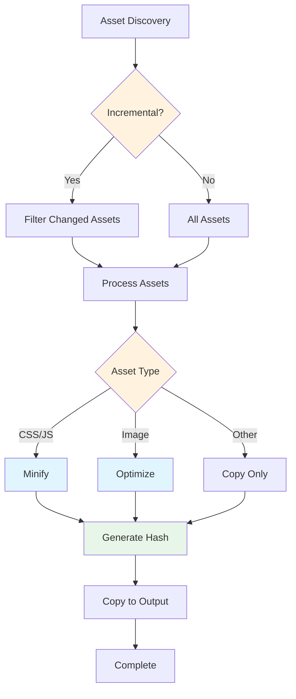

# Asset Pipeline

Bengal's asset pipeline provides efficient processing and delivery of static assets (CSS, JS, images, fonts) with optimization support.

## Overview

The asset pipeline (`bengal/assets/pipeline.py`) is a lightweight system that:
- Discovers assets from site and theme directories
- Processes assets (minification, optimization)
- Manages asset fingerprinting for cache busting
- Copies processed assets to output directory
- Integrates with incremental builds

## Asset Object (`bengal/core/asset.py`)

### Purpose
Represents a static file with metadata and processing capabilities

### Key Attributes
```python
class Asset:
    source_path: Path          # Original file location
    output_path: Path          # Destination in output directory
    asset_type: str            # Type (css, js, image, font, etc.)
    fingerprint: Optional[str] # SHA256 hash for cache busting
    minified: bool             # Whether asset has been minified
    optimized: bool            # Whether asset has been optimized
    metadata: Dict             # Additional metadata
```

### Asset Types

| Type | Extensions | Processing |
|------|-----------|------------|
| **CSS** | `.css`, `.scss`, `.sass`, `.less` | Minification, source maps |
| **JavaScript** | `.js`, `.mjs`, `.ts` | Minification, source maps |
| **Images** | `.jpg`, `.png`, `.gif`, `.webp`, `.svg` | Optimization, format conversion |
| **Fonts** | `.woff`, `.woff2`, `.ttf`, `.otf` | Copy only (already optimized) |
| **Data** | `.json`, `.yaml`, `.xml`, `.csv` | Copy, optional compression |
| **Other** | All others | Copy only |

### Key Methods

```python
def minify(self) -> None:
    """Minify CSS/JS files."""
    if self.asset_type in ('css', 'js'):
        minified_content = minifier.minify(self.content)
        self.save_minified(minified_content)
        self.minified = True

def optimize(self) -> None:
    """Optimize images (compression, format conversion)."""
    if self.asset_type == 'image':
        optimized = image_optimizer.optimize(self.source_path)
        self.save_optimized(optimized)
        self.optimized = True

def hash(self) -> str:
    """Generate SHA256 fingerprint for cache busting."""
    content = self.source_path.read_bytes()
    return hashlib.sha256(content).hexdigest()[:12]

def copy_to_output(self) -> None:
    """Copy asset to output directory with fingerprint."""
    if self.fingerprint:
        # Add fingerprint to filename
        # style.css -> style.abc123.css
        output = self.add_fingerprint_to_path()
    else:
        output = self.output_path

    shutil.copy2(self.source_path, output)
```

## Asset Discovery (`bengal/discovery/asset_discovery.py`)

### Purpose
Finds all static assets in site and theme directories

### Discovery Process

```python
def discover(site) -> List[Asset]:
    assets = []

    # 1. Discover site assets
    site_assets = discover_directory(site.assets_dir)
    assets.extend(site_assets)

    # 2. Discover theme assets
    if site.theme:
        theme_assets = discover_directory(site.theme.assets_dir)
        assets.extend(theme_assets)

    # 3. Preserve relative paths
    for asset in assets:
        asset.output_path = determine_output_path(asset)

    return assets

def discover_directory(path: Path) -> List[Asset]:
    assets = []
    for file_path in path.rglob('*'):
        if file_path.is_file() and not should_ignore(file_path):
            asset = Asset(
                source_path=file_path,
                asset_type=detect_type(file_path),
                metadata=extract_metadata(file_path)
            )
            assets.append(asset)
    return assets
```

### Exclusions
- Hidden files (`.gitignore`, `.DS_Store`)
- Cache directories (`.cache/`, `__pycache__/`)
- Build outputs (if nested incorrectly)
- Configurable ignore patterns

## Asset Pipeline (`bengal/assets/pipeline.py`)

### Purpose
Central coordinator for asset processing

### Processing Flow



### Implementation

```python
class AssetPipeline:
    def __init__(self, site: Site, config: Dict):
        self.site = site
        self.config = config
        self.minify_enabled = config.get('minify_assets', True)
        self.optimize_images = config.get('optimize_images', True)
        self.fingerprint = config.get('fingerprint_assets', False)

    def process(self, assets: List[Asset], parallel: bool = True) -> None:
        if parallel and len(assets) > 5:
            with ThreadPoolExecutor() as executor:
                futures = [
                    executor.submit(self.process_asset, asset)
                    for asset in assets
                ]
                wait(futures)
        else:
            for asset in assets:
                self.process_asset(asset)

    def process_asset(self, asset: Asset) -> None:
        # 1. Minification
        if self.minify_enabled and asset.should_minify():
            asset.minify()

        # 2. Optimization
        if self.optimize_images and asset.should_optimize():
            asset.optimize()

        # 3. Fingerprinting
        if self.fingerprint:
            asset.fingerprint = asset.hash()

        # 4. Copy to output
        asset.copy_to_output()

        # 5. Update cache
        if self.incremental:
            self.cache.update_hash(asset.source_path)
```

## Asset Dependency Tracking (`bengal/cache/asset_dependency_map.py`)

### Purpose
Tracks relationships between assets (imports, references)

### Use Cases
- CSS imports: `@import "variables.css"`
- JS imports: `import { foo } from './module.js'`
- Image references in CSS: `background: url('image.png')`

### Implementation

```python
class AssetDependencyMap:
    def __init__(self):
        self.dependencies: Dict[Path, Set[Path]] = {}

    def add_dependency(self, asset: Path, dependency: Path) -> None:
        if asset not in self.dependencies:
            self.dependencies[asset] = set()
        self.dependencies[asset].add(dependency)

    def get_affected_assets(self, changed_asset: Path) -> Set[Path]:
        """Find all assets that depend on the changed asset."""
        affected = set()
        for asset, deps in self.dependencies.items():
            if changed_asset in deps:
                affected.add(asset)
        return affected
```

### Integration with Incremental Builds
When a CSS file changes, all CSS files that import it are also rebuilt.

## Configuration

Asset pipeline is configured via `bengal.toml`:

```toml
[assets]
# Enable/disable minification
minify_css = true
minify_js = true

# Enable/disable image optimization
optimize_images = true

# Fingerprinting for cache busting
fingerprint = false  # or true for production

# Exclude patterns
exclude = [
    "*.map",
    "*.orig",
    "drafts/**",
]

# Optimization settings
[assets.images]
quality = 85  # JPEG quality (1-100)
strip_metadata = true  # Remove EXIF data
formats = ["webp"]  # Generate additional formats
```

## Minification

### CSS Minification
- Removes whitespace and comments
- Shortens color codes (#ffffff → #fff)
- Combines selectors
- Removes unused rules (future)

### JavaScript Minification
- Removes whitespace and comments
- Shortens variable names (optional)
- Dead code elimination (optional)

### Implementation
Uses `lightningcss` for CSS and `rjsmin` for JS (pure Python, no Node.js required)

## Image Optimization

### Supported Operations
- Lossless compression (PNG, WebP)
- Lossy compression with quality control (JPEG)
- Metadata stripping (EXIF, IPTC)
- Format conversion (e.g., PNG → WebP)
- Resizing (future)
- Responsive image generation (future)

### Implementation
Uses `Pillow` for image processing (widely available, pure Python + C extensions)

## Cache Busting

### Fingerprinting Strategy
Assets can include content hash in filename:

```
Original:      style.css
Fingerprinted: style.abc123.css
```

### Template Integration
Fingerprinted paths available in templates:

```jinja2
<link rel="stylesheet" href="{{ asset_url('style.css') }}">
<!-- Renders as: -->
<link rel="stylesheet" href="/assets/style.abc123.css">
```

### Benefits
- Long cache TTL (1 year+)
- No stale cache issues
- Automatic invalidation on changes

## Performance

### Parallel Processing
Assets are processed in parallel when:
- 5+ assets to process
- Parallel mode enabled (default)
- Worker pool available

**Measured speedup**: 2-3x for 10+ assets

### Incremental Builds
Only changed assets are reprocessed:
- File content hash comparison
- Dependency tracking for imports
- Cache invalidation on changes

**Measured speedup**: 15-30x for single asset changes

### Optimization Trade-offs
Image optimization is slowest operation (~100-500ms per image). Can be disabled for dev builds:

```toml
[assets]
optimize_images = false  # Dev mode
```

## Integration Points

### With Discovery
- AssetDiscovery finds assets
- AssetOrchestrator processes them
- Asset objects created and tracked

### With Incremental Builds
- BuildCache tracks asset file hashes
- AssetDependencyMap tracks imports
- Only changed assets reprocessed

### With Templates
- `asset_url()` function resolves asset paths
- Fingerprinted paths handled automatically
- Theme asset resolution

### With Themes
- Theme assets discovered automatically
- Theme assets override site assets
- Fallback chain: site → theme → default

## Health Validation

AssetValidator checks:
- All referenced assets exist
- Minification completed (if enabled)
- Optimization completed (if enabled)
- File sizes reasonable
- No broken asset references

```bash
bengal site build
# Asset validation runs automatically
# Reports missing assets, oversized files, etc.
```

## Future Enhancements

1. **Responsive Images**: Generate multiple sizes automatically
2. **Modern Format Support**: AVIF, WebP with fallbacks
3. **CSS Purging**: Remove unused CSS automatically
4. **Sprite Generation**: Combine small images into sprites
5. **CDN Integration**: Upload assets to CDN automatically
6. **Source Maps**: Generate source maps for minified files
7. **Preprocessor Support**: Built-in SCSS/Less compilation

## Testing

Asset pipeline testing:
- Unit tests: `tests/unit/test_asset.py`
- Integration tests: `tests/integration/test_asset_pipeline.py`
- Performance tests: `tests/performance/test_asset_processing.py`

**Coverage**: ~75% for asset processing
