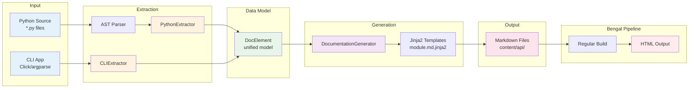

# Autodoc System

Bengal includes an **automatic documentation generation system** that extracts API documentation from Python source code using AST-based static analysis.

## Overview

The autodoc system extracts documentation without importing code, making it:
- **Reliable** - no import errors or side effects
- **Environment-independent** - works without installing dependencies
- **Currently Supports**: Python (AST-based), CLI (Click framework only)
- **Planned**: OpenAPI/REST API documentation, argparse/typer CLI support

## Architecture (`bengal/autodoc/`)

The autodoc system follows a clean extractor → generator → template architecture:



**Key Design Principles:**
- **No Imports**: AST-based extraction means no dependency installation needed
- **Unified Model**: DocElement provides consistent structure across extractors
- **Extensible**: New extractors (OpenAPI, GraphQL) can use same pipeline
- **Two-Pass**: Generate Markdown first, then render with Bengal's full pipeline

## Base Classes (`bengal/autodoc/base.py`)

### DocElement
Unified data model for all documented elements
- Used by all extractors (Python, OpenAPI, CLI)
- Represents functions, classes, methods, endpoints, commands, etc.
- Fields: name, qualified_name, description, element_type, metadata, children, examples
- Supports serialization for caching

### Extractor
Abstract base class for documentation extractors
- `extract(source)`: Extract DocElements from source
- `get_template_dir()`: Template directory name
- `get_output_path(element)`: Output path determination
- Pluggable architecture for different source types

## Python Extractor (`bengal/autodoc/extractors/python.py`)

### PythonExtractor
AST-based Python API documentation extractor
- **No imports**: Parses source via `ast` module
- **Type hints**: Extracts from annotations (PEP 484/585)
- **Signatures**: Builds complete function/method signatures
- **Docstrings**: Integrates with docstring parser
- **Inheritance**: Tracks base classes and method resolution
- **Decorators**: Detects @property, @classmethod, @staticmethod, etc.

### Extracted Elements
- Modules (with submodules)
- Classes (with methods, properties, attributes)
- Functions (standalone and methods)
- Type hints and signatures
- Docstrings and metadata

### Example

```python
# Source code
class Site:
    """Orchestrates website builds."""

    def build(self, parallel: bool = True) -> BuildStats:
        """Build the entire site.

        Args:
            parallel: Enable parallel processing

        Returns:
            BuildStats with timing information
        """
        ...

# Extracted DocElement
DocElement(
    name='build',
    qualified_name='bengal.core.site.Site.build',
    element_type='method',
    metadata={
        'signature': 'def build(self, parallel: bool = True) -> BuildStats',
        'args': [{'name': 'parallel', 'type': 'bool', 'default': 'True'}],
        'returns': {'type': 'BuildStats'},
    }
)
```

## Docstring Parser (`bengal/autodoc/docstring_parser.py`)

### DocstringParser
Extracts structured data from docstrings
- **Auto-detection**: Recognizes Google, NumPy, Sphinx styles
- **Sections**: Extracts Args, Returns, Raises, Examples, See Also, etc.
- **Type info**: Parses type specifications from docstrings
- **Examples**: Extracts code examples from docstrings
- **Metadata**: Parses Deprecated, Added, Notes, Warnings

### Supported Styles

```python
# Google Style
def foo(x: int) -> str:
    """Short description.

    Args:
        x: Parameter description

    Returns:
        Return value description

    Raises:
        ValueError: When x is negative
    """

# NumPy Style
def bar(x):
    """
    Short description.

    Parameters
    ----------
    x : int
        Parameter description

    Returns
    -------
    str
        Return value description
    """

# Sphinx Style
def baz(x):
    """
    Short description.

    :param x: Parameter description
    :type x: int
    :returns: Return value description
    :rtype: str
    """
```

## Documentation Generator (`bengal/autodoc/generator.py`)

### DocumentationGenerator
Renders DocElements to Markdown
- **Template-based**: Uses Jinja2 templates with safe rendering
- **Two-layer rendering**:
  - Layer 1: DocElements → Markdown (`.md.jinja2` templates)
  - Layer 2: Markdown → HTML (standard Bengal templates)
- **Parallel processing**: Can generate docs concurrently
- **Intelligent caching**: LRU cache with automatic eviction and performance tracking
- **Cross-references**: Resolves `[[ClassName.method]]` links
- **Error boundaries**: Safe template rendering with graceful fallbacks

### TemplateCache
Advanced caching system for rendered templates:
- **LRU eviction**: Automatically removes least recently used entries when cache is full
- **Configurable size**: Default 1000 entries, customizable via `max_size` parameter
- **Performance tracking**: Built-in hit rate and usage statistics
- **Memory management**: Evicts 20% of entries when cache reaches capacity
- **Cache invalidation**: Template hash-based invalidation for changed templates

### Template Safety System (`bengal/autodoc/template_safety.py`)

Bengal's autodoc system includes a **Hugo-style safe template rendering system** that eliminates silent failures:

#### SafeTemplateRenderer
- **Error boundaries**: Template failures don't break entire pages
- **Graceful fallbacks**: Generates structured fallback content when templates fail
- **Error categorization**: Handles template not found, undefined variables, syntax errors
- **Comprehensive logging**: Records all template errors with context for debugging
- **Error reporting**: Provides human-readable error summaries

#### Template Validation
- **Syntax checking**: Validates template syntax before rendering
- **Variable analysis**: Detects potentially undefined variables
- **Structure validation**: Checks for balanced blocks and proper Jinja2 structure
- **Whitespace issues**: Identifies common formatting problems

#### Safe Filters
Comprehensive set of 9 built-in template filters for safe rendering:
- `safe_description`: YAML-safe description formatting with quote escaping and truncation
- `code_or_dash`: Wraps values in code backticks or shows dash for empty/None values
- `safe_anchor`: Generates safe anchor links by cleaning special characters and parentheses
- `project_relative`: Converts absolute paths to project-relative paths with intelligent detection
- `safe_type`: Formats type annotations with cleanup of typing module prefixes and class wrappers
- `safe_default`: Formats default values with proper quoting for strings, booleans, and numbers
- `safe_text`: Formats text content with fallback message for empty values
- `truncate_text`: Truncates text to specified length with customizable suffix
- `format_list`: Formats lists with separators and truncation for long lists

#### Error Handling Tiers
1. **Template Level**: Entire template fails → Structured fallback page
2. **Section Level**: Template section fails → Error message + continue other sections
3. **Component Level**: Individual item fails → Item-specific fallback + continue list

#### Comprehensive Testing
The template safety system includes extensive test coverage:
- **Error boundary testing**: Validates fallback mechanisms for all error types
- **Performance testing**: Ensures scalability with large contexts (1000+ items)
- **Integration testing**: Tests with real template files and mock data
- **Regression testing**: Prevents template safety regressions
- **Parametrized testing**: Covers multiple error scenarios systematically
- **Helper methods**: Reduces test duplication and improves maintainability

### Template Development Tools (`bengal/autodoc/dev_tools.py`)

Bengal provides comprehensive development tools for template creation and debugging:

#### SampleDataGenerator
Generates realistic sample data for testing templates:
- **Python modules**: Complete DocElement structures with classes, methods, properties
- **CLI commands**: Click-style commands with options, arguments, and examples
- **OpenAPI endpoints**: REST API endpoints with request/response schemas
- **Sample configurations**: Template safety and project configurations

#### TemplateDebugger
Debug template rendering with detailed error information:
- **Validation analysis**: Template syntax checking and issue reporting
- **Context analysis**: Inspection of template variables and element types
- **Rendering diagnostics**: Performance timing and error capture
- **Debug sessions**: Historical tracking of debug attempts
- **Export functionality**: JSON export of debug sessions for analysis

#### TemplateProfiler
Performance profiling for template rendering:
- **Render timing**: Millisecond-precision performance measurement
- **Content analysis**: Size tracking and cache hit rate monitoring
- **Error tracking**: Count and categorization of rendering errors
- **Performance summaries**: Statistical analysis of rendering performance
- **Metrics export**: JSON export of performance data for analysis

#### TemplateHotReloader
Hot-reload templates during development:
- **File watching**: Monitor template directories for changes
- **Callback system**: Trigger custom actions on template changes
- **Multi-directory support**: Watch multiple template directories simultaneously
- **Background monitoring**: Non-blocking file system monitoring
- **Error resilience**: Continue monitoring even if callbacks fail

#### Standalone Debug Scripts
Bengal provides multiple standalone debugging scripts for quick template diagnostics:

**`debug_template_rendering.py`** - Comprehensive template debugging:
- **Quick debugging**: Standalone script for immediate template testing
- **Element extraction**: Tests Python element extraction and template rendering
- **Section analysis**: Analyzes specific template sections (e.g., Classes, Functions)
- **Error reporting**: Shows template errors and rendering issues
- **Command-line usage**: `python debug_template_rendering.py [source_file]`
- **Integration ready**: Uses the same `TemplateDebugger` class as CLI tools

**`debug_macro_error.py`** - Focused macro testing:
- **Macro-specific debugging**: Tests individual template macros in isolation
- **Safe macro testing**: Validates `safe_for` and other error boundary macros
- **Minimal setup**: Lightweight script for quick macro validation
- **Direct template testing**: Tests template strings without file system dependencies
- **Command-line usage**: `python debug_macro_error.py`

**`test_macro_step_by_step.py`** - Step-by-step macro testing:
- **Progressive testing**: Tests macros incrementally from basic to complex
- **Macro syntax validation**: Ensures proper macro call syntax (e.g., ``)
- **Comparative analysis**: Tests different approaches to identify issues
- **Educational tool**: Shows progression from basic filtering to safe macro usage
- **Command-line usage**: `python test_macro_step_by_step.py [source_file]`

### Template Resolution
Bengal uses a **unified template directory structure** with subdirectories for each documentation type:

1. **User templates** (highest priority): `templates/autodoc/{python,cli,openapi}/`
2. **Theme templates**: `themes/{name}/autodoc/{python,cli,openapi}/`
3. **Built-in templates**: `bengal/autodoc/templates/{python,cli,openapi}/`

**Template Type Mapping**:
- Python modules: `python/module.md.jinja2`
- Python classes: `python/class.md.jinja2`
- Python functions: `python/function.md.jinja2`
- CLI commands: `cli/command.md.jinja2`
- CLI command groups: `cli/command_group.md.jinja2`
- OpenAPI endpoints: `openapi/endpoint.md.jinja2`
- OpenAPI schemas: `openapi/schema.md.jinja2`

## Configuration (`bengal/autodoc/config.py`)

Autodoc is configured via `bengal.toml`:

```toml
[autodoc.python]
enabled = true
source_dirs = ["src/mylib", "bengal"]
output_dir = "content/api"
docstring_style = "auto"  # auto, google, numpy, sphinx
exclude = ["*/tests/*", "*/test_*.py"]
include_private = false
include_undocumented = false
```

**Settings**:
- `enabled`: Enable Python autodoc
- `source_dirs`: List of directories to document
- `output_dir`: Where to write markdown files
- `docstring_style`: Docstring format detection
- `exclude`: Glob patterns to exclude
- `include_private`: Include `_private` members
- `include_undocumented`: Include items without docstrings

## URL Grouping

Autodoc supports **three modes** for organizing API documentation URLs:

### Mode: Off (Default)
URLs follow Python package structure exactly (deepest `__init__.py`):
- **Config**: None required (default behavior)
- **Example**: `mypackage.core.site` → `/api/mypackage/core/site/`
- **Use when**: Simple projects, no special organization needed

### Mode: Auto (Recommended)
Auto-detects groups from `__init__.py` hierarchy:
```yaml
autodoc:
  python:
    strip_prefix: "mypackage."
    grouping:
      mode: "auto"
```
- **Scans** all `__init__.py` files in source directories
- **Groups** modules under their parent package
- **Zero maintenance** - adapts to new packages automatically
- **Example**: `cli.templates.blog` → `/api/templates/blog/` (grouped under templates)

### Mode: Explicit
Manual control with custom group names:
```yaml
autodoc:
  python:
    strip_prefix: "mypackage."
    grouping:
      mode: "explicit"
      prefix_map:
        cli.templates: "template-system"
        core: "core-api"
```
- **Custom names** for groups
- **Use when**: Need non-standard organization or custom naming

### Benefits vs. Sphinx/MkDocs
- **Sphinx**: Requires manual `toctree` entries (high maintenance)
- **MkDocs**: Requires separate `.md` files + nav config (very high maintenance)
- **Bengal Auto**: Zero config maintenance, adapts automatically

See `plan/active/rfc-autodoc-url-grouping.md` for detailed design.

## CLI Integration

```bash
# Generate API docs from config
bengal autodoc

# Override source/output
bengal autodoc --source mylib --output content/api

# Show extraction stats
bengal autodoc --stats --verbose
```

## Templates (`bengal/autodoc/templates/`)

### Template Safety Features

Bengal's autodoc templates are designed with **safety-first principles**:

#### Error Boundaries
Templates use error boundaries to isolate failures:
```jinja2
{# Safe section rendering #}

  

```

#### Fallback Content
When templates fail, structured fallback content is generated:
```markdown
# ModuleName

```{error}
Template Syntax Error: python/module.md.jinja2
Error: Undefined variable 'invalid_var'
```

## Basic Information

**Type:** module
**Source:** src/mylib/core.py

Module description from docstring...

*Note: Template has syntax errors. This is fallback content.*
```

#### Safe Variable Access
Templates use safe filters to prevent undefined variable errors:
```jinja2
{# Safe access with fallbacks #}
**Type:** {{ element.element_type | default('Unknown') }}
**Source:** {{ element.source_file | project_relative }}
**Description:** {{ element.description | safe_description }}
```

### Template Directory Structure
```
templates/autodoc/
├── python/
│   ├── module.md.jinja2      # Python module documentation
│   ├── class.md.jinja2       # Python class documentation
│   └── function.md.jinja2    # Python function/method documentation
├── cli/
│   ├── command.md.jinja2     # CLI command documentation
│   └── command_group.md.jinja2  # CLI command group documentation
├── openapi/
│   ├── endpoint.md.jinja2    # REST API endpoint documentation
│   └── schema.md.jinja2      # Data schema documentation
├── base/
│   ├── base.md.jinja2        # Common base template
│   └── error_fallback.md.jinja2  # Error fallback template
└── macros/
    ├── safe_macros.md.jinja2     # Error boundary macros
    ├── parameter_table.md.jinja2 # Parameter documentation
    └── code_blocks.md.jinja2     # Code formatting macros
```

### Template Context

```jinja2
{# templates/autodoc/python/module.md.jinja2 #}
---
title: "{{ element.name }}"
type: api-reference
---

# {{ element.name }}

{{ element.description }}

## Classes


### {{ cls.name }}

{{ cls.description }}


#### {{ method.name }}

```python
{{ method.metadata.signature }}
```

{{ method.description }}


**Arguments:**

- `{{ arg.name }}` ({{ arg.type }}): {{ arg.description }}




**Returns:** {{ method.metadata.returns.type }} - {{ method.metadata.returns.description }}



```

## CLI Extractor (`bengal/autodoc/extractors/cli.py`)

**Status**: ✅ **Partially Implemented**

The CLI extractor supports:
- ✅ **Click**: Full support for Click command groups, commands, options, and arguments
- 📋 **argparse**: Planned (framework accepted but extraction not implemented)
- 📋 **typer**: Planned (framework accepted but extraction not implemented)

**Usage**:
```bash
bengal autodoc-cli --app myapp.cli:main --framework click
```

## Planned Extractors

**Not Yet Implemented**:
- `OpenAPIExtractor`: REST API documentation from OpenAPI specs or FastAPI apps
- `GraphQLExtractor`: GraphQL schema documentation
- Full argparse/typer CLI support

## Performance Characteristics

**Advantages**:
- AST-based extraction (no imports needed)
- No import errors or side effects
- Works without installing project dependencies
- Integrates with Bengal's incremental build cache

## Integration with Bengal Pipeline

Autodoc-generated markdown files are treated as regular content:
- Discovered by content discovery
- Rendered with templates
- Included in search index
- Accessible via menus
- Full access to taxonomies, navigation, etc.

**Example Flow**:
```bash
# 1. Generate API docs
bengal autodoc
  → Creates content/api/*.md files

# 2. Build site (includes API docs)
bengal site build
  → Discovers content/api/*.md
  → Renders with templates
  → Generates public/api/*.html

# 3. Serve with dev server
bengal site serve
  → API docs included
  → Watch mode regenerates on source changes
```

## Migration from Other Tools

**Note**: Migration tools are not yet implemented. Users migrating from Sphinx or other documentation generators will need to manually configure Bengal's autodoc system.

## Real-World Usage

**Bengal's own docs** (examples/showcase):
- 99 modules documented
- 81 classes, 144 functions
- 0.57s generation time
- Full site build < 1 second
- Complete API reference at `/api/`
