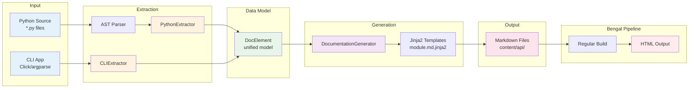

# Autodoc System

Bengal includes an **automatic documentation generation system** that extracts API documentation from Python source code using AST-based static analysis.

## Overview

The autodoc system extracts documentation without importing code, making it:
- **Reliable** - no import errors or side effects
- **Environment-independent** - works without installing dependencies
- **Currently Supports**: Python (AST-based), CLI (Click framework only)
- **Planned**: OpenAPI/REST API documentation, argparse/typer CLI support

## Architecture (`bengal/autodoc/`)

The autodoc system follows a clean extractor → generator → template architecture:



**Key Design Principles:**
- **No Imports**: AST-based extraction means no dependency installation needed
- **Unified Model**: DocElement provides consistent structure across extractors
- **Extensible**: New extractors (OpenAPI, GraphQL) can use same pipeline
- **Two-Pass**: Generate Markdown first, then render with Bengal's full pipeline

## Base Classes (`bengal/autodoc/base.py`)

### DocElement
Unified data model for all documented elements
- Used by all extractors (Python, OpenAPI, CLI)
- Represents functions, classes, methods, endpoints, commands, etc.
- Fields: name, qualified_name, description, element_type, metadata, children, examples
- Supports serialization for caching

### Extractor
Abstract base class for documentation extractors
- `extract(source)`: Extract DocElements from source
- `get_template_dir()`: Template directory name
- `get_output_path(element)`: Output path determination
- Pluggable architecture for different source types

## Python Extractor (`bengal/autodoc/extractors/python.py`)

### PythonExtractor
AST-based Python API documentation extractor
- **No imports**: Parses source via `ast` module
- **Type hints**: Extracts from annotations (PEP 484/585)
- **Signatures**: Builds complete function/method signatures
- **Docstrings**: Integrates with docstring parser
- **Inheritance**: Tracks base classes and method resolution
- **Decorators**: Detects @property, @classmethod, @staticmethod, etc.

### Extracted Elements
- Modules (with submodules)
- Classes (with methods, properties, attributes)
- Functions (standalone and methods)
- Type hints and signatures
- Docstrings and metadata

### Example

```python
# Source code
class Site:
    """Orchestrates website builds."""

    def build(self, parallel: bool = True) -> BuildStats:
        """Build the entire site.

        Args:
            parallel: Enable parallel processing

        Returns:
            BuildStats with timing information
        """
        ...

# Extracted DocElement
DocElement(
    name='build',
    qualified_name='bengal.core.site.Site.build',
    element_type='method',
    metadata={
        'signature': 'def build(self, parallel: bool = True) -> BuildStats',
        'args': [{'name': 'parallel', 'type': 'bool', 'default': 'True'}],
        'returns': {'type': 'BuildStats'},
    }
)
```

## Docstring Parser (`bengal/autodoc/docstring_parser.py`)

### DocstringParser
Extracts structured data from docstrings
- **Auto-detection**: Recognizes Google, NumPy, Sphinx styles
- **Sections**: Extracts Args, Returns, Raises, Examples, See Also, etc.
- **Type info**: Parses type specifications from docstrings
- **Examples**: Extracts code examples from docstrings
- **Metadata**: Parses Deprecated, Added, Notes, Warnings

### Supported Styles

```python
# Google Style
def foo(x: int) -> str:
    """Short description.

    Args:
        x: Parameter description

    Returns:
        Return value description

    Raises:
        ValueError: When x is negative
    """

# NumPy Style
def bar(x):
    """
    Short description.

    Parameters
    ----------
    x : int
        Parameter description

    Returns
    -------
    str
        Return value description
    """

# Sphinx Style
def baz(x):
    """
    Short description.

    :param x: Parameter description
    :type x: int
    :returns: Return value description
    :rtype: str
    """
```

## Documentation Generator (`bengal/autodoc/generator.py`)

### DocumentationGenerator
Renders DocElements to Markdown
- **Template-based**: Uses Jinja2 templates
- **Two-layer rendering**:
  - Layer 1: DocElements → Markdown (`.md.jinja2` templates)
  - Layer 2: Markdown → HTML (standard Bengal templates)
- **Parallel processing**: Can generate docs concurrently
- **Caching**: Avoids regenerating unchanged modules
- **Cross-references**: Resolves `[[ClassName.method]]` links

### Template Resolution
1. Custom templates (`templates/autodoc/python/`)
2. Theme templates (`themes/{name}/autodoc/python/`)
3. Default templates (`bengal/autodoc/templates/python/`)

## Configuration (`bengal/autodoc/config.py`)

Autodoc is configured via `bengal.toml`:

```toml
[autodoc.python]
enabled = true
source_dirs = ["src/mylib", "bengal"]
output_dir = "content/api"
docstring_style = "auto"  # auto, google, numpy, sphinx
exclude = ["*/tests/*", "*/test_*.py"]
include_private = false
include_undocumented = false
```

**Settings**:
- `enabled`: Enable Python autodoc
- `source_dirs`: List of directories to document
- `output_dir`: Where to write markdown files
- `docstring_style`: Docstring format detection
- `exclude`: Glob patterns to exclude
- `include_private`: Include `_private` members
- `include_undocumented`: Include items without docstrings

## CLI Integration

```bash
# Generate API docs from config
bengal autodoc

# Override source/output
bengal autodoc --source mylib --output content/api

# Show extraction stats
bengal autodoc --stats --verbose
```

## Templates (`bengal/autodoc/templates/`)

### Default Templates
- `python/module.md.jinja2`: Module documentation
- `python/class.md.jinja2`: Class documentation (future)
- `python/function.md.jinja2`: Function documentation (future)

### Template Context

```jinja2
{# templates/autodoc/python/module.md.jinja2 #}
---
title: "{{ element.name }}"
type: api-reference
---

# {{ element.name }}

{{ element.description }}

## Classes


### {{ cls.name }}

{{ cls.description }}


#### {{ method.name }}

```python
{{ method.metadata.signature }}
```

{{ method.description }}


**Arguments:**

- `{{ arg.name }}` ({{ arg.type }}): {{ arg.description }}




**Returns:** {{ method.metadata.returns.type }} - {{ method.metadata.returns.description }}



```

## CLI Extractor (`bengal/autodoc/extractors/cli.py`)

**Status**: ✅ **Partially Implemented**

The CLI extractor supports:
- ✅ **Click**: Full support for Click command groups, commands, options, and arguments
- 📋 **argparse**: Planned (framework accepted but extraction not implemented)
- 📋 **typer**: Planned (framework accepted but extraction not implemented)

**Usage**:
```bash
bengal autodoc-cli --app myapp.cli:main --framework click
```

## Planned Extractors

**Not Yet Implemented**:
- `OpenAPIExtractor`: REST API documentation from OpenAPI specs or FastAPI apps
- `GraphQLExtractor`: GraphQL schema documentation
- Full argparse/typer CLI support

## Performance Characteristics

**Advantages**:
- AST-based extraction (no imports needed)
- No import errors or side effects
- Works without installing project dependencies
- Integrates with Bengal's incremental build cache

## Integration with Bengal Pipeline

Autodoc-generated markdown files are treated as regular content:
- Discovered by content discovery
- Rendered with templates
- Included in search index
- Accessible via menus
- Full access to taxonomies, navigation, etc.

**Example Flow**:
```bash
# 1. Generate API docs
bengal autodoc
  → Creates content/api/*.md files

# 2. Build site (includes API docs)
bengal site build
  → Discovers content/api/*.md
  → Renders with templates
  → Generates public/api/*.html

# 3. Serve with dev server
bengal site serve
  → API docs included
  → Watch mode regenerates on source changes
```

## Migration from Other Tools

**Note**: Migration tools are not yet implemented. Users migrating from Sphinx or other documentation generators will need to manually configure Bengal's autodoc system.

## Real-World Usage

**Bengal's own docs** (examples/showcase):
- 99 modules documented
- 81 classes, 144 functions
- 0.57s generation time
- Full site build < 1 second
- Complete API reference at `/api/`
