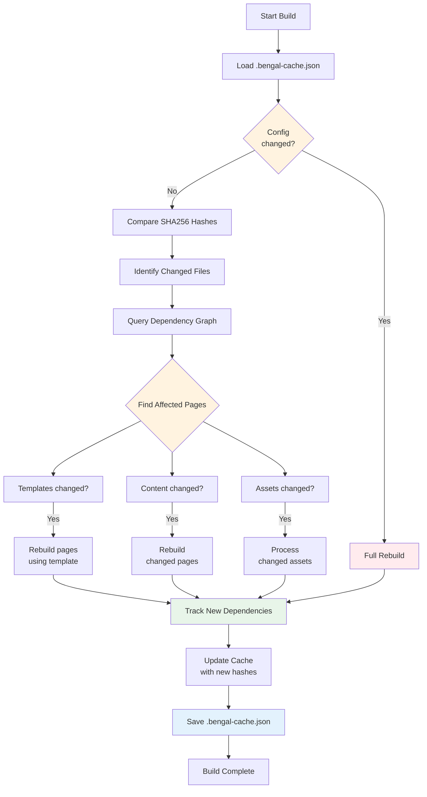
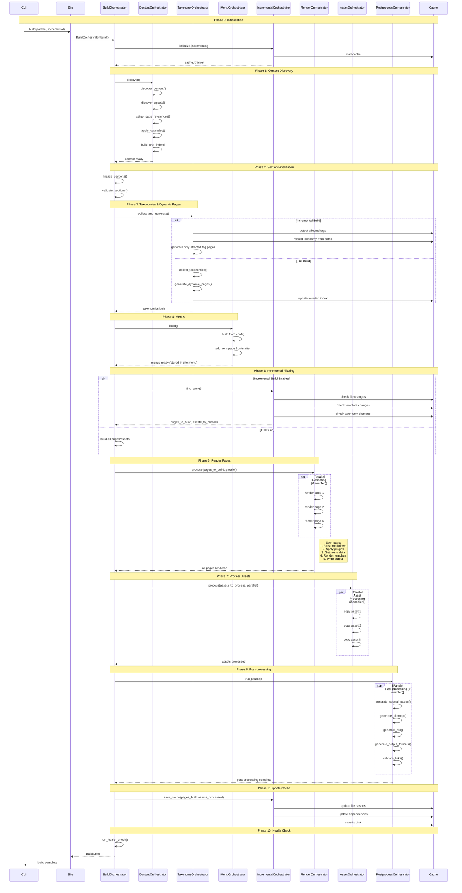

# Cache System

Bengal implements an intelligent caching system for incremental builds, providing faster rebuilds.

## Build Cache (`bengal/cache/build_cache.py`)

### Purpose
Tracks file changes between builds using SHA256 hashing and dependency graphs. Persisted as `.bengal-cache.json`.

### Key Methods

| Method | Description |
|--------|-------------|
| `is_changed(path)` | Check if file has changed since last build |
| `add_dependency(source, dependency)` | Record file dependencies (page → template/partial) |
| `get_affected_pages(changed_file)` | Find all pages needing rebuild based on dependency graph |
| `update_page_tags(path, tags)` | Update taxonomy inverted index, returns affected tags |
| `get_pages_for_tag(tag)` | Get all page paths for a specific tag (O(1) lookup) |
| `get_all_tags()` | Get all known tags from previous build |
| `save()` / `load()` | Persist cache between builds |

### Inverted Index Pattern

The cache stores a bidirectional mapping between pages and tags:
- **Forward index**: `page_tags` (page path → set of tags)
- **Inverted index**: `tag_to_pages` (tag slug → set of page paths)

This enables efficient taxonomy reconstruction without persisting object references:

```python
# Only paths stored in cache, never object references
cache.tag_to_pages['python'] = {'content/post1.md', 'content/post2.md'}

# During build: Reconstruct with current Page objects
current_page_map = {p.source_path: p for p in site.pages}
pages_for_tag = [current_page_map[path] for path in cache.get_pages_for_tag('python')]
```

### Key Design Principle
"Never persist object references across builds" - cache stores paths and hashes, relationships are reconstructed from current objects each build.

## Dependency Tracker (`bengal/cache/dependency_tracker.py`)

### Purpose
Tracks dependencies during the build process

### Tracks
- Page → template dependencies
- Page → partial dependencies
- Page → config dependencies
- Taxonomy (tag) → page relationships

### Usage
Integrated with rendering pipeline to build dependency graph

## Incremental Build Flow



## Cache Decision Logic

1. **Load cache** from `.bengal-cache.json` (or create if first build)
2. **Check config** - if `bengal.toml` changed → full rebuild
3. **Compare hashes** - SHA256 of all tracked files
4. **Query dependency graph** - find pages affected by changes
5. **Selective rebuild** - only pages that changed or depend on changed files
6. **Track dependencies** - during rendering, record what each page uses
7. **Update cache** - save new hashes and dependency graph
8. **Save cache** - persist to disk for next build

## Implemented Features

- Template dependency tracking (pages → templates/partials)
- Taxonomy dependency tracking (tags → pages) with inverted index pattern
- Config change detection (forces full rebuild)
- Verbose mode (`--verbose` flag shows what changed)
- Asset change detection (selective processing)
- Object reference safety (cache stores paths, not objects)

## CLI Usage

```bash
# Incremental build
bengal site build --incremental

# With detailed change information
bengal site build --incremental --verbose
```

## Build Pipeline Flow



## Pipeline Phases

0. **Initialization**: Load cache, set up dependency tracker
1. **Content Discovery**: Find pages/sections/assets, setup references, apply cascades, build xref index
2. **Section Finalization**: Ensure all sections have index pages, validate structure
3. **Taxonomies**: Collect tags/categories (incremental: detect affected tags + rebuild from cache paths), generate tag pages and pagination
4. **Menus**: Build navigation from config + page frontmatter (stored in `site.menu`)
5. **Incremental Filtering**: Determine what needs rebuilding (pages, assets, affected dependencies)
6. **Rendering**: Parse markdown → apply plugins → render templates (uses `site.menu`) → write HTML
7. **Assets**: Copy/process static files from site and theme
8. **Post-processing**: Generate sitemap, RSS, output formats, validate links (can run in parallel)
9. **Cache Update**: Save file hashes, dependencies, and taxonomy inverted index for next incremental build
10. **Health Check**: Validate build output, check for broken links, performance metrics

## Key Architecture Patterns

- **Delegation**: `Site.build()` immediately delegates to `BuildOrchestrator.build()`
- **Specialized Orchestrators**: Each build concern has a dedicated orchestrator class
- **Bulk Filtering**: Incremental builds filter upfront (Phase 5), then process filtered lists
- **Parallelization**: Phases 6, 7, and 8 can process items in parallel for performance
- **Menu Access**: Menus built once in Phase 4, accessed from `site.menu` during rendering
