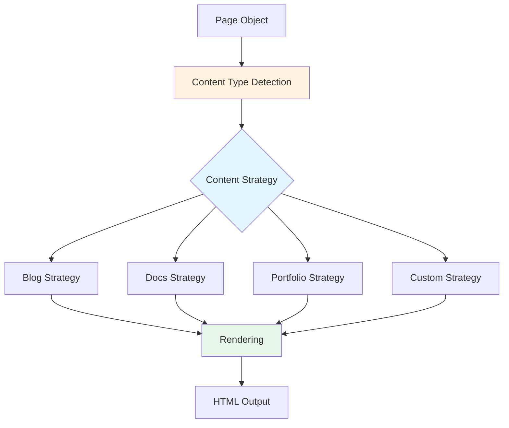

# Content Types System

Bengal's content type system provides flexible strategies for organizing and rendering different kinds of content.

## Overview

The content types subsystem (`bengal/content_types/`) implements a strategy pattern for handling different content organizations and rendering approaches. This allows Bengal to support multiple site styles (blog, docs, portfolio, etc.) without hardcoding behavior.

## Architecture



## Base Strategy (`bengal/content_types/base.py`)

### Purpose
Abstract base class defining the content strategy interface

### Interface

```python
class ContentStrategy(ABC):
    """Base class for content organization strategies."""

    @abstractmethod
    def get_template(self, page: Page) -> str:
        """Determine which template to use for this page."""
        pass

    @abstractmethod
    def get_url_pattern(self, page: Page) -> str:
        """Determine URL structure for this page."""
        pass

    @abstractmethod
    def should_generate_index(self, section: Section) -> bool:
        """Whether to generate index page for section."""
        pass

    @abstractmethod
    def get_sorting_key(self, pages: List[Page]) -> Callable:
        """How to sort pages in listings."""
        pass

    def before_render(self, page: Page) -> None:
        """Hook called before rendering."""
        pass

    def after_render(self, page: Page) -> None:
        """Hook called after rendering."""
        pass
```

## Built-in Strategies (`bengal/content_types/strategies.py`)

### Blog Strategy

**Purpose**: Traditional blog content organization

**Characteristics**:
- Date-based organization
- Reverse chronological sorting
- Archive pages by date
- RSS feed generation
- Pagination support

**Template Selection**:
```python
class BlogStrategy(ContentStrategy):
    def get_template(self, page: Page) -> str:
        if page.is_home:
            return 'index.html'
        elif page.is_section:
            return 'blog/list.html'
        elif page.metadata.get('type') == 'post':
            return 'blog/post.html'
        else:
            return 'page.html'

    def get_url_pattern(self, page: Page) -> str:
        if page.metadata.get('type') == 'post':
            # /blog/2025/10/my-post/
            return '{year}/{month}/{slug}/'
        else:
            # /about/
            return '{slug}/'

    def get_sorting_key(self, pages: List[Page]) -> Callable:
        return lambda p: (p.date or datetime.min, p.title)
```

**Configuration**:
```toml
[content_type]
strategy = "blog"

[content_type.blog]
posts_per_page = 10
generate_archives = true
generate_rss = true
```

### Docs Strategy

**Purpose**: Technical documentation organization

**Characteristics**:
- Hierarchical structure
- Manual ordering via weight/order
- Breadcrumb navigation
- Table of contents
- No date-based organization

**Template Selection**:
```python
class DocsStrategy(ContentStrategy):
    def get_template(self, page: Page) -> str:
        if page.is_home:
            return 'docs/home.html'
        elif page.is_section:
            return 'docs/section.html'
        else:
            return 'docs/page.html'

    def get_url_pattern(self, page: Page) -> str:
        # Hierarchical: /docs/guide/installation/
        return page.relative_path.replace('_index', '').strip('/')

    def get_sorting_key(self, pages: List[Page]) -> Callable:
        # Sort by weight, then title
        return lambda p: (p.metadata.get('weight', 999), p.title)
```

**Configuration**:
```toml
[content_type]
strategy = "docs"

[content_type.docs]
show_toc = true
show_breadcrumbs = true
collapse_sections = false
```

### Portfolio Strategy

**Purpose**: Portfolio/showcase content

**Characteristics**:
- Project-based organization
- Featured items support
- Gallery layouts
- Filtering by category/tag
- No date emphasis

**Template Selection**:
```python
class PortfolioStrategy(ContentStrategy):
    def get_template(self, page: Page) -> str:
        if page.is_home:
            return 'portfolio/home.html'
        elif page.metadata.get('type') == 'project':
            return 'portfolio/project.html'
        else:
            return 'page.html'

    def get_url_pattern(self, page: Page) -> str:
        if page.metadata.get('type') == 'project':
            return 'projects/{slug}/'
        else:
            return '{slug}/'

    def get_sorting_key(self, pages: List[Page]) -> Callable:
        # Sort by featured status, then weight
        return lambda p: (
            not p.metadata.get('featured', False),
            p.metadata.get('weight', 999)
        )
```

**Configuration**:
```toml
[content_type]
strategy = "portfolio"

[content_type.portfolio]
items_per_page = 12
show_filters = true
gallery_style = "masonry"  # or "grid"
```

### Landing Page Strategy

**Purpose**: Single-page marketing sites

**Characteristics**:
- Single main page
- Section-based navigation
- CTA focus
- Minimal hierarchy

**Template Selection**:
```python
class LandingStrategy(ContentStrategy):
    def get_template(self, page: Page) -> str:
        return 'landing.html'

    def get_url_pattern(self, page: Page) -> str:
        return '/'  # Everything on homepage
```

## Content Type Registry (`bengal/content_types/registry.py`)

### Purpose
Manages available content strategies and provides lookup

### Registry Pattern

```python
class ContentTypeRegistry:
    """Central registry for content strategies."""

    _strategies: Dict[str, Type[ContentStrategy]] = {}

    @classmethod
    def register(cls, name: str, strategy: Type[ContentStrategy]) -> None:
        """Register a content strategy."""
        cls._strategies[name] = strategy

    @classmethod
    def get(cls, name: str) -> ContentStrategy:
        """Get strategy by name."""
        if name not in cls._strategies:
            raise ValueError(f"Unknown content strategy: {name}")
        return cls._strategies[name]()

    @classmethod
    def list_strategies(cls) -> List[str]:
        """List all registered strategies."""
        return list(cls._strategies.keys())

# Register built-in strategies
ContentTypeRegistry.register('blog', BlogStrategy)
ContentTypeRegistry.register('docs', DocsStrategy)
ContentTypeRegistry.register('portfolio', PortfolioStrategy)
ContentTypeRegistry.register('landing', LandingStrategy)
```

### Usage

```python
# In site configuration
strategy_name = site.config.get('content_type', {}).get('strategy', 'blog')
strategy = ContentTypeRegistry.get(strategy_name)

# During rendering
template = strategy.get_template(page)
url = strategy.get_url_pattern(page)
```

## Custom Content Strategies

### Creating a Custom Strategy

Users can create custom strategies by:

1. **Define strategy class**:
```python
# my_site/strategies/custom.py
from bengal.content_types import ContentStrategy

class CustomStrategy(ContentStrategy):
    def get_template(self, page):
        # Custom template logic
        return 'custom/template.html'

    def get_url_pattern(self, page):
        # Custom URL logic
        return f"custom/{page.slug}/"

    def get_sorting_key(self, pages):
        # Custom sorting
        return lambda p: p.title

    def should_generate_index(self, section):
        return True
```

2. **Register strategy**:
```python
# In bengal.toml or startup hook
from my_site.strategies import CustomStrategy
from bengal.content_types import ContentTypeRegistry

ContentTypeRegistry.register('custom', CustomStrategy)
```

3. **Configure usage**:
```toml
[content_type]
strategy = "custom"
```

## Integration with Rendering

### Template Selection Flow

```python
# In rendering pipeline
def select_template(page: Page, site: Site) -> str:
    # 1. Explicit template in frontmatter
    if 'template' in page.metadata:
        return page.metadata['template']

    # 2. Content strategy determines template
    strategy = site.content_strategy
    return strategy.get_template(page)

    # 3. Fallback to defaults
    if page.is_home:
        return 'index.html'
    elif page.is_section:
        return 'section.html'
    else:
        return 'page.html'
```

### URL Generation

```python
def generate_url(page: Page, site: Site) -> str:
    strategy = site.content_strategy
    pattern = strategy.get_url_pattern(page)

    # Apply pattern
    url = pattern.format(
        slug=page.slug,
        year=page.date.year if page.date else '',
        month=f"{page.date.month:02d}" if page.date else '',
        section=page.section.name if page.section else ''
    )

    return url
```

## Configuration

Content type configured in `bengal.toml`:

```toml
# Strategy selection
[content_type]
strategy = "blog"  # or "docs", "portfolio", "landing", "custom"

# Strategy-specific options
[content_type.blog]
posts_per_page = 10
generate_archives = true
generate_rss = true

[content_type.docs]
show_toc = true
show_breadcrumbs = true
```

## Per-Page Overrides

Individual pages can override strategy behavior:

```yaml
---
title: "Special Page"
template: "custom-template.html"  # Override template selection
url: "/special/custom-url/"       # Override URL pattern
type: "special"                    # Custom type for strategy logic
---
```

## Use Cases

### Multi-Strategy Sites

Some sites need multiple strategies:
- Blog section: BlogStrategy
- Docs section: DocsStrategy
- Landing pages: LandingStrategy

**Implementation**:
```toml
[content_type]
default_strategy = "blog"

# Section-specific overrides
[content_type.overrides]
"/docs/" = "docs"
"/portfolio/" = "portfolio"
"/" = "landing"  # Home page only
```

### Hybrid Organization

Custom strategies can mix approaches:
```python
class HybridStrategy(ContentStrategy):
    def __init__(self):
        self.blog_strategy = BlogStrategy()
        self.docs_strategy = DocsStrategy()

    def get_template(self, page):
        if page.section.name == 'blog':
            return self.blog_strategy.get_template(page)
        else:
            return self.docs_strategy.get_template(page)
```

## Future Enhancements

1. **Dynamic Strategy Selection**: Choose strategy per section automatically
2. **Strategy Inheritance**: Extend existing strategies easily
3. **Strategy Validation**: Validate strategy requirements at build time
4. **Strategy Templates**: Package templates with strategies
5. **Strategy Hooks**: More lifecycle hooks for custom behavior

## Testing

Content type testing:
- Unit tests: `tests/unit/test_content_types.py`
- Strategy tests: `tests/unit/test_content_strategies.py`
- Integration tests: `tests/integration/test_multi_strategy.py`

**Coverage**: ~70% for content type system

## Related Documentation

- [Object Model](./object-model.md) - Core Page and Section objects
- [Rendering Pipeline](./rendering.md) - How templates are applied
- [Orchestration](./orchestration.md) - Build coordination
- [CLI](./cli.md) - Site template creation with different strategies
