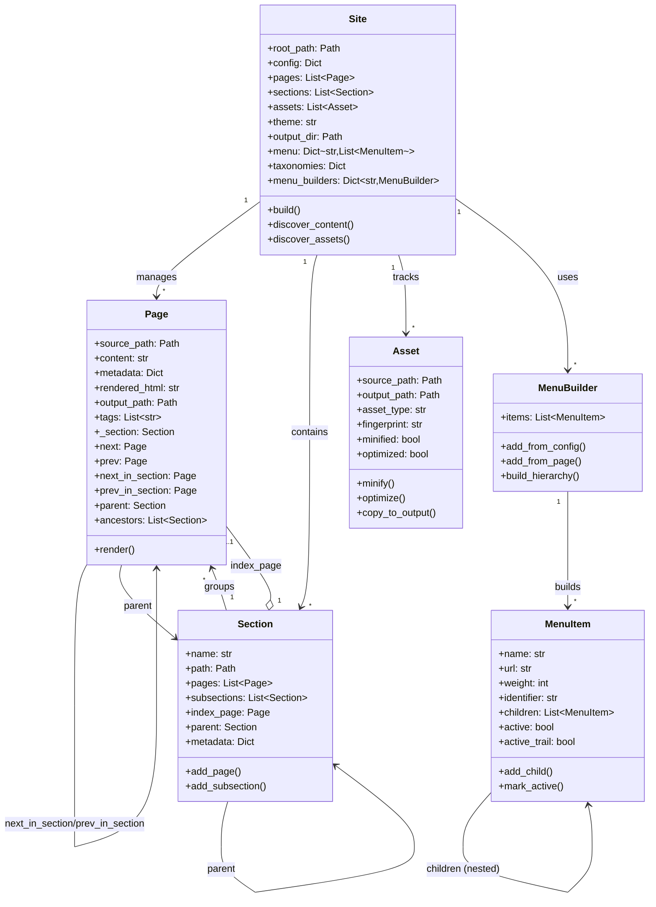

# Object Model

Bengal's object model provides a rich, hierarchical representation of site content with clear relationships and responsibilities.

## Site Object (`bengal/core/site.py`)

### Purpose
Central data model that holds all site content and delegates build coordination

### Primary Role
Data container and coordination entry point

### Key Attributes
- `root_path`: Site root directory
- `config`: Site configuration dictionary
- `pages`: List of all Page objects
- `sections`: List of all Section objects
- `assets`: List of all Asset objects
- `taxonomies`: Dict of taxonomies (tags, categories)
- `menu`: Dict[str, List[MenuItem]] - All built menus by name
- `menu_builders`: Dict[str, MenuBuilder] - Menu builders for active marking
- `theme`: Theme name or path
- `output_dir`: Output directory path
- `build_time`: Timestamp of last build

### Key Methods
- `build()`: Entry point that **delegates to BuildOrchestrator**
- `from_config()`: Factory method to create Site from config file
- `discover_content()`: Wrapper that delegates to ContentOrchestrator
- `discover_assets()`: Wrapper that delegates to AssetOrchestrator
- `mark_active_menu_items()`: Mark active menu items for current page

### Architecture Pattern
Site is a **data container**, not a "God object" - actual build logic lives in specialized orchestrators

## Page Object (`bengal/core/page/`)

### Purpose
Represents a single content page with source, metadata, rendered HTML, and navigation.

### Architecture
The Page object is split across multiple modules for better organization:

| Module | Purpose | Description |
|--------|---------|-------------|
| `__init__.py` | Main class | Core Page class that imports from other modules |
| `metadata.py` | Metadata | Frontmatter parsing, metadata extraction, property access |
| `navigation.py` | Navigation | Sequential and hierarchical navigation (next, prev, parent, ancestors) |
| `relationships.py` | Relationships | Section membership, page comparisons, hierarchical checks |
| `computed.py` | Computed props | Dynamic properties (URL, kind, type checks, TOC) |
| `operations.py` | Operations | Rendering, link extraction, validation |

### Key Properties

| Category | Property | Module | Description |
|----------|----------|--------|-------------|
| **Content** | `title`, `date`, `slug`, `url` | metadata, computed | Basic page metadata and URL path (date uses `bengal.utils.dates`) |
| | `description`, `keywords`, `draft` | metadata | SEO and publishing metadata |
| | `toc`, `toc_items` | computed | Auto-generated table of contents |
| **Navigation** | `next`, `prev` | navigation | Sequential navigation across all pages |
| | `next_in_section`, `prev_in_section` | navigation | Section-specific navigation |
| | `parent`, `ancestors` | navigation | Hierarchical navigation for breadcrumbs |
| **Type Checking** | `is_home`, `is_section`, `is_page` | computed | Boolean type checks |
| | `kind` | computed | Type as string ('home', 'section', or 'page') |
| **Comparison** | `eq()`, `in_section()` | relationships | Page equality and section membership |
| | `is_ancestor()`, `is_descendant()` | relationships | Hierarchical relationships |
| **Rendering** | `render()` | operations | Render page with template |
| | `validate_links()`, `extract_links()` | operations | Link processing and validation |

### Design Rationale
Splitting the Page class into modules provides:
- **Better maintainability**: Each module has ~100-300 lines vs 1000+ in single file
- **Clear separation of concerns**: Metadata, navigation, and operations are independent
- **Easier testing**: Test modules independently
- **Better code organization**: Related functionality grouped together

## Section Object (`bengal/core/section.py`)

### Purpose
Represents folder-based grouping of pages with hierarchical organization and metadata inheritance.

| Feature | Properties/Methods | Description |
|---------|-------------------|-------------|
| **Navigation** | `regular_pages`, `sections` | Get immediate children (pages or subsections) |
| | `regular_pages_recursive`, `url` | Recursive descendants and section URL |
| **Methods** | `aggregate_content()` | Collect metadata from all pages |
| | `walk()` | Iterative hierarchy traversal (no recursion) |
| | `apply_section_template()` | Generate section index page |
| **Cascade** | Frontmatter inheritance | Define `cascade` in `_index.md` to apply metadata to all descendants; child values override parent; accumulates through hierarchy |

## Asset Object (`bengal/core/asset.py`)

### Purpose
Handles static files (images, CSS, JS) with optimization and cache busting.

| Method | Description |
|--------|-------------|
| `minify()` | Minify CSS/JS files |
| `optimize()` | Optimize images |
| `hash()` | Generate fingerprint for cache busting |
| `copy_to_output()` | Copy to output directory |

## Menu System (`bengal/core/menu.py`)

### Purpose
Provides hierarchical navigation menus

### Components

#### MenuItem
Dataclass representing a menu item
- Supports nesting (parent/child relationships)
- Weight-based sorting
- Active state detection
- Active trail marking (parent items)

#### MenuBuilder
Constructs menu hierarchies
- Parses config-defined menus
- Integrates page frontmatter menus
- Builds hierarchical structure
- Marks active items per page

### Features
- Config-driven (TOML/YAML)
- Page frontmatter integration
- Multiple menus (main, footer, custom)
- Nested/dropdown support
- Automatic active detection

## Page Navigation System

### Purpose
Provides rich navigation between pages and through site hierarchy

### Automatic Setup
Page references are automatically configured during `discover_content()`

### Navigation Types

**Sequential Navigation**: `page.next` and `page.prev` for moving through all pages

**Section Navigation**: `page.next_in_section` and `page.prev_in_section` for section-specific navigation

**Hierarchical Navigation**: `page.parent` and `page.ancestors` for breadcrumbs and hierarchy

### Template Usage

```jinja2
{# Previous/Next links #}

  <a href="{{ url_for(page.prev) }}">← {{ page.prev.title }}</a>


{# Breadcrumbs #}

  <a href="{{ url_for(ancestor) }}">{{ ancestor.title }}</a> /


{# Section pages #}

  
    {{ child.title }}
  

```

## Cascade System (Frontmatter Inheritance)

### Purpose
Apply metadata from section index pages to all descendant pages.

### How It Works
Define `cascade` in `_index.md` frontmatter; all pages in that section inherit the metadata; page values override cascaded values; cascades accumulate through hierarchy.

### Example

```yaml
# content/products/_index.md
---
title: "Products"
cascade:
  type: "product"
  layout: "product-page"
  show_price: true
---
```

### Use Cases
Consistent layouts, default types, section-wide settings, DRY frontmatter.

## Object Model Relationships



## Key Relationships

- **Site** is the root object that manages everything
- **Sections** organize **Pages** hierarchically
- **Pages** have rich navigation (next/prev, parent, ancestors)
- **Cascade** flows metadata from Sections → Pages
- **Menus** are built from config + page frontmatter
