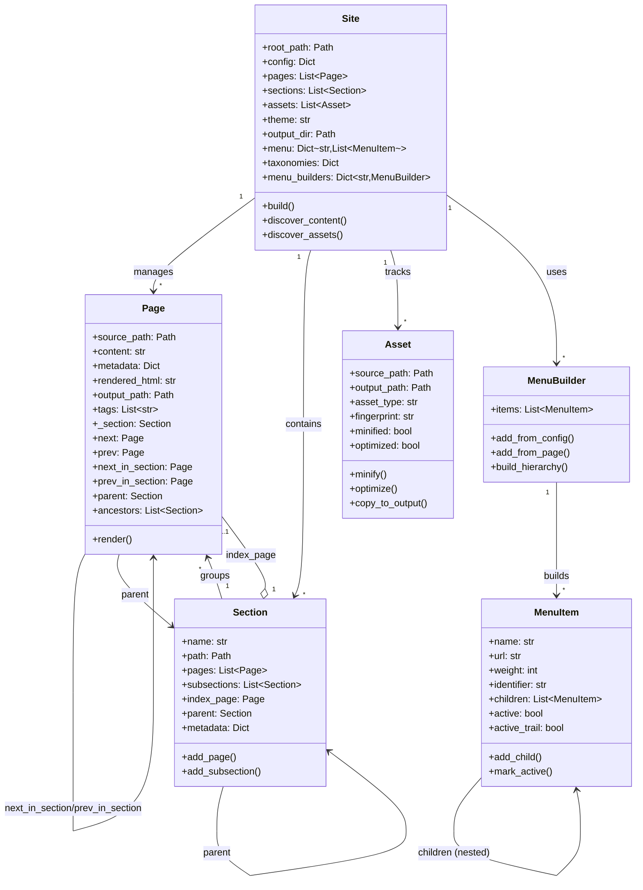

# Object Model

Bengal's object model provides a rich, hierarchical representation of site content with clear relationships and responsibilities.

## Site Object (`bengal/core/site.py`)

### Purpose
Central data model that holds all site content and delegates build coordination

### Primary Role
Data container and coordination entry point

### Key Attributes
- `root_path`: Site root directory
- `config`: Site configuration dictionary
- `pages`: List of all Page objects
- `sections`: List of all Section objects
- `assets`: List of all Asset objects
- `taxonomies`: Dict of taxonomies (tags, categories)
- `menu`: Dict[str, List[MenuItem]] - All built menus by name
- `menu_builders`: Dict[str, MenuBuilder] - Menu builders for active marking
- `theme`: Theme name or path
- `output_dir`: Output directory path
- `build_time`: Timestamp of last build

### Key Methods
- `build()`: Entry point that **delegates to BuildOrchestrator**
- `from_config()`: Factory method to create Site from config file
- `discover_content()`: Wrapper that delegates to ContentOrchestrator
- `discover_assets()`: Wrapper that delegates to AssetOrchestrator
- `mark_active_menu_items()`: Mark active menu items for current page

### Architecture Pattern
Site is a **data container**, not a "God object" - actual build logic lives in specialized orchestrators

## Page Object (`bengal/core/page/`)

### Purpose
Represents a single content page with source, metadata, rendered HTML, and navigation.

### Architecture
The Page object is split across multiple modules for better organization:

| Module | Purpose | Description |
|--------|---------|-------------|
| `__init__.py` | Main class | Core Page class that imports from other modules |
| `metadata.py` | Metadata | Frontmatter parsing, metadata extraction, property access |
| `navigation.py` | Navigation | Sequential and hierarchical navigation (next, prev, parent, ancestors) |
| `relationships.py` | Relationships | Section membership, page comparisons, hierarchical checks |
| `computed.py` | Computed props | Dynamic properties (URL, kind, type checks, TOC) |
| `operations.py` | Operations | Rendering, link extraction, validation |

### Key Properties

| Category | Property | Module | Description |
|----------|----------|--------|-------------|
| **Content** | `title`, `date`, `slug`, `url` | metadata, computed | Basic page metadata and URL path (date uses `bengal.utils.dates`) |
| | `description`, `keywords`, `draft` | metadata | SEO and publishing metadata |
| | `toc`, `toc_items` | computed | Auto-generated table of contents |
| **Navigation** | `next`, `prev` | navigation | Sequential navigation across all pages |
| | `next_in_section`, `prev_in_section` | navigation | Section-specific navigation |
| | `parent`, `ancestors` | navigation | Hierarchical navigation for breadcrumbs |
| **Type Checking** | `is_home`, `is_section`, `is_page` | computed | Boolean type checks |
| | `kind` | computed | Type as string ('home', 'section', or 'page') |
| **Comparison** | `eq()`, `in_section()` | relationships | Page equality and section membership |
| | `is_ancestor()`, `is_descendant()` | relationships | Hierarchical relationships |
| **Rendering** | `render()` | operations | Render page with template |
| | `validate_links()`, `extract_links()` | operations | Link processing and validation |

### Design Rationale
Splitting the Page class into modules provides:
- **Better maintainability**: Each module has ~100-300 lines vs 1000+ in single file
- **Clear separation of concerns**: Metadata, navigation, and operations are independent
- **Easier testing**: Test modules independently
- **Better code organization**: Related functionality grouped together

## PageProxy & Cache Contract (`bengal/core/page/proxy.py`, `bengal/cache/page_discovery_cache.py`)

### Purpose
Enables incremental builds by caching page metadata and lazy-loading full content only when needed.

### The Contract Problem
We have **three representations** of a page that must stay in sync:

| Representation | File | Purpose | Risk |
|----------------|------|---------|------|
| **Page** | `core/page/__init__.py` | Full page with content | Source of truth |
| **PageProxy** | `core/page/proxy.py` | Lazy-loaded wrapper | Must implement **ALL** properties templates use |
| **PageMetadata** | `cache/page_discovery_cache.py` | Cached metadata | Must store **ALL** fields needed without loading |

**Critical Invariant**: Any property/field added to Page that templates access **MUST** also be added to PageProxy AND PageMetadata.

### What Goes in PageMetadata Cache?

**MUST cache** (templates access these):
- `title`, `date`, `tags`, `slug`, `lang` - Core metadata
- `type`, `weight` - **Cascaded from section** (applied before cache save)
- `section` - Section path (for navigation)

**DO NOT cache** (requires full load):
- `content`, `rendered_html` - Full page content
- `toc`, `toc_items` - Generated from content
- `meta_description`, `excerpt` - Computed from content

### Path Handling Contract

**CRITICAL**: All paths must use **consistent format** in cache:
```python
# ✅ CORRECT: Relative to site root
"content/blog/post.md"

# ❌ WRONG: Absolute paths (causes duplicates)
"/Users/name/site/content/blog/post.md"
```

**Why this matters**:
- Cache lookup uses paths as keys
- Inconsistent paths → duplicate entries → wrong metadata loaded
- Use `page.source_path.relative_to(site.root_path)` when saving cache

### PageProxy Implementation Requirements

When adding a new Page property that templates use:

1. **Add to PageMetadata** (`cache/page_discovery_cache.py`):
   ```python
   @dataclass
   class PageMetadata:
       # ... existing fields ...
       new_field: str | None = None  # Add your field
   ```

2. **Save to cache** (`orchestration/build.py`, Phase 1.25):
   ```python
   metadata = PageMetadata(
       # ... existing fields ...
       new_field=page.metadata.get("new_field"),
   )
   ```

3. **Add to PageProxy** (`core/page/proxy.py`):
   ```python
   def __init__(...):
       # Populate from cache for immediate access
       self.new_field = metadata.new_field if hasattr(metadata, "new_field") else None

   @property
   def new_field(self) -> str:
       """Get new_field (NO lazy load if cached)."""
       if not self._lazy_loaded:
           return self._new_field_from_cache
       return self._full_page.new_field if self._full_page else default
   ```

### Common Pitfalls & Fixes

| Problem | Symptom | Fix |
|---------|---------|-----|
| **Missing PageProxy property** | `AttributeError` in templates after file change | Add property to PageProxy that returns cached value |
| **Missing PageMetadata field** | Wrong template/layout after rebuild | Add field to PageMetadata, save from page.metadata |
| **Duplicate cache entries** | Cache has 2x pages, wrong metadata loaded | Use relative paths when saving cache |
| **Missing cascaded field** | Properties like `type` are None | Ensure cache saved AFTER cascades applied |

### Testing Requirements

**Unit tests are NOT enough** - they don't use cache! You must test:

1. **Full build → incremental rebuild cycle**:
   ```python
   # Initial build (saves cache)
   site.build(incremental=False)

   # Load from cache
   cache = PageDiscoveryCache(...)
   site.build(incremental=True, cache=cache)

   # Verify cached pages have correct properties
   page = [p for p in site.pages if isinstance(p, PageProxy)][0]
   assert page.type == "doc"  # Must work without forcing load
   ```

2. **Cascade inheritance in incremental builds**:
   ```python
   # Change section cascade
   edit_section_index(type="article")
   site.reset_ephemeral_state()
   site.discover_content(incremental=True, cache=cache)

   # Pages should have new cascaded value
   assert page.type == "article"
   ```

### Refactoring Recommendations

**Problem**: Three places to update for every new field (error-prone). This is a **systemic design issue** affecting multiple caches (PageMetadata, BuildCache, TaxonomyIndex).

**The Root Cause**: We're manually maintaining parallel representations of data:
- Live objects (Page, Section, Asset)
- Cached metadata (PageMetadata, TagEntry, IndexEntry)  
- Lazy proxies (PageProxy)

**Solution Options** (ranked by effectiveness):

#### 1. Shared Base Class (Best - Type Safe + DRY)

```python
from dataclasses import dataclass
from typing import Protocol

@dataclass
class PageCore(Cacheable):
    """Shared fields between Page, PageProxy, and PageMetadata.

    This is the SINGLE SOURCE OF TRUTH for cacheable fields.
    Any field added here automatically works in all three representations.

    Implements the Cacheable protocol for type-safe serialization:
    - to_cache_dict(): Serializes to JSON-compatible dict (datetime → ISO string)
    - from_cache_dict(): Deserializes from cache dict back to PageCore
    """
    source_path: Path
    title: str
    date: datetime | None = None
    tags: list[str] = field(default_factory=list)
    type: str | None = None
    weight: int | None = None
    lang: str | None = None
    slug: str | None = None

# Page extends with full content
@dataclass
class Page(PageCore):
    content: str
    rendered_html: str
    toc: str
    _section: Section | None = None

# PageMetadata IS PageCore (no duplication!)
PageMetadata = PageCore

# PageProxy wraps PageCore
class PageProxy:
    def __init__(self, core: PageCore, loader: callable):
        self._core = core
        self._loader = loader

    @property
    def title(self) -> str:
        return self._core.title  # Delegate to core
```

**Benefits**:
- ✅ Define field once, works everywhere
- ✅ Type checker catches missing fields
- ✅ Impossible to have PageMetadata/PageProxy mismatch
- ✅ Clear separation: PageCore = cacheable, Page adds non-cacheable
- ✅ Type-safe serialization via Cacheable protocol (prevents cache bugs)

**Tradeoffs**:
- ⚠️ Requires refactoring Page to use composition (breaking change)
- ⚠️ ~2-3 days of work

#### 2. Decorator-Based Field Registration (Good - Automatic)

```python
from dataclasses import dataclass, fields
from typing import get_type_hints

# Use Page as source of truth
@cacheable_fields(["title", "date", "tags", "type", "weight", "lang", "slug"])
@dataclass
class Page:
    title: str
    date: datetime | None
    tags: list[str]
    type: str | None
    weight: int | None
    # ... more fields ...

    content: str  # NOT cacheable
    rendered_html: str  # NOT cacheable

# Auto-generate from decorator metadata
def generate_metadata_class(page_class):
    cacheable = getattr(page_class, "__cacheable_fields__")
    hints = get_type_hints(page_class)
    return make_dataclass(
        "PageMetadata",
        [(f, hints[f]) for f in cacheable]
    )

PageMetadata = generate_metadata_class(Page)

# PageProxy auto-delegates
class PageProxy:
    def __init__(self, metadata: PageMetadata, loader):
        self._metadata = metadata
        self._loader = loader

    def __getattr__(self, name):
        # Auto-delegate cacheable fields to metadata
        if hasattr(self._metadata, name):
            return getattr(self._metadata, name)
        # Force load for non-cacheable
        self._ensure_loaded()
        return getattr(self._full_page, name)
```

**Benefits**:
- ✅ Single source of truth (Page class)
- ✅ Auto-generates PageMetadata and PageProxy delegation
- ✅ Less invasive refactoring

**Tradeoffs**:
- ⚠️ Magic behavior (`__getattr__`) can be hard to debug
- ⚠️ ~1-2 days of work

#### 3. Protocol + Runtime Validation (Good - Defensive)

```python
from typing import Protocol, runtime_checkable

@runtime_checkable
class Cacheable(Protocol):
    """Contract for fields that must be cacheable."""
    source_path: Path
    title: str
    date: datetime | None
    tags: list[str]
    type: str | None
    weight: int | None

# Page implements protocol
@dataclass
class Page(Cacheable):
    # ... all fields ...
    pass

# PageMetadata also implements
@dataclass  
class PageMetadata(Cacheable):
    # Must have same fields or type checker fails
    pass

# Runtime validation
def save_to_cache(page: Page) -> PageMetadata:
    # Build metadata from page
    metadata = PageMetadata(...)

    # Runtime check - ensures all Cacheable fields copied
    for field in Cacheable.__annotations__:
        assert hasattr(metadata, field), f"Missing {field}"

    return metadata
```

**Benefits**:
- ✅ Type checker validates at compile time
- ✅ Runtime checks catch errors in dev
- ✅ Minimal refactoring (~1 day)

**Tradeoffs**:
- ⚠️ Still manual duplication between Page/PageMetadata
- ⚠️ Runtime checks add overhead

#### 4. Pydantic Models (Industry Standard - Automatic Serialization)

```python
from pydantic import BaseModel, Field

class PageMetadata(BaseModel):
    """Pydantic auto-handles serialization/validation."""
    source_path: Path
    title: str
    date: datetime | None = None
    tags: list[str] = Field(default_factory=list)
    type: str | None = None

    class Config:
        # Auto-convert from Page objects
        from_attributes = True

# Save to cache - automatic!
metadata = PageMetadata.from_orm(page)
json_str = metadata.model_dump_json()

# Load from cache - automatic!
metadata = PageMetadata.model_validate_json(json_str)
```

**Benefits**:
- ✅ Industry-standard (FastAPI, Django Ninja use this)
- ✅ Auto JSON serialization/deserialization  
- ✅ Built-in validation
- ✅ Great documentation

**Tradeoffs**:
- ⚠️ New dependency (pydantic ~600KB)
- ⚠️ Slower than dataclasses (~2-3x)
- ⚠️ Overkill for internal caching?

#### 5. Code Generation (Hugo's Approach - Type Safe)

```python
# schema.yaml (single source of truth)
cacheable_fields:
  - name: title
    type: str
  - name: date
    type: datetime | None
  - name: type
    type: str | None

# generate_classes.py (run at dev time)
def generate_from_schema(schema):
    # Generate Page class
    # Generate PageMetadata class  
    # Generate PageProxy delegation
    # All guaranteed to match!
```

**Benefits**:
- ✅ Compile-time type safety
- ✅ Zero runtime overhead
- ✅ Single source of truth (schema file)

**Tradeoffs**:
- ⚠️ Build step complexity
- ⚠️ Overkill for Python (lose dynamic benefits)

### Debug Checklist

When dev server shows wrong layouts/nav after file changes:

1. ✅ Does PageProxy implement `.type`, `.parent`, `.ancestors`?
2. ✅ Does PageMetadata have `type` field?
3. ✅ Is cache saved AFTER cascades applied? (check build.py Phase 1.25)
4. ✅ Are paths consistent (relative format)? Check cache file size
5. ✅ Do tests actually use cache? (not just `discover_content()`)

## Section Object (`bengal/core/section.py`)

### Purpose
Represents folder-based grouping of pages with hierarchical organization and metadata inheritance.

| Feature | Properties/Methods | Description |
|---------|-------------------|-------------|
| **Navigation** | `regular_pages`, `sections` | Get immediate children (pages or subsections) |
| | `regular_pages_recursive`, `url` | Recursive descendants and section URL |
| **Methods** | `aggregate_content()` | Collect metadata from all pages |
| | `walk()` | Iterative hierarchy traversal (no recursion) |
| | `apply_section_template()` | Generate section index page |
| **Cascade** | Frontmatter inheritance | Define `cascade` in `_index.md` to apply metadata to all descendants; child values override parent; accumulates through hierarchy |

## Asset Object (`bengal/core/asset.py`)

### Purpose
Handles static files (images, CSS, JS) with optimization and cache busting.

| Method | Description |
|--------|-------------|
| `minify()` | Minify CSS/JS files |
| `optimize()` | Optimize images |
| `hash()` | Generate fingerprint for cache busting |
| `copy_to_output()` | Copy to output directory |

## Menu System (`bengal/core/menu.py`)

### Purpose
Provides hierarchical navigation menus

### Components

#### MenuItem
Dataclass representing a menu item
- Supports nesting (parent/child relationships)
- Weight-based sorting
- Active state detection
- Active trail marking (parent items)

#### MenuBuilder
Constructs menu hierarchies
- Parses config-defined menus
- Integrates page frontmatter menus
- Builds hierarchical structure
- Marks active items per page

### Features
- Config-driven (TOML/YAML)
- Page frontmatter integration
- Multiple menus (main, footer, custom)
- Nested/dropdown support
- Automatic active detection

## Page Navigation System

### Purpose
Provides rich navigation between pages and through site hierarchy

### Automatic Setup
Page references are automatically configured during `discover_content()`

### Navigation Types

**Sequential Navigation**: `page.next` and `page.prev` for moving through all pages

**Section Navigation**: `page.next_in_section` and `page.prev_in_section` for section-specific navigation

**Hierarchical Navigation**: `page.parent` and `page.ancestors` for breadcrumbs and hierarchy

### Template Usage

```jinja2
{# Previous/Next links #}

  <a href="{{ url_for(page.prev) }}">← {{ page.prev.title }}</a>


{# Breadcrumbs #}

  <a href="{{ url_for(ancestor) }}">{{ ancestor.title }}</a> /


{# Section pages #}

  
    {{ child.title }}
  

```

## Cascade System (Frontmatter Inheritance)

### Purpose
Apply metadata from section index pages to all descendant pages.

### How It Works
Define `cascade` in `_index.md` frontmatter; all pages in that section inherit the metadata; page values override cascaded values; cascades accumulate through hierarchy.

### Example

```yaml
# content/products/_index.md
---
title: "Products"
cascade:
  type: "product"
  layout: "product-page"
  show_price: true
---
```

### Use Cases
Consistent layouts, default types, section-wide settings, DRY frontmatter.

## Object Model Relationships



## Key Relationships

- **Site** is the root object that manages everything
- **Sections** organize **Pages** hierarchically
- **Pages** have rich navigation (next/prev, parent, ancestors)
- **Cascade** flows metadata from Sections → Pages
- **Menus** are built from config + page frontmatter
