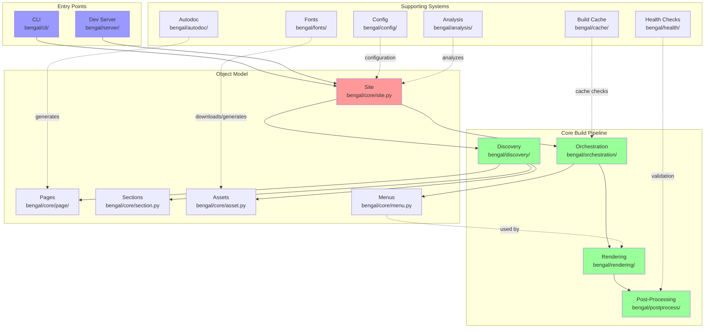

# Bengal SSG - Architecture Overview

## Introduction

Bengal SSG follows a modular architecture with clear separation of concerns to avoid "God objects" and maintain high performance even with large sites.

**Key Features:**
- **AST-based Python Autodoc**: Generate Python API documentation without importing code
- **Incremental Builds**: Faster rebuilds with intelligent caching
- **Performance**: Parallel processing and optimizations
- **Rich Content Model**: Taxonomies, navigation, menus, and cascading metadata
- **Developer Experience**: Error messages, health checks, and file-watching dev server

## High-Level Architecture

**Key Flows:**
1. **Build**: CLI → Site → Discovery → Orchestration → [Menus + Rendering] → Post-Process
2. **Menu Building**: Orchestration builds menus → Rendering uses menus in templates
3. **Cache**: Build Cache checks file changes and dependencies before rebuilding
4. **Autodoc**: Generate Python/CLI docs → treated as regular content pages
5. **Dev Server**: Watch files → trigger incremental rebuilds → serve output

## Cross-Cutting Concerns

### BuildContext (Dependency Injection)

The build system uses a lightweight `BuildContext` object (`bengal/utils/build_context.py`) to pass shared state and services through orchestrators and rendering without relying on globals or mutating `Site` internals.

- Purpose: centralized container for dependencies and in-flight state
- Typical fields: `site`, `pages`, `assets`, `reporter`, `progress_manager`, optional injected `markdown_parser`, `template_engine`, `api_doc_enhancer`
- Adoption:
  - `BuildOrchestrator` creates and threads `BuildContext` into `RenderOrchestrator` and post-process stages
  - `RenderingPipeline` and `Renderer` can read injected services from `BuildContext`
- Outcome: removes temporary mutation of `site.pages` and `site.assets`; phases now receive explicit lists (clearer, safer, parallel-friendly)

### ProgressReporter (Output Decoupling)

To standardize progress output, we introduced a `ProgressReporter` protocol with default and Rich-based implementations (`bengal/utils/progress.py`). This decouples user-visible output from the core logic.

- Protocol methods: `add_phase`, `start_phase`, `update_phase`, `complete_phase`, `log`
- Adapter: `LiveProgressReporterAdapter` bridges to the existing Rich `LiveProgressManager` (`bengal/utils/live_progress.py`)
- Usage: orchestrators and the rendering pipeline route per-page messages and phase updates via the reporter; direct `print()` calls have been removed or minimized

### TemplateValidationService (CLI Decoupling)

The CLI no longer constructs rendering internals directly for template validation. Instead it depends on a `TemplateValidationService` protocol (`bengal/services/validation.py`) with a default implementation that wraps the existing validator. This reduces CLI→rendering coupling and improves testability.

### Theme Resolution Utility

Theme inheritance and resolution logic is being extracted to `bengal/utils/theme_resolution.py` to reduce coupling between `Site`, theme assets, and the template engine. `Site` and rendering components use the utility for consistent chain resolution and fallbacks.

### Output Quality Hardening

The variable-substitution path (Mistune) restores escaped placeholders as HTML entities, and the pipeline hardens content by escaping raw Jinja2 markers when `preprocess: false`. This prevents unrendered template syntax (e.g., `{{ page.* }}`, ``) from leaking into final HTML outside templates.

### Recent Decoupling Improvements (2025-10)

- Introduced `BuildContext` and threaded it through rendering/post-processing
- Replaced temporary `site.pages`/`site.assets` swaps with explicit lists
- Standardized progress output via `ProgressReporter` (Rich adapter available)
- Decoupled CLI validation via `TemplateValidationService`
- Extracted theme resolution into utility module
- Hardened output to avoid unrendered Jinja2 markers in generated HTML

## Architecture Documentation

This overview provides a high-level view of Bengal's architecture. For detailed documentation on specific components, see:

- [Object Model](./object-model.md) - Site, Page, Section, Asset, Menu objects
- [Cache System](./cache.md) - Incremental builds and dependency tracking
- [Rendering Pipeline](./rendering.md) - Markdown parsing, templates, plugins
- [Autodoc System](./autodoc.md) - AST-based documentation generation
- [Discovery System](./discovery.md) - Content and asset discovery
- [Fonts System](./fonts.md) - Google Fonts self-hosting
- [Configuration](./config.md) - Configuration loading and management
- [Post-Processing](./postprocess.md) - Sitemap, RSS, link validation
- [Development Server](./server.md) - File watching and live reload
- [Health Checks](./health.md) - Build validation system
- [Analysis System](./analysis.md) - Graph analysis, PageRank, communities
- [CLI](./cli.md) - Command-line interface structure
- [Utilities](./utils.md) - Shared utility modules
- [Design Principles](./design-principles.md) - Core architectural patterns
- [Performance](./performance.md) - Performance characteristics and benchmarks
- [File Organization](./file-organization.md) - Directory structure and file management
- [Testing](./testing.md) - Testing strategy and coverage
