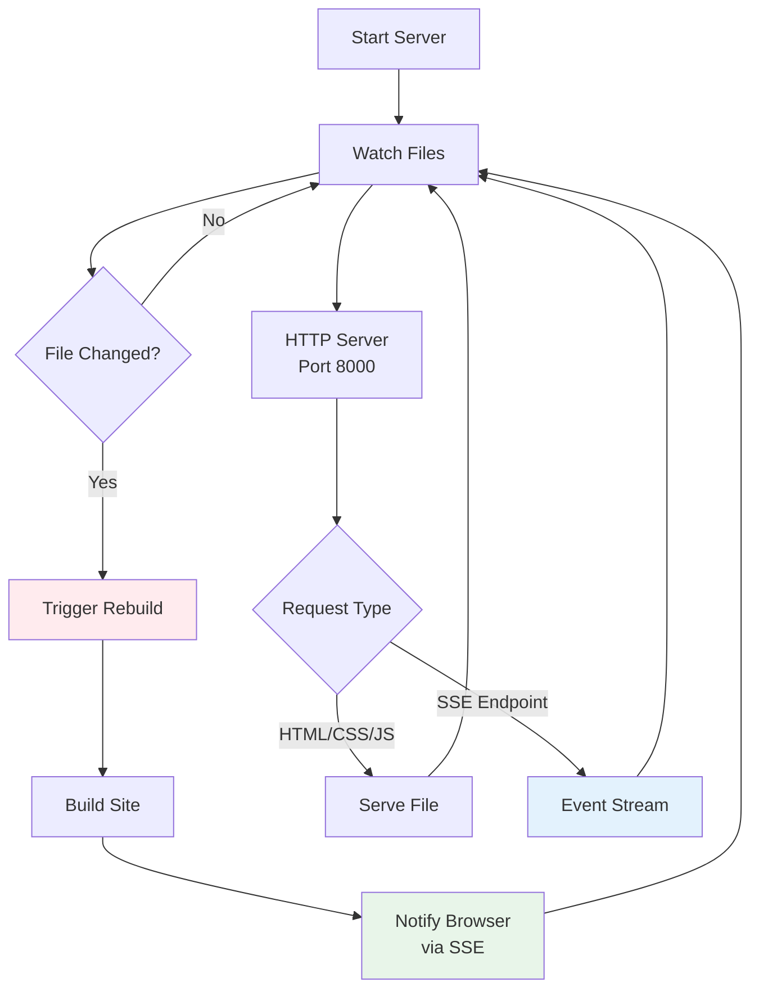

# Development Server

Bengal includes a built-in development server with file watching and live reload capabilities.

## Dev Server (`bengal/server/dev_server.py`)

### Purpose
Provide a local development environment with automatic rebuilds

### Features
- Built-in HTTP server
- File system watching with watchdog
- Automatic rebuild on changes
- Live reload via SSE (Server-Sent Events)
- Serves static files and HTML
- Automatic browser refresh

### Architecture



### Usage

```bash
# Start development server
bengal site serve

# Custom port
bengal site serve --port 8080

# Disable live reload
bengal site serve --no-reload

# Watch specific files only
bengal site serve --watch "content/**/*.md"
```

### File Watching

The server watches for changes in:
- Content files (`content/**/*.md`)
- Templates (`templates/**/*.html`, `templates/**/*.jinja2`)
- Assets (`assets/**/*`)
- Configuration (`bengal.toml`)
- Theme files (if using custom theme)

### Rebuild Triggers

| Changed File | Rebuild Type | Reason |
|--------------|--------------|--------|
| `bengal.toml` | Full rebuild | Config change affects everything |
| `content/*.md` | Incremental | Only changed pages need rebuild |
| `templates/*.html` | Affected pages | Pages using that template |
| `assets/*` | Asset only | Copy changed asset |
| `themes/*` | Full rebuild | Theme change affects all pages |

### Live Reload Implementation

The live reload feature uses Server-Sent Events (SSE):

1. **HTML Injection**: Server injects reload script into every HTML page
2. **SSE Connection**: Browser connects to `/__bengal_reload__` endpoint
3. **File Watch**: Server watches for file changes
4. **Rebuild Trigger**: On change, rebuild affected files
5. **Event Send**: Server sends `reload` event via SSE
6. **Browser Refresh**: Client receives event and reloads page

### Injected Script

```html
<!-- Automatically injected by dev server -->
<script>
const eventSource = new EventSource('/__bengal_reload__');
eventSource.onmessage = (event) => {
  if (event.data === 'reload') {
    location.reload();
  }
};
</script>
```

### Performance Considerations

- **Incremental builds**: Only rebuild changed files (fast)
- **Debouncing**: Groups rapid changes to avoid multiple rebuilds
- **Efficient watching**: Uses native file system events (watchdog)
- **Selective injection**: Reload script only in HTML, not assets

### Configuration

```toml
[server]
port = 8000
host = "localhost"
live_reload = true
debounce_delay = 0.5  # seconds
```

### Limitations

- **Live Reload**: Only reloads page, doesn't preserve state (unlike HMR)
- **Caching**: Browser caching can interfere with updates (use hard refresh)
- **HTTPS**: Dev server uses HTTP only (use reverse proxy for HTTPS testing)
- **Production**: Dev server not suitable for production (use proper web server)

## Integration with Build System

The dev server integrates cleanly with the build system:

```python
from bengal.server import DevServer
from bengal.core import Site

site = Site.from_config()
server = DevServer(
    site=site,
    output_dir=site.output_dir,
    watch_dirs=[site.content_dir, site.templates_dir, site.assets_dir],
    port=8000,
)
server.run()
```

### Reset Ephemeral State

The server calls `Site.reset_ephemeral_state()` before each rebuild to clear:
- Rendered HTML from pages
- Cached computed properties
- Menu active states
- Build-time temporary data

This ensures each rebuild starts fresh without stale data.
