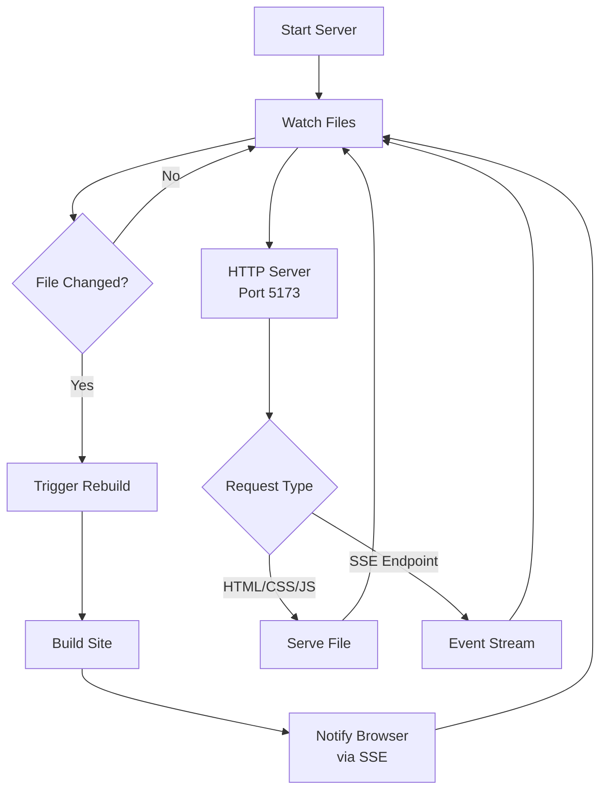

# Development And Preview Server

Bengal includes two local serving modes:

- `bengal serve` is the authoring loop with file watching, live reload, markdown
  negotiation, rebuild badges, and serve-ready startup.
- `bengal preview` builds first, then serves the completed output directory
  read-only through Pounce's static file path.

## Dev Server (`bengal/server/dev_server.py`)

### Purpose

Provide a local development environment with automatic rebuilds.

### Features

- ASGI server via [Pounce](https://github.com/lbliii/pounce)
- Double-buffered output (eliminates FOUC during rebuilds)
- File system watching with watchfiles
- Automatic rebuild on changes
- Live reload via SSE (Server-Sent Events)
- CSS hot reload (no full page refresh for CSS changes)
- Browse-ready cold start: local `serve` starts once HTML is ready, then finishes
  generated artifacts, health checks, and cache writes in the background
- Automatic browser opening
- Stale process detection and cleanup
- Automatic port fallback if port is in use
- Process-isolated builds for clean Ctrl+C shutdown

### Architecture



### Usage

```bash
# Start development server (opens browser by default)
bengal serve

# Custom port
bengal serve --port 8080

# Disable file watching (and live reload)
bengal serve --no-watch

# Disable automatic browser opening
bengal serve --no-open-browser

# Wait for deploy-quality artifacts, health checks, and caches before serving
bengal serve --complete

# Focus rebuilds on a single version (faster for versioned docs)
bengal serve --version-scope v2

# Verbose output for debugging
bengal serve --verbose
```

## Static Preview (`bengal preview`)

Use preview when you want local serving behavior closer to a deployed static
host:

```bash
# Build with the preview environment, then serve public/
bengal preview

# Build with production settings before serving locally
bengal preview --environment production

# Bind a specific address and port
bengal preview --host 127.0.0.1 --port 8080

# Keep the browser closed
bengal preview --no-open-browser
```

Preview always runs a complete build before starting the server. The server then
mounts the generated output directory as a Pounce static root. That gives local
requests the static-serving behavior Bengal relies on for deployment checks:
directory indexes, ETags, `304 Not Modified`, byte-range responses, `HEAD`,
precompressed `.gz`/`.zst` sidecars when they already exist, symlink/path
guardrails, and generated JSON/XML/TXT artifacts as ordinary completed files.

Preview deliberately leaves out development behavior: no watcher, no live
reload script injection, no markdown negotiation, no rebuild badge, and no
serve-ready pending-artifact responses. Missing routes use the generated
`404.html` when present, without dev injection.

The preview server also exposes a Bengal-namespaced health path at
`/__bengal_pounce_health__` for local readiness checks.

### File Watching

The server watches for changes in:

- Content files (`content/**/*.md`)
- Templates (`templates/**/*.html`)
- Assets (`assets/**/*`)
- Data files (`data/**/*`)
- Static files (`static/**/*`) if enabled
- Internationalization (`i18n/**/*`) if present
- Configuration (`bengal.toml`)
- Theme files (project and bundled themes)
- Autodoc source directories (Python, OpenAPI) if configured

### Rebuild Triggers

| Changed File | Rebuild Type | Reason |
|--------------|--------------|--------|
| `bengal.toml` | Full rebuild | Config change affects everything |
| `content/*.md` | Incremental | Only changed pages need rebuild |
| `templates/*.html` | Affected pages | Pages using that template |
| `assets/*` | Asset only | Copy changed asset |
| `themes/*` | Full rebuild | Theme change affects all pages |

### Live Reload Implementation

The live reload feature uses Server-Sent Events (SSE):

1. **HTML Injection**: Server injects reload script into every HTML page
2. **SSE Connection**: Browser connects to `/__bengal_reload__` endpoint
3. **File Watch**: Server watches for file changes
4. **Rebuild Trigger**: On change, rebuild affected files
5. **Event Send**: Server sends `reload` or `reload-css` event via SSE
6. **Browser Refresh**: Client receives event and reloads page (or hot-swaps CSS)

### Injected Script (Simplified)

The actual implementation includes CSS hot reload and reconnection logic:

```html
<!-- Automatically injected by dev server -->
<script>
const source = new EventSource('/__bengal_reload__');
source.onmessage = (event) => {
  const action = JSON.parse(event.data).action || event.data;
  if (action === 'reload') {
    location.reload();
  } else if (action === 'reload-css') {
    // Hot-swap CSS without full page reload
    document.querySelectorAll('link[rel="stylesheet"]').forEach(link => {
      link.href = link.href.replace(/\?.*|$/, '?t=' + Date.now());
    });
  }
};
</script>
```

### Double-Buffered Output

The dev server uses a double-buffered output strategy to prevent flash-of-unstyled-content (FOUC) during rebuilds. Instead of writing directly to the directory being served, builds write to an alternate buffer and atomically swap it in when complete.

- **BufferManager** manages two output directories and provides an atomic swap
- The ASGI app resolves the active directory per-request, so in-flight requests always see a consistent snapshot
- Content-only edits can use a zero-disk reactive path that skips the full write cycle

### Performance Considerations

- **Serve-ready startup**: Cold `bengal serve` blocks on HTML and special pages,
  then completes search indexes, feeds, health checks, and cache persistence in
  the background. Use `--complete` when validating deploy-quality output before
  the server starts.
- **Preview static root**: `bengal preview` skips dev-server routing after the
  build and lets Pounce serve the completed output directory directly.
- **Incremental builds**: Only rebuild changed files (5-10x faster than full builds)
- **Debouncing**: Groups rapid changes (300ms delay) to avoid multiple rebuilds
- **Efficient watching**: Uses watchfiles with native file system events
- **Selective injection**: Reload script only in HTML, not assets
- **Process-isolated builds**: Builds run outside the server process for clean Ctrl+C shutdown

### Configuration

Configure dev server behavior in `bengal.toml` under the `[dev_server]` section:

```toml
[dev_server]
# Exclude patterns from file watching
exclude_patterns = ["*.tmp", "*.log", ".git/**"]

# Pre-build hooks (run before each rebuild)
pre_build = [
    "python scripts/check-content.py"
]

# Post-build hooks (run after each rebuild)
post_build = [
    "python scripts/validate-links.py public/"
]
```

Server options (port, host, watch) are CLI arguments, not config options.

### Limitations

- **Live Reload**: Only reloads page, doesn't preserve state (unlike HMR)
- **Caching**: Browser caching can interfere with updates (use hard refresh)
- **HTTPS**: Dev server uses HTTP only (use reverse proxy for HTTPS testing)
- **Production**: Dev server not suitable for production (use proper web server)
- **Precompression**: Bengal serves existing `.gz` and `.zst` sidecars in
  preview, but build-time sidecar generation is a separate output contract and
  is not enabled by this command.

## Integration with Build System

### Recommended API

The simplest way to start the dev server programmatically:

```python
from bengal.core import Site

site = Site.from_config()
site.serve(port=5173, watch=True, open_browser=True)
```

### Direct DevServer Usage

For more control, use the DevServer class directly:

```python
from bengal.server.dev_server import DevServer
from bengal.core import Site

site = Site.from_config()
server = DevServer(
    site=site,
    port=5173,
    watch=True,
    auto_port=True,      # Find available port if 5173 is taken
    open_browser=False,  # Don't auto-open browser
    completion_policy="serve_ready",  # Use "complete" for production parity
)
server.start()  # Runs until Ctrl+C
```

### Reset Ephemeral State

The server calls `Site.reset_ephemeral_state()` before each rebuild to clear:

- Page and section lists
- Asset references
- Taxonomy data
- Menu builders and cached menus
- Cross-reference indices

This ensures each rebuild starts fresh without stale data.
