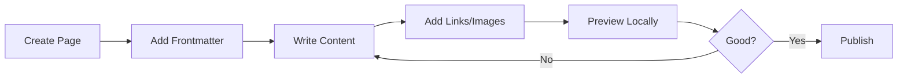

# Writing Guide

Learn to create beautiful content with Bengal SSG. This guide covers everything from your first page to advanced features.

## Quick Start

New to Bengal? Start here:

1. **[Getting Started](getting-started.md)** - Create your first page in 5 minutes
2. **[Markdown Basics](markdown-basics.md)** - Learn essential markdown syntax
3. **[Content Organization](content-organization.md)** - Structure your site

## Essential Skills

Core skills every writer needs:

- **[Frontmatter Guide](frontmatter-guide.md)** - Page metadata essentials
- **[Internal Links](internal-links.md)** - Cross-reference between pages
- **[Images and Assets](images-and-assets.md)** - Add media to your content

## Level Up

Ready for more advanced features:

- **[Extended Markdown](markdown-extended.md)** - Tables, footnotes, and more
- **[External Links](external-links.md)** - Link to external resources

## Content Workflow



## What You Can Create

Bengal supports multiple content types:

- **Documentation** - Technical docs with navigation
- **Blog Posts** - Articles with tags and categories
- **Tutorials** - Step-by-step guides
- **Standard Pages** - About, contact, landing pages

See [Content Types](../content-types/) for details.

## Quick Reference

### Basic Page Structure

```markdown
---
title: My Page Title
description: Short summary
date: 2025-10-11
tags: ["guide", "tutorial"]
---

# My Page Title

Write your content here using markdown.

## Section Heading

More content...
```

### Common Tasks

| Task | Syntax |
|------|--------|
| Bold text | `**bold**` |
| Italic text | `*italic*` |
| Link | `[text](url)` |
| Image | `` |
| Code | `` `code` `` |
| Heading | `## Heading` |

See [Markdown Basics](markdown-basics.md) for complete syntax.

## Need Help?

- Browse the [Kitchen Sink](../kitchen-sink.md) for examples of all features
- Check [Directives](../directives/) for callouts, tabs, and more
- Review [Advanced Features](../advanced/) for power user tips

## Next Steps

Start with [Getting Started](getting-started.md) to create your first page!

