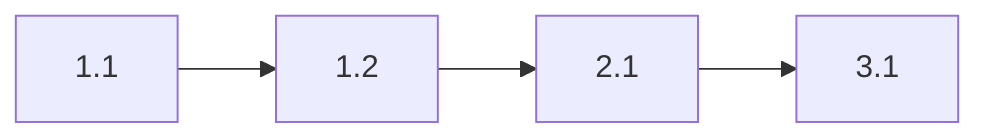

# Plan

Convert RFC into actionable, atomic task list.

**Shortcut**: `::plan`

**Works with**: `modules/evidence-handling`

---

## Output Structure

```markdown
# Plan: [Feature Name]

**RFC**: [Link to RFC]
**Status**: Ready
**Estimated Effort**: [N] hours

---

## Phase 1: [Foundation]

### Task 1.1: [Description]
**File**: `bengal/core/new_file.py`
**Changes**:
- Add `NewClass` dataclass
- Define type contract

**Tests**: `tests/unit/core/test_new_file.py`

**Commit**: 
```bash
git add -A && git commit -m "core: add NewClass type contract"
```

### Task 1.2: [Description]
[Same structure]

---

## Phase 2: [Implementation]
[Tasks...]

---

## Phase 3: [Testing]
[Tasks...]

---

## Dependencies



## Quality Gates

- [ ] All tasks have tests defined
- [ ] Core module tasks: 90% confidence required
- [ ] Commit messages pre-drafted
```

---

## Task Principles

1. **Atomic** - One logical change per task
2. **Ordered** - Dependencies clear
3. **Testable** - Each task has verification
4. **Committable** - Each task = one commit

---

## Related

- `commands/rfc` - Input for planning
- `commands/implement` - Execute tasks
- `workflows/feature` - Full flow

