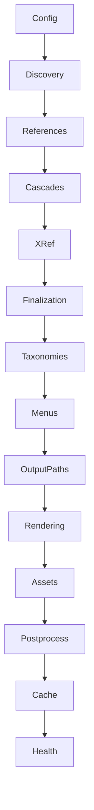

# Bengal SSG - Data Flow Cheat Sheet

**Quick Reference** - Essential transformations only  
**For detailed flow**: See `DATA_TRANSFORMATION_FLOW_CORRECTED.md`

---

## 10-Second Overview

```
TOML → Config → Files → Pages → References → Cascades → 
Generated Pages → Menus → Output Paths → Parse → Render → Write
```

---

## Phase Summary

| # | Phase | Input | Output | Time |
|---|-------|-------|--------|------|
| 0 | Config | `bengal.toml` | `Site.config` dict | Discovery |
| 1a | Discovery | `content/*.md` | `List[Page]`, `List[Section]` | Discovery |
| 1b | References | Isolated pages | Pages with `._site`, `._section` | Discovery |
| 1c | Cascades | Section metadata | Enriched page metadata | Discovery |
| 1d | XRef Index | All pages | `site.xref_index` | Discovery |
| 2 | Finalization | Sections missing index | Auto-generated archive pages | Pre-render |
| 3 | Taxonomies | Pages with tags | `site.taxonomies`, tag pages | Pre-render |
| 4 | Menus | Config + frontmatter | `site.menu` | Pre-render |
| 5 | Incremental | All pages | Filtered pages to build | Pre-render |
| 6a | Output Paths | Pages | Pages with `output_path` | Pre-render |
| 6b | Var Sub | `{{ page.title }}` | Substituted markdown | Per-page |
| 6c | Markdown | Markdown text | HTML + TOC | Per-page |
| 6d | API Enhance | `@async` markers | Badge HTML | Per-page |
| 6e | Link Extract | HTML | `page.links` list | Per-page |
| 6f | Template | HTML + context | `page.rendered_html` | Per-page |
| 6g | Write | HTML string | File on disk | Per-page |
| 7 | Assets | CSS/JS/images | Minified/optimized files | Post-render |
| 8 | Postprocess | All rendered | sitemap, RSS, 404 | Post-render |
| 9 | Cache | Build state | `.bengal-cache/*.json` | Post-render |
| 10 | Health | Everything | Validation report | Post-render |

---

## Critical Transformations (Code Locations)

### Phase 0: Config Loading
```python
# bengal/config/loader.py:102-115
with open('bengal.toml') as f:
    raw = toml.load(f)              # TOML → dict
flat = self._flatten_config(raw)    # Nested → flat
validated = validator.validate(flat) # Validate
```

### Phase 1a: Frontmatter Parsing
```python
# bengal/discovery/content_discovery.py:180-184
post = frontmatter.loads(file_content)  # Parse
content = post.content                   # Markdown string
metadata = dict(post.metadata)           # Metadata dict
```

### Phase 1b: Reference Setup
```python
# bengal/orchestration/content.py:112-126
for page in site.pages:
    page._site = site        # ← CRITICAL
    page._section = section  # ← CRITICAL
```

### Phase 1c: Cascade Application
```python
# bengal/orchestration/content.py:195-202
for key, value in cascade.items():
    if key not in page.metadata:
        page.metadata[key] = value  # ← Add cascaded value
```

### Phase 6a: Output Path Computation
```python
# bengal/orchestration/render.py:147-163
for page in site.pages:
    # content/blog/post.md → public/blog/post/index.html
    page.output_path = site.output_dir / output_rel_path
```

### Phase 6b: Variable Substitution
```python
# bengal/rendering/plugins/variable_substitution.py
"# {{ page.title }}" → "# My Post"  # In markdown
```

### Phase 6c: Markdown → HTML
```python
# bengal/rendering/parser.py
"# My Post\n\nContent" → "<h1>My Post</h1><p>Content</p>"
```

### Phase 6f: Template Rendering
```python
# bengal/rendering/renderer.py:85-103
template = env.get_template('page.html')
html = template.render(content=html, page=page, site=site)
```

---

## Key Data Structure Evolution

### 1. Page Object Lifecycle

```python
# After Discovery (Phase 1a)
Page(
    source_path=Path("content/blog/post.md"),
    content="# Post\n\nContent",
    metadata={'title': 'Post'},
    _site=None,          # ← Not set
    _section=None,       # ← Not set
    output_path=None,    # ← Not set
    parsed_ast=None,     # ← Not set
    rendered_html=""     # ← Not set
)

# After References (Phase 1b)
_site=<Site>,            # ← ADDED
_section=<Section>,      # ← ADDED

# After Cascades (Phase 1c)
metadata={
    'title': 'Post',
    'type': 'blog-post'  # ← ADDED from cascade
}

# After Output Paths (Phase 6a)
output_path=Path("public/blog/post/index.html")  # ← ADDED

# After Parsing (Phase 6c)
parsed_ast="<h1>Post</h1>...",  # ← ADDED
toc="<ul>...</ul>",             # ← ADDED

# After Template (Phase 6f)
rendered_html="<!DOCTYPE html>..."  # ← ADDED (complete)
```

### 2. Site Object Evolution

```python
# After Config (Phase 0)
Site(config={'title': 'My Site', ...})

# After Discovery (Phase 1a)
Site(
    pages=[page1, page2],
    sections=[section1]
)

# After Cascades (Phase 1c)
# Pages have enriched metadata

# After XRef (Phase 1d)
Site(xref_index={'by_path': {...}, 'by_slug': {...}})

# After Section Finalization (Phase 2)
# New archive pages added to site.pages

# After Taxonomies (Phase 3)
Site(
    taxonomies={'tags': {'python': {...}}},
    pages=[...original..., ...tag_pages...]
)

# After Menus (Phase 4)
Site(menu={'main': [MenuItem(...)]})
```

---

## Common Patterns

### Pattern 1: Metadata Merging (Precedence Order)

```python
# Highest priority → Lowest priority:
1. Page frontmatter        page.metadata['type'] = 'custom'
2. Immediate section cascade   section.metadata['cascade']['type'] = 'post'
3. Parent section cascade      parent.metadata['cascade']['type'] = 'article'
4. Default values          (none)
```

### Pattern 2: Path Transformations

```
Source                        → Output (pretty_urls=true)
content/about.md             → public/about/index.html
content/blog/_index.md       → public/blog/index.html
content/blog/post.md         → public/blog/post/index.html
content/docs/api/guide.md    → public/docs/api/guide/index.html
```

### Pattern 3: URL Generation

```python
page.output_path = Path("public/blog/post/index.html")
site.output_dir = Path("public")

# Compute:
rel_path = output_path.relative_to(output_dir)
# → Path("blog/post/index.html")

# Remove index.html:
# → Path("blog/post")

# Convert to URL:
url = '/' + '/'.join(rel_path.parts) + '/'
# → "/blog/post/"
```

### Pattern 4: Generated Pages

```python
# All generated pages have:
metadata = {
    '_generated': True,     # Flag for filtering
    '_virtual': True,       # No source file
    'template': '...',      # Template to use
    # + type-specific fields
}

# Types:
# - Archive pages:   _section, _posts
# - Tag pages:       _tag, _posts, _paginator
# - Taxonomy index:  _tags (all tags)
```

---

## Dependencies (Why Order Matters)



**Breaking any arrow = bugs!**

Examples:
- Rendering before Output Paths → Wrong URLs in navigation
- Taxonomies before Section Finalization → Missing archive pages in tag counts
- Cascades before References → Can't access `page._section.metadata`

---

## Quick Debugging Guide

### "Page URL is wrong" → Check Phase 6a
```python
# Verify:
assert page.output_path is not None
assert page._site is not None
print(f"output_path: {page.output_path}")
print(f"Expected URL: {page.url}")
```

### "Cascade not working" → Check Phase 1c
```python
# Verify:
assert page._section is not None
print(f"Section cascade: {page._section.metadata.get('cascade')}")
print(f"Page metadata: {page.metadata}")
```

### "Generated page missing" → Check Phase 2 or 3
```python
# Check counts:
all_pages = len(site.pages)
generated = len([p for p in site.pages if p.metadata.get('_generated')])
print(f"Total: {all_pages}, Generated: {generated}")
```

### "Variable substitution not working" → Check Phase 6b
```python
# Verify:
print(f"Raw content: {page.content[:100]}")
print(f"Parsed: {page.parsed_ast[:100]}")
# Should see {{ vars }} replaced
```

---

## Performance Notes

### Phase Timings (Typical)

```
Phase 0 (Config):           < 1ms
Phase 1 (Discovery):        10-100ms   (depends on file count)
Phase 2 (Finalization):     1-10ms
Phase 3 (Taxonomies):       1-10ms
Phase 4 (Menus):            < 1ms
Phase 5 (Incremental):      5-50ms     (if enabled)
Phase 6 (Rendering):        100-5000ms (SLOWEST - parallelized)
Phase 7 (Assets):           50-500ms   (depends on asset count)
Phase 8 (Postprocess):      10-100ms
Phase 9 (Cache):            5-20ms
Phase 10 (Health):          10-50ms
```

### Optimization Targets

1. **Phase 6 (Rendering)** - 80% of build time
   - Use `--parallel` (default: on)
   - Use `--incremental` for repeated builds
   - Mistune parser is faster than python-markdown

2. **Phase 7 (Assets)** - 15% of build time
   - Disable minification in dev: `minify_assets = false`
   - Disable optimization in dev: `optimize_assets = false`

3. **Phase 1 (Discovery)** - 5% of build time
   - Not much to optimize (I/O bound)

---

## Memory Footprint

```
Phase 1-5:  Build site object graph in memory
Phase 6:    Peak memory (all pages + rendered HTML)
Phase 7-10: Release page HTML from memory (keep structure)
```

**Typical memory for 100 pages:** ~50-100MB

---

## File Outputs by Phase

```
Phase 6g:  public/**/*.html        (page HTML)
Phase 7:   public/assets/**/*      (CSS, JS, images)
Phase 8:   public/sitemap.xml      (sitemap)
           public/rss.xml           (RSS feed)
           public/404.html          (error page)
           public/index.json        (search index)
Phase 9:   .bengal-cache/*.json    (build cache)
```

---

## Template Context Availability

### In Markdown (Phase 6b - Variable Substitution)

```jinja2
{{ page.title }}              ✅
{{ page.metadata.author }}    ✅
{{ site.config.baseurl }}     ✅
{{ config.title }}            ✅

        ❌ Logic not supported
    ❌ Logic not supported
```

### In Templates (Phase 6f - Full Jinja2)

```jinja2
{{ page.title }}              ✅
{{ content }}                 ✅ (rendered markdown)
{{ page.toc }}                ✅
{{ page.next.url }}           ✅
{{ site.menu.main }}          ✅
{{ site.taxonomies.tags }}    ✅

        ✅ Full logic support
    ✅ Full logic support
  ✅
     ✅
```

---

## Validation Checklist

After each phase, verify:

```python
# Phase 1a: Discovery
assert len(site.pages) > 0
assert len(site.sections) >= 0

# Phase 1b: References
assert all(p._site is not None for p in site.pages)

# Phase 1c: Cascades
# (Check specific metadata values)

# Phase 2: Finalization
assert all(s.index_page is not None for s in site.sections)

# Phase 6a: Output Paths
assert all(p.output_path is not None for p in site.pages)

# Phase 6f: Rendering
assert all(p.rendered_html for p in site.pages if not p.metadata.get('_skip_render'))

# Phase 8: Postprocess
assert (site.output_dir / 'sitemap.xml').exists()
assert (site.output_dir / 'rss.xml').exists()
```

---

## Code References

**Full build flow:**
- `bengal/orchestration/build.py` - Main orchestration
- Line 59-209: Complete build sequence

**Discovery:**
- `bengal/orchestration/content.py:36-70`
- `bengal/discovery/content_discovery.py:29-247`

**Rendering:**
- `bengal/orchestration/render.py:40-163`
- `bengal/rendering/pipeline.py:88-174`

**Config:**
- `bengal/config/loader.py:40-100`

---

## One-Line Summaries

```
Phase 0:  TOML → dict
Phase 1a: Files → Page objects
Phase 1b: Add _site and _section references
Phase 1c: Merge cascade metadata
Phase 1d: Build cross-reference index
Phase 2:  Auto-generate missing section indexes
Phase 3:  Collect taxonomies, generate tag pages
Phase 4:  Build navigation menus
Phase 5:  Filter to changed pages (incremental)
Phase 6a: Compute output paths for all pages
Phase 6b: {{ vars }} → values
Phase 6c: Markdown → HTML
Phase 6d: @async → badges
Phase 6e: HTML → links list
Phase 6f: HTML + template → complete page
Phase 6g: HTML → file
Phase 7:  Process assets (minify, optimize, copy)
Phase 8:  Generate sitemap, RSS, 404, etc.
Phase 9:  Save build cache for incremental
Phase 10: Run health checks and validation
```

---

**Remember:** This is a simplified view. For complete details, see `DATA_TRANSFORMATION_FLOW_CORRECTED.md`.


