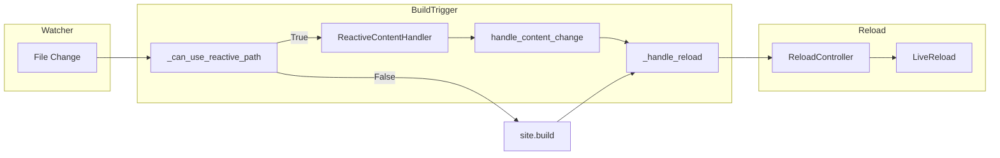

# RFC: Reactive Dev Sequel

**Status**: Implemented  
**Created**: 2026-03-01  
**Related**: `rfc-output-cache-architecture.md`, content-only-hot-reload

---

## Executive Summary

This RFC defines the Reactive Dev Sequel: content-only hot reload that skips full builds when a single markdown file is edited and only its body (not frontmatter) changes. The reactive path parses, re-renders, and writes the affected page without discovery, provenance, or post-process.

---

## Architecture

**Flow**:
1. Watcher detects file change
2. BuildTrigger classifies: structural vs content-only
3. If content-only and single .md modified: `_can_use_reactive_path` returns True
4. ReactiveContentHandler parses, renders, writes HTML
5. BuildTrigger calls `_handle_reload` with changed outputs
6. ReloadController decides action (reload-page for single HTML, reload for multiple)
7. LiveReload sends SSE to browser

---

## Phases

| Phase | Description | Status |
|-------|-------------|--------|
| 1 | Content hash cache for change detection | Done |
| 2 | seed_content_hash_cache after build | Done |
| 3 | trigger_build uses reactive path after first build | Done |
| 4 | Content hash embedding in HTML | Done (rfc-output-cache) |
| 5 | handle_content_change writes output | Done |
| 6 | reload-page for single-page content edits | Done |
| 7 | RFC document + edge-case hardening | Done |

---

## Key Components

### BuildTrigger ([bengal/server/build_trigger.py](bengal/server/build_trigger.py))
- `_content_hash_cache`: Maps source path → ContentHashCacheEntry (frontmatter_hash, content_hash)
- `_can_use_reactive_path()`: Returns True when single .md modified, content-only change
- `seed_content_hash_cache()`: Populates cache after successful build
- Reactive path: ~310-351

### ReactiveContentHandler ([bengal/server/reactive/handler.py](bengal/server/reactive/handler.py))
- `handle_content_change(path)`: Find page, read source, update _raw_content, run RenderingPipeline, write output
- Uses RenderingPipeline.process_page() (no mock)

### ReloadController ([bengal/server/reload_controller.py](bengal/server/reload_controller.py))
- `decide_from_outputs()`: Single HTML → reload-page, multiple HTML → reload, CSS-only → reload-css

---

## Edge Cases and Known Limitations

### Page with xrefs to other pages
Reactive path only re-renders the edited page. Dependent pages (e.g. index listing it, pages that xref it) are stale until full build. **Mitigation**: Full build on next structural change or manual rebuild.

### Section _index.md with child pages
Already supported. `test_seed_content_hash_cache_section_page` covers this.

### Template with dynamic data
Templates that include `{{ site.pages | length }}` or similar: reactive path uses same site state; may be stale if site.pages changed. **Risk**: Low for content-only edits (body change does not affect site.pages).

### Concurrent edits
BuildTrigger queues changes when a build is in progress. Reactive path handles single file; queued changes trigger full build. **Behavior**: Documented in BuildTrigger queuing tests.

---

## Relationship to Output Cache RFC

- Content hash embedding: `embed_content_hash()`, `extract_content_hash()` in [bengal/rendering/pipeline/output.py](bengal/rendering/pipeline/output.py)
- Config: `build.content_hash_in_html` (default: True)
- ReloadController content-hash mode: `use_content_hashes=True` for accurate change detection
