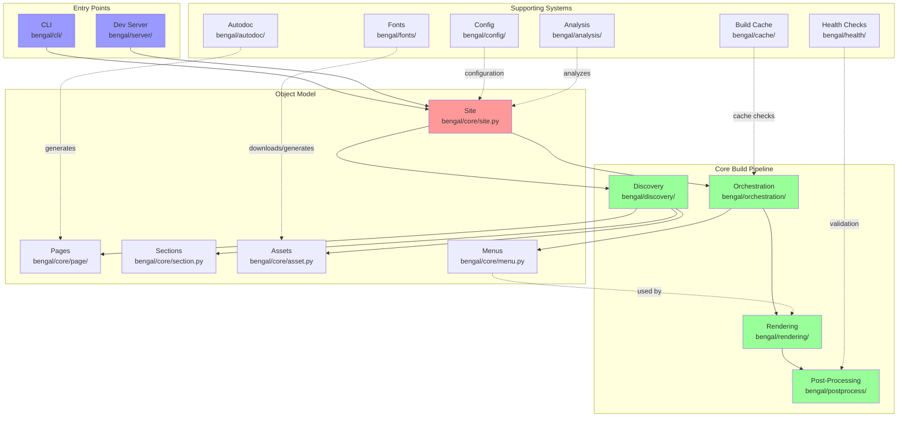
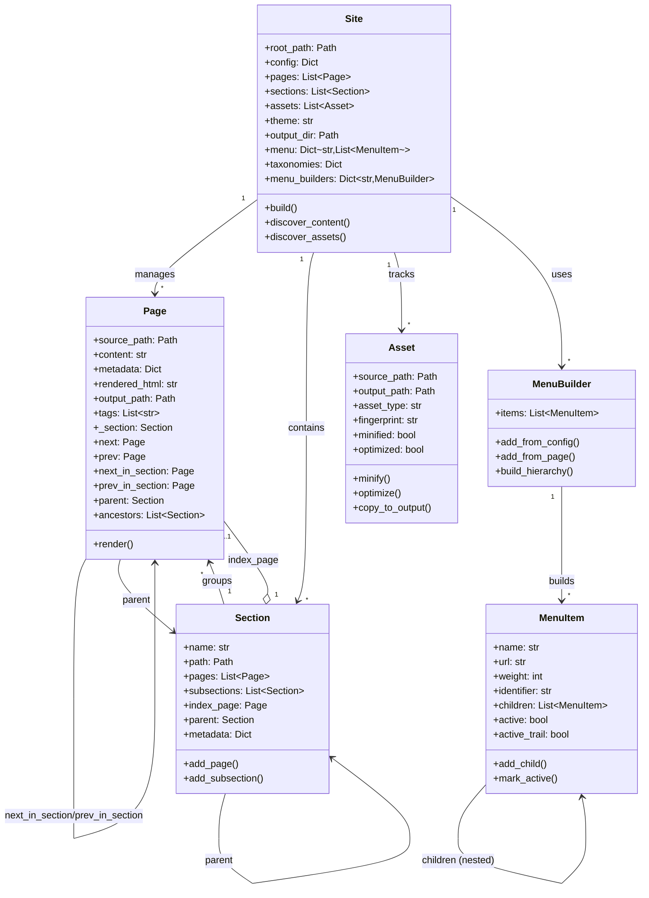
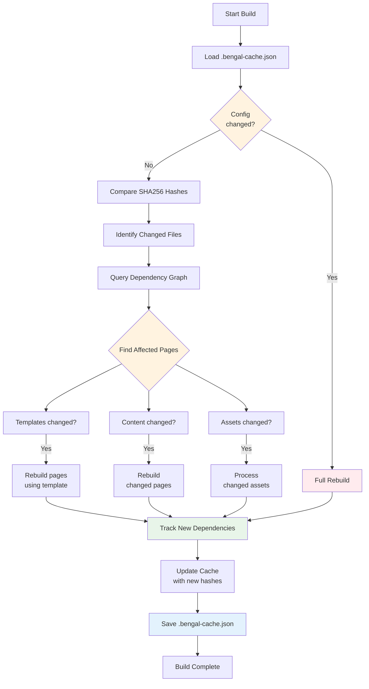
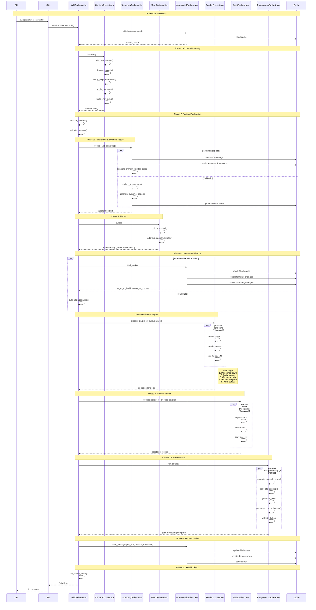
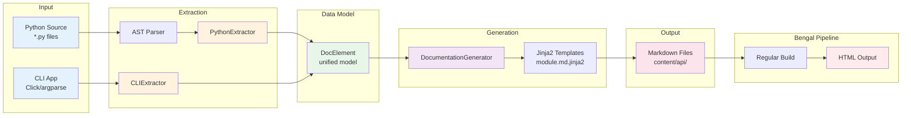

# Bengal SSG - Architecture Documentation

## Overview

Bengal SSG follows a modular architecture with clear separation of concerns to avoid "God objects" and maintain high performance even with large sites.

**Key Features:**
- **AST-based Python Autodoc**: Generate Python API documentation without importing code
- **Incremental Builds**: Faster rebuilds with intelligent caching
- **Performance**: Parallel processing and optimizations
- **Rich Content Model**: Taxonomies, navigation, menus, and cascading metadata
- **Developer Experience**: Error messages, health checks, and file-watching dev server

## High-Level Architecture



**Key Flows:**
1. **Build**: CLI → Site → Discovery → Orchestration → [Menus + Rendering] → Post-Process
2. **Menu Building**: Orchestration builds menus → Rendering uses menus in templates
3. **Cache**: Build Cache checks file changes and dependencies before rebuilding
4. **Autodoc**: Generate Python/CLI docs → treated as regular content pages
5. **Dev Server**: Watch files → trigger incremental rebuilds → serve output

## Cross-Cutting Context and Reporting

### BuildContext (Dependency Injection)

The build system uses a lightweight `BuildContext` object (`bengal/utils/build_context.py`) to pass shared state and services through orchestrators and rendering without relying on globals or mutating `Site` internals.

- Purpose: centralized container for dependencies and in-flight state
- Typical fields: `site`, `pages`, `assets`, `reporter`, `progress_manager`, optional injected `markdown_parser`, `template_engine`, `api_doc_enhancer`
- Adoption:
  - `BuildOrchestrator` creates and threads `BuildContext` into `RenderOrchestrator` and post-process stages
  - `RenderingPipeline` and `Renderer` can read injected services from `BuildContext`
- Outcome: removes temporary mutation of `site.pages` and `site.assets`; phases now receive explicit lists (clearer, safer, parallel-friendly)

### ProgressReporter (Output Decoupling)

To standardize progress output, we introduced a `ProgressReporter` protocol with default and Rich-based implementations (`bengal/utils/progress.py`). This decouples user-visible output from the core logic.

- Protocol methods: `add_phase`, `start_phase`, `update_phase`, `complete_phase`, `log`
- Adapter: `LiveProgressReporterAdapter` bridges to the existing Rich `LiveProgressManager` (`bengal/utils/live_progress.py`)
- Usage: orchestrators and the rendering pipeline route per-page messages and phase updates via the reporter; direct `print()` calls have been removed or minimized

### TemplateValidationService (CLI Decoupling)

The CLI no longer constructs rendering internals directly for template validation. Instead it depends on a `TemplateValidationService` protocol (`bengal/services/validation.py`) with a default implementation that wraps the existing validator. This reduces CLI→rendering coupling and improves testability.

### Theme Resolution Utility

Theme inheritance and resolution logic is being extracted to `bengal/utils/theme_resolution.py` to reduce coupling between `Site`, theme assets, and the template engine. `Site` and rendering components use the utility for consistent chain resolution and fallbacks.

### Output Quality Hardening

The variable-substitution path (Mistune) restores escaped placeholders as HTML entities, and the pipeline hardens content by escaping raw Jinja2 markers when `preprocess: false`. This prevents unrendered template syntax (e.g., `{{ page.* }}`, ``) from leaking into final HTML outside templates.

### Recent Decoupling Improvements (2025-10)

- Introduced `BuildContext` and threaded it through rendering/post-processing
- Replaced temporary `site.pages`/`site.assets` swaps with explicit lists
- Standardized progress output via `ProgressReporter` (Rich adapter available)
- Decoupled CLI validation via `TemplateValidationService`
- Extracted theme resolution into utility module
- Hardened output to avoid unrendered Jinja2 markers in generated HTML

## Core Components

### 1. Object Model

#### Site Object (`bengal/core/site.py`)
- **Purpose**: Central data model that holds all site content and delegates build coordination
- **Primary Role**: Data container and coordination entry point
- **Key Attributes**:
  - `root_path`: Site root directory
  - `config`: Site configuration dictionary
  - `pages`: List of all Page objects
  - `sections`: List of all Section objects
  - `assets`: List of all Asset objects
  - `taxonomies`: Dict of taxonomies (tags, categories)
  - `menu`: Dict[str, List[MenuItem]] - All built menus by name
  - `menu_builders`: Dict[str, MenuBuilder] - Menu builders for active marking
  - `theme`: Theme name or path
  - `output_dir`: Output directory path
  - `build_time`: Timestamp of last build
- **Key Methods**:
  - `build()`: Entry point that **delegates to BuildOrchestrator**
  - `from_config()`: Factory method to create Site from config file
  - `discover_content()`: Wrapper that delegates to ContentOrchestrator
  - `discover_assets()`: Wrapper that delegates to AssetOrchestrator
  - `mark_active_menu_items()`: Mark active menu items for current page
- **Architecture Pattern**: Site is a **data container**, not a "God object" - actual build logic lives in specialized orchestrators

#### Page Object (`bengal/core/page/`)

**Purpose**: Represents a single content page with source, metadata, rendered HTML, and navigation.

**Architecture**: The Page object is split across multiple modules for better organization:

| Module | Purpose | Description |
|--------|---------|-------------|
| `__init__.py` | Main class | Core Page class that imports from other modules |
| `metadata.py` | Metadata | Frontmatter parsing, metadata extraction, property access |
| `navigation.py` | Navigation | Sequential and hierarchical navigation (next, prev, parent, ancestors) |
| `relationships.py` | Relationships | Section membership, page comparisons, hierarchical checks |
| `computed.py` | Computed props | Dynamic properties (URL, kind, type checks, TOC) |
| `operations.py` | Operations | Rendering, link extraction, validation |

**Key Properties**:

| Category | Property | Module | Description |
|----------|----------|--------|-------------|
| **Content** | `title`, `date`, `slug`, `url` | metadata, computed | Basic page metadata and URL path (date uses `bengal.utils.dates`) |
| | `description`, `keywords`, `draft` | metadata | SEO and publishing metadata |
| | `toc`, `toc_items` | computed | Auto-generated table of contents |
| **Navigation** | `next`, `prev` | navigation | Sequential navigation across all pages |
| | `next_in_section`, `prev_in_section` | navigation | Section-specific navigation |
| | `parent`, `ancestors` | navigation | Hierarchical navigation for breadcrumbs |
| **Type Checking** | `is_home`, `is_section`, `is_page` | computed | Boolean type checks |
| | `kind` | computed | Type as string ('home', 'section', or 'page') |
| **Comparison** | `eq()`, `in_section()` | relationships | Page equality and section membership |
| | `is_ancestor()`, `is_descendant()` | relationships | Hierarchical relationships |
| **Rendering** | `render()` | operations | Render page with template |
| | `validate_links()`, `extract_links()` | operations | Link processing and validation |

**Design Rationale**: Splitting the Page class into modules provides:
- **Better maintainability**: Each module has ~100-300 lines vs 1000+ in single file
- **Clear separation of concerns**: Metadata, navigation, and operations are independent
- **Easier testing**: Test modules independently
- **Better code organization**: Related functionality grouped together

#### Section Object (`bengal/core/section.py`)

**Purpose**: Represents folder-based grouping of pages with hierarchical organization and metadata inheritance.

| Feature | Properties/Methods | Description |
|---------|-------------------|-------------|
| **Navigation** | `regular_pages`, `sections` | Get immediate children (pages or subsections) |
| | `regular_pages_recursive`, `url` | Recursive descendants and section URL |
| **Methods** | `aggregate_content()` | Collect metadata from all pages |
| | `walk()` | Iterative hierarchy traversal (no recursion) |
| | `apply_section_template()` | Generate section index page |
| **Cascade** | Frontmatter inheritance | Define `cascade` in `_index.md` to apply metadata to all descendants; child values override parent; accumulates through hierarchy |

#### Asset Object (`bengal/core/asset.py`)

**Purpose**: Handles static files (images, CSS, JS) with optimization and cache busting.

| Method | Description |
|--------|-------------|
| `minify()` | Minify CSS/JS files |
| `optimize()` | Optimize images |
| `hash()` | Generate fingerprint for cache busting |
| `copy_to_output()` | Copy to output directory |

#### Menu System (`bengal/core/menu.py`)
- **Purpose**: Provides hierarchical navigation menus
- **Components**:
  - **MenuItem**: Dataclass representing a menu item
    - Supports nesting (parent/child relationships)
    - Weight-based sorting
    - Active state detection
    - Active trail marking (parent items)
  - **MenuBuilder**: Constructs menu hierarchies
    - Parses config-defined menus
    - Integrates page frontmatter menus
    - Builds hierarchical structure
    - Marks active items per page
- **Features**:
  - Config-driven (TOML/YAML)
  - Page frontmatter integration
  - Multiple menus (main, footer, custom)
  - Nested/dropdown support
  - Automatic active detection

#### Page Navigation System
- **Purpose**: Provides rich navigation between pages and through site hierarchy
- **Automatic Setup**: Page references are automatically configured during `discover_content()`
- **Navigation Types**:
  - **Sequential Navigation**: `page.next` and `page.prev` for moving through all pages
  - **Section Navigation**: `page.next_in_section` and `page.prev_in_section` for section-specific navigation
  - **Hierarchical Navigation**: `page.parent` and `page.ancestors` for breadcrumbs and hierarchy
- **Template Usage**:
  ```jinja2
  {# Previous/Next links #}
  
    <a href="{{ url_for(page.prev) }}">← {{ page.prev.title }}</a>
  

  {# Breadcrumbs #}
  
    <a href="{{ url_for(ancestor) }}">{{ ancestor.title }}</a> /
  

  {# Section pages #}
  
    
      {{ child.title }}
    
  
  ```

#### Cascade System (Frontmatter Inheritance)

**Purpose**: Apply metadata from section index pages to all descendant pages.

**How It Works**: Define `cascade` in `_index.md` frontmatter; all pages in that section inherit the metadata; page values override cascaded values; cascades accumulate through hierarchy.

**Example**:
```yaml
# content/products/_index.md
---
title: "Products"
cascade:
  type: "product"
  layout: "product-page"
  show_price: true
---
```

**Use Cases**: Consistent layouts, default types, section-wide settings, DRY frontmatter.

#### Object Model Relationships



**Key Relationships:**
- **Site** is the root object that manages everything
- **Sections** organize **Pages** hierarchically
- **Pages** have rich navigation (next/prev, parent, ancestors)
- **Cascade** flows metadata from Sections → Pages
- **Menus** are built from config + page frontmatter

### 2. Cache System

Bengal implements an intelligent caching system for incremental builds, providing faster rebuilds.

#### Build Cache (`bengal/cache/build_cache.py`)

**Purpose**: Tracks file changes between builds using SHA256 hashing and dependency graphs. Persisted as `.bengal-cache.json`.

| Method | Description |
|--------|-------------|
| `is_changed(path)` | Check if file has changed since last build |
| `add_dependency(source, dependency)` | Record file dependencies (page → template/partial) |
| `get_affected_pages(changed_file)` | Find all pages needing rebuild based on dependency graph |
| `update_page_tags(path, tags)` | Update taxonomy inverted index, returns affected tags |
| `get_pages_for_tag(tag)` | Get all page paths for a specific tag (O(1) lookup) |
| `get_all_tags()` | Get all known tags from previous build |
| `save()` / `load()` | Persist cache between builds |

**Inverted Index Pattern**: The cache stores a bidirectional mapping between pages and tags:
- **Forward index**: `page_tags` (page path → set of tags)
- **Inverted index**: `tag_to_pages` (tag slug → set of page paths)

This enables efficient taxonomy reconstruction without persisting object references:
```python
# Only paths stored in cache, never object references
cache.tag_to_pages['python'] = {'content/post1.md', 'content/post2.md'}

# During build: Reconstruct with current Page objects
current_page_map = {p.source_path: p for p in site.pages}
pages_for_tag = [current_page_map[path] for path in cache.get_pages_for_tag('python')]
```

**Key Design Principle**: "Never persist object references across builds" - cache stores paths and hashes, relationships are reconstructed from current objects each build.

#### Dependency Tracker (`bengal/cache/dependency_tracker.py`)
- **Purpose**: Tracks dependencies during the build process
- **Tracks**:
  - Page → template dependencies
  - Page → partial dependencies
  - Page → config dependencies
  - Taxonomy (tag) → page relationships
- **Usage**: Integrated with rendering pipeline to build dependency graph

#### Incremental Build Flow



**Cache Decision Logic:**
1. **Load cache** from `.bengal-cache.json` (or create if first build)
2. **Check config** - if `bengal.toml` changed → full rebuild
3. **Compare hashes** - SHA256 of all tracked files
4. **Query dependency graph** - find pages affected by changes
5. **Selective rebuild** - only pages that changed or depend on changed files
6. **Track dependencies** - during rendering, record what each page uses
7. **Update cache** - save new hashes and dependency graph
8. **Save cache** - persist to disk for next build

**Implemented Features:**
- Template dependency tracking (pages → templates/partials)
- Taxonomy dependency tracking (tags → pages) with inverted index pattern
- Config change detection (forces full rebuild)
- Verbose mode (`--verbose` flag shows what changed)
- Asset change detection (selective processing)
- Object reference safety (cache stores paths, not objects)

**CLI Usage:**
```bash
# Incremental build
bengal site build --incremental

# With detailed change information
bengal site build --incremental --verbose
```

#### Build Pipeline Flow



**Pipeline Phases:**

0. **Initialization**: Load cache, set up dependency tracker
1. **Content Discovery**: Find pages/sections/assets, setup references, apply cascades, build xref index
2. **Section Finalization**: Ensure all sections have index pages, validate structure
3. **Taxonomies**: Collect tags/categories (incremental: detect affected tags + rebuild from cache paths), generate tag pages and pagination
4. **Menus**: Build navigation from config + page frontmatter (stored in `site.menu`)
5. **Incremental Filtering**: Determine what needs rebuilding (pages, assets, affected dependencies)
6. **Rendering**: Parse markdown → apply plugins → render templates (uses `site.menu`) → write HTML
7. **Assets**: Copy/process static files from site and theme
8. **Post-processing**: Generate sitemap, RSS, output formats, validate links (can run in parallel)
9. **Cache Update**: Save file hashes, dependencies, and taxonomy inverted index for next incremental build
10. **Health Check**: Validate build output, check for broken links, performance metrics

**Key Architecture Patterns:**

- **Delegation**: `Site.build()` immediately delegates to `BuildOrchestrator.build()`
- **Specialized Orchestrators**: Each build concern has a dedicated orchestrator class
- **Bulk Filtering**: Incremental builds filter upfront (Phase 5), then process filtered lists
- **Parallelization**: Phases 6, 7, and 8 can process items in parallel for performance
- **Menu Access**: Menus built once in Phase 4, accessed from `site.menu` during rendering

### 3. Rendering Pipeline

The rendering pipeline is divided into clear stages:

```
Parse → Build AST → Apply Templates → Render Output → Post-process
```

#### Rendering Flow Detail

```mermaid
flowchart TD
    Start[Markdown File] --> VarSub[Variable Substitution<br/>Preprocessing]
    VarSub --> Parse[Parse Markdown<br/>Mistune]

    Parse --> Plugins{Mistune Plugins}
    Plugins --> P1[Built-in: table, strikethrough,<br/>task_lists, url, footnotes, def_list]
    Plugins --> P2[Custom: Documentation Directives<br/>admonitions, tabs, dropdowns, code_tabs]

    P1 --> AST[Abstract Syntax Tree]
    P2 --> AST

    AST --> HTML1[Generate HTML]
    HTML1 --> PostProc[Post-Processing]
    PostProc --> XRef[Cross-Reference Links [[...]]]
    PostProc --> Anchors[Heading Anchors & IDs]
    PostProc --> TOC[TOC Extraction]

    XRef --> HTML2[HTML with Links & Anchors]
    Anchors --> HTML2
    TOC --> HTML2

    HTML2 --> APIEnhance{API Reference Page?}
    APIEnhance -->|Yes| Badges[Inject Badges<br/>@async, @property, etc.]
    APIEnhance -->|No| HTML3[Enhanced HTML]
    Badges --> HTML3

    HTML3 --> Links[Extract Links<br/>for Validation]
    Links --> Context[Build Template Context]

    Context --> ContextData{Context Includes}
    ContextData --> Page[page object]
    ContextData --> Site[site object]
    ContextData --> Config[config]
    ContextData --> Functions[80+ template functions]
    ContextData --> Content[content HTML]
    ContextData --> TOCData[toc, toc_items]

    Page --> Jinja[Jinja2 Template Engine]
    Site --> Jinja
    Config --> Jinja
    Functions --> Jinja
    Content --> Jinja
    TOCData --> Jinja

    Jinja --> Template[Apply Template]
    Template --> FinalHTML[Final HTML]

    FinalHTML --> Output[Atomic Write to public/]

    style VarSub fill:#ffe6e6
    style Parse fill:#e1f5ff
    style P1 fill:#fff4e6
    style P2 fill:#fff4e6
    style PostProc fill:#f0e6ff
    style APIEnhance fill:#e6ffe6
    style Jinja fill:#e8f5e9
    style FinalHTML fill:#f3e5f5
```

**Key Features:**
- **Three-Stage Processing**: Pre-processing (variables) → Parsing (plugins) → Post-processing (xrefs, anchors)
- **Variable Substitution**: `{{ page.title }}` replaced BEFORE Mistune parsing (natural code block protection)
- **Plugin Architecture**: Built-in Mistune plugins + custom documentation directives during parsing
- **Post-Processing**: Cross-references, heading anchors, and TOC extracted AFTER HTML generation
- **API Enhancement**: Special badge injection for API reference pages (@async, @property markers)
- **Rich Context**: Templates have access to entire site, page navigation, taxonomies, 80+ functions
- **Atomic Writes**: Crash-safe file writing with atomic operations

#### Template Functions (`bengal/rendering/template_functions/`)

**Purpose**: Provide 75+ custom filters and functions for Jinja2 templates

**Organization**:
- Modular design with self-registering modules
- 17 focused modules, each with single responsibility
- No monolithic classes
- Comprehensive testing (335+ tests)

**Architecture Principles**:
- **Built on Utilities**: Many functions delegate to `bengal/utils/` modules for consistent behavior
- **Type Safety**: Full type hints throughout
- **Error Handling**: Graceful fallbacks and error messages
- **Testing**: 71-98% coverage across function modules

**Module Breakdown (17 modules, 75+ functions total)**:

| Module | Functions | Description |
|--------|-----------|-------------|
| **strings.py** | 11 | `truncatewords`, `slugify`, `markdownify`, `strip_html`, `excerpt`, `reading_time` (uses `bengal.utils.text`) |
| **collections.py** | 8 | `where`, `where_not`, `group_by`, `sort_by`, `limit`, `offset`, `uniq`, `flatten` |
| **math_functions.py** | 6 | `percentage`, `times`, `divided_by`, `ceil`, `floor`, `round` |
| **dates.py** | 3 | `time_ago`, `date_iso`, `date_rfc822` (uses `bengal.utils.dates`) |
| **urls.py** | 3 | `absolute_url`, `url_encode`, `url_decode` |
| **content.py** | 6 | `safe_html`, `html_escape`, `html_unescape`, `nl2br`, `smartquotes`, `emojify` (uses `bengal.utils.text`) |
| **data.py** | 8 | `get_data`, `jsonify`, `merge`, `has_key`, `get_nested`, `keys`, `values`, `items` (uses `bengal.utils.file_io`) |
| **advanced_strings.py** | 5 | `camelize`, `underscore`, `titleize`, `wrap_text`, `indent_text` |
| **files.py** | 3 | `read_file`, `file_exists`, `file_size` (uses `bengal.utils.file_io`) |
| **advanced_collections.py** | 3 | `sample`, `shuffle`, `chunk` |
| **images.py** | 6 | `image_url`, `image_dimensions`, `image_srcset`, `image_srcset_gen`, `image_alt`, `image_data_uri` |
| **seo.py** | 4 | `meta_description`, `meta_keywords`, `canonical_url`, `og_image` |
| **debug.py** | 3 | `debug`, `typeof`, `inspect` |
| **taxonomies.py** | 4 | `related_posts`, `popular_tags`, `tag_url`, `has_tag` (uses `bengal.utils.text`) |
| **pagination_helpers.py** | 3 | `paginate`, `page_url`, `page_range` |
| **crossref.py** | 5 | `ref`, `doc`, `anchor`, `relref`, internal linking helpers |
| **navigation.py** | 4 | `breadcrumbs`, `active_menu`, `menu_tree`, navigation helpers |

**Total**: 75+ functions across 17 modules

#### Parser (`bengal/rendering/parser.py`)
- **Multi-Engine Architecture**: Supports multiple Markdown parsers with unified interface
- **Base Parser Interface**: `BaseMarkdownParser` ABC defines contract for all parsers
- **Factory Pattern**: `create_markdown_parser(engine)` returns appropriate parser instance
- **Thread-Local Caching**: Parser instances reused per thread for performance
- **Uses Utilities**: Delegates to `bengal.utils.text.slugify()` for heading ID generation
- **Supported Engines**:
  - **`python-markdown`** (default): Feature-rich (3.78s for 78 pages)
  - **`mistune`** (recommended): Faster parser with full doc features (2.18s for 78 pages, 42% faster)
- **Configuration**: Select engine via `bengal.toml`:
  ```toml
  [build]
  markdown_engine = "mistune"  # or "python-markdown"
  ```

##### Mistune Plugins (`bengal/rendering/plugins/`)

**Structure**: Modular plugin package with focused modules (~100-200 lines each)

**Location**: `bengal/rendering/plugins/` directory organized by type

**Core Plugins**:

| Plugin | File | Purpose |
|--------|------|---------|
| **Variable Substitution** | `variable_substitution.py` | Substitute `{{ page.metadata.xxx }}` in markdown content |
| **Cross References** | `cross_references.py` | Resolve `[[docs/page]]` references to internal pages |
| **Badges** | `badges.py` | Inject badges for API documentation (@async, @property, etc.) |

**Documentation Directives** (`directives/` subdirectory):

| Directive | File | Syntax | Purpose |
|-----------|------|--------|---------|
| **Admonitions** | `admonitions.py` | ` ```{note} Title ` | Callout boxes (note, tip, warning, danger, error, info, example, success, caution) |
| **Tabs** | `tabs.py` | ` ```{tabs} ` | Tabbed content sections with markdown support |
| **Dropdown** | `dropdown.py` | ` ```{dropdown} Title ` | Collapsible sections with open/closed state |
| **Code Tabs** | `code_tabs.py` | ` ```{code-tabs} ` | Multi-language code examples with syntax highlighting |
| **Cards** | `cards.py` | ` ```{cards} ` / ` ```{card} ` | Card layouts with titles, icons, and links |
| **Grid** | `cards.py` | ` ```{grid} ` / ` ```{grid-item-card} ` | Responsive grid layouts for content |
| **Button** | `button.py` | ` ```{button} ` | Styled buttons with various types |
| **Rubric** | `rubric.py` | ` ```{rubric} ` | Rubric headings (minor headings without TOC entries) |

**Supporting Modules**:

| Module | Purpose |
|--------|---------|
| `directives/validator.py` | Validation and error checking for directives |
| `directives/errors.py` | Error formatting and reporting |
| `directives/cache.py` | Caching for directive parsing (planned) |

**Features**:
- **Clean API**: Only 3 main exports (`VariableSubstitutionPlugin`, `CrossReferencePlugin`, `create_documentation_directives`)
- **Modular**: Each directive is self-contained and independently testable
- **Extensible**: Add new directives without touching existing code
- **Backward Compatible**: Old imports still work via aliases
- **Error Handling**: Comprehensive validation and error reporting
- **Performance**: Efficient parsing with minimal overhead

**Architecture Pattern**:
```python
# Old monolithic structure (v0.1.x):
bengal/rendering/mistune_plugins.py (757 lines)

# New modular structure (v1.0.0+):
bengal/rendering/plugins/
├── __init__.py                    # Public API
├── variable_substitution.py       # Core plugin
├── cross_references.py            # Core plugin
├── badges.py                      # API doc enhancement
└── directives/
    ├── __init__.py               # Directive factory
    ├── admonitions.py            # ~150 lines
    ├── tabs.py                   # ~180 lines
    ├── dropdown.py               # ~100 lines
    ├── code_tabs.py              # ~120 lines
    ├── cards.py                  # ~400 lines (3 directives)
    ├── button.py                 # ~100 lines
    ├── rubric.py                 # ~80 lines
    ├── validator.py              # Validation
    └── errors.py                 # Error formatting
```

**Usage**:
```python
from bengal.rendering.plugins import (
    VariableSubstitutionPlugin,
    CrossReferencePlugin,
    create_documentation_directives
)
import mistune

# Create markdown parser with all plugins
md = mistune.create_markdown(
    plugins=[
        'table',
        'strikethrough',
        create_documentation_directives(),
        VariableSubstitutionPlugin(context),
    ]
)
```

**See**: `bengal/rendering/plugins/README.md` for detailed documentation

##### Mistune Parser (`MistuneParser`)
- **Performance**: 52% faster rendering, 42% faster total builds
- **Built-in Features**:
  - GFM tables, footnotes, definition lists
  - Task lists, strikethrough, autolinks
  - Code blocks (fenced + inline)
- **Custom Plugins**:
  - **Admonitions**: `!!! note "Title"` syntax (7+ types)
  - **Directives**: Fenced directives for rich content (` ```{name} `)
    - **Tabs**: Multi-tab content with markdown support
    - **Dropdowns**: Collapsible sections
    - **Code-tabs**: Multi-language code examples (partial support)
  - **Variable Substitution**: `{{ page.metadata.xxx }}` in markdown content
  - **TOC Generation**: Extracts h2-h4 headings with slugs
  - **Heading IDs**: Auto-generated with permalink anchors
- **Nesting Support**: Full recursive markdown parsing inside directives
- **Plugin Architecture**: Extensible via `mistune.DirectivePlugin`
- **Location**: Core parser in `bengal/rendering/parser.py`, plugins in `bengal/rendering/mistune_plugins.py`

##### Variable Substitution in Markdown Content

**Purpose**: Insert dynamic frontmatter values into markdown content (DRY principle).  
**Architecture**: Single-pass Mistune plugin at AST level; code blocks stay literal automatically.

**Supported Syntax**:
```markdown
Welcome to {{ page.metadata.product_name }} version {{ page.metadata.version }}.
Connect to {{ page.metadata.api_url }}/users
```

**What's Supported**: `{{ page.metadata.xxx }}`, `{{ page.title }}`, `{{ site.config.xxx }}`  
**Not Supported**: Conditionals (``), loops (``), complex logic → use templates instead

**Design Rationale**: Separation of concerns (like Hugo) - content uses simple variables, templates handle logic. Code blocks remain literal without escaping.

##### Parser Performance Comparison
| Parser | Time (78 pages) | Throughput | Features |
|--------|----------------|------------|----------|
| python-markdown | 3.78s | 20.6 pages/s | 100% (attribute lists) |
| **mistune** | **2.18s** | **35.8 pages/s** | 95% (no attribute lists) |

Mistune is recommended for most use cases due to faster performance.

#### Template Engine (`bengal/rendering/template_engine.py`)
- Jinja2-based templating
- Supports nested templates and partials
- 75 custom template functions organized in focused modules
- Multiple template directories (custom, theme, default)
- Template dependency tracking for incremental builds
- Tracks includes, extends, and imports automatically

#### Renderer (`bengal/rendering/renderer.py`)
- Applies templates to pages
- Determines which template to use based on page metadata
- Fallback rendering for error cases

#### Pipeline Coordinator (`bengal/rendering/pipeline.py`)
- Orchestrates all stages for each page
- Handles output path determination
- Writes final output to disk
- Integrates with DependencyTracker for incremental builds
- Tracks template usage during rendering

### 4. Autodoc System

Bengal includes an **automatic documentation generation system** that extracts API documentation from Python source code using AST-based static analysis.

#### Overview

The autodoc system extracts documentation without importing code, making it:
- **Reliable** - no import errors or side effects
- **Environment-independent** - works without installing dependencies
- **Currently Supports**: Python (AST-based), CLI (Click framework only)
- **Planned**: OpenAPI/REST API documentation, argparse/typer CLI support

#### Architecture (`bengal/autodoc/`)

The autodoc system follows a clean extractor → generator → template architecture:



**Key Design Principles:**
- **No Imports**: AST-based extraction means no dependency installation needed
- **Unified Model**: DocElement provides consistent structure across extractors
- **Extensible**: New extractors (OpenAPI, GraphQL) can use same pipeline
- **Two-Pass**: Generate Markdown first, then render with Bengal's full pipeline

#### Base Classes (`bengal/autodoc/base.py`)

**DocElement**: Unified data model for all documented elements
- Used by all extractors (Python, OpenAPI, CLI)
- Represents functions, classes, methods, endpoints, commands, etc.
- Fields: name, qualified_name, description, element_type, metadata, children, examples
- Supports serialization for caching

**Extractor**: Abstract base class for documentation extractors
- `extract(source)`: Extract DocElements from source
- `get_template_dir()`: Template directory name
- `get_output_path(element)`: Output path determination
- Pluggable architecture for different source types

#### Python Extractor (`bengal/autodoc/extractors/python.py`)

**PythonExtractor**: AST-based Python API documentation extractor
- **No imports**: Parses source via `ast` module
- **Type hints**: Extracts from annotations (PEP 484/585)
- **Signatures**: Builds complete function/method signatures
- **Docstrings**: Integrates with docstring parser
- **Inheritance**: Tracks base classes and method resolution
- **Decorators**: Detects @property, @classmethod, @staticmethod, etc.

**Extracted Elements**:
- Modules (with submodules)
- Classes (with methods, properties, attributes)
- Functions (standalone and methods)
- Type hints and signatures
- Docstrings and metadata

**Example**:
```python
# Source code
class Site:
    """Orchestrates website builds."""

    def build(self, parallel: bool = True) -> BuildStats:
        """Build the entire site.

        Args:
            parallel: Enable parallel processing

        Returns:
            BuildStats with timing information
        """
        ...

# Extracted DocElement
DocElement(
    name='build',
    qualified_name='bengal.core.site.Site.build',
    element_type='method',
    metadata={
        'signature': 'def build(self, parallel: bool = True) -> BuildStats',
        'args': [{'name': 'parallel', 'type': 'bool', 'default': 'True'}],
        'returns': {'type': 'BuildStats'},
    }
)
```

#### Docstring Parser (`bengal/autodoc/docstring_parser.py`)

**DocstringParser**: Extracts structured data from docstrings
- **Auto-detection**: Recognizes Google, NumPy, Sphinx styles
- **Sections**: Extracts Args, Returns, Raises, Examples, See Also, etc.
- **Type info**: Parses type specifications from docstrings
- **Examples**: Extracts code examples from docstrings
- **Metadata**: Parses Deprecated, Added, Notes, Warnings

**Supported Styles**:
```python
# Google Style
def foo(x: int) -> str:
    """Short description.

    Args:
        x: Parameter description

    Returns:
        Return value description

    Raises:
        ValueError: When x is negative
    """

# NumPy Style
def bar(x):
    """
    Short description.

    Parameters
    ----------
    x : int
        Parameter description

    Returns
    -------
    str
        Return value description
    """

# Sphinx Style
def baz(x):
    """
    Short description.

    :param x: Parameter description
    :type x: int
    :returns: Return value description
    :rtype: str
    """
```

#### Documentation Generator (`bengal/autodoc/generator.py`)

**DocumentationGenerator**: Renders DocElements to Markdown
- **Template-based**: Uses Jinja2 templates
- **Two-layer rendering**:
  - Layer 1: DocElements → Markdown (`.md.jinja2` templates)
  - Layer 2: Markdown → HTML (standard Bengal templates)
- **Parallel processing**: Can generate docs concurrently
- **Caching**: Avoids regenerating unchanged modules
- **Cross-references**: Resolves `[[ClassName.method]]` links

**Template Resolution**:
1. Custom templates (`templates/autodoc/python/`)
2. Theme templates (`themes/{name}/autodoc/python/`)
3. Default templates (`bengal/autodoc/templates/python/`)

#### Configuration (`bengal/autodoc/config.py`)

Autodoc is configured via `bengal.toml`:

```toml
[autodoc.python]
enabled = true
source_dirs = ["src/mylib", "bengal"]
output_dir = "content/api"
docstring_style = "auto"  # auto, google, numpy, sphinx
exclude = ["*/tests/*", "*/test_*.py"]
include_private = false
include_undocumented = false
```

**Settings**:
- `enabled`: Enable Python autodoc
- `source_dirs`: List of directories to document
- `output_dir`: Where to write markdown files
- `docstring_style`: Docstring format detection
- `exclude`: Glob patterns to exclude
- `include_private`: Include `_private` members
- `include_undocumented`: Include items without docstrings

#### CLI Integration

```bash
# Generate API docs from config
bengal autodoc

# Override source/output
bengal autodoc --source mylib --output content/api

# Show extraction stats
bengal autodoc --stats --verbose
```

#### Templates (`bengal/autodoc/templates/`)

**Default Templates**:
- `python/module.md.jinja2`: Module documentation
- `python/class.md.jinja2`: Class documentation (future)
- `python/function.md.jinja2`: Function documentation (future)

**Template Context**:
```jinja2
{# templates/autodoc/python/module.md.jinja2 #}
---
title: "{{ element.name }}"
type: api-reference
---

# {{ element.name }}

{{ element.description }}

## Classes


### {{ cls.name }}

{{ cls.description }}


#### {{ method.name }}

```python
{{ method.metadata.signature }}
```

{{ method.description }}


**Arguments:**

- `{{ arg.name }}` ({{ arg.type }}): {{ arg.description }}




**Returns:** {{ method.metadata.returns.type }} - {{ method.metadata.returns.description }}



```

#### CLI Extractor (`bengal/autodoc/extractors/cli.py`)

**Status**: ✅ **Partially Implemented**

The CLI extractor supports:
- ✅ **Click**: Full support for Click command groups, commands, options, and arguments
- 📋 **argparse**: Planned (framework accepted but extraction not implemented)
- 📋 **typer**: Planned (framework accepted but extraction not implemented)

**Usage**:
```bash
bengal autodoc-cli --app myapp.cli:main --framework click
```

#### Planned Extractors

**Not Yet Implemented**:
- `OpenAPIExtractor`: REST API documentation from OpenAPI specs or FastAPI apps
- `GraphQLExtractor`: GraphQL schema documentation
- Full argparse/typer CLI support

#### Performance Characteristics

**Advantages**:
- AST-based extraction (no imports needed)
- No import errors or side effects
- Works without installing project dependencies
- Integrates with Bengal's incremental build cache

#### Integration with Bengal Pipeline

Autodoc-generated markdown files are treated as regular content:
- Discovered by content discovery
- Rendered with templates
- Included in search index
- Accessible via menus
- Full access to taxonomies, navigation, etc.

**Example Flow**:
```bash
# 1. Generate API docs
bengal autodoc
  → Creates content/api/*.md files

# 2. Build site (includes API docs)
bengal site build
  → Discovers content/api/*.md
  → Renders with templates
  → Generates public/api/*.html

# 3. Serve with dev server
bengal site serve
  → API docs included
  → Watch mode regenerates on source changes
```

#### Migration from Other Tools

**Note**: Migration tools are not yet implemented. Users migrating from Sphinx or other documentation generators will need to manually configure Bengal's autodoc system.

#### Real-World Usage

**Bengal's own docs** (examples/showcase):
- 99 modules documented
- 81 classes, 144 functions
- 0.57s generation time
- Full site build < 1 second
- Complete API reference at `/api/`

### 5. Discovery System

#### Content Discovery (`bengal/discovery/content_discovery.py`)
- Walks content directory recursively
- Creates Page and Section objects
- Parses frontmatter
- Organizes content into hierarchy
- **Includes autodoc-generated markdown files**
- **Uses Utilities**: Delegates to `bengal.utils.file_io.read_text_file()` for robust file reading with encoding fallback

#### Asset Discovery (`bengal/discovery/asset_discovery.py`)
- Finds all static assets
- Preserves directory structure
- Creates Asset objects with metadata

### 6. Fonts System (`bengal/fonts/`)

Bengal includes a built-in font management system that automatically downloads and hosts Google Fonts locally, improving performance and privacy.

#### Overview

The fonts system provides:
- **Automatic font downloading** from Google Fonts (no external dependencies)
- **Self-hosting** for better performance and GDPR compliance
- **CSS generation** with @font-face rules and CSS custom properties
- **Zero configuration** - just specify fonts in bengal.toml

**Benefits**:
- No external requests to Google Fonts CDN at runtime
- Faster page loads (fonts served from same domain)
- GDPR/privacy compliance (no third-party tracking)
- Offline builds
- Cache control

#### Font Downloader (`bengal/fonts/downloader.py`)

**Purpose**: Downloads font files from Google Fonts using the public CSS API.

**Key Classes**:

| Class | Description |
|-------|-------------|
| `GoogleFontsDownloader` | Downloads fonts from Google Fonts API |
| `FontVariant` | Represents a specific font variant (family + weight + style) |

**Features**:
- No API key required
- Uses stdlib only (urllib)
- Automatic WOFF2 format selection (modern, smaller files)
- Supports multiple weights and styles
- SSL/TLS support
- Robust error handling

**Usage**:
```python
from bengal.fonts import GoogleFontsDownloader

downloader = GoogleFontsDownloader()
variants = downloader.download_font(
    family="Inter",
    weights=[400, 600, 700],
    styles=["normal", "italic"],
    output_dir=Path("public/assets/fonts")
)

# Returns list of FontVariant objects with file info
```

#### Font CSS Generator (`bengal/fonts/generator.py`)

**Purpose**: Generates @font-face CSS rules for self-hosted fonts.

**Key Classes**:

| Class | Description |
|-------|-------------|
| `FontCSSGenerator` | Generates CSS with @font-face rules and custom properties |

**Generated CSS includes**:
- @font-face declarations for each variant
- font-display: swap for performance
- CSS custom properties for easy reference

**Example output**:
```css
/* Inter */
@font-face {
  font-family: 'Inter';
  font-weight: 400;
  font-style: normal;
  font-display: swap;
  src: url('/fonts/inter-400.woff2') format('woff2');
}

@font-face {
  font-family: 'Inter';
  font-weight: 700;
  font-style: normal;
  font-display: swap;
  src: url('/fonts/inter-700.woff2') format('woff2');
}

/* CSS Custom Properties */
:root {
  --font-primary: 'Inter';
  --font-heading: 'Playfair Display';
}
```

#### Font Helper (`bengal/fonts/__init__.py`)

**Purpose**: Main interface that orchestrates downloading and CSS generation.

**Key Classes**:

| Class | Description |
|-------|-------------|
| `FontHelper` | Coordinates font downloading and CSS generation |

**Usage**:
```python
from bengal.fonts import FontHelper

helper = FontHelper(config['fonts'])
css_path = helper.process(assets_dir)
```

#### Configuration

Configure fonts in `bengal.toml`:

**Simple format** (family:weights):
```toml
[fonts]
primary = "Inter:400,600,700"
heading = "Playfair Display:700,900"
mono = "Fira Code:400,500"
```

**Detailed format** (with styles):
```toml
[fonts.primary]
family = "Inter"
weights = [400, 600, 700]
styles = ["normal", "italic"]

[fonts.heading]
family = "Playfair Display"
weights = [700, 900]
styles = ["normal"]
```

#### Build Integration

Fonts are automatically processed during builds:

1. **Font Helper runs** early in build process
2. **Downloads fonts** to `public/assets/fonts/`
3. **Generates fonts.css** in `public/assets/`
4. **Theme can reference** fonts via CSS custom properties

**In theme CSS**:
```css
body {
  font-family: var(--font-primary), sans-serif;
}

h1, h2, h3 {
  font-family: var(--font-heading), serif;
}

code {
  font-family: var(--font-mono), monospace;
}
```

#### Health Validation

The FontValidator checks:
- Font files downloaded successfully
- fonts.css generated correctly
- File sizes reasonable (< 500KB per variant)
- All configured fonts present

```bash
# Font health check runs automatically
bengal site build

# Example output:
# 🔤 Fonts:
#    Inter...
#    Playfair Display...
#    └─ Generated: fonts.css (5 variants)
```

#### Performance Characteristics

**File sizes**: WOFF2 format typically 15-100KB per variant
**Build overhead**: Minimal - fonts cached locally after first download
**Runtime performance**: Eliminates external CDN requests

**Comparison to Google Fonts CDN**:
| Aspect | CDN | Self-hosted |
|--------|-----|-------------|
| Initial page load | External request | Same domain |
| Caching | Shared cache | Local cache |
| Privacy | Third-party | No tracking |
| Offline | Requires connection | Works offline |

### 7. Configuration System

#### Config Loader (`bengal/config/loader.py`)
- Supports TOML and YAML formats
- Auto-detects config files
- Provides sensible defaults
- Flattens nested configuration for easy access
- **Uses Utilities**: Delegates to `bengal.utils.file_io` for robust file loading with error handling

### 8. Post-Processing

#### Sitemap Generator (`bengal/postprocess/sitemap.py`)
- Generates XML sitemap for SEO
- Includes all pages with metadata
- Configurable priority and change frequency

#### RSS Generator (`bengal/postprocess/rss.py`)
- Generates RSS feed
- Includes recent posts
- Supports custom descriptions

#### Link Validator (`bengal/rendering/link_validator.py`)
- Validates internal and external links
- Reports broken links
- Can be extended for comprehensive validation

### 9. Development Server

#### Dev Server (`bengal/server/dev_server.py`)
- Built-in HTTP server
- File system watching with watchdog
- Automatic rebuild on changes
- Live reload via SSE (implemented): HTML injection + `/__bengal_reload__`

### 10. Health Check System (`bengal/health/`)

Bengal includes a comprehensive health check system that validates builds across all components.

#### Health Check (`bengal/health/health_check.py`)
- **Purpose**: Orchestrates validators and produces unified health reports
- **Features**:
  - Modular validator architecture
  - Fast execution (< 100ms per validator)
  - Configurable per-validator enable/disable
  - Console and JSON report formats
  - Integration with build stats
- **Usage**:
  ```python
  from bengal.health import HealthCheck

  health = HealthCheck(site)
  report = health.run(build_stats=stats)
  print(report.format_console())
  ```

#### Base Validator (`bengal/health/base.py`)
- **Purpose**: Abstract base class for all validators
- **Interface**: `validate(site) -> List[CheckResult]`
- **Features**:
  - Independent execution (no validator dependencies)
  - Error handling and crash recovery
  - Performance tracking per validator
  - Configuration-based enablement

#### Health Report (`bengal/health/report.py`)
- **Purpose**: Unified reporting structure for health check results
- **Components**:
  - `CheckStatus`: SUCCESS, INFO, WARNING, ERROR
  - `CheckResult`: Individual check result with recommendation
  - `ValidatorReport`: Results from a single validator
  - `HealthReport`: Aggregated report from all validators
- **Formats**:
  - Console output (colored, formatted)
  - JSON output (machine-readable)
  - Summary statistics (pass/warning/error counts)

#### Validators (`bengal/health/validators/`)

**All Validators (14 total)**:

**Basic Validation:**
| Validator | Validates |
|-----------|-----------|
| **ConfigValidatorWrapper** | Configuration validity, essential fields, common issues |
| **OutputValidator** | Page sizes, asset presence, directory structure |
| **MenuValidator** | Menu structure integrity, circular reference detection |
| **LinkValidatorWrapper** | Broken links detection (internal and external) |

**Content Validation:**
| Validator | Validates |
|-----------|-----------|
| **NavigationValidator** | Page navigation (next/prev, breadcrumbs, ancestors) |
| **TaxonomyValidator** | Tags, categories, archives, pagination integrity |
| **RenderingValidator** | HTML quality, template function usage, SEO metadata |
| **DirectiveValidator** | Directive syntax, completeness, and performance |

**Advanced Validation:**
| Validator | Validates |
|-----------|-----------|
| **CacheValidator** | Incremental build cache integrity and consistency |
| **PerformanceValidator** | Build performance metrics and bottleneck detection |

**Production-Ready Validation:**
| Validator | Validates |
|-----------|-----------|
| **RSSValidator** | RSS feed quality, XML validity, URL formatting |
| **SitemapValidator** | Sitemap.xml validity for SEO, no duplicate URLs |
| **FontValidator** | Font downloads, CSS generation, file sizes |
| **AssetValidator** | Asset optimization, minification hints, size analysis |

#### Configuration
Health checks can be configured via `bengal.toml`:
```toml
[health_check]
# Globally enable/disable health checks
validate_build = true

# Per-validator configuration (all enabled by default)
[health_check.validators]
# Phase 1: Basic
configuration = true
output = true
navigation_menus = true
links = true

# Phase 2: Content
navigation = true
taxonomies = true
rendering = true
directives = true

# Phase 3: Advanced
cache_integrity = true
performance = true

# Phase 4: Production-ready
rss_feed = true
sitemap = true
fonts = true
asset_processing = true
```

#### Integration
Health checks run automatically after builds in strict mode and can be triggered manually:
```python
# Automatic validation in strict mode
site.config["strict_mode"] = True
stats = site.build()

# Manual validation
from bengal.health import HealthCheck
health = HealthCheck(site)
report = health.run(build_stats=stats)
```

### 11. Analysis System (`bengal/analysis/`)

Bengal includes a comprehensive analysis system that helps understand and optimize site structure, connectivity, and content relationships.

#### Overview

The analysis module provides tools for:
- **Knowledge Graph Analysis**: Build and analyze page connectivity through links, taxonomies, and menus
- **PageRank**: Compute page importance scores using Google's PageRank algorithm
- **Community Detection**: Discover topical clusters using the Louvain method
- **Path Analysis**: Identify navigation bridges and bottlenecks using centrality metrics
- **Link Suggestions**: Get smart recommendations for internal linking
- **Graph Visualization**: Generate interactive visualizations of site structure
- **Performance Advisor**: Analyze and recommend performance optimizations

#### Knowledge Graph (`bengal/analysis/knowledge_graph.py`)

**Purpose**: Analyzes the connectivity structure of a Bengal site by building a graph of all pages and their connections.

**Tracks connections through**:
- Internal links (cross-references)
- Taxonomies (tags, categories)
- Related posts
- Menu items

**Key Classes**:

| Class | Description |
|-------|-------------|
| `KnowledgeGraph` | Main analyzer that builds and queries the connectivity graph |
| `GraphMetrics` | Aggregated metrics (total pages, links, hubs, leaves, orphans) |
| `PageConnectivity` | Per-page connectivity information |

**Usage**:
```python
from bengal.analysis import KnowledgeGraph

graph = KnowledgeGraph(site)
graph.build()

# Find orphaned pages
orphans = graph.get_orphans()
print(f"Found {len(orphans)} orphaned pages")

# Find hub pages
hubs = graph.get_hubs(threshold=10)
print(f"Found {len(hubs)} hub pages")

# Get metrics
metrics = graph.metrics
print(f"Average connectivity: {metrics.avg_connectivity:.2f}")
```

**Provides insights for**:
- Content strategy (find orphaned pages)
- Performance optimization (hub-first streaming)
- Navigation design (understand structure)
- SEO improvements (link structure)

#### PageRank (`bengal/analysis/page_rank.py`)

**Purpose**: Computes page importance scores using Google's PageRank algorithm with the iterative power method.

**Algorithm considers**:
- Number of incoming links (popularity)
- Importance of pages linking to it (authority)
- Damping factor for random navigation (user behavior)

**Key Classes**:

| Class | Description |
|-------|-------------|
| `PageRankComputer` | Computes PageRank scores iteratively |
| `PageRankResults` | Results with scores, convergence info, and ranking methods |

**Usage**:
```python
from bengal.analysis.page_rank import PageRankComputer

computer = PageRankComputer(knowledge_graph, damping_factor=0.85)
results = computer.compute(max_iterations=100)

# Get top-ranked pages
top_pages = results.get_top_pages(limit=20)
for page, score in top_pages:
    print(f"{page.title}: {score:.4f}")

# Get pages above 80th percentile
important_pages = results.get_pages_above_percentile(80)
```

**Applications**:
- Prioritize important content
- Guide content promotion
- Optimize navigation structure
- Implement hub-first streaming

#### Community Detection (`bengal/analysis/community_detection.py`)

**Purpose**: Discovers topical clusters in content using the Louvain method for modularity optimization.

**Algorithm**: Two-phase iterative approach
1. Local optimization: Move nodes to communities that maximize modularity gain
2. Aggregation: Treat each community as a single node and repeat

**Key Classes**:

| Class | Description |
|-------|-------------|
| `LouvainCommunityDetector` | Implements Louvain method for community detection |
| `Community` | Represents a community of related pages |
| `CommunityDetectionResults` | Results with communities, modularity score, and query methods |

**Usage**:
```python
from bengal.analysis.community_detection import LouvainCommunityDetector

detector = LouvainCommunityDetector(knowledge_graph)
results = detector.detect()

# Get largest communities
large_communities = results.get_largest_communities(limit=10)
for community in large_communities:
    print(f"Community {community.id}: {community.size} pages")

# Find which community a page belongs to
community = results.get_community_for_page(page)
```

**Applications**:
- Discover topical organization
- Guide content categorization
- Improve internal linking within topics
- Generate navigation menus

#### Path Analysis (`bengal/analysis/path_analysis.py`)

**Purpose**: Analyze navigation paths and page accessibility using centrality metrics.

**Computes**:
- **Betweenness centrality**: Pages that connect different parts of the site (bridges)
- **Closeness centrality**: Pages that are easy to reach from anywhere (accessible)
- **Shortest paths**: Navigation paths between pages

**Key Classes**:

| Class | Description |
|-------|-------------|
| `PathAnalyzer` | Computes centrality metrics using Brandes' algorithm |
| `PathAnalysisResults` | Results with centrality scores and path queries |

**Usage**:
```python
from bengal.analysis.path_analysis import PathAnalyzer

analyzer = PathAnalyzer(knowledge_graph)
results = analyzer.analyze()

# Find bridge pages (navigation bottlenecks)
bridges = results.get_top_bridges(10)
for page, score in bridges:
    print(f"Bridge: {page.title} (score: {score:.4f})")

# Find shortest path between pages
path = analyzer.find_shortest_path(source_page, target_page)
if path:
    print(" → ".join([p.title for p in path]))
```

**Applications**:
- Identify navigation bottlenecks
- Optimize site structure
- Find critical pages for user flows
- Improve site accessibility

#### Link Suggestions (`bengal/analysis/link_suggestions.py`)

**Purpose**: Provides smart cross-linking recommendations based on multiple signals.

**Considers**:
- Topic similarity (shared tags, categories, keywords)
- PageRank importance (prioritize linking to high-value pages)
- Navigation patterns (betweenness, closeness)
- Current link structure (avoid over-linking, find gaps)

**Key Classes**:

| Class | Description |
|-------|-------------|
| `LinkSuggestionEngine` | Generates smart link suggestions |
| `LinkSuggestion` | A suggested link with score and reasons |
| `LinkSuggestionResults` | Collection of suggestions with query methods |

**Usage**:
```python
from bengal.analysis.link_suggestions import LinkSuggestionEngine

engine = LinkSuggestionEngine(knowledge_graph)
results = engine.generate_suggestions(min_score=0.5, max_per_page=5)

# Get suggestions for specific page
suggestions = results.get_suggestions_for_page(page, limit=10)
for suggestion in suggestions:
    print(f"Suggest linking to: {suggestion.target.title}")
    print(f"  Score: {suggestion.score:.3f}")
    print(f"  Reasons: {', '.join(suggestion.reasons)}")
```

**Helps improve**:
- Internal linking structure
- SEO through better site connectivity
- Content discoverability
- User navigation

#### Graph Visualization (`bengal/analysis/graph_visualizer.py`)

**Purpose**: Generate interactive visualizations of site structure using D3.js force-directed graphs.

**Features**:
- Node sizing by PageRank
- Node coloring by community
- Edge thickness by connection strength
- Interactive zoom and pan
- Node hover information
- Responsive design

**Usage**:
```python
from bengal.analysis import GraphVisualizer

visualizer = GraphVisualizer(knowledge_graph)
visualizer.generate(
    output_path="public/graph.html",
    include_pagerank=True,
    include_communities=True
)
```

#### Performance Advisor (`bengal/analysis/performance_advisor.py`)

**Purpose**: Analyzes site structure and provides performance optimization recommendations.

**Analyzes**:
- Hub-first streaming opportunities
- Parallel rendering candidates
- Cache hit potential
- Link structure efficiency

**Usage**:
```python
from bengal.analysis.performance_advisor import PerformanceAdvisor

advisor = PerformanceAdvisor(site, knowledge_graph)
recommendations = advisor.analyze()

for rec in recommendations:
    print(f"{rec.category}: {rec.message}")
    print(f"  Impact: {rec.impact}")
    print(f"  Effort: {rec.effort}")
```

#### CLI Integration

The analysis system is integrated into the CLI with dedicated commands:

```bash
# Analyze site structure
bengal graph

# Show site structure as tree
bengal graph --tree

# Generate interactive visualization
bengal graph --output public/graph.html

# Compute PageRank scores
bengal pagerank --top 20

# Detect communities
bengal communities --min-size 3

# Find bridge pages
bengal bridges --top 10

# Get link suggestions
bengal suggest --min-score 0.5
```

See "CLI Commands" section for detailed command documentation.

### 12. CLI (`bengal/cli/`)

**Structure**: Modular command-line interface with Click framework

**Location**: `bengal/cli/` directory with organized command modules

**Architecture**:
- `bengal/cli/__init__.py` - Main CLI group with command registration and typo detection
- `bengal/cli/commands/` - Individual command modules
  - `build.py` - Build commands
  - `serve.py` - Development server
  - `autodoc.py` - Documentation generation
  - `graph.py` - Graph analysis commands
  - `perf.py` - Performance analysis
  - `clean.py` - Cleanup utilities
  - `new.py` - Content creation

**Features**:
- **Typo Detection**: Fuzzy matching for command names with suggestions
- **Rich Output**: Colored output and progress bars using Rich library
- **Error Handling**: Beautiful tracebacks with context and locals
- **Extensibility**: Easy to add new commands in separate modules

#### Core Commands

**Build Commands**:
```bash
# Basic build
bengal site build

# Incremental build (18-42x faster)
bengal site build --incremental

# Parallel build (default, 2-4x faster)
bengal site build --parallel

# Strict mode (fail on template errors, recommended for CI)
bengal site build --strict

# Debug mode (full tracebacks)
bengal site build --debug

# Verbose output (show detailed change info)
bengal site build --incremental --verbose
```

**Development Commands**:
```bash
# Start development server with live reload
bengal site serve

# Custom port
bengal site serve --port 8080

# Disable live reload
bengal site serve --no-reload
```

**Documentation Commands**:
```bash
# Generate Python API documentation
bengal autodoc

# Generate CLI documentation (Click only)
bengal autodoc-cli --app myapp.cli:main --framework click

# Override source/output
bengal autodoc --source mylib --output content/api

# Show extraction stats
bengal autodoc --stats --verbose
```

**Graph Analysis Commands**:
```bash
# Analyze site structure and connectivity
bengal graph

# Show site structure as tree
bengal graph --tree

# Generate interactive visualization
bengal graph --output public/graph.html

# Compute PageRank scores
bengal pagerank --top 20

# Detect topical communities
bengal communities --min-size 3

# Find bridge pages (navigation bottlenecks)
bengal bridges --top 10

# Get link suggestions
bengal suggest --min-score 0.5
```

**Performance Commands**:
```bash
# Performance analysis
bengal perf

# Detailed performance breakdown
bengal perf --verbose
```

**Utility Commands**:
```bash
# Clean output directory
bengal site clean

# Clean cache and output
bengal site cleanup

# Create new site
bengal new site mysite

# Create new page
bengal new page content/blog/post.md

# Show version
bengal --version

# Show help
bengal --help
```

#### Command Registration

Commands are registered in `bengal/cli/__init__.py`:

```python
from bengal.cli.commands.build import build
from bengal.cli.commands.serve import serve
from bengal.cli.commands.autodoc import autodoc, autodoc_cli
from bengal.cli.commands.graph import graph, pagerank, communities, bridges, suggest
from bengal.cli.commands.perf import perf
from bengal.cli.commands.clean import clean, cleanup
from bengal.cli.commands.new import new

@click.group(cls=BengalGroup)
@click.version_option(version=__version__, prog_name="Bengal SSG")
def main() -> None:
    """Bengal SSG - A high-performance static site generator."""
    pass

# Register commands
main.add_command(build)
main.add_command(serve)
main.add_command(autodoc)
main.add_command(autodoc_cli)
main.add_command(graph)
main.add_command(pagerank)
main.add_command(communities)
main.add_command(bridges)
main.add_command(suggest)
main.add_command(perf)
main.add_command(clean)
main.add_command(cleanup)
main.add_command(new)
```

#### Custom Click Group

Bengal uses a custom `BengalGroup` class that provides typo detection:

```python
class BengalGroup(click.Group):
    """Custom Click group with typo detection and suggestions."""

    def resolve_command(self, ctx, args):
        """Resolve command with fuzzy matching for typos."""
        try:
            return super().resolve_command(ctx, args)
        except click.exceptions.UsageError as e:
            if "No such command" in str(e) and args:
                suggestions = self._get_similar_commands(args[0])
                if suggestions:
                    # Show suggestions
                    pass
            raise
```

**Example**:
```bash
$ bengal bild
Unknown command 'bild'.

Did you mean one of these?
  • build
  • bridges

Run 'bengal --help' to see all commands.
```

### 13. Utilities (`bengal/utils/`)

Bengal provides a comprehensive set of utility modules that consolidate common operations across the codebase, eliminating duplication and providing consistent, well-tested implementations.

#### Text Utilities (`bengal/utils/text.py`)
- **Purpose**: Text processing and manipulation
- **Functions (12 total)**:
  - `slugify()` - URL-safe slug generation with configurable separators
  - `strip_html()` - Remove HTML tags and decode entities
  - `truncate_words()` - Intelligent word-based truncation
  - `truncate_chars()` - Character-based truncation with suffix
  - `truncate_middle()` - Ellipsis in the middle (for long paths)
  - `generate_excerpt()` - Create previews from content
  - `normalize_whitespace()` - Collapse and normalize spaces
  - `escape_html()` - Escape HTML special characters
  - `unescape_html()` - Unescape HTML entities
  - `pluralize()` - Simple pluralization (with custom forms)
  - `humanize_bytes()` - Format bytes as KB/MB/GB
  - `humanize_number()` - Format numbers with thousand separators
- **Usage**: Used by template functions, parser, and throughout rendering pipeline
- **Coverage**: 91% with 74 comprehensive tests

#### File I/O Utilities (`bengal/utils/file_io.py`)
- **Purpose**: Robust file reading/writing with consistent error handling
- **Functions (7 total)**:
  - `read_text_file()` - Read text with UTF-8/latin-1 fallback
  - `load_json()` - Load JSON with validation
  - `load_yaml()` - Load YAML with graceful PyYAML detection
  - `load_toml()` - Load TOML with validation
  - `load_data_file()` - Smart loader (auto-detects JSON/YAML/TOML)
  - `write_text_file()` - Atomic writes with temp file pattern
  - `write_json()` - Atomic JSON writes with formatting
- **Features**:
  - Encoding fallback (UTF-8 → latin-1)
  - Multiple error handling strategies (raise, return_empty, return_none)
  - Structured logging with context
  - Atomic writes for data integrity
- **Usage**: Used by config loader, content discovery, template functions
- **Coverage**: 23-91% (increases as adoption grows)

#### Date Utilities (`bengal/utils/dates.py`)
- **Purpose**: Date parsing, formatting, and manipulation
- **Functions (8 total)**:
  - `parse_date()` - Unified date parsing (datetime, date, str, None)
  - `format_date_iso()` - Format as ISO 8601
  - `format_date_rfc822()` - Format as RFC 822 (RSS feeds)
  - `format_date_human()` - Custom strftime formatting
  - `time_ago()` - Human-readable "2 days ago" format
  - `get_current_year()` - Current year (for copyright)
  - `is_recent()` - Check if date is within N days
  - `date_range_overlap()` - Check if ranges overlap
- **Features**:
  - Flexible date parsing (many formats with fallback chain)
  - Timezone-aware operations
  - Multiple error handling strategies
  - Type-safe with DateLike type alias
- **Usage**: Used by template functions, frontmatter parsing, RSS generation
- **Coverage**: 91% with 56 comprehensive tests

#### Paginator (`bengal/utils/pagination.py`)
- **Purpose**: Generic pagination utility for splitting long lists
- **Features**:
  - Configurable items per page
  - Page range calculation (smart ellipsis)
  - Template context generation
  - Type-safe generic implementation
- **Usage**: Used for archive pages and tag pages
- **Coverage**: 96% with 10 tests

#### Impact of Utility Consolidation
- **Code Reduction**: Eliminated 311 lines of duplicate code across 9 files
- **Test Coverage**: Added 184+ comprehensive tests
- **Consistency**: Single source of truth for text, files, and dates
- **Maintainability**: Fix once in utility module vs 4+ places
- **Type Safety**: Full type hints with type aliases
- **Error Handling**: Consistent strategies across all utilities

## Design Principles

### 1. Avoiding Stack Overflow
- **Iterative Traversal**: Section hierarchy uses `walk()` method instead of deep recursion
- **Configurable Limits**: Can set max recursion depth if needed
- **Tail Call Patterns**: Where recursion is used, structured for optimization

### 2. Avoiding God Objects
- **Single Responsibility**: Each class has one clear purpose
- **Composition over Inheritance**: Objects compose other objects rather than inheriting
- **Clear Dependencies**: Site → Sections → Pages (one direction)

### 3. Performance Optimization
- **Parallel Processing** (implemented):
  - Pages rendered in parallel using ThreadPoolExecutor
  - Assets processed in parallel for 5+ assets (2-4x speedup measured)
  - Post-processing: Sitemap, RSS, link validation run concurrently (2x speedup measured)
  - Smart thresholds avoid thread overhead for tiny workloads
  - Thread-safe error handling and output
  - Configurable via single `parallel` flag (default: true)
  - Configurable worker count (`max_workers`, default: auto-detect)
- **Incremental Builds** (implemented):
  - SHA256 file hashing for change detection
  - Dependency graph tracking (pages → templates/partials)
  - Template change detection (rebuilds only affected pages)
  - Granular taxonomy tracking (only rebuilds affected tag pages)
  - Verbose mode for debugging (`--verbose` flag)
  - 18-42x faster for single-file changes (measured on 10-100 page sites)
  - Automatic caching with `.bengal-cache.json`
- **Caching**: Build cache persists between builds
- **Lazy Loading**: Parse content only when needed

### 4. Extensibility
- **Custom Content Types**: Multiple markdown parsers supported (mistune, python-markdown)
- **Template Flexibility**: Custom templates override defaults
- **Theme System**: Self-contained themes with templates and assets
- **Plugin System**: 📋 Planned for v0.4.0 - hooks for pre/post build events

## Data Flow

### Complete Build Pipeline (from build.py)

```
┌─────────────────────────────────────────────────────────────────┐
│                         BUILD START                              │
└───────────────────────────────────┬─────────────────────────────┘
                                    ↓
┌─────────────────────────────────────────────────────────────────┐
│ Phase 1: CONTENT DISCOVERY (ContentOrchestrator)                │
│   content/ (Markdown files)                                     │
│       ↓                                                          │
│   ContentDiscovery.discover()                                   │
│       ↓                                                          │
│   Page Objects (with frontmatter + raw content)                 │
│   Section Objects (directory structure)                         │
└───────────────────────────────────┬─────────────────────────────┘
                                    ↓
┌─────────────────────────────────────────────────────────────────┐
│ Phase 2: SECTION FINALIZATION (SectionOrchestrator)             │
│   - Ensure sections have index pages                            │
│   - Validate section structure                                  │
└───────────────────────────────────┬─────────────────────────────┘
                                    ↓
┌─────────────────────────────────────────────────────────────────┐
│ Phase 3: TAXONOMIES (TaxonomyOrchestrator)                      │
│   - Collect tags/categories from pages                          │
│   - Generate taxonomy pages (tag list, archive, etc.)           │
└───────────────────────────────────┬─────────────────────────────┘
                                    ↓
┌─────────────────────────────────────────────────────────────────┐
│ Phase 4: MENUS (MenuOrchestrator)                               │
│   - Build navigation structure                                  │
└───────────────────────────────────┬─────────────────────────────┘
                                    ↓
┌─────────────────────────────────────────────────────────────────┐
│ Phase 5: INCREMENTAL FILTERING (IncrementalOrchestrator)        │
│   - Detect changed files (if incremental mode)                  │
│   - Filter to pages/assets that need rebuilding                 │
└───────────────────────────────────┬─────────────────────────────┘
                                    ↓
┌─────────────────────────────────────────────────────────────────┐
│ Phase 6: RENDERING (RenderOrchestrator)                         │
│   For each page:                                                │
│       Page Object (content + metadata)                          │
│           ↓                                                      │
│       RenderingPipeline.process_page()                          │
│           ↓                                                      │
│       ┌─────────────────────────────────┐                       │
│       │ 1. Markdown Parsing             │                       │
│       │    - parse_with_toc_and_context │                       │
│       │    - Variable substitution      │                       │
│       │    - Output: HTML + TOC         │                       │
│       └───────────┬─────────────────────┘                       │
│                   ↓                                              │
│       ┌─────────────────────────────────┐                       │
│       │ 2. Post-processing              │                       │
│       │    - API doc enhancement        │                       │
│       │    - Link extraction            │                       │
│       └───────────┬─────────────────────┘                       │
│                   ↓                                              │
│       ┌─────────────────────────────────┐                       │
│       │ 3. Template Application         │                       │
│       │    - Jinja2 TemplateEngine      │                       │
│       │    - Inject content into layout │                       │
│       │    - Output: Complete HTML      │                       │
│       └───────────┬─────────────────────┘                       │
│                   ↓                                              │
│       page.rendered_html                                        │
│           ↓                                                      │
│       Write to output/ (atomic)                                 │
└───────────────────────────────────┬─────────────────────────────┘
                                    ↓
┌─────────────────────────────────────────────────────────────────┐
│ Phase 7: ASSETS (AssetOrchestrator)                             │
│   assets/ (CSS, JS, images, fonts, etc.)                        │
│       ↓                                                          │
│   AssetDiscovery.discover()                                     │
│       ↓                                                          │
│   Asset Objects                                                 │
│       ↓                                                          │
│   For each asset:                                               │
│       - Minify (CSS/JS) → asset.minify()                        │
│       - Optimize (images) → asset.optimize()                    │
│       - Hash fingerprint (cache busting)                        │
│       - Copy to output/assets/ (with fingerprint)               │
└───────────────────────────────────┬─────────────────────────────┘
                                    ↓
┌─────────────────────────────────────────────────────────────────┐
│ Phase 8: POST-PROCESSING (PostprocessOrchestrator)              │
│   - Generate sitemap.xml                                        │
│   - Generate RSS feed                                           │
│   - Validate links                                              │
└───────────────────────────────────┬─────────────────────────────┘
                                    ↓
┌─────────────────────────────────────────────────────────────────┐
│ Phase 9: CACHE UPDATE (IncrementalOrchestrator)                 │
│   - Save build cache for next incremental build                 │
│   - Update dependency graph                                     │
└───────────────────────────────────┬─────────────────────────────┘
                                    ↓
┌─────────────────────────────────────────────────────────────────┐
│ Phase 10: HEALTH CHECK                                          │
│   - Run validators                                              │
│   - Generate health report                                      │
└───────────────────────────────────┬─────────────────────────────┘
                                    ↓
                            BUILD COMPLETE
```

## Performance Considerations

### Measured Performance (2025-10-12)

**Python 3.14 Build Rates** (recommended):

| Pages | Full Build | Pages/sec | Python | Incremental | Speedup |
|-------|-----------|-----------|--------|-------------|---------|
| 1,000 | 3.90s     | **256 pps** | 3.14   | ~0.5s       | ~6x     |
| 1,000 | 4.86s     | 206 pps   | 3.12   | ~0.5s       | ~10x    |

**Python 3.14t Free-Threading** (optional, maximum performance):

| Pages | Full Build | Pages/sec | Python | Incremental | Speedup |
|-------|-----------|-----------|--------|-------------|---------|
| 1,000 | 2.68s     | **373 pps** | 3.14t  | ~0.5s       | ~5x     |

**Legacy Python Build Rates**:

| Pages | Full Build | Pages/sec | Incremental | Speedup |
|-------|-----------|-----------|-------------|---------|
| 394   | 3.3s      | 119 pps   | 0.18s       | 18x     |
| 1,000 | ~10s      | 100 pps   | ~0.5s       | ~20x    |
| 10,000| ~100s     | 100 pps   | ~2s         | ~50x    |

**Python 3.14 Performance Impact**:
- **24% speedup** over Python 3.12 (256 pps vs 206 pps)
- **Better JIT compilation** and memory management
- **Production-ready** with full ecosystem support

**Python 3.14t Free-Threading** (optional):
- **81% speedup** over Python 3.12 (373 pps vs 206 pps)
- **True parallel rendering** without GIL bottlenecks
- Requires separate build, some dependencies may not work

**Comparison with Other SSGs**:
- **Hugo (Go)**: ~1000 pps — 4x faster (compiled language)
- **Eleventy (Node.js)**: ~200 pps — Bengal 3.14 is 28% faster
- **Bengal (Python 3.14)**: ~256 pps — **Fastest Python SSG**
- **Bengal (Python 3.14t)**: ~373 pps — **With free-threading**
- **Jekyll (Ruby)**: ~50 pps — 5x slower (single-threaded)

**Reality Check**:
- ✅ **Fast enough** for 1K-10K page documentation sites
- ✅ **Incremental builds** are genuinely 15-50x faster
- ✅ **Python 3.14** makes Bengal competitive with Node.js SSGs
- ✅ **Validated** at 1K-10K pages
- ✅ **Production-ready** with all dependencies working

### Current Optimizations

1. **Parallel Processing**
   - Pages, assets, and post-processing tasks run concurrently
   - Configurable via `build.parallel` setting
   - **Impact**: 2-4x speedup on multi-core systems

2. **Incremental Builds**
   - Only rebuild changed files
   - Dependency tracking detects affected pages
   - **Impact**: 15-50x speedup for single-file changes (validated at 1K-10K pages)

3. **Page Subset Caching** (Added 2025-10-12, Completed 2025-10-18)
   - `Site.regular_pages` - cached content pages  
   - `Site.generated_pages` - cached generated pages
   - **Impact**: 75% reduction in equality checks (446K → 112K at 400 pages)
   - **Status**: ✅ All code paths now use cached properties

4. **Smart Thresholds**
   - Automatic detection of when parallelism is beneficial
   - **Impact**: Avoids overhead for small sites

5. **Efficient File I/O**
   - Thread-safe concurrent file operations
   - **Impact**: Minimal wait time for I/O

6. **Build Cache**
   - Persists file hashes and dependencies between builds
   - Parsed Markdown AST cached
   - **Impact**: Enables fast incremental builds

7. **Minimal Dependencies**
   - Only necessary libraries included
   - **Impact**: Fast pip install, small footprint

### Known Limitations

1. **Python Overhead**: Even with optimizations, Python is still 4x slower than compiled Go/Rust
2. **Memory Usage**: Loading 10K pages = ~500MB-1GB RAM (Python object overhead)
3. **Parsing Speed**: Markdown parsing is 40-50% of build time (already using fastest pure-Python parser)
4. **Python 3.14 Requirement**: Requires Python 3.14+ (released October 2024)
5. **Recommended Limit**: 10K pages max (validated at 1K-10K)

### Future: Free-Threading

Python 3.14t (free-threaded build) can achieve **373 pages/sec** (+46% faster), but:
- Requires separate Python build
- Some C extensions don't support it yet (e.g., lightningcss)
- Expected to become default in Python 3.16-3.18 (2027-2029)

When free-threading becomes the default Python build, Bengal will automatically benefit without any code changes.

### Potential Future Optimizations

1. ~~**Content Caching**~~: ✅ Already implemented (parsed AST cached)
2. ~~**Batch File I/O**~~: ✅ Already implemented
   - Page rendering: Parallel (`ThreadPoolExecutor`)
   - Asset processing: Parallel (`ThreadPoolExecutor`)
   - Content discovery: Parallel (`ThreadPoolExecutor`, 8 workers)
   - Post-processing: Parallel (`ThreadPoolExecutor`)
3. **Memory-Mapped Reads**: For large files (>100KB) - Low priority, marginal gains
4. ~~**Build Profiling**~~: ✅ Already implemented (`tests/performance/`)
5. **Asset Deduplication**: Share common assets across pages (if needed)

### Performance Audit (2025-10-18)

**Comprehensive code audit revealed:**
- ✅ No O(n²) patterns in codebase
- ✅ All file I/O already parallelized
- ✅ Proper use of sets for O(1) membership checks
- ✅ Dict-based indexes for O(1) lookups
- ✅ Page caching complete across all code paths

**Current bottlenecks are CPU-bound, not I/O-bound:**
1. Markdown parsing (40-50% of build time) - already using fastest pure-Python parser
2. Template rendering (30-40% of build time) - already parallel + cached
3. No remaining algorithmic inefficiencies found

The codebase demonstrates excellent performance engineering with no obvious optimization opportunities remaining.

## File Organization

Bengal maintains a clean and organized directory structure for generated files, separating build outputs, cache data, and development artifacts.

### Directory Structure

```
mysite/
├── content/              # Source content (user-managed)
├── templates/            # Custom templates (user-managed)
├── assets/               # Static assets (user-managed)
├── bengal.toml           # Configuration (user-managed)
│
├── public/               # Build outputs (generated, .gitignored)
│   ├── index.html
│   ├── assets/
│   ├── .bengal-cache.json           # Build cache (metadata)
│   └── .bengal-cache/
│       └── templates/                # Jinja2 bytecode cache
│
└── .bengal/              # Development files (generated, .gitignored)
    ├── profiles/         # Performance profiling data
    │   ├── profile.stats
    │   └── build_profile.stats
    └── logs/             # Build logs (future)
        └── build.log
```

### File Categories

Bengal organizes generated files into three categories:

1. **Build Outputs** (`public/`)
   - Deployable website files
   - Should be .gitignored
   - Example: `public/index.html`, `public/assets/`

2. **Build Metadata** (`public/.bengal-cache*`)
   - Cache files that improve rebuild performance
   - Stored alongside outputs for atomic cleanup
   - Should be .gitignored
   - Examples:
     - `.bengal-cache.json` - Incremental build cache
     - `.bengal-cache/templates/` - Jinja2 bytecode cache

3. **Development Files** (`.bengal/`)
   - Performance profiles, logs, and debugging data
   - Separate from source and outputs
   - Should be .gitignored
   - Examples:
     - `.bengal/profiles/profile.stats` - Performance profiling data
     - `.bengal-build.log` - Build logs (currently at root for backward compatibility)

### Usage in Code

The `BengalPaths` utility class (`bengal/utils/paths.py`) provides consistent path management:

```python
from bengal.utils.paths import BengalPaths

# Get profile directory (creates if needed)
profile_dir = BengalPaths.get_profile_dir(source_dir)

# Get profile file path with custom or default name
profile_path = BengalPaths.get_profile_path(
    source_dir,
    custom_path=None,  # or Path("custom.stats")
    filename='build_profile.stats'
)

# Get cache paths
cache_path = BengalPaths.get_cache_path(output_dir)
template_cache = BengalPaths.get_template_cache_dir(output_dir)

# Get log path
log_path = BengalPaths.get_build_log_path(source_dir)
```

### CLI Integration

The CLI automatically uses organized paths:

```bash
# Default: saves to .bengal/profiles/profile.stats
bengal site build --perf-profile

# Custom path
bengal site build --perf-profile my-profile.stats

# Build log: defaults to .bengal-build.log
bengal site build --log-file custom.log
```

### Design Rationale

1. **Separation of Concerns**:
   - Source files (content/) - version controlled
   - Build outputs (public/) - deployable, .gitignored
   - Build cache (public/.bengal-cache*) - improves performance, .gitignored
   - Dev tools (.bengal/) - profiling/debugging, .gitignored

2. **Easy Cleanup**:
   - `rm -rf public/` removes all build outputs including cache
   - `rm -rf .bengal/` removes all development artifacts
   - Source files remain untouched

3. **Backward Compatibility**:
   - `.bengal-build.log` stays at root for now (may move to `.bengal/logs/` in future)
   - Cache files in `public/` ensure they're cleaned up with outputs

4. **Git-Friendly**:
   - All generated files are properly ignored via `.gitignore`
   - Clear separation between tracked and generated files

## Extension Points

### 1. Custom Content Types
Implement a new parser in `bengal/rendering/parser.py`:
```python
class ReStructuredTextParser:
    def parse(self, content: str) -> str:
        # Convert RST to HTML
        pass
```

### 2. Custom Post-Processors
Add new generators in `bengal/postprocess/`:
```python
class RobotsGenerator:
    def generate(self, site: Site) -> None:
        # Generate robots.txt
        pass
```

### 3. Build Hooks (Future)
```python
@bengal.hook('pre_build')
def custom_pre_build(site):
    # Custom logic before build
    pass
```

## Testing Strategy

Bengal uses a comprehensive testing approach with pytest and coverage tracking.

### Test Infrastructure

**Location:** `tests/` directory with organized structure:
- `tests/unit/` - Unit tests for individual components
- `tests/integration/` - Integration tests for workflows
- `tests/e2e/` - End-to-end tests with example sites
- `tests/performance/` - Performance benchmarks
- `tests/fixtures/` - Shared test data
- `tests/conftest.py` - Shared pytest fixtures

**Tools:**
- `pytest` - Test framework
- `pytest-cov` - Coverage reporting
- `pytest-mock` - Mocking utilities
- `pytest-xdist` - Parallel test execution
- `ruff` - Linting
- `mypy` - Type checking

### Coverage Goals

| Component | Target | Current | Status |
|-----------|--------|---------|--------|
| **Utilities** | | | |
| Utils - Text | 95%+ | 91% | ✅ 74 tests |
| Utils - Date | 95%+ | 91% | ✅ 56 tests |
| Utils - File I/O | 95%+ | 23-91% | ⚠️ 54 tests (coverage grows with adoption) |
| Utils - Paginator | 95%+ | 96% | ✅ 10 tests |
| **Core Systems** | | | |
| Cache (BuildCache, DependencyTracker) | 95%+ | 95% | ✅ 32 tests |
| Postprocess (RSS, Sitemap) | 95%+ | 96% | ✅ Complete |
| Core Navigation & Menu | 90%+ | 98% | ✅ 13 tests |
| **Orchestration & Rendering** | | | |
| Orchestration (Taxonomy, Asset, Render) | 85%+ | 78-91% | ✅ Tested |
| Template Functions (16 modules) | 85%+ | 44-98% | ✅ 335+ tests |
| Rendering Pipeline | 80%+ | 71-87% | ⚠️ Partial |
| Parallel Processing | 80%+ | 90% | ✅ 12 tests |
| **Quality & Discovery** | | | |
| Health Validators (10 validators) | 75%+ | 13-98% | ⚠️ In Progress |
| Discovery (Content, Asset) | 80%+ | 75-81% | ⚠️ In Progress |
| Page Metadata | 85%+ | 86% | ✅ Improved (+146%) |
| **Entry Points** | | | |
| CLI | 75%+ | 0% | ❌ Not Started |
| Dev Server | 75%+ | 0% | ❌ Not Started |
| **Overall** | **85%** | **~68%** | 🎯 **Gap: 17%** (improved +4%) |

**Test Statistics:**
- Total tests: 1,084+ passing
- Test execution time: ~20 seconds (excluding performance benchmarks)
- Performance benchmarks: Separate suite with longer-running tests

### Test Types

1. **Unit Tests**
   - Test individual components in isolation
   - Fast execution (< 1 second)
   - Mock external dependencies
   - Examples:
     - `tests/unit/utils/test_text.py` (74 tests, 91% coverage)
     - `tests/unit/utils/test_dates.py` (56 tests, 91% coverage)
     - `tests/unit/utils/test_file_io.py` (54 tests, 23-91% coverage)
     - `tests/unit/utils/test_pagination.py` (10 tests, 96% coverage)

2. **Integration Tests**
   - Test component interactions
   - Full build workflows
   - Theme rendering
   - Example: Building a complete site from content

3. **End-to-End Tests**
   - Build example sites
   - Verify output correctness
   - Real-world scenarios

4. **Performance Tests**
   - Build speed benchmarks (`tests/performance/benchmark_*.py`)
   - Memory usage profiling (`tests/performance/test_memory_profiling.py`)
   - Large site stress tests

### Running Tests

```bash
# All tests
pytest

# With coverage
pytest --cov=bengal

# Specific test file
pytest tests/unit/utils/test_pagination.py

# Parallel execution
pytest -n auto

# Generate HTML coverage report
pytest --cov=bengal --cov-report=html

# Performance tests
pytest tests/performance/benchmark_full_build.py -v

# Memory profiling tests (shows detailed output)
pytest tests/performance/test_memory_profiling.py -v -s

# Specific memory test with allocator details
pytest tests/performance/test_memory_profiling.py::TestMemoryProfiling::test_build_with_detailed_allocators -v -s
```
