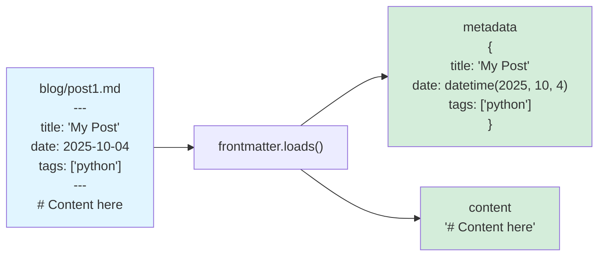
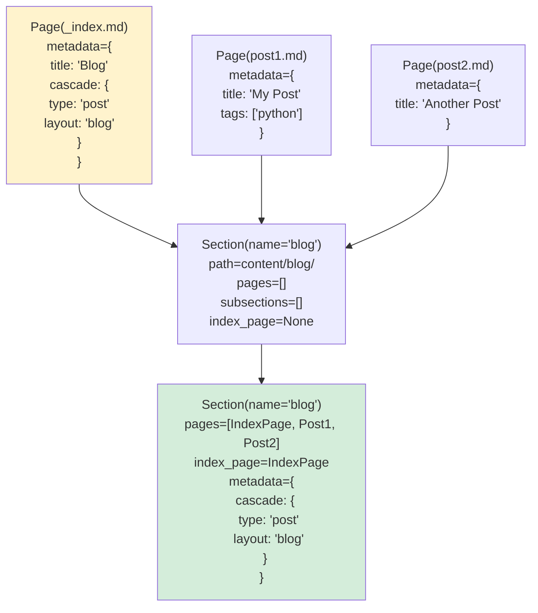
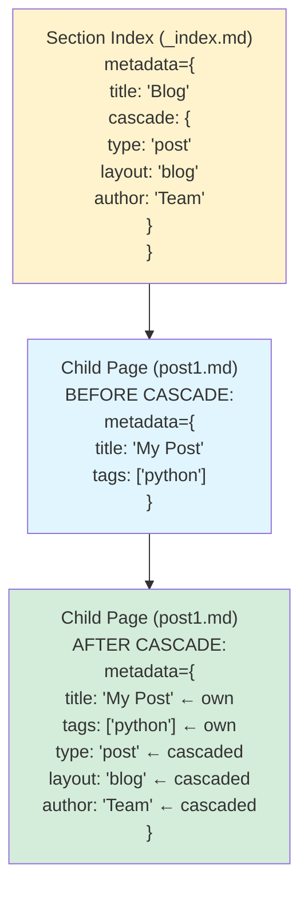
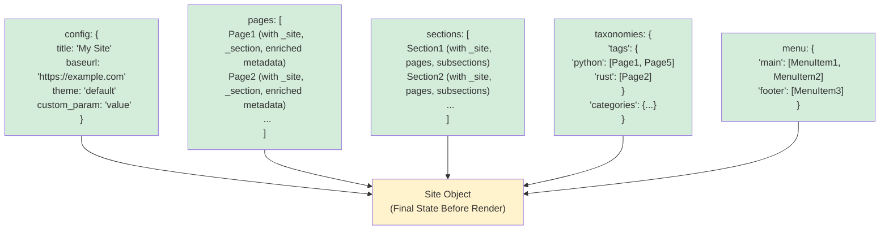
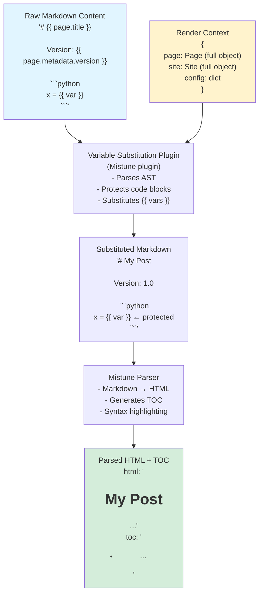
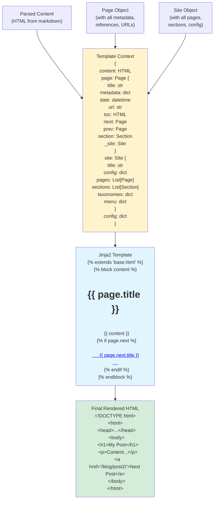

# Bengal SSG - Data Transformation Flow

This document diagrams the complete data transformation pipeline from configuration and source files through to final rendered output.

## Complete Data Flow Overview

```mermaid
graph TB
    %% Phase 1: Initialization
    ConfigFile["bengal.toml<br/>Configuration File"]
    ContentFiles["content/*.md<br/>Markdown Files<br/>with Frontmatter"]
    ThemeFiles["themes/*/templates/*.html<br/>Jinja2 Templates"]
    
    %% Phase 2: Parsing
    ConfigLoader["Config Loader<br/>bengal/config/loader.py"]
    FrontmatterParser["Frontmatter Parser<br/>python-frontmatter"]
    
    %% Phase 3: Core Objects
    SiteConfig["Site.config<br/>{<br/>  title: str<br/>  baseurl: str<br/>  theme: str<br/>  custom_params: dict<br/>}"]
    
    RawMetadata["Raw Metadata<br/>{<br/>  title: str<br/>  date: datetime<br/>  tags: list<br/>  custom_fields: any<br/>}"]
    
    RawContent["Raw Content<br/>(Markdown string)"]
    
    %% Phase 4: Object Creation
    PageObjects["Page Objects<br/>source_path: Path<br/>content: str<br/>metadata: dict<br/>parsed_ast: None<br/>rendered_html: ''"]
    
    SectionObjects["Section Objects<br/>name: str<br/>path: Path<br/>pages: list<br/>subsections: list<br/>metadata: dict<br/>index_page: Page?"]
    
    %% Phase 5: Organization
    SiteObject["Site Object<br/>pages: List[Page]<br/>sections: List[Section]<br/>config: dict<br/>taxonomies: dict<br/>menu: dict"]
    
    %% Phase 6: Reference Setup
    PageReferences["Page References Setup<br/>page._site = site<br/>page._section = section<br/>section._site = site<br/>section.parent = parent"]
    
    %% Phase 7: Cascade Application
    CascadeMetadata["Cascade Metadata<br/>(from _index.md)<br/>{<br/>  type: 'product'<br/>  layout: 'custom'<br/>  version: '2.0'<br/>}"]
    
    EnrichedMetadata["Enriched Page Metadata<br/>(own + cascaded)<br/>{<br/>  title: 'My Page'<br/>  type: 'product' ← cascade<br/>  layout: 'custom' ← cascade<br/>  version: '2.0' ← cascade<br/>}"]
    
    %% Phase 8: Taxonomy & Dynamic Pages
    Taxonomies["Taxonomies<br/>{<br/>  'tags': {'python': [pages]}<br/>  'categories': {...}<br/>}"]
    
    DynamicPages["Dynamic Pages<br/>- Tag pages<br/>- Archive pages<br/>- Pagination pages"]
    
    %% Phase 9: Rendering Context
    RenderContext["Render Context<br/>{<br/>  page: Page<br/>  site: Site<br/>  config: dict<br/>}"]
    
    %% Phase 10: Content Processing
    VarSubstitution["Variable Substitution<br/>VariableSubstitutionPlugin<br/>{{ page.title }}<br/>{{ site.config.name }}"]
    
    MarkdownParsing["Markdown Parsing<br/>Mistune Parser<br/>→ HTML"]
    
    ParsedHTML["Parsed HTML<br/>(with substituted vars)"]
    
    %% Phase 11: Template Rendering
    TemplateContext["Template Context<br/>{<br/>  page: Page (full)<br/>  site: Site (full)<br/>  config: dict<br/>  content: HTML<br/>  menu: dict<br/>  taxonomies: dict<br/>}"]
    
    RenderedPage["Rendered HTML Page<br/>(final output)"]
    
    OutputFile["Output File<br/>public/path/index.html"]
    
    %% Connections - Phase 1 to 2
    ConfigFile --> ConfigLoader
    ContentFiles --> FrontmatterParser
    
    %% Connections - Phase 2 to 3
    ConfigLoader --> SiteConfig
    FrontmatterParser --> RawMetadata
    FrontmatterParser --> RawContent
    
    %% Connections - Phase 3 to 4
    RawMetadata --> PageObjects
    RawContent --> PageObjects
    ContentFiles --> SectionObjects
    
    %% Connections - Phase 4 to 5
    PageObjects --> SiteObject
    SectionObjects --> SiteObject
    SiteConfig --> SiteObject
    
    %% Connections - Phase 5 to 6
    SiteObject --> PageReferences
    
    %% Connections - Phase 6 to 7
    SectionObjects --> CascadeMetadata
    CascadeMetadata --> EnrichedMetadata
    PageReferences --> EnrichedMetadata
    
    %% Connections - Phase 7 to 8
    EnrichedMetadata --> Taxonomies
    Taxonomies --> DynamicPages
    DynamicPages --> SiteObject
    
    %% Connections - Phase 8 to 9
    SiteObject --> RenderContext
    EnrichedMetadata --> RenderContext
    
    %% Connections - Phase 9 to 10
    RawContent --> VarSubstitution
    RenderContext --> VarSubstitution
    VarSubstitution --> MarkdownParsing
    MarkdownParsing --> ParsedHTML
    
    %% Connections - Phase 10 to 11
    ParsedHTML --> TemplateContext
    RenderContext --> TemplateContext
    ThemeFiles --> TemplateContext
    
    %% Connections - Phase 11 to output
    TemplateContext --> RenderedPage
    RenderedPage --> OutputFile
    
    style ConfigFile fill:#e1f5ff
    style ContentFiles fill:#e1f5ff
    style ThemeFiles fill:#e1f5ff
    style SiteObject fill:#fff3cd
    style PageObjects fill:#d4edda
    style EnrichedMetadata fill:#d4edda
    style TemplateContext fill:#f8d7da
    style RenderedPage fill:#f8d7da
    style OutputFile fill:#d1ecf1
```



## Detailed Phase Breakdown

### Phase 1: File Discovery & Loading

```
Input Files:
├── bengal.toml                    → Site Configuration
├── content/
│   ├── _index.md                  → Section index (with cascade)
│   ├── blog/
│   │   ├── _index.md              → Blog section (with cascade)
│   │   ├── post1.md               → Regular page
│   │   └── post2.md               → Regular page
│   └── docs/
│       └── guide.md               → Regular page
└── themes/default/templates/
    ├── base.html                  → Base template
    └── page.html                  → Page template
```

### Phase 2: Frontmatter Parsing



### Phase 3: Page Object Creation

```python
# In: ContentDiscovery._create_page()
page = Page(
    source_path=Path("content/blog/post1.md"),
    content="# Content here",
    metadata={
        'title': 'My Post',
        'date': datetime(2025, 10, 4),
        'tags': ['python']
    }
)

# At this point:
# - page._site = None (not set yet)
# - page._section = None (not set yet)
# - page.parsed_ast = None (not parsed yet)
# - page.rendered_html = "" (not rendered yet)
# - page.output_path = None (not computed yet)
```

### Phase 4: Section Organization



### Phase 5: Reference Setup

```python
# In: ContentOrchestrator._setup_page_references()

# Set site reference on all pages
for page in site.pages:
    page._site = site
    page._section = None  # Initialize

# Set section references
for section in site.sections:
    section._site = site
    for page in section.pages:
        page._section = section  # Link page to section
```

**Result:**
```python
page._site      → Site object (access to config, all pages, etc.)
page._section   → Section object (access to siblings, parent, etc.)
section._site   → Site object
section.parent  → Parent Section or None
```

### Phase 6: Cascade Application



**Code Flow:**
```python
# In: ContentOrchestrator._apply_section_cascade()

# Extract cascade from section's index page
cascade = section.metadata.get('cascade', {})

# Apply to each page in section
for page in section.pages:
    for key, value in cascade.items():
        if key not in page.metadata:  # Page values take precedence
            page.metadata[key] = value
```

**Nested Cascades:**
```python
# Parent section cascade
parent_cascade = {'type': 'docs', 'version': '1.0'}

# Child section cascade
child_cascade = {'category': 'api', 'stable': True}

# Accumulated cascade for pages in child section
accumulated = {
    'type': 'docs',      # from parent
    'version': '1.0',    # from parent
    'category': 'api',   # from child
    'stable': True       # from child
}
```

### Phase 7: Site Object Population



### Phase 8: Rendering Pipeline - Content Processing



**Key Architecture Point:**
- **Variable substitution** happens in markdown content: `{{ page.title }}`
- **Logic** (if/for) happens in templates: ``
- **Code blocks** are protected at AST level during variable substitution

### Phase 9: Template Rendering



### Phase 10: Output

```python
# Compute output path
output_path = Path("public/blog/post1/index.html")

# Write file
output_path.parent.mkdir(parents=True, exist_ok=True)
output_path.write_text(rendered_html, encoding='utf-8')
```

## Data Transformation Summary

### 1. Frontmatter → Page.metadata

```yaml
# Input: content/blog/post.md frontmatter
title: "My Post"
date: 2025-10-04
tags: ["python", "rust"]
author: "John Doe"
custom_field: "value"
```

```python
# Output: Page.metadata dict
{
    'title': 'My Post',
    'date': datetime(2025, 10, 4, 0, 0),
    'tags': ['python', 'rust'],
    'author': 'John Doe',
    'custom_field': 'value'
}
```

### 2. Section Cascade → Page.metadata

```yaml
# Input: content/blog/_index.md
title: "Blog"
cascade:
  type: "post"
  layout: "blog-post"
  show_author: true
```

```python
# Effect on child pages:
# BEFORE cascade:
page.metadata = {'title': 'My Post', 'author': 'John'}

# AFTER cascade:
page.metadata = {
    'title': 'My Post',      # from page (unchanged)
    'author': 'John',        # from page (unchanged)
    'type': 'post',          # from cascade (added)
    'layout': 'blog-post',   # from cascade (added)
    'show_author': True      # from cascade (added)
}
```

### 3. Page Object → Render Context

```python
# Input: Page object (enriched)
page = Page(
    source_path=Path("content/blog/post.md"),
    content="# My Post\n\nContent...",
    metadata={'title': 'My Post', 'type': 'post'},
    _site=site,
    _section=section
)

# Output: Render context
context = {
    'page': page,        # Full object with all properties
    'site': site,        # Full site object
    'config': site.config  # For convenience
}

# Available in {{ }} substitutions in markdown:
# - {{ page.title }}
# - {{ page.metadata.type }}
# - {{ site.config.baseurl }}
# - {{ config.title }}
```

### 4. Render Context → Template Context

```python
# After markdown parsing:
page.parsed_ast = "<h1>My Post</h1><p>Content...</p>"
page.toc = "<ul><li><a href='#section'>Section</a></li></ul>"

# Template context (for Jinja2):
template_context = {
    'content': page.parsed_ast,  # Rendered markdown
    'page': page,                # Full page object
    'site': site,                # Full site object
    'config': site.config,       # Config dict
    'menu': site.menu,           # All menus
    'taxonomies': site.taxonomies  # Tags, categories
}

# Available in  logic in templates:
# - 
# - 
# - 
```

## Special Cases

### Generated/Dynamic Pages

```python
# Tag page (generated dynamically)
tag_page = Page(
    source_path=Path("virtual/tags/python.md"),  # Virtual path
    content="",  # No source content
    metadata={
        '_generated': True,           # Marks as generated
        'template': 'tag.html',       # Template to use
        'tag': 'python',              # Tag name
        'title': 'Tag: python',       # Generated title
        'pages': [page1, page2]       # Pages with this tag
    }
)
```

### Index Pages

```python
# Section index page
index_page = Page(
    source_path=Path("content/blog/_index.md"),
    content="# Blog\n\nWelcome to the blog",
    metadata={
        'title': 'Blog',
        'cascade': {              # Applies to children
            'type': 'post',
            'layout': 'blog-post'
        }
    }
)

# After assignment to section:
section.index_page = index_page
section.metadata['cascade'] = index_page.metadata['cascade']
```

### Nested Cascade Accumulation

```
content/
├── api/_index.md           cascade: {type: 'api', base_url: '...'}
│   └── v2/_index.md        cascade: {version: '2.0', stable: true}
│       └── auth.md         (inherits all 4 fields)
```

```python
# For auth.md:
accumulated_cascade = {
    'type': 'api',              # from parent
    'base_url': '...',          # from parent
    'version': '2.0',           # from immediate section
    'stable': True              # from immediate section
}

# Applied to page:
auth_page.metadata = {
    'title': 'Authentication',  # from page frontmatter
    'type': 'api',              # from cascade
    'base_url': '...',          # from cascade
    'version': '2.0',           # from cascade
    'stable': True              # from cascade
}
```

## Access Patterns in Templates

### Page Object Properties

```jinja2
{# Direct properties #}
{{ page.title }}          {# From metadata or filename #}
{{ page.date }}           {# datetime object #}
{{ page.url }}            {# Computed from output_path #}
{{ page.slug }}           {# From metadata or filename #}
{{ page.content }}        {# Raw markdown #}
{{ page.toc }}            {# Generated table of contents HTML #}

{# Metadata access #}
{{ page.metadata.author }}
{{ page.metadata.custom_field }}
{{ page.metadata['any-key'] }}

{# Navigation #}
{{ page.next.title }}     {# Next page in site #}
{{ page.prev.title }}     {# Previous page in site #}
{{ page.section.title }}  {# Parent section #}

{# Tags/taxonomy #}

  <span>{{ tag }}</span>

```

### Site Object Properties

```jinja2
{# Configuration #}
{{ site.title }}
{{ site.baseurl }}
{{ site.config.custom_param }}

{# Collections #}

  {{ page.title }}



  {{ section.title }}


{# Taxonomies #}

  <a href="/tags/{{ tag }}/">{{ tag }} ({{ pages|length }})</a>


{# Menus #}

  <a href="{{ item.url }}">{{ item.title }}</a>

```

## Performance Considerations

### Build-Time Transformations

All these transformations happen **once** during build:
1. Frontmatter parsing
2. Page object creation
3. Reference setup
4. Cascade application
5. Markdown parsing
6. Template rendering

**Result:** Static HTML files with no runtime overhead.

### Caching

Bengal caches:
- **Content hashes**: Detect changed files for incremental builds
- **Dependency tracking**: Rebuild only affected pages
- **Build cache**: Skip unchanged pages entirely

### Parallel Processing

Transformations are parallelized where possible:
- **Content discovery**: Sequential (file I/O bound)
- **Markdown parsing**: Parallel (CPU bound)
- **Template rendering**: Parallel (CPU bound)
- **Asset processing**: Parallel (I/O and CPU bound)

---

## Quick Reference: Data Flow Cheat Sheet

```
File System          → Parser           → Core Objects      → Enrichment        → Rendering
─────────────────────────────────────────────────────────────────────────────────────────────
bengal.toml          → ConfigLoader     → Site.config       →                   →
                                                             
content/post.md      → frontmatter      → Page.metadata     → + Cascade         → Context
                     → .loads()         → Page.content      → + References      → + site
                                                                                 → + config
                                                                                 ↓
themes/*.html        →                  →                   →                   → Jinja2
                                                                                 → Template
                                                                                 ↓
                                                                              public/*.html
```

**Key Insight:** Each phase enriches the data:
1. **Parse**: File → Basic data
2. **Create**: Data → Objects
3. **Organize**: Objects → Structure (sections, hierarchies)
4. **Enrich**: Structure → Add references and cascades
5. **Render**: Enriched objects → HTML with full context


