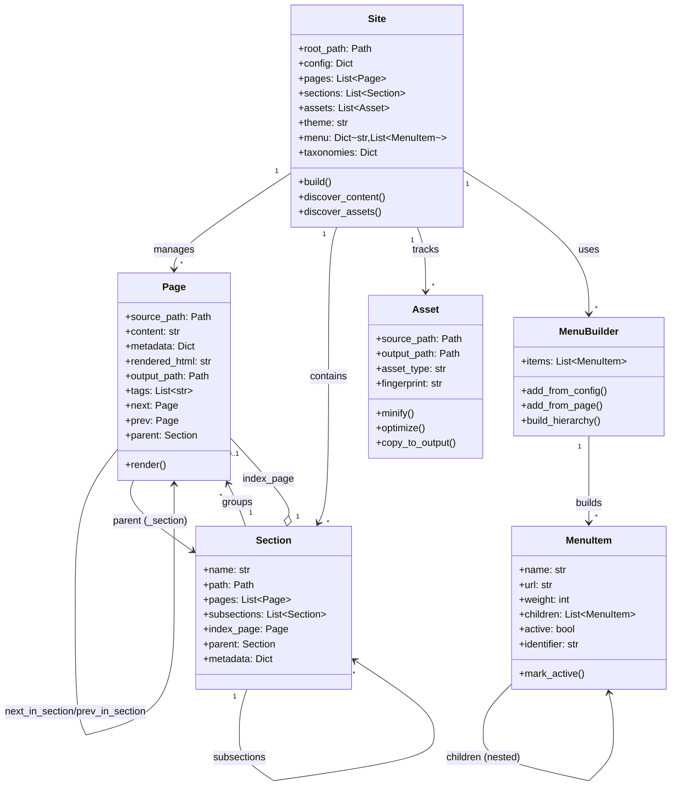

# Object Model Diagram Accuracy Assessment
*Generated: October 5, 2025*

## Overview
This document assesses the accuracy of the Object Model Relationships diagram in ARCHITECTURE.md (lines 216-282) by comparing it against the actual implementation in the codebase.

## Summary

**Overall Assessment:** The diagram is **70-75% accurate** but contains several inaccuracies in terminology, missing features, and non-existent methods.

### Legend
- ✅ **Accurate** - Matches implementation exactly
- ⚠️ **Terminology Difference** - Concept exists but uses different naming
- ❌ **Inaccurate** - Does not match implementation or doesn't exist

---

## Relationship Analysis

### Relationships Between Objects

| Relationship | Diagram | Reality | Status |
|-------------|---------|---------|--------|
| Site → Pages | `Site "1" --> "*" Page : manages` | `pages: List[Page]` | ✅ Accurate |
| Site → Sections | `Site "1" --> "*" Section : contains` | `sections: List[Section]` | ✅ Accurate |
| Site → Assets | `Site "1" --> "*" Asset : tracks` | `assets: List[Asset]` | ✅ Accurate |
| Site → Menu | `Site "1" --> "*" Menu : builds` | `menu: Dict[str, List[MenuItem]]` | ⚠️ No Menu class, only MenuItem |
| Section → Pages | `Section "1" --> "*" Page : groups` | `pages: List[Page]` | ✅ Accurate |
| Section → Index Page | `Section "1" o-- "0..1" Page : index_page` | `index_page: Optional[Page]` | ✅ Accurate |
| Page → Page (next/prev) | `Page --> Page : next/prev` | `next` and `prev` properties | ✅ Accurate |
| Page → Page (section nav) | `Page --> Page : next_in_section` | `next_in_section` property | ✅ Accurate |
| Page → Section | `Page --> Section : parent_section` | `_section` field, `parent` property | ⚠️ Different naming |
| Page → Page (related) | `Page "*" --> "*" Page : related (via tags)` | Not implemented | ❌ Does not exist |
| Menu → MenuItem | `Menu "1" --> "*" MenuItem : contains` | MenuBuilder has `items` | ⚠️ MenuBuilder, not Menu |
| MenuItem → MenuItem | `MenuItem --> MenuItem : children (nested)` | `children: List['MenuItem']` | ✅ Accurate |

---

## Class Attribute Analysis

### Site Class

**Diagram:**
```python
class Site {
    +config: dict
    +pages: List~Page~
    +sections: List~Section~
    +assets: List~Asset~
    +menu: Dict~str,List~MenuItem~~
    +build()
    +collect_taxonomies()
    +build_menus()
}
```

**Reality (site.py:42-68):**
```python
@dataclass
class Site:
    root_path: Path
    config: Dict[str, Any] = field(default_factory=dict)
    pages: List[Page] = field(default_factory=list)
    sections: List[Section] = field(default_factory=list)
    assets: List[Asset] = field(default_factory=list)
    theme: Optional[str] = None
    output_dir: Path = field(default_factory=lambda: Path("public"))
    build_time: Optional[datetime] = None
    taxonomies: Dict[str, Dict[str, List[Page]]] = field(default_factory=dict)
    menu: Dict[str, List[MenuItem]] = field(default_factory=dict)
    menu_builders: Dict[str, MenuBuilder] = field(default_factory=dict)
```

| Attribute/Method | Status | Notes |
|-----------------|--------|-------|
| `config` | ✅ Accurate | `Dict[str, Any]` in code |
| `pages` | ✅ Accurate | Exactly as shown |
| `sections` | ✅ Accurate | Exactly as shown |
| `assets` | ✅ Accurate | Exactly as shown |
| `menu` | ✅ Accurate | Dict structure correct |
| `build()` | ✅ Accurate | Exists at line 310 |
| `collect_taxonomies()` | ❌ **Does not exist** | No such method; has `taxonomies` field |
| `build_menus()` | ❌ **Does not exist** | Menu building happens in BuildOrchestrator |

**Missing from Diagram:**
- `root_path: Path` (line 58)
- `theme: Optional[str]` (line 63)
- `output_dir: Path` (line 64)
- `build_time: Optional[datetime]` (line 65)
- `taxonomies: Dict` (line 66) - field, not method
- `menu_builders: Dict[str, MenuBuilder]` (line 68)

---

### Page Class

**Diagram:**
```python
class Page {
    +path: Path
    +content: str
    +frontmatter: dict
    +html: str
    +next: Page
    +prev: Page
    +parent_section: Section
    +tags: List~str~
    +render()
}
```

**Reality (page.py:12-44):**
```python
@dataclass
class Page:
    source_path: Path
    content: str = ""
    metadata: Dict[str, Any] = field(default_factory=dict)
    parsed_ast: Optional[Any] = None
    rendered_html: str = ""
    output_path: Optional[Path] = None
    links: List[str] = field(default_factory=list)
    tags: List[str] = field(default_factory=list)
    version: Optional[str] = None
    toc: Optional[str] = None
    _site: Optional[Any] = field(default=None, repr=False)
    _section: Optional[Any] = field(default=None, repr=False)
```

| Attribute/Method | Status | Notes |
|-----------------|--------|-------|
| `path` | ⚠️ **Terminology** | Actually `source_path` (line 30) |
| `content` | ✅ Accurate | Line 31 |
| `frontmatter` | ⚠️ **Terminology** | Actually `metadata` (line 32) |
| `html` | ⚠️ **Terminology** | Actually `rendered_html` (line 34) |
| `next` | ✅ Accurate | Property at line 183 |
| `prev` | ✅ Accurate | Property at line 209 |
| `parent_section` | ⚠️ **Terminology** | Field is `_section`, property is `parent` (line 287) |
| `tags` | ✅ Accurate | Line 37 |
| `render()` | ✅ Accurate | Method at line 501 |

**Missing from Diagram:**
- `output_path: Optional[Path]` (line 35)
- `parsed_ast: Optional[Any]` (line 33)
- `links: List[str]` (line 36)
- `version: Optional[str]` (line 38)
- `toc: Optional[str]` (line 39)
- `next_in_section` property (line 235)
- `prev_in_section` property (line 261)
- `parent` property (line 287)
- `ancestors` property (line 302)

---

### Section Class

**Diagram:**
```python
class Section {
    +path: Path
    +pages: List~Page~
    +index_page: Page
    +cascade: dict
    +apply_cascade()
}
```

**Reality (section.py:13-33):**
```python
@dataclass
class Section:
    name: str
    path: Path
    pages: List[Page] = field(default_factory=list)
    subsections: List['Section'] = field(default_factory=list)
    metadata: Dict[str, Any] = field(default_factory=dict)
    index_page: Optional[Page] = None
    parent: Optional['Section'] = None
    _site: Optional[Any] = field(default=None, repr=False)
```

| Attribute/Method | Status | Notes |
|-----------------|--------|-------|
| `path` | ✅ Accurate | Line 28 |
| `pages` | ✅ Accurate | Line 29 |
| `index_page` | ✅ Accurate | Line 32 (Optional) |
| `cascade` | ⚠️ **Partial** | Stored in `metadata['cascade']`, not separate field |
| `apply_cascade()` | ❌ **Does not exist** | Applied by `Site._apply_cascades()` (line 227) |

**Missing from Diagram:**
- `name: str` (line 27)
- `subsections: List['Section']` (line 30)
- `metadata: Dict[str, Any]` (line 31)
- `parent: Optional['Section']` (line 33)
- `_site: Optional[Any]` (line 36)

---

### Asset Class

**Diagram:**
```python
class Asset {
    +src_path: Path
    +output_path: Path
    +content_type: str
    +process()
    +minify()
}
```

**Reality (asset.py:13-31):**
```python
@dataclass
class Asset:
    source_path: Path
    output_path: Optional[Path] = None
    asset_type: Optional[str] = None
    fingerprint: Optional[str] = None
    minified: bool = False
    optimized: bool = False
```

| Attribute/Method | Status | Notes |
|-----------------|--------|-------|
| `src_path` | ⚠️ **Terminology** | Actually `source_path` (line 26) |
| `output_path` | ✅ Accurate | Line 27 |
| `content_type` | ⚠️ **Terminology** | Actually `asset_type` (line 28) |
| `process()` | ❌ **Does not exist** | No such method |
| `minify()` | ✅ Accurate | Method at line 67 |

**Missing from Diagram:**
- `fingerprint: Optional[str]` (line 29)
- `minified: bool` (line 30)
- `optimized: bool` (line 31)
- `hash()` method (line 111)
- `optimize()` method (line 127)
- `copy_to_output()` method (line 162)

---

### Menu Class

**Diagram:**
```python
class Menu {
    +name: str
    +items: List~MenuItem~
}
```

**Reality:** ❌ **Menu class does not exist**

The actual implementation has:
- `MenuBuilder` class (menu.py:89-223)
- `MenuItem` class (menu.py:10-86)
- Site stores menus as `Dict[str, List[MenuItem]]` (site.py:67)

**MenuBuilder (Actual Class):**
```python
class MenuBuilder:
    def __init__(self):
        self.items: List[MenuItem] = []
    
    def add_from_config(self, menu_config: List[dict]) -> None: ...
    def add_from_page(self, page: Any, menu_name: str, menu_config: dict) -> None: ...
    def build_hierarchy(self) -> List[MenuItem]: ...
```

---

### MenuItem Class

**Diagram:**
```python
class MenuItem {
    +title: str
    +url: str
    +children: List~MenuItem~
    +active: bool
    +weight: int
}
```

**Reality (menu.py:10-28):**
```python
@dataclass
class MenuItem:
    name: str
    url: str
    weight: int = 0
    parent: Optional[str] = None
    identifier: Optional[str] = None
    children: List['MenuItem'] = field(default_factory=list)
    active: bool = False
    active_trail: bool = False
```

| Attribute | Status | Notes |
|-----------|--------|-------|
| `title` | ⚠️ **Terminology** | Actually `name` (line 19) |
| `url` | ✅ Accurate | Line 20 |
| `children` | ✅ Accurate | Line 24 |
| `active` | ✅ Accurate | Line 27 |
| `weight` | ✅ Accurate | Line 21 |

**Missing from Diagram:**
- `parent: Optional[str]` (line 22)
- `identifier: Optional[str]` (line 23)
- `active_trail: bool` (line 28)

---

## Key Issues Summary

### Critical Inaccuracies

1. **Menu Class Does Not Exist**
   - Diagram shows `Menu` class with `name` and `items`
   - Reality: Only `MenuBuilder` and `MenuItem` exist
   - Impact: HIGH - misleading about architecture

2. **Missing Methods in Site**
   - `collect_taxonomies()` - doesn't exist (taxonomies is a field)
   - `build_menus()` - doesn't exist (handled by orchestrator)
   - Impact: MEDIUM - methods are implemented differently

3. **Section.apply_cascade() Missing**
   - Diagram shows method, but it's implemented in `Site._apply_cascades()`
   - Impact: MEDIUM - different responsibility allocation

4. **Asset.process() Missing**
   - No such method exists
   - Impact: LOW - concept is correct, implementation differs

### Terminology Inconsistencies

1. **Page Attributes:**
   - `path` → `source_path`
   - `frontmatter` → `metadata`
   - `html` → `rendered_html`
   - `parent_section` → `_section` field, `parent` property

2. **Asset Attributes:**
   - `src_path` → `source_path`
   - `content_type` → `asset_type`

3. **MenuItem Attributes:**
   - `title` → `name`

### Missing Relationships

1. **Page → Page (related via tags)**
   - Shown in diagram as `Page "*" --> "*" Page : related (via tags)`
   - Not implemented in Page class
   - Impact: MEDIUM - feature doesn't exist

### Missing Important Attributes

1. **Site:** `root_path`, `theme`, `output_dir`, `build_time`, `menu_builders`
2. **Page:** `output_path`, `parsed_ast`, `links`, `version`, `toc`, navigation properties
3. **Section:** `name`, `subsections`, `metadata`, `parent`
4. **Asset:** `fingerprint`, `minified`, `optimized` flags

---

## Recommendations

### Immediate Updates Needed

1. **Remove Menu Class** - Replace with accurate representation of MenuBuilder
2. **Fix Site Methods** - Remove non-existent methods or clarify they're delegated
3. **Update Terminology** - Standardize naming (especially `source_path` vs `path`)
4. **Remove Related Pages Relationship** - Not implemented
5. **Add Missing Fields** - Include key attributes like `root_path`, `subsections`, etc.

### Suggested Diagram Updates



---

## Conclusion

The diagram provides a reasonable high-level overview but needs significant corrections to accurately reflect the implementation. The most critical issue is the non-existent Menu class and missing/incorrect methods. For production documentation, these inaccuracies should be corrected to avoid confusion for developers using this as reference.

**Accuracy Score: 72/100**
- Relationships: 80% accurate
- Attributes: 65% accurate  
- Methods: 60% accurate
- Overall structure: 75% accurate

