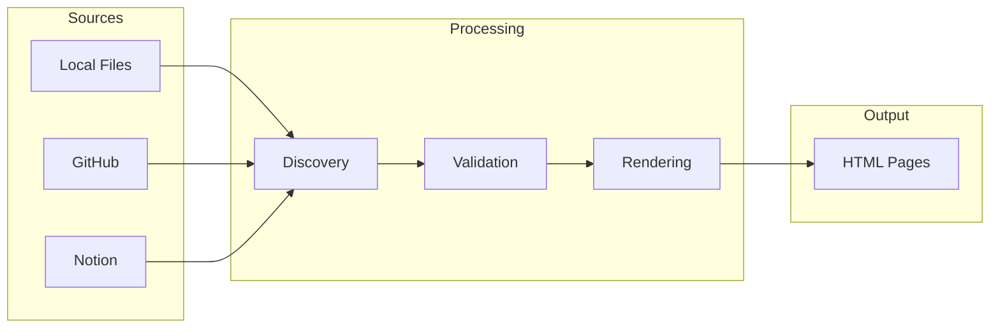
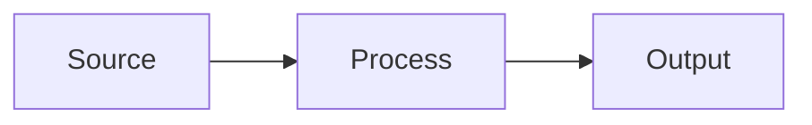
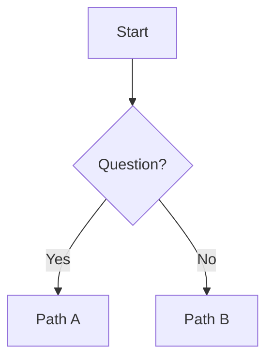
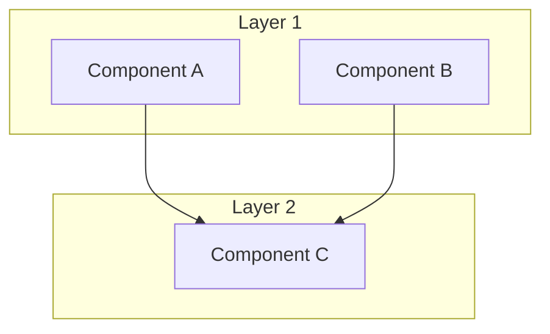
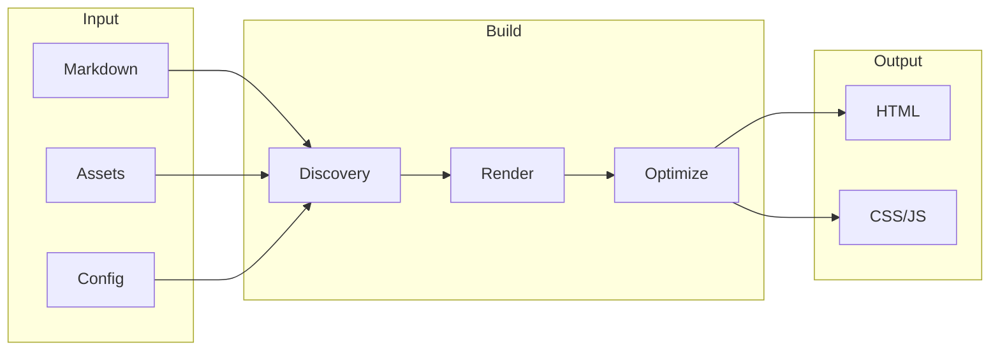
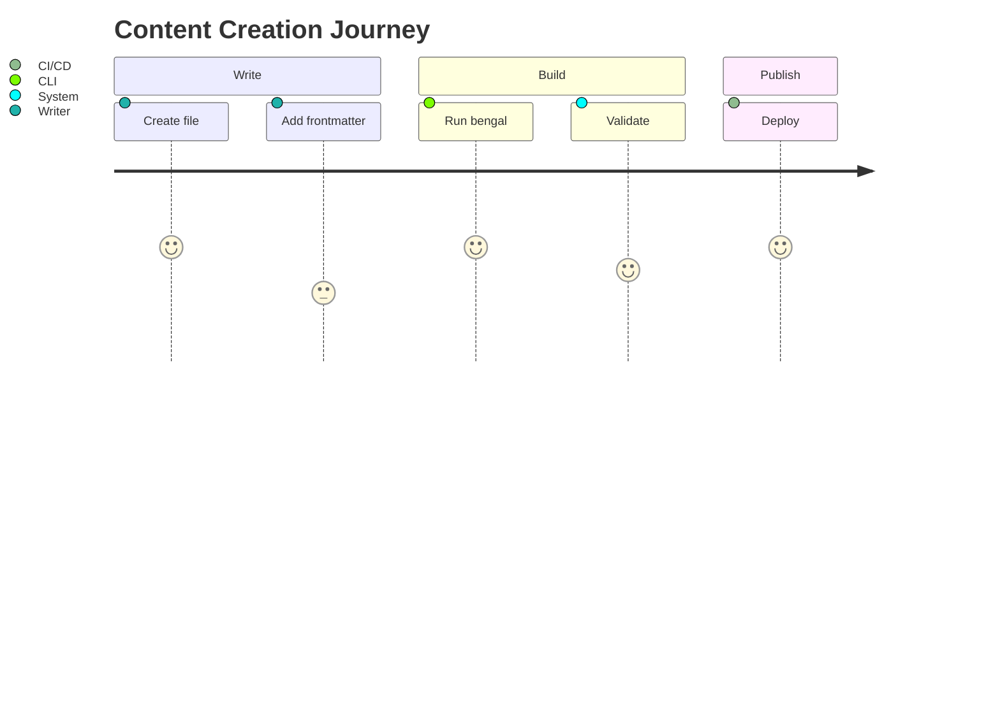

# Index Page Examples

> Companion to: `index-page-content-standard.md`

---

## Example 1: Top-Level Hub — Content Section

### ❌ Before (Current Pattern)

```markdown
---
title: Content
description: Everything about content authoring in Bengal
---

# Content

Everything you need to know about creating, organizing, and managing content in Bengal.

## Overview

Bengal provides a powerful content system with:

- **Flexible organization** — Pages, sections, bundles, and custom taxonomies
- **Rich authoring** — Markdown, MyST directives, and shortcodes
- **Typed schemas** — Validate frontmatter with content collections
- **Multiple sources** — Local files, GitHub, Notion, REST APIs
- **Content reuse** — Snippets, data files, and smart filtering

## Quick Links

| I want to... | Go to... |
|--------------|----------|
| Understand content structure | [Organization](/docs/content/organization/) |
| Write rich content | [Authoring](/docs/content/authoring/) |
| Validate frontmatter | [Collections](/docs/content/collections/) |
| Pull content from external sources | [Sources](/docs/content/sources/) |
| Reuse content across pages | [Reuse](/docs/content/reuse/) |

## Sections

### [Organization](/docs/content/organization/)

How content is structured in Bengal — pages, sections, bundles, frontmatter, and navigation menus.

### [Authoring](/docs/content/authoring/)

Writing content with Markdown, MyST directives, and shortcodes. Reference for all available formatting options.

### [Collections](/docs/content/collections/)

Define typed schemas for your content. Validate frontmatter, enforce required fields, and maintain consistency.

### [Sources](/docs/content/sources/)

Fetch content from external sources — GitHub repositories, Notion databases, REST APIs, and custom loaders.

### [Reuse](/docs/content/reuse/)

DRY content strategies using snippets, data files, taxonomies, and smart filtering.
```

**Problems**:
- `## Sections` duplicates auto-generated child tiles
- Quick Links table + Sections list = double redundancy
- Feature bullets are generic, don't aid wayfinding

---

### ✅ After (Revised)

```markdown
---
title: Content
description: Author, organize, and manage your documentation
weight: 20
cascade:
  type: doc
---

# The Content System

Bengal's content system turns Markdown files into a structured site.

## What Do You Need?

::::{cards}
:columns: 2
:gap: medium

:::{card} 📝 Write Content
:link: ./authoring/
:color: blue

Markdown, directives, and shortcodes for rich documentation.
:::

:::{card} 📁 Organize Content
:link: ./organization/
:color: green

Pages, sections, bundles, and navigation menus.
:::

:::{card} ✅ Validate Content
:link: ./collections/
:color: purple

Typed schemas to catch errors at build time.
:::

:::{card} 🔗 Connect Content
:link: ./sources/
:color: orange

Pull from GitHub, Notion, or REST APIs.
:::
::::

## How Content Flows



:::{tip}
**New to Bengal?** Start with [Organization](./organization/) to understand the content model, then explore [Authoring](./authoring/) for writing syntax.
:::
```

**Improvements**:
- Cards replace redundant sections list
- Mermaid shows content flow mental model
- Single tip provides actionable guidance
- 60% shorter, more scannable

---

## Example 2: Conceptual Subsection — Content Organization

### ❌ Before (Current Pattern)

```markdown
---
title: Content Organization
description: How content is structured in Bengal
---

# Content Organization

Understanding how content is structured in Bengal — pages, sections, bundles, and navigation.

## Content Hierarchy

Bengal organizes content in a familiar directory-based hierarchy:

```
content/
├── _index.md           # Homepage
├── about.md            # Single page
├── blog/               # Section (list page + children)
│   ├── _index.md       # Section index
│   ├── first-post.md   # Regular page
│   └── photo-gallery/  # Page bundle
│       ├── index.md    # Bundle's main content
│       └── hero.jpg    # Co-located asset
└── docs/
    ├── _index.md
    └── getting-started/
        ├── _index.md
        └── installation.md
```

## Core Concepts

### Pages

A **page** is any `.md` file that becomes an HTML page. Two types:

- **Single pages** — Standalone files like `about.md` → `/about/`
- **Index pages** — `_index.md` files that define a section

### Sections

A **section** is a directory containing an `_index.md`. Sections:
- Create list pages showing their children
- Can be nested to any depth
- Support cascade configuration

### Page Bundles

A **page bundle** is a directory with `index.md` (not `_index.md`) that groups a page with its assets:

```
my-post/
├── index.md        # The page content
├── hero.jpg        # Co-located image
├── data.json       # Co-located data
└── diagram.svg     # Co-located asset
```

Assets in a bundle are only available to that page.

## In This Section

- **[Frontmatter Reference](/docs/content/organization/frontmatter/)** — All available frontmatter fields
- **[Menus](/docs/content/organization/menus/)** — Navigation menu configuration
```

**Problems**:
- "In This Section" duplicates auto-tiles
- Good content, but lacks visual mental model
- No "Do I Need This?" framing

---

### ✅ After (Revised)

```markdown
---
title: Content Organization
description: Pages, sections, and bundles explained
weight: 10
---

# How Bengal Organizes Content

Bengal uses your folder structure to create your site structure. No configuration required.

## The Three Building Blocks

```mermaid
graph TB
    subgraph "Content Types"
        A["📄 Page<br/><code>file.md</code>"]
        B["📁 Section<br/><code>folder/_index.md</code>"]
        C["📦 Bundle<br/><code>folder/index.md</code>"]
    end

    A --> |"standalone"| D[HTML Page]
    B --> |"with children"| E[List Page + Children]
    C --> |"with assets"| F[Page + Assets]
```



| Type | File Pattern | Creates | Use For |
|------|--------------|---------|---------|
| **Page** | `about.md` | `/about/` | Standalone content |
| **Section** | `blog/_index.md` | `/blog/` + child list | Content groups |
| **Bundle** | `post/index.md` | `/post/` + co-located assets | Pages with images/data |

## Quick Reference

::::{tab-set}
:::{tab-item} Page
```
content/
└── about.md  →  /about/
```
A single Markdown file = a single HTML page.
:::

:::{tab-item} Section
```
content/
└── blog/
    ├── _index.md     →  /blog/ (list page)
    ├── post-1.md     →  /blog/post-1/
    └── post-2.md     →  /blog/post-2/
```
Directory with `_index.md` = section with children.
:::

:::{tab-item} Bundle
```
content/
└── gallery/
    ├── index.md      →  /gallery/
    ├── photo-1.jpg   (co-located)
    └── photo-2.jpg   (co-located)
```
Directory with `index.md` = page with private assets.
:::
::::

:::{tip}
**Rule of thumb**: Use `_index.md` for sections (folders with child pages), use `index.md` for bundles (pages with co-located assets).
:::

:::{dropdown} Deep Dive: Nesting and Cascades
Sections can nest to any depth:

```
docs/
├── _index.md
├── getting-started/
│   ├── _index.md
│   └── installation.md
└── advanced/
    ├── _index.md
    └── plugins.md
```

Configuration in a section's `_index.md` can cascade to all children:

```yaml
---
title: Docs
cascade:
  type: doc
  toc: true
---
```

All pages under `docs/` inherit `type: doc` and `toc: true`.
:::
```

**Improvements**:
- Visual diagram shows the three types at a glance
- Tabs replace verbose text explanations
- Table provides quick reference
- Dropdown hides advanced content (progressive disclosure)
- No redundant "In This Section" list

---

## Example 3: Reference Hub — Architecture

### ❌ Before (Simplified)

```markdown
---
title: Architecture
description: High-level architecture overview
---

# Architecture Overview

Bengal follows a modular architecture...

## Sections

### [Core](/docs/reference/architecture/core/)
The brain of Bengal...

### [Rendering](/docs/reference/architecture/rendering/)
From Markdown to HTML...

### [Subsystems](/docs/reference/architecture/subsystems/)
Specialized features...
```

**Problems**:
- Sections list duplicates auto-tiles
- No visual architecture overview

---

### ✅ After (Current — Already Good!)

The current `reference/architecture/_index.md` is actually a good example:

```markdown
# Architecture Overview

Bengal SSG follows a modular architecture with clear separation of concerns...

::::{cards}
:columns: 2
:gap: medium

:::{card} Core Architecture
:icon: cpu
:link: core/
:color: blue
The brain of Bengal. Data models, build coordination, and core principles.
:::

[... more cards ...]
::::

## High-Level Architecture

```mermaid
graph TB
    subgraph "Entry Points"
        CLI[CLI<br/>bengal/cli/]
        Server[Dev Server<br/>bengal/server/]
    end

    [... full diagram ...]
```
```

**Why it works**:
- Cards provide role-based wayfinding (not just listing children)
- Mermaid diagram shows system relationships
- Auto-tiles are supplementary, not duplicated

---

## Example 4: Deep Content — Sources (Keep As-Is)

The `content/sources/_index.md` is **260 lines** of actual documentation. This is correct for Template D (Deep Content Index).

**Key markers that it's the right approach**:
- "Do I Need This?" section ✅
- "Quick Start" with code ✅
- Full API documentation for all loaders ✅
- `show_children: false` would be appropriate (if it had children)

**Only change needed**: None, but could add:

```yaml
---
show_children: false  # This IS the documentation
---
```

---

## Mermaid Diagram Recipes

### Recipe 1: Content Flow



### Recipe 2: Decision Tree



### Recipe 3: System Components



### Recipe 4: Build Pipeline



### Recipe 5: User Journey



---

## Before/After Summary

| Section | Before (Lines) | After (Lines) | Reduction |
|---------|---------------|---------------|-----------|
| Content Hub | 60 | 45 | 25% |
| Organization | 72 | 65 | 10% |
| Theming Hub | 57 | 40 | 30% |
| Extending Hub | 55 | 40 | 27% |

**Key metric**: Not just shorter, but **more scannable** and **less redundant**.
