# RFC: Learning Tracks for Bengal Documentation

**Status**: Draft  
**Created**: 2025-12-04  
**Author**: AI Assistant  
**Priority**: P2 (Medium)  

---

## Executive Summary

Propose 6 structured learning tracks that guide users from first contact to mastery. Each track connects existing documentation pages into coherent progressions with clear outcomes.

**Key Insight**: We have excellent content scattered across sections. Learning tracks organize this into goal-oriented journeys without requiring new content creation.

**Implementation**: Bengal already has a tracks system via `site/data/tracks.yaml` with dedicated templates (`tracks/list.html`, `tracks/single.html`). This RFC proposes populating that system with well-designed learning paths.

---

## Problem Statement

Current documentation offers:
- ✅ Comprehensive reference material
- ✅ Good quickstarts for 3 personas
- ✅ Solid tutorials
- ✅ Existing tracks infrastructure (templates, data file)
- ❌ Only 2 placeholder tracks defined with outdated paths
- ❌ No clear "what's next?" progression
- ❌ Advanced features feel disconnected
- ❌ No tracks for team leads, DevOps, or API teams

**User Feedback Pattern**: "I finished the quickstart. Now what?"

---

## Proposed Learning Tracks

### Track 1: "Zero to Deployed Site"

**Goal**: First static site generator experience → live website  
**Audience**: Complete beginners, no SSG experience  
**Duration**: ~45 minutes  
**Outcome**: Personal blog deployed to GitHub Pages

```mermaid
flowchart LR
    A[Installation] --> B[Writer Quickstart]
    B --> C[Build a Blog Tutorial]
    C --> D[Deployment]
    D --> E["🎉 Live Site!"]
```

**Pages in Track**:
1. `/docs/get-started/installation/` (5 min)
2. `/docs/get-started/quickstart-writer/` (5 min)
3. `/docs/tutorials/build-a-blog/` (15 min)
4. `/docs/building/deployment/` (10 min)
5. `/docs/tutorials/automate-with-github-actions/` (10 min)

**Completion Criteria**:
- [ ] Bengal installed
- [ ] Local site running
- [ ] First blog post created
- [ ] Site deployed to GitHub Pages
- [ ] CI/CD pipeline configured

---

### Track 2: "Content Author Mastery"

**Goal**: Basic Markdown → power user with advanced features  
**Audience**: Writers who completed quickstart, want more  
**Duration**: ~60 minutes  
**Outcome**: Mastery of directives, reuse, and dynamic content

```mermaid
flowchart LR
    A[Authoring Basics] --> B[Directives Deep Dive]
    B --> C[Content Reuse]
    C --> D[Variable Substitution]
    D --> E["✨ Power User"]
```

**Pages in Track**:
1. `/docs/content/authoring/` (10 min)
2. `/docs/reference/directives/` (15 min)
3. `/docs/reference/directives/admonitions/` (5 min)
4. `/docs/reference/directives/layout/` (10 min) - cards, tabs
5. `/docs/content/reuse/` (10 min)
6. `/docs/content/reuse/snippets/` (5 min)
7. Variable Substitution section in Authoring (5 min)

**Completion Criteria**:
- [ ] Can create all admonition types
- [ ] Uses tabs and cards effectively
- [ ] Reuses content with includes
- [ ] Uses variables in content
- [ ] Understands directive nesting rules

---

### Track 3: "Theme Developer Journey"

**Goal**: CSS tweaks → full custom theme  
**Audience**: Designers and frontend developers  
**Duration**: ~90 minutes  
**Outcome**: Custom theme extending Bengal defaults

```mermaid
flowchart LR
    A[Themer Quickstart] --> B[CSS Variables]
    B --> C[Template Recipes]
    C --> D[Custom Templates]
    D --> E[Full Theme]
    E --> F["🎨 Theme Pro"]
```

**Pages in Track**:
1. `/docs/get-started/quickstart-themer/` (10 min)
2. `/docs/theming/themes/customize/` (15 min) - CSS variables
3. `/docs/theming/recipes/` (20 min) - all recipes
4. `/docs/theming/templating/` (15 min) - Jinja2 basics
5. `/docs/theming/templating/functions/` (10 min) - filters
6. `/docs/theming/variables/` (10 min)
7. `/docs/reference/theme-variables/` (10 min)

**Completion Criteria**:
- [ ] Customized colors/fonts via CSS variables
- [ ] Created template override
- [ ] Implemented a recipe (reading time, recent posts)
- [ ] Built complete custom theme
- [ ] Published theme (optional)

---

### Track 4: "Documentation Team Lead"

**Goal**: Solo docs → scalable team workflow  
**Audience**: Tech writers, doc managers, lead engineers  
**Duration**: ~75 minutes  
**Outcome**: Validated, governed documentation with CI/CD

```mermaid
flowchart LR
    A[Collections] --> B[Schema Validation]
    B --> C[Remote Sources]
    C --> D[Content Validation]
    D --> E[CI/CD Integration]
    E --> F["📋 Team Ready"]
```

**Pages in Track**:
1. `/docs/content/collections/` (15 min)
2. `/docs/content/sources/` (15 min)
3. `/docs/extending/validation/` (10 min)
4. `/docs/building/deployment/` (10 min) - CI/CD section
5. `/docs/tutorials/automate-with-github-actions/` (15 min)
6. `/docs/building/configuration/` (10 min) - environments

**Completion Criteria**:
- [ ] Schema defined for content types
- [ ] Validation runs on build
- [ ] `--strict` mode enabled
- [ ] CI pipeline validates PRs
- [ ] Multi-source content configured (if needed)

---

### Track 5: "Migration Express"

**Goal**: Existing SSG site → Bengal  
**Audience**: Hugo, Jekyll, Gatsby, or other SSG users  
**Duration**: ~60 minutes  
**Outcome**: Fully migrated site with preserved URLs

```mermaid
flowchart LR
    A[Compare SSGs] --> B[Migration Tutorial]
    B --> C[Content Organization]
    C --> D[Configuration]
    D --> E[URL Preservation]
    E --> F["🔄 Migrated!"]
```

**Pages in Track**:
1. `/docs/about/comparison/` (10 min)
2. `/docs/tutorials/migrate-from-hugo/` (30 min)
3. `/docs/content/organization/` (10 min)
4. `/docs/building/configuration/` (10 min)
5. Aliases and redirects (reference within organization)

**Completion Criteria**:
- [ ] Content migrated with preserved structure
- [ ] Frontmatter adapted
- [ ] URLs preserved (via aliases)
- [ ] Theme recreated or replaced
- [ ] Redirects configured

---

### Track 6: "API Documentation Specialist"

**Goal**: Manual API docs → auto-generated, always-current docs  
**Audience**: Developer advocates, API teams, SDK maintainers  
**Duration**: ~60 minutes  
**Outcome**: Automated API documentation pipeline

```mermaid
flowchart LR
    A[Autodoc Intro] --> B[Python Docs]
    B --> C[CLI Docs]
    C --> D[OpenAPI Docs]
    D --> E[Build Integration]
    E --> F["📚 API Docs Pro"]
```

**Pages in Track**:
1. `/docs/extending/autodoc/` (10 min)
2. Python autodoc walkthrough (15 min)
3. CLI autodoc walkthrough (10 min)
4. OpenAPI autodoc walkthrough (10 min)
5. `/docs/content/collections/` (10 min) - schema for API pages
6. CI integration for autodoc (5 min)

**Completion Criteria**:
- [ ] Python module documented from docstrings
- [ ] CLI commands documented automatically
- [ ] OpenAPI spec generates endpoint docs
- [ ] Autodoc runs in CI pipeline
- [ ] Output validated with collections schema

---

## Implementation

Bengal already has a complete tracks infrastructure:
- **Data file**: `site/data/tracks.yaml` - defines track metadata and page lists
- **Templates**: `tracks/list.html` and `tracks/single.html` - renders track pages
- **Content pages**: `site/content/tracks/` - track landing pages with `track_id` frontmatter

### Phase 1: Update tracks.yaml (Immediate)

Replace the placeholder tracks with well-designed learning paths using existing documentation pages.

### Phase 2: Create Track Landing Pages (Immediate)

Each track needs a content page in `site/content/tracks/` with:
- `layout: tracks/single`
- `track_id: <key-from-tracks.yaml>`
- Introduction content
- Learning objectives
- "What you'll learn" summary

### Phase 3: Verify Page Paths (Immediate)

Ensure all referenced pages in tracks.yaml exist and paths are correct.

### Phase 4: Progress Tracking (Future)

Consider adding:
- Track progress via localStorage
- Completion badges
- Suggested next tracks

---

## Design Principles

1. **No New Content Required**: Tracks curate existing pages into journeys
2. **Clear Outcomes**: Each track has concrete completion criteria
3. **Time Estimates**: Every page shows estimated reading time
4. **Progressive Complexity**: Easy → intermediate → advanced within each track
5. **Cross-Track Awareness**: Suggest related tracks at completion

---

## Success Metrics

**User-Facing**:
- Time to first successful build (target: < 30 min)
- Track completion rate (target: > 60%)
- "What's next?" support questions (target: reduce by 50%)

**Content-Facing**:
- All major features covered by at least one track
- Each track page linked to appropriate reference material

---

## Risks & Mitigations

| Risk | Mitigation |
|------|------------|
| Tracks become stale as content changes | Include track pages in content review checklist |
| Users skip tracks and get lost | Clear "Prerequisites" on each page |
| Tracks feel too rigid | Provide "customize your journey" escape hatches |

---

## Appendix: Content Inventory

### Pages by Section

**Get Started** (4 pages):
- Installation, Writer QS, Themer QS, Contributor QS

**Tutorials** (3 pages):
- Build a Blog, Migrate from Hugo, GitHub Actions

**Content** (9 pages):
- Authoring, Collections, Organization, Frontmatter, Menus, Reuse, Filtering, Snippets, Sources

**Theming** (11 pages):
- Assets, Recipes (5), Templating (2), Themes (2), Variables

**Building** (4 sections):
- Commands, Configuration, Deployment, Performance

**Extending** (4 sections):
- Analysis, Architecture, Autodoc, Validation

**Reference** (extensive):
- Directives (7 pages), Architecture (15+ pages), Functions, Variables, Security

**About** (7 pages):
- Concepts (7), FAQ, Glossary, Benchmarks, Comparison, Limitations

### Coverage Analysis

| Track | Sections Used | Gap? |
|-------|--------------|------|
| Zero to Deployed | Get Started, Tutorials, Building | ✅ Complete |
| Content Mastery | Content, Reference/Directives | ✅ Complete |
| Theme Developer | Theming, Reference | ✅ Complete |
| Team Lead | Content, Extending, Building | ✅ Complete |
| Migration | About, Tutorials, Content, Building | ⚠️ May need more migration tips |
| API Docs | Extending/Autodoc, Content | ⚠️ Autodoc page could be expanded |

---

## Next Steps

1. [ ] Review this RFC
2. [ ] Create `/docs/learning-tracks/` structure
3. [ ] Draft track index page
4. [ ] Create individual track pages
5. [ ] Add "Track Progress" sidebar component (optional)
6. [ ] Update main docs index with track links
