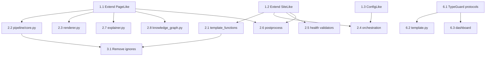

# Plan: Protocol-Driven Typing for ty Compliance

**RFC**: `plan/rfc-protocol-driven-typing.md`  
**Status**: Ready  
**Created**: 2026-01-17  
**Estimated Effort**: 10-12 hours

---

## Overview

Migrate Bengal from concrete type annotations (`Site`, `Page`, `Section`) to protocols (`SiteLike`, `PageLike`, `SectionLike`) to resolve 339 ty errors. The protocols already exist in `bengal/protocols/`—they're just not being used. This plan prioritizes high-impact protocol migration first, followed by mechanical fixes.

**Key phases**:
1. Extend protocols with missing attributes
2. Migrate core signatures to protocols (highest impact)
3. Remove stale `# type: ignore` comments
4. Guard `__file__` access patterns
5. Fix async override mismatches
6. Add TypeGuards for `hasattr` narrowing

---

## Phase 1: Protocol Extensions

Extend existing protocols to cover missing attributes before migration.

### Task 1.1: Extend PageLike Protocol with `metadata` and `tags`

**Subsystem**: Core  
**File**: `bengal/protocols/core.py`

**Changes**:
```python
@runtime_checkable
class PageLike(Protocol):
    # ... existing properties ...

    @property
    def metadata(self) -> dict[str, Any]:
        """Raw frontmatter/metadata dict for template access."""
        ...

    @property
    def tags(self) -> list[str] | None:
        """Tags for taxonomy filtering."""
        ...
```

**Tests**: `tests/unit/protocols/test_core.py`
- `test_pagelike_has_metadata_property`
- `test_pagelike_has_tags_property`

**Commit**:
```bash
git add -A && git commit -m "core: extend PageLike protocol with metadata and tags"
```

**Confidence Gate**: 90%

---

### Task 1.2: Extend SiteLike Protocol with `output_dir` and `dev_mode`

**Subsystem**: Core  
**File**: `bengal/protocols/core.py`

**Changes**:
```python
@runtime_checkable
class SiteLike(Protocol):
    # ... existing properties ...

    @property
    def output_dir(self) -> Path:
        """Build output directory."""
        ...

    @property
    def dev_mode(self) -> bool:
        """Whether site is in development mode."""
        ...
```

**Tests**: `tests/unit/protocols/test_core.py`
- `test_sitelike_has_output_dir_property`
- `test_sitelike_has_dev_mode_property`

**Commit**:
```bash
git add -A && git commit -m "core: extend SiteLike protocol with output_dir and dev_mode"
```

**Confidence Gate**: 90%

---

### Task 1.3: Add ConfigLike Protocol

**Subsystem**: Core  
**File**: `bengal/protocols/core.py`

**Changes**:
```python
@runtime_checkable
class ConfigLike(Protocol):
    """Protocol for dict-like config access."""

    def get(self, key: str, default: Any = None) -> Any:
        """Get config value with optional default."""
        ...

    def __getitem__(self, key: str) -> Any:
        """Get config value by key."""
        ...

    def __contains__(self, key: object) -> bool:
        """Check if key exists."""
        ...
```

Update `__all__` and `bengal/protocols/__init__.py` to export `ConfigLike`.

**Tests**: `tests/unit/protocols/test_core.py`
- `test_configlike_protocol_defined`
- `test_dict_satisfies_configlike`

**Commit**:
```bash
git add -A && git commit -m "core: add ConfigLike protocol for config access"
```

**Confidence Gate**: 90%

---

## Phase 2: Protocol Migration (HIGH IMPACT)

Migrate function signatures from concrete types to protocols. This phase fixes ~60-80 errors.

### Task 2.1: Migrate `rendering/template_functions/` to SiteLike

**Subsystem**: Rendering  
**Files**: `bengal/rendering/template_functions/*.py` (40+ files)  
**Depends on**: 1.1, 1.2

**Pattern**:
```python
# Before
from bengal.core import Site
def register_functions(env: TemplateEnvironment, site: Site) -> None:

# After
from bengal.protocols import SiteLike
def register_functions(env: TemplateEnvironment, site: SiteLike) -> None:
```

**High-priority files** (sorted by usage count):
1. `bengal/rendering/template_functions/get_page.py` (7 instances)
2. `bengal/rendering/template_functions/i18n.py` (6 instances)
3. `bengal/rendering/template_functions/version_url.py` (8 instances)
4. `bengal/rendering/template_functions/navigation/*.py` (12 instances)
5. All remaining files in `template_functions/`

**Commit**:
```bash
git add -A && git commit -m "rendering: migrate template_functions to SiteLike protocol"
```

**Confidence Gate**: 90%

---

### Task 2.2: Migrate `rendering/pipeline/core.py` to PageLike

**Subsystem**: Rendering  
**File**: `bengal/rendering/pipeline/core.py` (12 instances!)  
**Depends on**: 1.1

**Pattern**:
```python
# Before
from bengal.core.page import Page
def render_page(page: Page) -> str:

# After  
from bengal.protocols import PageLike
def render_page(page: PageLike) -> str:
```

**Commit**:
```bash
git add -A && git commit -m "rendering: migrate pipeline/core.py to PageLike protocol"
```

**Confidence Gate**: 90%

---

### Task 2.3: Migrate `rendering/renderer.py` to PageLike

**Subsystem**: Rendering  
**File**: `bengal/rendering/renderer.py` (7 instances)  
**Depends on**: 1.1

**Commit**:
```bash
git add -A && git commit -m "rendering: migrate renderer.py to PageLike protocol"
```

**Confidence Gate**: 90%

---

### Task 2.4: Migrate `orchestration/*.py` to SiteLike

**Subsystem**: Orchestration  
**Files**: `bengal/orchestration/*.py` (12 files)  
**Depends on**: 1.2

**High-priority files**:
1. `bengal/orchestration/section.py` (9 instances)
2. `bengal/orchestration/css_optimizer.py` (5 instances)
3. `bengal/orchestration/render/orchestrator.py` (3 instances)
4. `bengal/orchestration/build/__init__.py` (3 instances)
5. `bengal/orchestration/incremental/*.py` (cascading)

**Commit**:
```bash
git add -A && git commit -m "orchestration: migrate orchestrators to SiteLike protocol"
```

**Confidence Gate**: 90%

---

### Task 2.5: Migrate `health/validators/*.py` to SiteLike

**Subsystem**: Health  
**Files**: `bengal/health/validators/*.py` (15 files)  
**Depends on**: 1.2

**High-priority files**:
1. `bengal/health/validators/links.py` (8 instances)
2. `bengal/health/validators/navigation.py` (7 instances)
3. `bengal/health/validators/autodoc.py` (5 instances)
4. `bengal/health/validators/taxonomy.py` (5 instances)
5. `bengal/health/validators/output.py` (5 instances)

**Commit**:
```bash
git add -A && git commit -m "health: migrate validators to SiteLike protocol"
```

**Confidence Gate**: 90%

---

### Task 2.6: Migrate `postprocess/*.py` to SiteLike/PageLike

**Subsystem**: Postprocess  
**Files**: `bengal/postprocess/*.py` (8 files)  
**Depends on**: 1.1, 1.2

**Files**:
- `bengal/postprocess/social_cards.py` (5 instances Page)
- `bengal/postprocess/xref_index.py` (5 instances Site)
- `bengal/postprocess/output_formats/*.py` (various)

**Commit**:
```bash
git add -A && git commit -m "postprocess: migrate to PageLike/SiteLike protocols"
```

**Confidence Gate**: 90%

---

### Task 2.7: Migrate `debug/explainer.py` to PageLike

**Subsystem**: Debug  
**File**: `bengal/debug/explainer.py` (8 instances)  
**Depends on**: 1.1

**Commit**:
```bash
git add -A && git commit -m "debug: migrate explainer.py to PageLike protocol"
```

**Confidence Gate**: 85%

---

### Task 2.8: Migrate `analysis/graph/` to PageLike

**Subsystem**: Analysis  
**File**: `bengal/analysis/graph/knowledge_graph.py` (7 instances)  
**Depends on**: 1.1

**Commit**:
```bash
git add -A && git commit -m "analysis: migrate knowledge_graph.py to PageLike protocol"
```

**Confidence Gate**: 85%

---

### Task 2.9: Migrate `content_types/strategies.py` to SectionLike

**Subsystem**: Content  
**File**: `bengal/content_types/strategies.py` (7 instances)  
**Depends on**: 1.1, 1.2

**Commit**:
```bash
git add -A && git commit -m "content: migrate strategies.py to SectionLike protocol"
```

**Confidence Gate**: 85%

---

## Phase 3: Stale Ignore Comments

Remove 42 unused `# type: ignore` comments.

### Task 3.1: Remove Stale `# type: ignore` Comments

**Subsystem**: Multiple  
**Files**: 40+ files with `unused-ignore-comment` errors

**Approach**:
```bash
# Find all stale ignores
uv run ty check 2>&1 | grep "unused-ignore-comment"

# Then remove manually or via script
```

**Sample files**:
- `bengal/assets/js_bundler.py:89`
- `bengal/cli/base.py:242, 343`
- `bengal/cli/commands/collections.py:292`
- (37 more)

**Commit**:
```bash
git add -A && git commit -m "chore: remove 42 stale type: ignore comments"
```

**Confidence Gate**: 85%

---

## Phase 4: `__file__` Guards

Fix 14 instances where `module.__file__` may be `None`.

### Task 4.1: Guard `__file__` in `cli/commands/theme.py`

**Subsystem**: CLI  
**File**: `bengal/cli/commands/theme.py` (5 instances)

**Pattern**:
```python
# Before
pkg_dir = Path(bengal.__file__).parent / "themes"

# After
if bengal.__file__ is None:
    raise RuntimeError("Bengal package __file__ is None")
pkg_dir = Path(bengal.__file__).parent / "themes"
```

**Commit**:
```bash
git add -A && git commit -m "cli: guard __file__ access in theme.py"
```

**Confidence Gate**: 85%

---

### Task 4.2: Guard `__file__` in Remaining Files

**Subsystem**: Multiple  
**Files**:
- `bengal/build/detectors/template.py` (line 94)
- `bengal/assets/pipeline.py` (line 455)
- Other files with `Path(module.__file__)` patterns

**Commit**:
```bash
git add -A && git commit -m "chore: guard __file__ access across codebase"
```

**Confidence Gate**: 85%

---

## Phase 5: Async Override Fixes

Fix 5 async/sync override mismatches.

### Task 5.1: Fix `action_quit` Async Override

**Subsystem**: CLI  
**Files**:
- `bengal/cli/dashboard/base.py:123`
- `bengal/cli/dashboard/serve.py:501`

**Pattern**:
```python
# Before
def action_quit(self) -> None:
    self.exit()

# After
async def action_quit(self) -> None:
    self.exit()
```

**Commit**:
```bash
git add -A && git commit -m "cli: fix async override for action_quit"
```

**Confidence Gate**: 85%

---

## Phase 6: TypeGuard Functions for `hasattr` Narrowing

Fix 22 `call-non-callable` errors from `hasattr` not narrowing types.

### Task 6.1: Add TypeGuard Protocols to `bengal/protocols/capabilities.py`

**Subsystem**: Core  
**File**: `bengal/protocols/capabilities.py` (new file)

**Changes**:
```python
"""Capability protocols for hasattr-style type narrowing."""

from typing import Protocol, TypeGuard, runtime_checkable

@runtime_checkable
class HasClearTemplateCache(Protocol):
    def clear_template_cache(self, names: list[str]) -> None: ...

@runtime_checkable
class HasActionRebuild(Protocol):
    def action_rebuild(self) -> None: ...

@runtime_checkable
class HasConfigChangedSignal(Protocol):
    @property
    def config_changed_signal(self) -> object: ...

@runtime_checkable
class HasErrors(Protocol):
    @property
    def errors(self) -> list[object]: ...


def has_clear_template_cache(obj: object) -> TypeGuard[HasClearTemplateCache]:
    return hasattr(obj, "clear_template_cache") and callable(getattr(obj, "clear_template_cache", None))

def has_action_rebuild(obj: object) -> TypeGuard[HasActionRebuild]:
    return hasattr(obj, "action_rebuild") and callable(getattr(obj, "action_rebuild", None))

def has_errors(obj: object) -> TypeGuard[HasErrors]:
    return hasattr(obj, "errors")
```

Export from `bengal/protocols/__init__.py`.

**Tests**: `tests/unit/protocols/test_capabilities.py`
- `test_typeguard_narrows_to_callable`

**Commit**:
```bash
git add -A && git commit -m "core: add capability protocols with TypeGuard functions"
```

**Confidence Gate**: 90%

---

### Task 6.2: Apply TypeGuards to `build/detectors/template.py`

**Subsystem**: Build  
**File**: `bengal/build/detectors/template.py:142`

**Pattern**:
```python
# Before
if hasattr(engine, "clear_template_cache"):
    engine.clear_template_cache(template_names)  # Error!

# After
from bengal.protocols import has_clear_template_cache

if has_clear_template_cache(engine):
    engine.clear_template_cache(template_names)  # Works!
```

**Commit**:
```bash
git add -A && git commit -m "build: use TypeGuard for template cache clearing"
```

**Confidence Gate**: 85%

---

### Task 6.3: Apply TypeGuards to Dashboard Screens

**Subsystem**: CLI  
**Files**:
- `bengal/cli/dashboard/app.py:232`
- `bengal/cli/dashboard/screens.py:48,612`
- `bengal/collections/validator.py:289`

**Commit**:
```bash
git add -A && git commit -m "cli: use TypeGuards for dashboard capability checks"
```

**Confidence Gate**: 85%

---

## Phase 7: Protocol Self-Type Fixes

Fix 8 `Self@...` type mismatches in renderers.

### Task 7.1: Fix Self-Type Annotations in Patitas Renderers

**Subsystem**: Parsing  
**File**: `bengal/parsing/backends/patitas/renderers/html.py`

**Pattern**:
```python
# Before - explicit protocol annotation conflicts with Self
def _render_block(self: HtmlRendererProtocol, node: Block, sb: StringBuilder) -> None:

# After - let inheritance handle protocol conformance
def _render_block(self, node: Block, sb: StringBuilder) -> None:
```

**Commit**:
```bash
git add -A && git commit -m "parsing: remove explicit self-type annotations from renderers"
```

**Confidence Gate**: 85%

---

## Dependencies



---

## Quality Gates

| Phase | Subsystem | Required Confidence |
|-------|-----------|---------------------|
| 1 | Core (protocols) | 90% |
| 2 | Rendering/Orch | 90% |
| 3 | Multiple | 85% |
| 4 | CLI/Build | 85% |
| 5 | CLI | 85% |
| 6 | Core/Build/CLI | 85-90% |
| 7 | Parsing | 85% |

---

## Success Criteria

| Metric | Current | After Plan | Target |
|--------|---------|------------|--------|
| Total ty errors | 339 | ~160 | <100 |
| `unused-ignore-comment` | 42 | 0 | 0 |
| `call-non-callable` | 22 | <5 | 0 |
| Protocol adoption (Site) | 1 fn | ~120 fns | 80%+ |
| Protocol adoption (Page) | 2 fns | ~90 fns | 80%+ |

---

## Verification Commands

```bash
# Run ty check after each phase
uv run ty check 2>&1 | head -50

# Count remaining errors
uv run ty check 2>&1 | grep -c "error\["

# Run tests
uv run pytest tests/ -x -q

# Check specific error types
uv run ty check 2>&1 | grep "invalid-argument-type" | wc -l
```

---

## Checklist

- [x] All tasks have pre-drafted commits
- [x] Each task is atomic (one commit)
- [x] Dependencies are explicit
- [x] Type contracts come first (Phase 1)
- [x] Core tasks require 90% confidence
- [x] Integration tests defined
- [ ] Protocol extensions verified against concrete classes
- [ ] Full test suite passes after each phase
