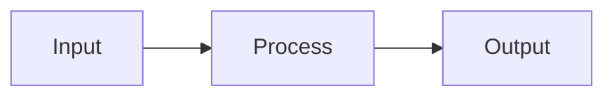
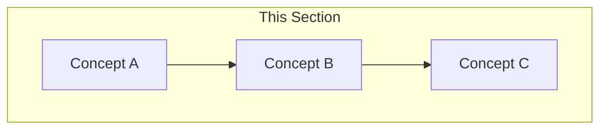
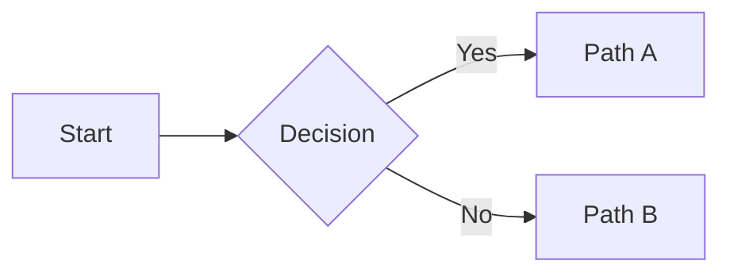
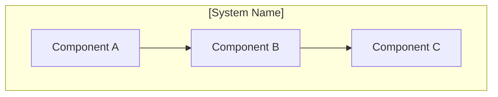
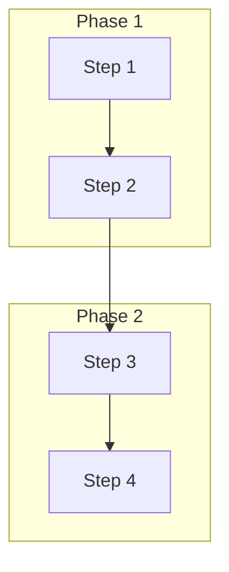
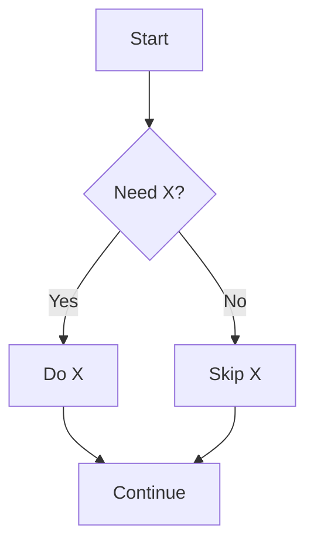
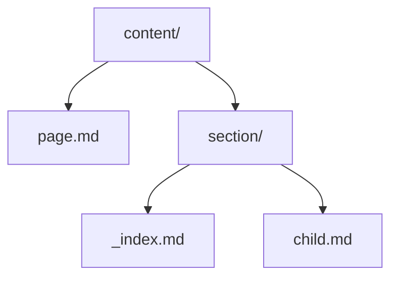

# Index Page Content Standard

> **Status**: Active  
> **Created**: 2025-01-03  
> **Scope**: All `_index.md` files in `site/content/`

---

## Executive Summary

Index pages (`_index.md`) serve as **wayfinding hubs** that help users orient themselves and find the right content. They should NOT duplicate information that the theme provides automatically (child page listings).

**Key Principles**:
1. **Progressive disclosure** — Layer information from essential → detailed
2. **Reduce cognitive overload** — Use directives to organize, not overwhelm
3. **Visual mental models** — Mermaid diagrams for flows and relationships
4. **No redundancy** — Theme provides child listings; index adds context

---

## What the Theme Provides (Don't Repeat)

The default theme automatically renders:

| Element | Auto-Generated | You Should NOT... |
|---------|----------------|-------------------|
| Child page tiles | ✅ Title, description, link | List children with descriptions |
| Subsection cards | ✅ Section title, description | Create "Sections" lists |
| Navigation sidebar | ✅ Full hierarchy | Add navigation links |
| Breadcrumbs | ✅ Path to current page | Show path manually |
| Page metadata | ✅ Tags, dates when configured | Repeat in content |

**Disable child tiles** when your content IS the reference (set `show_children: false` in frontmatter).

---

## Progressive Disclosure Layers

### Layer 1: Immediate Orientation (0-10 seconds)
**Goal**: User knows if they're in the right place

```markdown
# [Section Name]

Brief one-sentence description of what's here and who it's for.
```

### Layer 2: Wayfinding (10-30 seconds)
**Goal**: User finds the right path

Use **cards** or **"I want to..."** table:

```markdown
::::{cards}
:columns: 2
:gap: medium

:::{card} Path A
:link: ./child-a/
Brief description of this path
:::

:::{card} Path B  
:link: ./child-b/
Brief description of this path
:::
::::
```

Or task-oriented table:

```markdown
| I want to... | Go to... |
|--------------|----------|
| Do X | [Child A](./child-a/) |
| Do Y | [Child B](./child-b/) |
```

### Layer 3: Conceptual Grounding (30-120 seconds)
**Goal**: User understands the mental model

Use **mermaid diagrams** and collapsed details:

```markdown
## How It Works

Brief explanation (2-3 sentences max).



:::{dropdown} More Details
Extended explanation for users who want to go deeper.
:::
```

### Layer 4: Quick Reference (As Needed)
**Goal**: User gets immediate value without navigating away

Use **tabs** for alternatives, **code blocks** for quick wins:

````markdown
::::{tab-set}
:::{tab-item} Quick Start
```bash
bengal build
```
:::
:::{tab-item} Full Options
```bash
bengal build --environment production --strict
```
:::
::::
````

---

## Index Page Templates

### Template A: Top-Level Hub (docs/content/, docs/theming/, etc.)

```markdown
---
title: [Section Name]
description: [One-line value proposition]
weight: [order]
cascade:
  type: doc
---

# [Section Name]

[One sentence: What's in this section and who it's for.]

## Choose Your Path

::::{cards}
:columns: 2
:gap: medium

:::{card} [Path 1 Name]
:icon: [icon]
:link: ./path-1/
:color: blue

[Who this is for and what they'll learn/do]
:::

:::{card} [Path 2 Name]
:icon: [icon]
:link: ./path-2/
:color: green

[Who this is for and what they'll learn/do]
:::
::::

## Overview

[2-4 sentences explaining the domain. What problem does this solve?]



:::{tip}
[One actionable tip or "start here" recommendation]
:::
```

**Target length**: 40-80 lines  
**Auto-children**: Enabled (default)

---

### Template B: Conceptual Subsection (content/organization/, theming/templating/)

```markdown
---
title: [Subsection Name]
description: [What this covers]
weight: [order]
---

# [Subsection Name]

[One sentence explaining the scope.]

## Do I Need This?

:::{note}
**Skip this if**: [When they don't need this]  
**Read this if**: [When they do need this]
:::

## How It Works

[2-3 sentence explanation of the core concept.]



## Core Concepts

### [Concept 1]

[Brief explanation with example]

### [Concept 2]

[Brief explanation with example]

:::{dropdown} Advanced: [Topic]
[Extended content for power users]
:::
```

**Target length**: 60-120 lines  
**Auto-children**: Enabled

---

### Template C: Reference Hub (reference/, extending/)

```markdown
---
title: [Reference Section]
description: [What's documented here]
weight: [order]
---

# [Reference Section]

[One sentence: What kind of reference material is here.]

::::{cards}
:columns: 2
:gap: medium
:variant: explanation

:::{card} [Category 1]
:icon: [icon]
:link: ./category-1/
[Brief description]
:::

:::{card} [Category 2]
:icon: [icon]
:link: ./category-2/
[Brief description]
:::
::::

## Architecture Overview



:::{seealso}
- [Related Topic 1](link)
- [Related Topic 2](link)
:::
```

**Target length**: 40-80 lines  
**Auto-children**: Enabled

---

### Template D: Deep Content Index (sources/, collections/)

When the index page IS the primary documentation (not just a hub):

```markdown
---
title: [Topic]
description: [What this covers]
weight: [order]
show_children: false  # Content is self-contained
---

# [Topic]

[One sentence summary.]

## Do I Need This?

No. [Feature] is optional.

**Use this when**:
- [Use case 1]
- [Use case 2]

## Quick Start

```bash
# Minimal example
command --flag
```

## [Main Content Sections]

[Full documentation content...]

## See Also

- [Related 1](link) — Brief description
- [Related 2](link) — Brief description
```

**Target length**: 100-300 lines  
**Auto-children**: Disabled (`show_children: false`)

---

## Mermaid Diagram Guidelines

### When to Use Mermaid

| Scenario | Use Mermaid? | Diagram Type |
|----------|--------------|--------------|
| Multi-step workflow | ✅ Yes | `flowchart LR` or `sequenceDiagram` |
| Component relationships | ✅ Yes | `graph TB` with subgraphs |
| Decision tree | ✅ Yes | `flowchart` with `{decision}` |
| Simple list of features | ❌ No | Use bullet list or cards |
| Linear process (< 3 steps) | ❌ No | Use numbered list |
| State transitions | ✅ Yes | `stateDiagram-v2` |

### Diagram Style Guide

**Keep diagrams simple** (5-10 nodes max):


**Use subgraphs for grouping**:



**Show decision points clearly**:



---

## Directive Usage Guide

### Cards — For Path Selection

```markdown
::::{cards}
:columns: 2
:gap: medium

:::{card} Option A
:link: ./option-a/
:icon: file-text
:color: blue
Description
:::
::::
```

**Use when**: Multiple equally-valid paths, user chooses based on role/goal

### Tabs — For Alternatives

```markdown
::::{tab-set}
:::{tab-item} macOS
```bash
brew install bengal
```
:::
:::{tab-item} Linux
```bash
pip install bengal
```
:::
::::
```

**Use when**: Same goal, different approaches (OS, language, tool)

### Dropdown — For Progressive Disclosure

```markdown
:::{dropdown} Advanced Configuration
Extended content here...
:::
```

**Use when**: Content is helpful but not essential for most users

### Admonitions — For Callouts

```markdown
:::{tip}
Quick actionable advice
:::

:::{note}
Important context
:::

:::{warning}
Potential pitfall
:::
```

**Use sparingly** — One admonition per section max

### See Also — For Cross-References

```markdown
:::{seealso}
- [Related Topic](link) — Brief why
:::
```

**Use when**: Linking to related content outside this section

---

## Anti-Patterns to Avoid

### ❌ Don't: List Children with Descriptions

```markdown
## Sections

### [Templating](/docs/theming/templating/)
Jinja2 templating fundamentals...

### [Assets](/docs/theming/assets/)
The asset pipeline...
```

**Why**: Theme already renders this as tiles.

**Instead**: Use cards only if you need custom grouping or paths.

---

### ❌ Don't: Overload with Admonitions

```markdown
:::{note}
Note 1
:::

:::{tip}
Tip 1
:::

:::{warning}
Warning 1
:::

:::{important}
Important 1
:::
```

**Why**: Creates visual noise, reduces impact.

**Instead**: One admonition per logical section, max 2-3 per page.

---

### ❌ Don't: Repeat the Title as H1

```markdown
---
title: Content Organization
---

# Content Organization

Understanding how content is organized...
```

**Why**: Title is already rendered by template.

**Better**: Use a more specific H1 or skip straight to content:

```markdown
---
title: Content Organization
---

# How Bengal Organizes Content

Understanding the page → section → bundle model.
```

---

### ❌ Don't: Create Walls of Text

```markdown
Bengal provides a powerful content system that allows you to organize your content in a flexible hierarchy. Pages can be standalone files or organized into sections. Sections are directories containing an _index.md file. You can nest sections to any depth. Each section can have its own configuration that cascades to children...
```

**Why**: Hard to scan, high cognitive load.

**Instead**: Use structure:

```markdown
## Content Hierarchy

Bengal organizes content in three levels:

1. **Pages** — Individual `.md` files
2. **Sections** — Directories with `_index.md`
3. **Bundles** — Pages with co-located assets


```

---

## Checklist for Index Pages

### Before Writing

- [ ] Identify the tier (Hub, Subsection, Reference, Deep Content)
- [ ] List the user jobs-to-be-done for this section
- [ ] Identify if a diagram would clarify the mental model

### While Writing

- [ ] Layer 1 complete: Can user orient in 10 seconds?
- [ ] Layer 2 complete: Can user find the right path in 30 seconds?
- [ ] Layer 3 complete: Does user understand the concept?
- [ ] No children lists that duplicate auto-tiles
- [ ] Max 2-3 admonitions
- [ ] Diagram has < 10 nodes
- [ ] Code examples are minimal/actionable

### After Writing

- [ ] Total length within target for tier
- [ ] Build and verify auto-children display correctly
- [ ] Diagram renders correctly
- [ ] All links work

---

## Migration Strategy

### Phase 1: Top-Level Hubs
Refactor: `docs/content/`, `docs/theming/`, `docs/building/`, `docs/extending/`

### Phase 2: Subsections
Refactor: `content/organization/`, `theming/templating/`, etc.

### Phase 3: Deep Content
Review: `content/sources/`, `content/collections/` — may be fine as-is

### Phase 4: Reference
Refactor: `reference/architecture/`, `reference/directives/`

---

## Examples

See companion file: `plan/active/index-page-examples.md`
