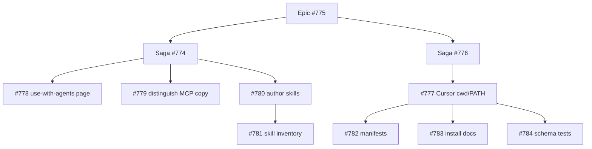

<!-- markdownlint-disable MD013 MD060 -->

# RFC + Plan: Bengal agent pack

**Status**: Draft (design frozen; status lives in GitHub)
**Created**: 2026-08-17
**GitHub**: Epic [#775](https://github.com/lbliii/bengal/issues/775) · Saga [#774](https://github.com/lbliii/bengal/issues/774) (Phase 1–2) · Saga [#776](https://github.com/lbliii/bengal/issues/776) (Phase 3, gated on [#777](https://github.com/lbliii/bengal/issues/777))
**Confidence**: 82%
**Category**: Docs / CLI packaging (no core, no build-phase change)

This file is design memory plus an actionable task list. It is not shipped
behavior. Do not document the pack as a product until Phase 3 lands.

**Related**:
[Agent Plugins 1.0.0](https://github.com/agentplugins/agent-plugins-spec/blob/main/spec/1.0.0.md),
`bengal/cli/milo_app.py`, `site/content/docs/ship/ai-native-output.md`,
`site/content/docs/ship/connect-to-ide.md`

---

## Executive Summary

Bengal already exposes the CLI as an MCP server (`bengal --mcp`) and already
emits site-level agent artifacts (`llms.txt`, `agent.json`). The missing work is
**author-facing documentation** and, later, a **portable Agent Plugins directory**
that wraps the existing stdio server plus a few site-author skills.

Do not generate a per-site Agent Plugin. Do not put `plugin.json` at the Bengal
repo root. Do not treat this as Foundation work.

---

## Decision

| Product | Verdict |
|---------|---------|
| **A. Bengal-the-tool pack** (`agent-plugin/` + public docs) | **Yes**, sequenced |
| **B. Generated per-site Agent Plugin** in `public/` | **No** until Bengal hosts a docs MCP |
| **C. Bengal as an Agent Plugins client** | **No** |

**Sequence (frozen):**

1. Document the CLI MCP that already exists.
2. Write 3–5 source-backed **site-author** skills.
3. Wrap them in `plugin.json` + `mcp.json` after one client install path is
   hand-verified (Cursor first).

Public name: **Bengal agent pack** (`bengal-agent`). Never call it a "Bengal
plugin" in user docs — that name is taken by `bengal.plugins` entry points
(`site/content/docs/build-sites/extend/plugins.md`).

---

## Problem Statement

### Current State

Three agent surfaces exist and are easy to confuse:

| Surface | Audience | Evidence |
|---------|----------|----------|
| Site AI-native output | Agents *reading* a published site | `README.md:27`; `bengal/postprocess/output_formats/agent_manifest_generator.py:4-6`; `site/content/docs/ship/ai-native-output.md:34-48` |
| Connect to IDE | Readers installing a *hosted docs* MCP | `site/content/docs/ship/connect-to-ide.md:31-56` — Bengal does **not** provide that server |
| CLI as MCP | People *authoring* a Bengal site | `bengal/cli/milo_app.py:45-50`; `docs/architecture/tooling/cli.md:68-73` |

`--mcp`, `--mcp-install`, `--mcp-uninstall`, and `--llms-txt` are registered
root flags. Architecture docs mention them. **Public site docs do not**
(`site/content/docs/` has no `--mcp` / `--llms-txt` hits). Connect-to-IDE says
"Bengal does not ship an MCP server" (`connect-to-ide.md:56`) — true for
published-site MCP, misleading once the CLI server is documented.

Contributor `AGENTS.md` files and `.cursor/rules/` teach agents working *on
Bengal*. Scaffolds copy none of that into new sites (`bengal/scaffolds/`).

Agent Plugins 1.0.0 (published 2026-08-06) is a directory with `plugin.json`,
optional `skills/`, and optional `mcp.json`. Launch clients: Cursor, VS Code,
Copilot, ChatGPT/Codex, Kiro. Claude Code is not in. v1 has no portable trust
model, secrets, or registry.

### Pain Points

- Site authors cannot discover `bengal --mcp` from public docs.
- Connect-to-IDE copy will be wrong the moment we mention the CLI server
  without a clarification.
- Author skills do not exist; contributor stewards are the wrong content to wrap.
- `--mcp-install` is Milo-gateway-only. Agent Plugins is the portable equivalent
  for Cursor / VS Code / Codex.

### Impact

Authors using Cursor (house IDE) or VS Code cannot install Bengal as a portable
agent pack. Readers of published docs are unaffected; they already have
`llms.txt` / `agent.json` / connect-to-ide.

---

## Goals and Non-Goals

### Goals

1. Public docs name `--mcp`, `--mcp-install`, `--mcp-uninstall`, and
   `--llms-txt`, each tracing to `bengal/cli/milo_app.py:45-50`.
2. Connect-to-IDE no longer implies Bengal has no MCP of any kind.
3. Three surfaces (site artifacts / hosted docs MCP / CLI MCP) are distinguished
   in one table on the new page and cross-linked from AI-native output.
4. 3–5 author skills claim only commands and config keys that exist in source.
5. Optional `agent-plugin/` pack validates against Agent Plugins 1.0.0 and
   points `mcp.json` at `bengal --mcp`. Not in the wheel.

### Non-Goals

1. New MCP server, new Milo transport, or new CLI flags.
2. New build phase or `bengal.plugins` hook.
3. Generated `plugin.json` in site output.
4. Translating steward `AGENTS.md` / `.cursor/rules/` into skills.
5. `plugin.json` at the Bengal repo root (wrong audience while hacking the engine).
6. npm / `npx plugins add` distribution (fights the pure-Python north star).
7. Claude Code marketplace, OAuth, or a hosted docs MCP.
8. Foundation / incremental / shard work (`plan/foundation.md`, #742).

---

## Design Options (accepted)

| Option | Verdict |
|--------|---------|
| A. Do nothing | Rejected — leaves `--mcp` undocumented |
| B. Docs + skills only | **Phase 1–2** |
| C. Optional `bengal-agent` pack | **Phase 3**, gated |
| D. Generate Agent Plugins from site builds | Rejected until a site MCP exists |
| E. Bengal loads Agent Plugins | Rejected |

---

## Architecture Impact

| Subsystem | Impact | Changes |
|-----------|--------|---------|
| `bengal/core/` | None | — |
| `bengal/orchestration/` | None | — |
| `bengal/rendering/` | None | — |
| `bengal/cache/` | None | — |
| `bengal/cli/` | None (runtime) | Flags already exist; no new registration |
| `bengal/plugins/` | None | Different product; do not reuse the name |
| `site/content/` | High | New page + copy fixes + cross-links |
| `docs/architecture/` | Low | Already documents Milo MCP; keep as contributor surface |
| `agent-plugin/` | New (Phase 2–3) | Skills, then manifest. **Not** package data |
| `tests/` | Medium | Help/docs parity; skill invocation inventory; schema checks |
| Wheel / `pyproject.toml` | None | Pack stays out of the installed package |

---

## Target layout (Phase 3)

```text
agent-plugin/                 # repo root, not bengal/, not site output
├── plugin.json               # name: bengal-agent
├── mcp.json                  # stdio → bengal --mcp
├── README.md                 # install for Cursor first
└── skills/
    ├── write-content/
    │   └── SKILL.md
    ├── configure-site/
    │   └── SKILL.md
    ├── check-and-fix/
    │   └── SKILL.md
    └── scaffold-site/
        └── SKILL.md
```

`mcp.json` (intent, not shipped until Phase 3):

```json
{
  "$schema": "https://agent-plugins.org/schemas/1.0.0/mcp.schema.json",
  "mcpServers": {
    "bengal": {
      "type": "stdio",
      "command": "bengal",
      "args": ["--mcp"]
    }
  }
}
```

`command` is a bare executable token (spec §7.2.1). Resolution uses the
platform `PATH`. Do not bundle a Python venv inside the pack. Do not use
`npx`. Working directory defaults to the plugin root; authors run this from a
site repo, so document that the client’s workspace — not `PLUGIN_ROOT` — is
where `bengal build` should run. If Cursor’s install always sets cwd to the
plugin root, Phase 3 must set `"cwd"` only to a form the spec allows
(`${PLUGIN_ROOT}` / `${PLUGIN_DATA}` / `./…`) **or** omit cwd and tell the
skill to pass the site path explicitly. **Open question O1** — resolve during
the Cursor install spike, not in the docs PR.

---

## Phase 1: Document the CLI MCP

**Saga-sized.** No runtime change. Effort: s.

### Task 1.1: New public page — three surfaces

**Subsystem**: Docs
**File**: `site/content/docs/ship/use-with-agents.md`

**Changes**:
- Title/nav that does **not** say "plugin".
- Table distinguishing site artifacts / hosted docs MCP / CLI MCP.
- Commands copied from help text, not invented:
  - `bengal --mcp`
  - `bengal --mcp-install` / `bengal --mcp-uninstall` (Milo gateway)
  - `bengal --llms-txt`
- What `--mcp` is: Milo exposes the registered command tree over stdio
  JSON-RPC. Point at `bengal/cli/milo_app.py:45-50` in the plan/PR, not in
  user prose.
- What it is not: not a docs-site MCP, not `bengal.plugins`, not Agent
  Plugins (until Phase 3).
- Prerequisites: `bengal` on `PATH` (same as any CLI).
- Cross-links: AI-native output, Connect to IDE, Writing Plugins (name collision).

**Tests**:
- `tests/unit/cli/test_cli_contract_inventory.py` already scans `bengal …`
  snippets in README and architecture CLI docs. Extend the same helper to
  `site/content/docs/ship/use-with-agents.md` (and any new snippet file).
- Add `--mcp` / `--mcp-install` / `--mcp-uninstall` / `--llms-txt` to a
  public-docs flag assertion (today `tests/` has **zero** `--mcp` hits).

**Commit**: `docs: document bengal --mcp for site authors`

**Confidence gate**: 85%

---

### Task 1.2: Fix Connect-to-IDE and AI-native copy

**Subsystem**: Docs
**Depends on**: 1.1 (same PR is fine; same commit if the page exists)

**Files**:
- `site/content/docs/ship/connect-to-ide.md:56` — replace "Bengal does not
  ship an MCP server" with: Bengal does not ship an MCP server **for your
  published docs**. The CLI can run as an MCP server for authors — link
  Task 1.1.
- `site/content/docs/ship/ai-native-output.md` — short "related" note: these
  files are for agents *reading the site*; authors who want the CLI in an
  IDE should use the new page.
- `site/content/docs/ship/_index.md:71` — add a quick-ref row next to
  Connect to IDE.
- `site/content/docs/build-sites/extend/plugins.md` — one sentence: Python
  entry-point plugins are not Agent Plugins / not the CLI MCP.

**Global sweep** (required — this is a P0 copy correction):

```bash
rg -n "does not ship an MCP|Bengal does not provide the MCP" \
  site/content/ README.md CONTRIBUTING.md CHANGELOG.md docs/ plan/
```

**Commit**: `docs: distinguish CLI MCP from site MCP`

---

### Task 1.3: Changelog fragment (docs-only)

**Subsystem**: Docs / release
**File**: `changelog.d/+cli-mcp-docs.added.md` (or `<issue>.added.md` once
the saga exists)

User-facing line, no plan-file names:

> Public docs now describe `bengal --mcp`, `--mcp-install`, and `--llms-txt`
> so coding agents can drive the Bengal CLI.

**Proof**: `uv run poe changelog-lint`

**Commit**: include in 1.1 or 1.2; do not split a one-line fragment.

---

## Phase 2: Author skills

**Same saga as Phase 1, later commits.** Effort: s–m.

Skills live under `agent-plugin/skills/` from the first skill commit so Phase 3
is only a manifest. Do **not** add `plugin.json` yet (avoids clients loading
an incomplete pack).

### Task 2.0: Skill contract (types-as-contracts analogue)

Each `SKILL.md` MUST:

1. Use Agent Skills frontmatter: `name`, `description` (when to trigger).
2. Claim only commands that resolve in the Milo registry
   (`cli.walk_commands()` / root flags in `milo_app.py`).
3. Claim only config keys that exist in schema / `site/content/docs/ship/configuration/reference.md`.
4. Mark unknowns as `TODO` — never invent flags.
5. Address **site authors**, not Bengal contributors. No steward vocabulary,
   no `::research`, no Foundation / saga language.

**Rejected skill topics**: incremental provenance, shard builds, mixin history,
import-linter, ty floors.

### Task 2.1: `scaffold-site`

**File**: `agent-plugin/skills/scaffold-site/SKILL.md`

Cover `bengal new site` and the preset list only as it appears in
`README.md` / `bengal new site --help`. Point at
`site/content/docs/get-started/`.

**Commit**: `docs: add scaffold-site author skill`

### Task 2.2: `write-content`

**File**: `agent-plugin/skills/write-content/SKILL.md`

Frontmatter fields, MyST directives, and page creation via `bengal new page`
— only constructs documented in `site/content/docs/build-sites/write/` and
`site/content/docs/reference/directives/`.

**Commit**: `docs: add write-content author skill`

### Task 2.3: `configure-site`

**File**: `agent-plugin/skills/configure-site/SKILL.md`

`bengal.toml` / config-dir keys that exist. Output formats and Content
Signals by reference to `ai-native-output.md` and configuration reference.
No invented keys.

**Commit**: `docs: add configure-site author skill`

### Task 2.4: `check-and-fix`

**File**: `agent-plugin/skills/check-and-fix/SKILL.md`

`bengal check`, `bengal fix`, `bengal audit` as they exist in help. Failure
→ read the error, do not invent health codes.

**Commit**: `docs: add check-and-fix author skill`

### Task 2.5: Skill invocation inventory test

**Subsystem**: Tests
**File**: `tests/unit/docs/test_agent_plugin_skills.py` (or extend
`test_cli_contract_inventory.py`)

Reuse the `bengal <subcommand>` snippet scanner from
`tests/unit/cli/test_cli_contract_inventory.py:17-43`. Scan every
`agent-plugin/skills/**/SKILL.md`. Fail on unregistered commands.

**Commit**: `tests: inventory bengal commands in author skills`

---

## Phase 3: Package `bengal-agent`

**Follow-up saga. Do not start until the gate below is green.** Effort: s.

### Gate (manual-confirmation-needed)

On a machine with Cursor (or current house client):

1. Install a **minimal** local plugin (`plugin.json` + one hello skill +
   `mcp.json` → `bengal --mcp`) from a directory path.
2. Record: install UI path, whether `bengal` on `PATH` is enough, what cwd
   the stdio server gets, and whether tools from the Milo tree appear.
3. Write the answers into this file under [Open Questions](#open-questions)
   (O1, O2) before implementing Task 3.1.

If the client cannot load a directory plugin yet, **stop**. Keep Phase 2
skills as files; do not ship a fake install story.

### Task 3.1: Manifests

**Files**: `agent-plugin/plugin.json`, `agent-plugin/mcp.json`

- `$schema` values exactly as spec 1.0.0.
- `name`: `bengal-agent` (charset / length per spec §5.5).
- `mcpServers.bengal`: `type: stdio`, `command: bengal`, `args: ["--mcp"]`.
- No secrets in `env` or `headers`.
- No `extensions` until a Cursor-specific need is proven.

**Commit**: `docs: add bengal-agent plugin manifest`

### Task 3.2: Pack README + public install section

**Files**:
- `agent-plugin/README.md` — directory install, Cursor first, PATH note.
- `site/content/docs/ship/use-with-agents.md` — add an "Agent pack" section
  **only after** the gate. Do not mention Agent Plugins in Phase 1.

**Commit**: `docs: document bengal-agent install`

### Task 3.3: Schema / contract tests

**File**: `tests/unit/docs/test_agent_plugin_manifest.py`

- `plugin.json` is JSON, has required `$schema` and `name`, name matches
  §5.5, no unknown top-level keys we care about.
- `mcp.json` has matching schema version, one stdio server, `command` is
  `bengal`, `args == ["--mcp"]`.
- Vendor a **local copy** of the 1.0.0 schemas under
  `tests/unit/docs/fixtures/agent-plugins/` if validating with a JSON Schema
  library already in the test env. **Do not** fetch schemas at test time
  (spec §5.2: clients must not retrieve schemas while loading; our tests
  should not either).
- Do **not** add a runtime dependency for this.

**Commit**: `tests: validate bengal-agent manifests`

### Task 3.4: Changelog

`changelog.d/<issue>.added.md`:

> You can install a Bengal agent pack so compatible coding agents load
> author skills and the `bengal --mcp` server from one directory.

**Commit**: with 3.2.

---

## Phase 4: Explicitly not now

Track as GitHub issues only if they start getting requested. Do not fold
into Phase 1–3.

| Item | Why not now |
|------|-------------|
| Generated per-site Agent Plugin | No hosted docs MCP; `agent.json` + `llms.txt` + connect-to-ide already cover discovery |
| `plugin.json` at Bengal repo root | Loads author skills while developing the engine |
| Copying skills into `bengal new` scaffolds | Premature until the pack is real and wanted |
| Wheel / package-data inclusion | Agent Plugins is a directory, not a Python extra |
| Claude Code marketplace | Out of v1 client list |
| Site MCP server | Separate product; Stop-and-Ask (new runtime + public contract) |

---

## Dependencies



`#778` `#779` `#780` are path-disjoint and `lifecycle-ready` (safe to `drive` in parallel).
`#781` waits on `#780`. `#782` `#783` `#784` wait on `#777`.

---

## Quality Gates

| Phase | Required confidence | Proof |
|-------|---------------------|-------|
| 1 | 85% | `uv run pytest tests/unit/cli/test_cli_contract_inventory.py tests/unit/docs/ -q`; `rg` sweep; `poe changelog-lint` |
| 2 | 85% | Skill inventory test green; no invented flags |
| 3 | 85% + gate | Manifest tests; **manual-confirmation-needed** Cursor install note in the PR |

No `bengal/core/` changes → no 90% core gate.
No `make test` full suite required beyond the scoped tests unless a later
commit touches runtime.

---

## Risks and Mitigations

| Risk | L | I | Mitigation |
|------|---|---|------------|
| Connect-to-IDE "no MCP server" copy stays wrong | H | H | Task 1.2 + Global Sweep in the same PR |
| Name collision with `bengal.plugins` | H | M | Public name is "agent pack" / `bengal-agent` |
| Spec / client install UX still moving (11 days old at plan time) | M | M | Phase 3 gated on a real Cursor install |
| `bengal` not on PATH inside the client | M | H | Document PATH; gate records actual behavior (O2) |
| cwd is plugin root, not the site | M | H | O1; skills pass site path if needed |
| Skills drift from CLI | M | M | Inventory test (Task 2.5) |
| Pack lands in the wheel by accident | L | M | Keep `agent-plugin/` out of package-data; do not add to `pyproject.toml` |
| Docs-ahead (advertise pack before it exists) | H | H | Phase 1 page must not mention Agent Plugins |

---

## Open Questions

- [x] **O1.** What cwd does Cursor give a stdio server from `mcp.json`? Decide
      whether skills must pass `--config` / a site path.
      **Decided (#777 O1-B):** omit `cwd` (plugin root). Skills pass a site path.
- [x] **O2.** Is `command: "bengal"` enough, or do we need a documented
      `uv run bengal --mcp` story? Spec forbids shell command strings in
      `command`, so a uv wrapper would be a bundled `./` script, not
      `uv run …`.
      **Decided (#777 O2-A):** PATH `bengal`, `args: ["--mcp"]`. No `uv run`.
- [ ] **O3.** Keep `--mcp-install` (Milo gateway) in public docs long-term, or
      treat it as a contributor/advanced footnote once the pack exists?
      Default: keep both; they are different clients.
- [ ] **O4.** After Phase 3, should `bengal new site` offer an opt-in copy of
      the pack? Default: **no** until authors ask.

O1 and O2 block Phase 3 only. Phase 1–2 can ship without them.

---

## Issue shape

Issue tree is minted. Workers claim only `task` + `lifecycle-ready`.

| Kind | Issue |
|------|-------|
| Epic | #775 |
| Saga Phase 1–2 | #774 |
| Saga Phase 3 | #776 |
| Investigation (O1/O2) | #777 |
| Tasks (ready) | #778 #779 #780 |
| Tasks (blocked) | #781 (on #780); #782 #783 #784 (on #777) |

Ready leases: `#778` `#779` `#780`. Do not `claim` `#781` until `#780` closes.
Do not triage `#782` `#783` `#784` until `#777` closes.

---

## Steward Notes

| Steward | How invariants are protected |
|---------|------------------------------|
| Site (`site/AGENTS.md`) | Every flag traces to `milo_app.py`; no aspirational Agent Plugins claims in Phase 1 |
| CLI (`bengal/cli/AGENTS.md`) | No new flags; help text stays source |
| Plugins (`bengal/plugins/AGENTS.md`) | Untouched; docs call out the name collision |
| Postprocess | Untouched; no generated pack |
| Changelog | Fragment is user-observable (`bengal --mcp` in docs) |
| Plan | This file; Phase 3 stays gated; not-now stays in the table |

---

## Checklist

- [x] Problem statement has evidence (`file:line`)
- [x] Options analyzed; recommendation frozen
- [x] Architecture impact documented
- [x] Risks + mitigations
- [x] Tasks are atomic with pre-drafted commits
- [x] Dependencies explicit
- [x] Not-now bounded
- [x] GitHub tree minted (#775 epic, #774/#776 sagas, #777 investigation, #778–#784 tasks)
- [ ] Phase 3 gate filled (O1, O2) — #777

---

## Next

1. `drive epic #775` or `claim #778` / `#779` / `#780`.
2. Do not `claim` Phase 3 tasks until #777 closes.
