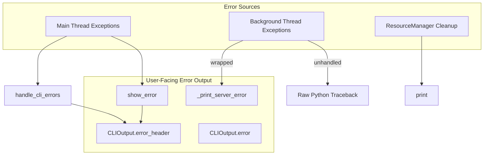

# RFC: Developer Experience — Graceful Error Communication

## Status: Draft
## Created: 2026-03-09
## Origin: Audit of DX gaps following server port-in-use traceback fix

---

## Summary

**Problem**: Background threads emit raw Python tracebacks when they fail; the dev server and ResourceManager use ad-hoc `print()` instead of the unified error display system. This produces ugly, inconsistent output that degrades the developer experience.

**Solution**:
1. Wrap all background thread targets to catch exceptions and display errors gracefully (no tracebacks).
2. Route dev server and ResourceManager output through CLIOutput / show_error for consistent formatting.

**Priority**: Medium (UX polish, low implementation cost)
**Scope**: ~80 LOC changes across 3 files

---

## Evidence: Current State

### Architecture

**Canonical error display**: `show_error(msg)` → `CLIOutput().error_header(msg)` (Rich panel or bold red). Build failures, hook failures, and subprocess build results use this path.

**Bypass**: Direct `print()` in `bengal/server/dev_server.py` (stale process, port-in-use, shutdown) and `bengal/server/resource_manager.py` (cleanup errors, shutdown timeout) bypass CLIOutput.

### Thread Inventory

| Location | Target | Exception Handling | Risk |
|----------|--------|--------------------|------|
| `bengal/server/dev_server.py:272` | `_run_server` | Wrapped (fixed) | None |
| `bengal/server/dev_server.py:1201` | `open_browser` | None | webbrowser.open can raise |
| `bengal/server/resource_manager.py:175,185` | `s.shutdown` | None in target | shutdown() can raise |

### print() vs show_error / CLIOutput

| File | Line(s) | Purpose |
|------|---------|---------|
| `dev_server.py` | 299, 383 | "Shutting down server..." on KeyboardInterrupt |
| `dev_server.py` | 490, 495 | Cache validation messages |
| `dev_server.py` | 885-896, 912-917, 930, 960 | Stale process / port-in-use messages |
| `resource_manager.py` | 179-181, 190-193, 215-216, 311-312, 323, 345 | Cleanup messages (shutdown timeout, errors) |

### Precedent: Server Thread Fix

The server thread (`_run_server`) was recently fixed to wrap `backend.start()` in try/except, catch OSError and other exceptions, and display a friendly Rich panel via `_print_server_error()` instead of a raw traceback. This RFC extends that pattern to the remaining threads and output sites.

---

## Problem Analysis

### 1. Unprotected Background Threads

**open_browser** (`dev_server.py:1190-1201`):
- `webbrowser.open()` can raise (no browser installed, permission denied, headless environment).
- Thread is fire-and-forget; unhandled exception produces full traceback.

**shutdown threads** (`resource_manager.py:175, 185`):
- `s.shutdown()` runs in a daemon thread; if it raises, Python prints "Exception in thread Thread-N".
- The outer `except Exception` in cleanup does catch errors from the main cleanup flow, but the thread target itself has no wrapper—exceptions in the thread bypass that.

**Python default**: Unhandled exceptions in threads are printed to stderr with full traceback via `threading.excepthook` (or the default handler).

### 2. Inconsistent Output

- **ResourceManager cleanup**: 6 `print()` sites for errors and timeouts. Uses `get_icons()` but bypasses CLIOutput (no Rich panel, no TTY detection).
- **dev_server stale process**: 12+ `print()` lines that could be one Rich panel.
- **dev_server port-in-use**: Mix of print and icons in `_create_server`; could use `_print_server_error`-style panel for consistency.

### 3. Duplication

- `_print_server_error` in dev_server uses Rich Panel directly; `show_error` uses CLIOutput (TTY-aware, supports plain fallback).
- Two parallel paths for "prominent error" display. Proposal: unify via shared helper or extend CLIOutput.

---

## Solution Options

### Option A: Minimal (Thread Wrapping Only)

- Wrap `open_browser` and shutdown targets in try/except.
- On exception: `logger.warning` + optional one-line user message (browser: "Could not open browser"; shutdown: suppress in target, rely on outer catch).
- Effort: Low (~20 LOC)

### Option B: Full Consistency (Recommended)

- Wrap threads (Option A).
- Replace ResourceManager `print()` with `CLIOutput().warning()` or `show_error(..., show_art=False)`.
- Add `_print_stale_process_panel()` in dev_server to consolidate stale-process output.
- Route port-in-use in `_create_server` through shared helper (reuse `_print_server_error` pattern or show_error).
- Effort: Medium (~60 LOC)

### Option C: Shared Error Panel Helper

- Extract `_print_server_error` pattern to `bengal/output/` or `bengal/orchestration/stats/helpers.py` as `show_error_panel(title, message, style="error")`.
- Use for server errors, stale process, port-in-use, cleanup errors.
- Ensures Rich panels everywhere; CLIOutput remains for inline/header use.
- Effort: Medium+ (~80 LOC)

---

## Implementation Phases

### Phase 1: Thread Safety (High Priority)

1. **open_browser** (`dev_server.py`):
   - Wrap in try/except; on failure: `logger.warning` + `cli.warning("Could not open browser")`.
   - Fire-and-forget, non-fatal; server continues.

2. **shutdown thread** (`resource_manager.py`):
   - Wrap target: `def _safe_shutdown(s): try: s.shutdown(); except Exception: pass`.
   - Errors already surface via outer `except Exception` in cleanup which prints. Wrapping prevents traceback from thread; avoid double-reporting.

### Phase 2: Output Consistency (Medium Priority)

1. Replace ResourceManager `print()` with `CLIOutput().warning()`.
2. Consolidate dev_server stale-process block into `_print_stale_process_panel()`.

### Phase 3: Shared Helper (Optional)

1. Extract `show_error_panel(title, message)` for Rich panel errors.
2. Migrate `_print_server_error` to use it.

---

## Files to Modify

| File | Changes |
|------|---------|
| `bengal/server/dev_server.py` | Wrap open_browser; add _print_stale_process_panel; optionally refactor port messages |
| `bengal/server/resource_manager.py` | Wrap shutdown target; replace print with CLIOutput |
| `bengal/orchestration/stats/helpers.py` or `bengal/output/core.py` | Optional: add show_error_panel |

---

## Testing

- Unit test: open_browser thread catches exception (mock webbrowser.open to raise).
- Unit test: shutdown thread catches exception.
- Manual: verify no traceback when port in use, stale process, browser open fails.

---

## Open Questions for Review

1. **Shutdown thread**: Should shutdown failures surface to the user at all? Currently the outer `except Exception` prints. Wrapping the target only prevents the thread from re-raising and producing a traceback. Keep existing print or switch to CLIOutput?

2. **Browser failure**: Fatal vs non-fatal? Recommendation: non-fatal (warning only); server continues.

3. **Shared helper location**: `bengal/orchestration/stats/helpers.py` (with show_error) vs new `bengal/output/panels.py`?
