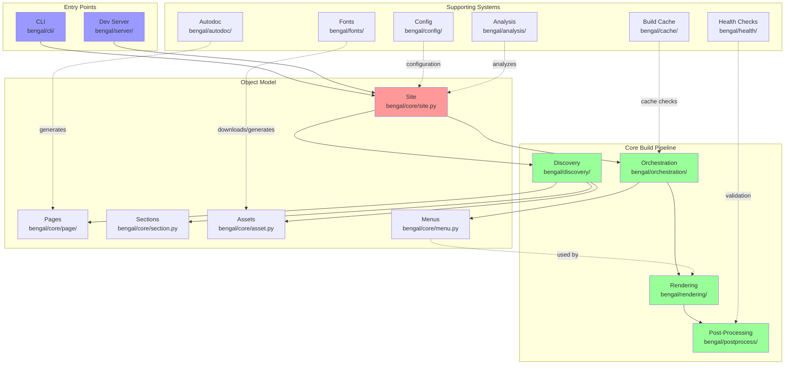

# Architecture Overview

Bengal SSG follows a modular architecture with clear separation of concerns to avoid "God objects" and maintain high performance even with large sites.

::::{cards}
:columns: 2
:gap: medium

:::{card} Core Architecture
:icon: cpu
:link: core/
:color: blue

The brain of Bengal. Data models, build coordination, and core principles.
:::

:::{card} Rendering Pipeline
:icon: layers
:link: rendering/
:color: green

From Markdown to HTML. Discovery, parsing, templates, and post-processing.
:::

:::{card} Subsystems
:icon: package
:link: subsystems/
:color: purple

Specialized features like Autodoc, Analysis, Health Checks, and Fonts.
:::

:::{card} Tooling & CLI
:icon: terminal
:link: tooling/
:color: orange

Developer tools, CLI commands, server, and configuration.
:::

:::{card} Meta & Operations
:icon: settings
:link: meta/
:color: gray

Performance, testing, file organization, and extension points.
:::
::::

## High-Level Architecture

**Key Flows:**
1. **Build**: CLI → Site → Discovery → Orchestration → [Menus + Rendering] → Post-Process
2. **Menu Building**: Orchestration builds menus → Rendering uses menus in templates
3. **Cache**: Build Cache checks file changes and dependencies before rebuilding
4. **Autodoc**: Generate Python/CLI docs → treated as regular content pages
5. **Dev Server**: Watch files → trigger incremental rebuilds → serve output

## Recent Improvements (2025-10)

::::{cards}
:columns: 1
:gap: small
:variant: explanation

:::{card} Dependency Injection
:icon: git-merge
Introduced `BuildContext` to pass shared state and services through orchestrators without globals or mutation.
:::

:::{card} Output Decoupling
:icon: activity
Standardized progress output via `ProgressReporter` protocol with Rich adapter.
:::

:::{card} Hardened Output
:icon: shield
Variable substitution restores escaped placeholders to prevent template syntax leakage.
:::
::::
