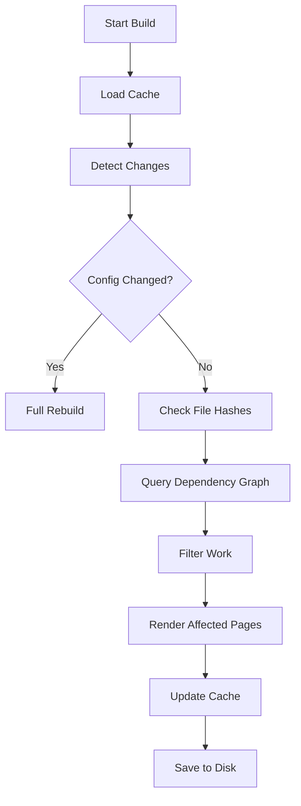

# Cache System

Bengal implements an intelligent caching system that enables sub-second incremental rebuilds.

## How It Works

The build cache (`.bengal-cache.json`) tracks the state of your project to determine exactly what needs to be rebuilt.



## Caching Strategies

::::{tab-set}
:::{tab-item} File Hashing
**Change Detection**

We use **SHA256** hashing to detect file changes.
- Content files (`.md`)
- Templates (`.html`, `.jinja2`)
- Config files (`.toml`)
- Assets (`.css`, `.js`)
:::

:::{tab-item} Dependency Graph
**Impact Analysis**

We track relationships to know what to rebuild.
- **Page → Template**: If `post.html` changes, rebuild all blog posts.
- **Tag → Pages**: If `python` tag changes, rebuild `tags/python/` page.
- **Page → Partial**: If `header.html` changes, rebuild everything.
:::

:::{tab-item} Inverted Index
**Taxonomy Lookup**

We store an inverted index of tags to avoid parsing all pages.
- **Stored**: `tag_to_pages['python'] = ['post1.md', 'post2.md']`
- **Benefit**: O(1) lookup for taxonomy page generation.
:::
::::

## The "No Object References" Rule

:::{card} Architecture Principle
**Never persist object references across builds.**
:::

The cache **only** stores:
1.  File paths (strings)
2.  Hashes (strings)
3.  Simple metadata (dicts/lists)

This ensures cache stability. When a build starts, we load the cache and **reconstruct** the relationships with fresh live objects.

## Cacheable Protocol

To enforce safety, we use a `Cacheable` protocol.

```python
class Cacheable(Protocol):
    def to_cache_dict(self) -> dict:
        """Return JSON-serializable data only."""
        ...

    @classmethod
    def from_cache_dict(cls, data: dict) -> T:
        """Reconstruct object from data."""
        ...
```

This prevents accidental pickling of complex objects that might break across versions.
