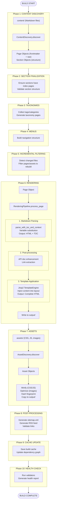

## Complete Build Pipeline (from build.py)

```mermaid
flowchart TD
    Start([BUILD START]) --> P1

    subgraph P1 [Phase 1: CONTENT DISCOVERY]
        direction TB
        P1_In["content/ (Markdown files)"] --> P1_Disc[ContentDiscovery.discover]
        P1_Disc --> P1_Out["Page Objects (frontmatter + raw)<br/>Section Objects (structure)"]
    end

    P1 --> P2

    subgraph P2 [Phase 2: SECTION FINALIZATION]
        direction TB
        P2_Proc["Ensure sections have index pages<br/>Validate section structure"]
    end

    P2 --> P3

    subgraph P3 [Phase 3: TAXONOMIES]
        direction TB
        P3_Proc["Collect tags/categories<br/>Generate taxonomy pages"]
    end

    P3 --> P4

    subgraph P4 [Phase 4: MENUS]
        P4_Proc[Build navigation structure]
    end

    P4 --> P5

    subgraph P5 [Phase 5: INCREMENTAL FILTERING]
        direction TB
        P5_Proc["Detect changed files<br/>Filter pages/assets to rebuild"]
    end

    P5 --> P6

    subgraph P6 [Phase 6: RENDERING]
        direction TB
        P6_In[Page Object] --> P6_Pipe[RenderingPipeline.process_page]

        subgraph P6_S1 [1. Markdown Parsing]
            P6_S1_Proc["parse_with_toc_and_context<br/>Variable substitution<br/>Output: HTML + TOC"]
        end

        subgraph P6_S2 [2. Post-processing]
            P6_S2_Proc["API doc enhancement<br/>Link extraction"]
        end

        subgraph P6_S3 [3. Template Application]
            P6_S3_Proc["Jinja2 TemplateEngine<br/>Inject content into layout<br/>Output: Complete HTML"]
        end

        P6_Pipe --> P6_S1
        P6_S1 --> P6_S2
        P6_S2 --> P6_S3
        P6_S3 --> P6_Out[Write to output/]
    end

    P6 --> P7

    subgraph P7 [Phase 7: ASSETS]
        direction TB
        P7_In["assets/ (CSS, JS, images)"] --> P7_Disc[AssetDiscovery.discover]
        P7_Disc --> P7_Objs[Asset Objects]
        P7_Objs --> P7_Proc["Minify (CSS/JS)<br/>Optimize (images)<br/>Hash fingerprint<br/>Copy to output/"]
    end

    P7 --> P8

    subgraph P8 [Phase 8: POST-PROCESSING]
        direction TB
        P8_Proc["Generate sitemap.xml<br/>Generate RSS feed<br/>Validate links"]
    end

    P8 --> P9

    subgraph P9 [Phase 9: CACHE UPDATE]
        direction TB
        P9_Proc["Save build cache<br/>Update dependency graph"]
    end

    P9 --> P10

    subgraph P10 [Phase 10: HEALTH CHECK]
        direction TB
        P10_Proc["Run validators<br/>Generate health report"]
    end

    P10 --> End([BUILD COMPLETE])
```
