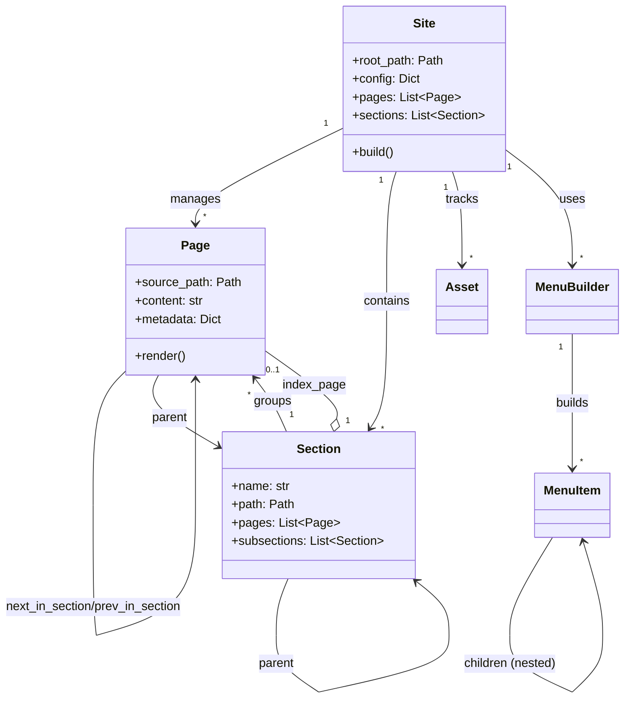

# Object Model

Bengal's object model provides a rich, hierarchical representation of site content with clear relationships and responsibilities.

## Core Objects

::::{tab-set}
:::{tab-item} Site
**Central Data Container** (`bengal/core/site.py`)

Holds all site content and delegates build coordination. It is a passive data container, not a "God object".

**Key Attributes:**
- `pages`: List of all Page objects
- `sections`: List of all Section objects
- `assets`: List of all Asset objects
- `config`: Configuration dictionary
- `menu`: Built navigation menus

**Key Methods:**
- `build()`: Delegates to `BuildOrchestrator`
- `discover_content()`: Delegates to `ContentOrchestrator`
:::

:::{tab-item} Page
**Content Unit** (`bengal/core/page/`)

Represents a single content page with source, metadata, rendered HTML, and navigation.

**Architecture:**
Split into focused mixins:
- `metadata.py`: Frontmatter parsing
- `navigation.py`: Next/prev/parent links
- `relationships.py`: Section membership
- `computed.py`: URL generation, TOC
- `operations.py`: Rendering logic
:::

:::{tab-item} Section
**Structural Unit** (`bengal/core/section.py`)

Represents folder-based grouping of pages with hierarchical organization.

**Features:**
- **Hierarchy**: Parent/child relationships (`subsections`)
- **Navigation**: Access to `regular_pages` and `sections`
- **Cascade**: Inheritance of frontmatter metadata to descendants
:::

:::{tab-item} Asset
**Static Resource** (`bengal/core/asset.py`)

Handles static files (images, CSS, JS) with optimization.

**Capabilities:**
- Minification (CSS/JS)
- Image optimization
- Cache busting (fingerprinting)
- Output copying
:::

:::{tab-item} Menu
**Navigation Structure** (`bengal/core/menu.py`)

Provides hierarchical navigation menus built from config + frontmatter.

**Components:**
- `MenuItem`: Nested item with active state
- `MenuBuilder`: Constructs hierarchy and marks active items
:::
::::

## PageProxy & Cache Contract

To enable incremental builds, we cache page metadata and lazy-load full content only when needed.

**Critical Invariant**: Any property added to `Page` that templates access **MUST** also be added to `PageProxy` and `PageMetadata`.

:::::{dropdown} Refactoring Recommendations
We are evaluating options to strictly enforce this contract.

::::{tab-set}
:::{tab-item} 1. Shared Base Class
**Best for Type Safety + DRY**

```python
@dataclass
class PageCore(Cacheable):
    """Single source of truth for cacheable fields."""
    title: str
    date: datetime | None = None
    # ...

class Page(PageCore):
    content: str  # Non-cacheable

PageMetadata = PageCore
```
:::

:::{tab-item} 2. Decorators
**Automatic Generation**

```python
@cacheable_fields(["title", "date"])
class Page:
    # ...
```
:::

:::{tab-item} 3. Protocol
**Defensive Validation**

```python
class Cacheable(Protocol):
    title: str
    date: datetime | None
```
:::

:::{tab-item} 4. Pydantic
**Industry Standard**

Using Pydantic models for automatic serialization and validation.
:::

:::{tab-item} 5. Code Gen
**Hugo Approach**

Generating Python classes from a YAML schema definition.
:::
::::
:::::

## Object Model Relationships


