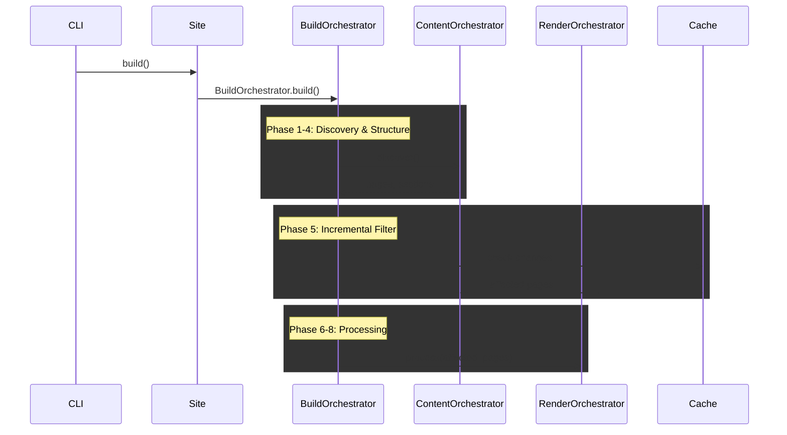

# Orchestration System

Bengal's orchestration system coordinates the build process through specialized orchestrator classes, each responsible for a specific phase of the build pipeline.

## Overview

The orchestration subsystem (`bengal/orchestration/`) implements the **delegation pattern** where the `Site` object delegates build coordination to specialized orchestrators. This design avoids "God objects" and provides clear separation of concerns.

:::{card} Key Principle
**Site** is a passive data container.
**Orchestrators** handle the active build logic.
:::

## Build Pipeline

The build process follows a strict sequence of 10 phases.



## Orchestrator Reference

::::{tab-set}
:::{tab-item} Build
**BuildOrchestrator** (`build.py`)

The main conductor.
- **Coordinates** all other orchestrators
- **Manages** `BuildContext` threading
- **Handles** parallel vs sequential execution
- **Collects** build statistics
:::

:::{tab-item} Content
**ContentOrchestrator** (`content.py`)

Finds and organizes content.
- **Delegates** to `ContentDiscovery`
- **Links** navigation (next/prev/parent)
- **Applies** cascade metadata
- **Builds** cross-reference index
:::

:::{tab-item} Render
**RenderOrchestrator** (`render.py`)

Coordinates page rendering.
- **Manages** parallel rendering threads
- **Injects** `BuildContext` dependencies
- **Handles** errors gracefully
- **Writes** output files
:::

:::{tab-item} Incremental
**IncrementalOrchestrator** (`incremental.py`)

The decision maker.
- **Detects** file changes (SHA256)
- **Queries** dependency graph
- **Filters** work to minimal set
- **Updates** cache on success
:::
::::

## Specialized Orchestrators

::::{cards}
:columns: 2
:gap: medium
:variant: explanation

:::{card} Section Orchestrator
:icon: folder
Ensures every section has an index page and validates hierarchy structure.
:::

:::{card} Taxonomy Orchestrator
:icon: tag
Collects tags/categories and generates term/list pages (incremental-aware).
:::

:::{card} Menu Orchestrator
:icon: list
Builds hierarchical navigation menus from config and frontmatter.
:::

:::{card} Asset Orchestrator
:icon: image
Processes static assets (minify, optimize, fingerprint) in parallel.
:::

:::{card} Postprocess Orchestrator
:icon: check-circle
Generates sitemap, RSS, and runs link validation after rendering.
:::
::::

## Architecture Patterns

### 1. BuildContext Threading

To avoid global state, we pass a `BuildContext` object through the pipeline.

```python
# Created in Phase 0
ctx = BuildContext(site=site)

# Threaded through phases
ContentOrchestrator.discover(ctx)
RenderOrchestrator.process(ctx, pages)
PostprocessOrchestrator.run(ctx)
```

### 2. Smart Parallelization

Orchestrators automatically switch between sequential and parallel execution based on workload size to avoid thread overhead.

```python
def process(items, parallel=True):
    # Threshold avoids overhead for small sites
    if parallel and len(items) > PARALLEL_THRESHOLD:
        with ThreadPoolExecutor() as executor:
            # Parallel execution
            pass
    else:
        # Sequential execution
        pass
```

### 3. Incremental Intelligence

The `IncrementalOrchestrator` acts as a filter before heavy lifting begins.

1. **Detect**: Find changed files
2. **Trace**: Find dependents (pages using changed templates)
3. **Filter**: Pass ONLY affected items to Render/Asset orchestrators
