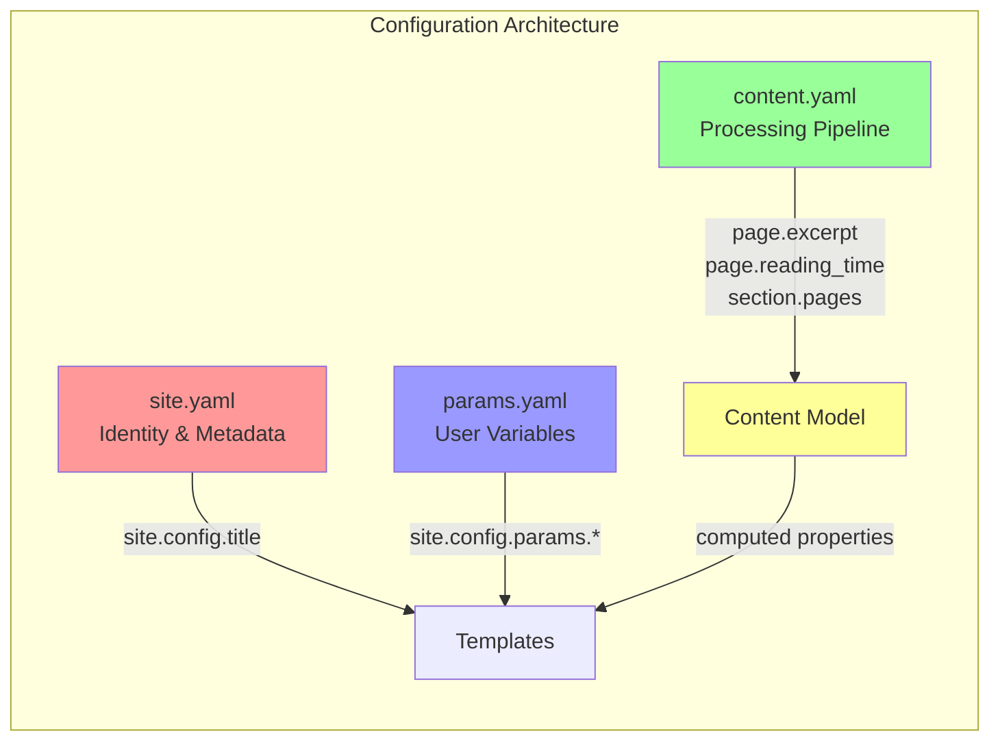

# Configuration System

Bengal's configuration system provides flexible, format-agnostic loading of site configuration with clear architectural boundaries.

## Design Philosophy

Bengal's configuration follows the **Separation of Concerns** principle with three distinct layers:



### Three-Layer Architecture

1. **`site.yaml` - Identity & Metadata**
   - Who you are: title, author, baseurl
   - Site structure: menus, taxonomies
   - **Does NOT** control content processing or theme behavior

2. **`content.yaml` - Processing Pipeline (Bengal's Core API)**
   - How Bengal computes content
   - Theme-independent processing: `page.excerpt`, `page.reading_time`, `page.toc`
   - Section organization: sorting, filtering, type detection
   - **This is Bengal's API to theme developers**

3. **`params.yaml` - User Variables**
   - Custom site-specific data
   - Accessible in templates/markdown: `{{ site.config.params.product_name }}`
   - Not processed by Bengal, just passed through

### Why This Architecture?

**Aligns with Design Principles:**
- ✅ **Single Responsibility**: Each config file has one clear purpose
- ✅ **Separation of Concerns**: Identity vs. Processing vs. Data
- ✅ **Theme Independence**: Content processing separate from presentation
- ✅ **Explicit is Better Than Implicit**: Clear what each setting controls
- ✅ **Composition Over Inheritance**: Content model composes from config

**Example: Theme Switch Scenario**
```yaml
# When switching themes, you DON'T touch:
content:
  excerpt_length: 200      # Bengal still computes 200-char excerpts
  reading_speed: 250       # Bengal still calculates at 250 WPM
  default_type: "doc"      # Sections still default to doc type

# New theme just displays what Bengal computed:
# {{ page.excerpt }} - still 200 chars
# {{ page.reading_time }} - still calculated at 250 WPM
```

## Config Loader (`bengal/config/loader.py`)

### Purpose
Load and manage site configuration from TOML, YAML, or directory structures

### Features
- Supports TOML and YAML formats
- Supports directory-based config (config/_default/, config/environments/)
- Auto-detects config files
- Provides sensible defaults
- Flattens nested configuration for easy access
- **Uses Utilities**: Delegates to `bengal.utils.file_io` for robust file loading with error handling

### Auto-Detection Order
1. `bengal.toml`
2. `bengal.yaml` / `bengal.yml`
3. `config.toml`
4. `config.yaml` / `config.yml`

### Configuration Structure (Single File - bengal.toml)

```toml
# bengal.toml - All-in-one configuration

[site]
title = "My Site"
description = "A Bengal SSG site"
baseurl = "https://example.com"
language = "en"

[content]
# Bengal's content processing pipeline
default_type = "doc"
excerpt_length = 200
reading_speed = 250
related_count = 3
toc_depth = 3

[params]
# User custom variables
product_name = "My Product"
api_url = "https://api.example.com"

[build]
output_dir = "public"
markdown_engine = "mistune"
parallel = true
incremental = false

[theme]
name = "default"

[site.taxonomies]
- tags
- categories

[site.menu.main]
[[site.menu.main]]
name = "Home"
url = "/"
weight = 1
```

### Configuration Structure (Directory - Recommended)

```
config/
├── _default/
│   ├── site.yaml      # Identity: title, author, menus, taxonomies
│   ├── content.yaml   # Processing: excerpt_length, toc_depth, sorting
│   ├── params.yaml    # Variables: product_name, api_url, custom data
│   ├── build.yaml     # Build: parallel, incremental, output_dir
│   └── features.yaml  # Features: analytics, search, comments
├── environments/
│   ├── local.yaml     # Dev overrides
│   └── production.yaml # Prod overrides
└── profiles/
    ├── writer.yaml    # Workflow: fast builds, no validation
    └── dev.yaml       # Workflow: full observability
```

**Example: site.yaml (Identity)**
```yaml
site:
  title: "My Site"
  author: "Your Name"
  baseurl: "https://example.com"

  menu:
    main:
      - name: "Home"
        url: "/"
        weight: 1

  taxonomies:
    - tags
    - categories
```

**Example: content.yaml (Bengal's API)**
```yaml
content:
  # What Bengal computes
  default_type: "doc"
  excerpt_length: 200      # → page.excerpt (200 chars)
  reading_speed: 250       # → page.reading_time (at 250 WPM)
  related_count: 3         # → page.related_posts (3 items)
  toc_depth: 3             # → page.toc (h1-h3)

  # How Bengal organizes
  sort_pages_by: "weight"
  sort_order: "asc"
```

**Example: params.yaml (User Data)**
```yaml
params:
  product_name: "Bengal"
  version: "1.0.0"
  api_url: "https://api.example.com"

  # Accessible in templates:
  # {{ site.config.params.product_name }}
  # {{ site.config.params.api_url }}
```

### Default Configuration

If no config file found, Bengal provides sensible defaults:

```python
{
    'title': 'My Site',
    'base_url': '',
    'output_dir': 'public',
    'content_dir': 'content',
    'assets_dir': 'assets',
    'templates_dir': 'templates',
    'theme': 'default',
    'build': {
        'parallel': True,
        'incremental': False,
        'markdown_engine': 'mistune',
    },
    'taxonomies': {
        'tags': 'tags',
        'categories': 'categories',
    },
}
```

### Usage

```python
from bengal.config import load_config

# Auto-detect and load
config = load_config()

# Load from specific path
config = load_config(Path('my-config.toml'))

# Access values
title = config['title']
parallel = config['build']['parallel']
```

### Content Configuration Details

**What `content.yaml` Controls:**

These settings configure **Bengal's content model**, not theme presentation:

| Setting | Affects | Template Access |
|---------|---------|-----------------|
| `excerpt_length` | `Page.excerpt` property | `{{ page.excerpt }}` |
| `reading_speed` | `Page.reading_time` property | `{{ page.reading_time }}` |
| `summary_length` | `Page.meta_description` property | `{{ page.meta_description }}` |
| `related_count` | `Page.related_posts` property | `` |
| `related_threshold` | Related posts algorithm | (internal) |
| `toc_depth` | `Page.toc` generation | `{{ page.toc \| safe }}` |
| `toc_min_headings` | When TOC is generated | (internal) |
| `default_type` | `Section` content type detection | (internal) |
| `sort_pages_by` | `Section.pages` ordering | `` |

**Key Insight**: Bengal computes these properties during build. Themes just display them.

### Configuration Validation

The ConfigValidator (part of health check system) validates:
- Required fields present
- Valid values for enums
- Path existence
- Type correctness
- Common misconfigurations
- Separation of concerns (warns if mixing concerns)
