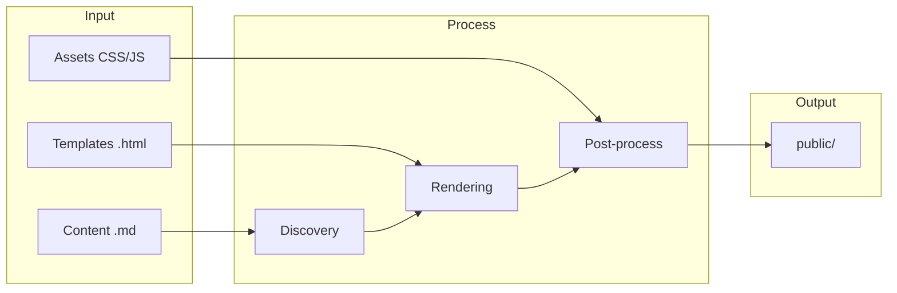

# Core Concepts

Understand how Bengal organizes content, processes files, and generates sites.

## The Build Model



## Key Concepts

| Concept | What It Means |
|---------|---------------|
| **Page** | A single content file (`.md`) → single HTML output |
| **Section** | A directory with `_index.md` → list page with children |
| **Leaf Bundle** | A directory with `index.md` → page with co-located assets |
| **Template** | Jinja2 HTML that wraps your content |
| **Asset** | CSS, JS, images — processed, optimized, and fingerprinted |
| **Cascade** | Metadata inheritance from section `_index.md` to child pages |

## Mental Model

:::{tab-set}
:::{tab-item} Files → Pages
Your file structure becomes your URL structure:

```text
content/blog/hello.md → /blog/hello/
content/docs/_index.md → /docs/
```

:::

:::{tab-item} Templates → Layouts
Templates wrap content in HTML. Bengal provides 80+ template helpers:

```text
page.content + single.html → final HTML
```

:::

:::{tab-item} Assets → Output
Static files are copied, optimized, and fingerprinted for cache-busting:

```text
assets/css/main.css → public/assets/css/main.a1b2c3.css
```

:::
:::{/tab-set}

:::{tip}
**Start simple**: Most sites only need pages and a theme. Add sections when you need grouping, leaf bundles when you need co-located assets.
:::
