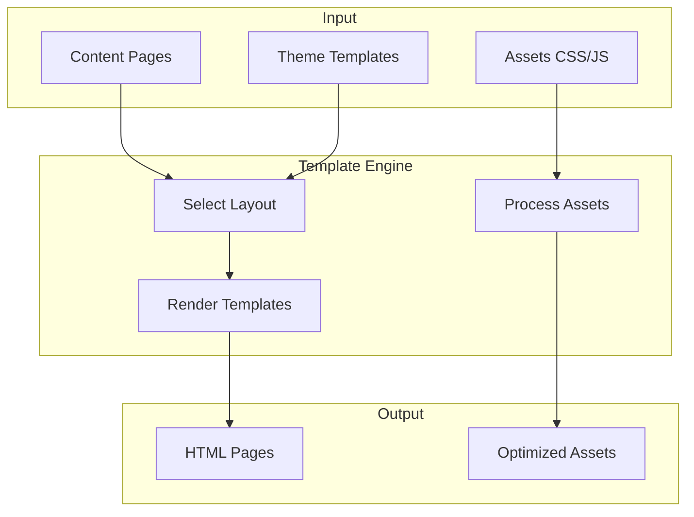

---

title: Theming
description: Templates, assets, and visual customization
weight: 25
icon: palette
tags:
- persona-themer
aliases:
  - /docs/theming/
aliases:
  - /docs/build-sites/customize/
  - /docs/theming/
---

# Design & Theming

Customize templates, CSS/JS assets, and theme packages — or skip entirely and
use the default theme.

:::{note}
**Do I need this?** Yes when changing layout, appearance, or template logic.
**Writers** can skip this section — the default theme works out of the box.
Start with [[docs/get-started/quickstart-themer|Themer Quickstart]], then
[[docs/build-sites/customize/themes/customize|Customize the Default Theme]].
:::

**Customizing appearance?** This section covers [[ext:kida:|Kida]] templates,
CSS/JS assets, and theme packages.

:::{glossary}
:tags: persona-themer
:limit: 4
:collapsed: true
:::

:::{child-cards}
:columns: 2
:include: sections
:fields: title, description, icon
:::

## How Theming Works

## Customization Levels

| Level | Effort | What You Can Change |
|-------|--------|---------------------|
| **CSS Variables** | Low | Colors, fonts, spacing via `--var` overrides |
| **Template Overrides** | Medium | Copy and modify specific templates with [swizzling](./themes/customize/) |
| **Custom Theme** | High | Full control over all templates and assets |

:::{tip}
**Quick wins**: Start with [CSS Variables](./themes/customize/) to change colors and fonts without touching templates. Use `bengal theme swizzle --template-path <template>` to copy and customize specific templates when you need structural changes.
:::

## Reference

| Reference | Description |
|-----------|-------------|
| [Theme Variables](/docs/reference/theme-variables/) | Complete `page`, `site`, `section` object reference |
| [Template Functions](/docs/reference/template-functions/) | 80+ filters and functions for templates |
| [Kida Syntax](/docs/reference/kida-syntax/) | Kida template engine syntax reference ([[ext:kida:docs|full docs]]) |
