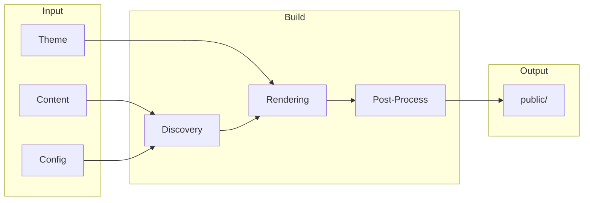

# Build & Deploy

Configure, build, optimize, and deploy your Bengal site.

## What Do You Need?

:::{child-cards}
:columns: 2
:include: sections
:fields: title, description, icon
:::

## Build Pipeline



## Quick Reference

| I want to... | Go to... |
|--------------|----------|
| Configure my site | [Configuration](./configuration/) |
| Build for production | [Commands](./commands/) |
| Speed up builds | [Performance](./performance/) |
| Deploy my site | [Deployment](./deployment/) |
| Fix build errors | [Troubleshooting](./troubleshooting/) |

## Essential Commands

```bash
# Development (live reload, opens browser)
bengal serve

# Production build
bengal build --environment production --strict

# Fast CI build
bengal build --fast --environment production

# Validate content
bengal validate

# Clean and rebuild
bengal clean --cache && bengal build
```

:::{tip}
**Quick start**: Run `bengal serve` for development with live reload. For production, use `bengal build --environment production --strict`.
:::
