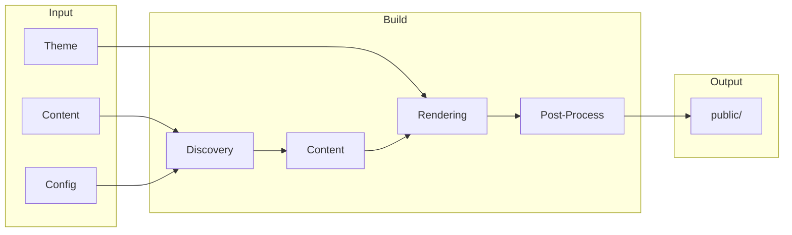

# Build & Deploy

Configure, build, optimize, and deploy your Bengal site.

## What Do You Need?

:::{child-cards}
:columns: 2
:include: sections
:fields: title, description, icon
:::

## Build Pipeline



## Quick Reference

| I want to... | Go to... |
|--------------|----------|
| Configure my site | [Configuration](./configuration/) |
| Build for production | [Commands](../reference/architecture/tooling/cli/#commands) |
| Speed up builds | [Performance](./performance/) |
| Generate JSON/LLM output | [Output Formats](./output-formats.md) |
| Deploy my site | [Deployment](./deployment/) |
| Fix build errors | [Troubleshooting](./troubleshooting/) |

## Essential Commands

```bash
# Development server with live reload
bengal serve                # or: bengal s

# Production build (recommended for deployment)
bengal build --environment production --strict

# Fast CI build (parallel, quiet output)
bengal build --fast --environment production

# Validate content before building
bengal validate             # or: bengal v

# Clean cache and rebuild from scratch
bengal clean --cache && bengal build
```
