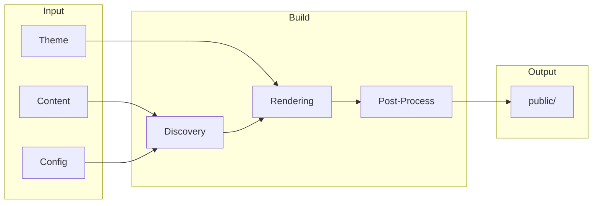

# Build & Deploy

Configure, build, optimize, and deploy your Bengal site.

## What Do You Need?

::::{cards}
:columns: 2
:gap: medium

:::{card} ⚙️ Configuration
:link: ./configuration/
:color: blue

Set up `bengal.toml`, environment overrides, and project settings.
:::

:::{card} 💻 Commands
:link: ./commands/
:color: green

CLI workflows for building, serving, and validating your site.
:::

:::{card} ⚡ Performance
:link: ./performance/
:color: purple

Incremental builds, parallel processing, and caching strategies.
:::

:::{card} 🚀 Deployment
:link: ./deployment/
:color: orange

Deploy to GitHub Pages, Netlify, Vercel, and other platforms.
:::
::::

## Build Pipeline

## Quick Reference

| I want to... | Go to... |
|--------------|----------|
| Configure my site | [Configuration](./configuration/) |
| Build for production | [Commands](./commands/) |
| Speed up builds | [Performance](./performance/) |
| Deploy my site | [Deployment](./deployment/) |

:::{tip}
**Quick start**: Run `bengal build` for production, `bengal serve` for development. Add `--environment production` for production builds with optimizations.
:::
