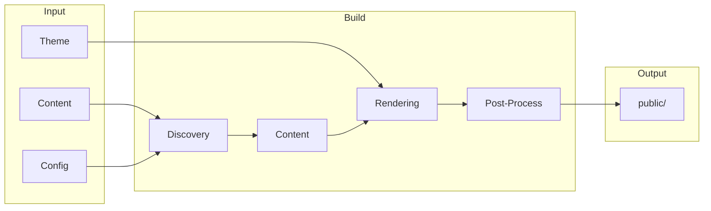

# Build & Deploy

Configure, build, optimize, improve SEO/discovery, and deploy your Bengal site.

## What Do You Need?

:::{child-cards}
:columns: 2
:include: sections
:fields: title, description, icon
:::

## Build Pipeline


```mermaid
flowchart LR
    subgraph Input
        A[Content]
        B[Config]
        C[Theme]
    end

    subgraph Build
        D[Discovery]
        E[Content]
        F[Rendering]
        G[Post-Process]
    end

    subgraph Output
        H[public/]
    end

    A --> D
    B --> D
    D --> E
    C --> F
    E --> F
    F --> G
    G --> H
```

## Quick Reference

| I want to... | Go to... |
|--------------|----------|
| Configure my site | [Configuration](./configuration/) |
| Improve metadata, sitemap, feeds, and social sharing | [SEO & Discovery](./seo.md) |
| Add "Connect to IDE" button for Cursor MCP | [Connect to IDE](./connect-to-ide.md) |
| Build OSS vs Enterprise variants | [Multi-Variant Builds](./configuration/variants) |
| Build for production | [Commands](../reference/architecture/tooling/cli/#commands) |
| Speed up builds | [Performance](./performance/) |
| Generate JSON/LLM output | [Output Formats](./output-formats.md) |
| Understand DX hints (Docker, WSL, K8s) | [DX Hints](./dx-hints.md) |
| Deploy my site | [Deployment](./deployment/) |
| Fix build errors | [Troubleshooting](./troubleshooting/) |

## Essential Commands

```bash
# Development server with live reload
bengal serve                # or: bengal s

# Production build (recommended for deployment)
bengal build --environment production --strict

# Fast CI build (parallel, quiet output)
bengal build --fast --environment production

# Validate content before building
bengal validate             # or: bengal v

# Clean cache and rebuild from scratch
bengal clean --cache && bengal build
```

`bengal serve` keeps HTML, markdown negotiation, custom 404 pages, and live
reload under Bengal's dev-server path. Static assets such as CSS, JavaScript,
images, fonts, media, PDFs, and WebAssembly are served through Pounce's static
file handler, so browsers get ETags, `304 Not Modified` revalidation, byte-range
responses, and precompressed `.gz`/`.zst` variants when those files exist.
