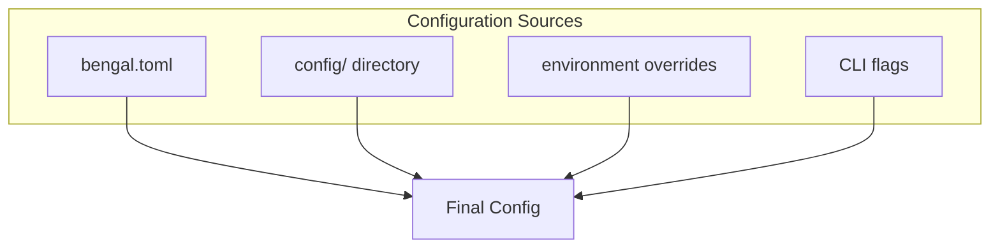

# Configuration

Control Bengal's behavior through `bengal.toml` and environment-specific settings.

## Configuration Methods



Settings merge in order: `bengal.toml` → `config/` → environment → CLI flags.

## Quick Start

```toml
# bengal.toml
[site]
title = "My Site"
base_url = "https://example.com"
language = "en"

[build]
output_dir = "public"
clean = true

[theme]
name = "default"
```

## Configuration Patterns

::::{tab-set}
:::{tab-item} Single File
Best for small sites:

```toml
# bengal.toml - everything in one place
[site]
title = "My Blog"

[build]
output_dir = "public"

[theme]
name = "default"
```
:::

:::{tab-item} Directory-Based
Best for larger sites:

```
config/
├── _default/
│   ├── site.yaml
│   ├── build.yaml
│   └── theme.yaml
└── environments/
    ├── production.yaml
    └── staging.yaml
```
:::
::::

## Environment Overrides

Run with different settings per environment:

```bash
bengal build --environment production
```

```yaml
# config/environments/production.yaml
site:
  base_url: "https://example.com"

build:
  minify: true
  fingerprint: true
```

:::{tip}
**Best practice**: Keep development settings in `bengal.toml`, add production overrides in `config/environments/production.yaml`.
:::
