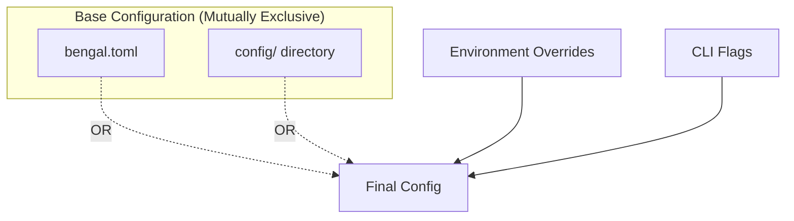

# Configuration

Control Bengal's behavior through `bengal.toml` and environment-specific settings.

## Configuration Methods



Bengal loads configuration from **either** the `config/` directory (preferred) **OR** `bengal.toml` (legacy/simple). If `config/` exists, `bengal.toml` is ignored.

Overrides apply in order: Base Config → Environment Overrides → CLI Flags.

## Quick Start

```toml
# bengal.toml
[site]
title = "My Site"
baseurl = "https://example.com"
language = "en"

[build]
output_dir = "public"
parallel = true
incremental = true

[theme]
name = "default"
```

## Configuration Patterns

:::{tab-set}
:::{tab-item} Single File
Best for small sites:

```toml
# bengal.toml - everything in one place
[site]
title = "My Blog"

[build]
output_dir = "public"

[theme]
name = "default"
```
:::

:::{tab-item} Directory-Based
Best for larger sites:

```tree
config/
├── _default/
│   ├── site.yaml
│   ├── build.yaml
│   └── theme.yaml
└── environments/
    ├── production.yaml
    └── staging.yaml
```
:::
:::{/tab-set}

## Environment Overrides

Run with different settings per environment:

```bash
bengal build --environment production
```

```yaml
# config/environments/production.yaml
site:
  baseurl: "https://example.com"

build:
  minify_html: true
  strict_mode: true

assets:
  fingerprint: true
```

:::{tip}
**Best practice**: Keep development settings in `bengal.toml`, add production overrides in `config/environments/production.yaml`.
:::

## Build Options Reference

Key `[build]` configuration options:

| Option | Type | Default | Description |
|--------|------|---------|-------------|
| `output_dir` | string | `"public"` | Directory for generated files |
| `parallel` | bool | `true` | Enable parallel processing |
| `incremental` | bool | `true` | Only rebuild changed content |
| `minify_html` | bool | `true` | Minify HTML output |
| `validate_templates` | bool | `false` | Proactive template syntax validation |
| `validate_build` | bool | `true` | Post-build validation checks |
| `validate_links` | bool | `true` | Check for broken internal links |
| `strict_mode` | bool | `false` | Fail build on any error or warning |
| `fast_mode` | bool | `false` | Enable maximum performance optimizations |

### Asset Options

Configure asset processing in the `[assets]` section:

| Option | Type | Default | Description |
|--------|------|---------|-------------|
| `minify` | bool | `true` | Minify CSS/JS assets |
| `optimize` | bool | `true` | Optimize images |
| `fingerprint` | bool | `true` | Add content hash to asset URLs |

```toml
[assets]
minify = true
optimize = true
fingerprint = true
```

### Template Validation

Enable `validate_templates` to catch template syntax errors early during builds:

```toml
[build]
validate_templates = true
```

When enabled, Bengal validates all templates (HTML/XML) in your template directories before rendering. This provides early feedback on syntax errors, even for templates that might not be used by every page.

:::{tab-set}
:::{tab-item} Development
Enable template validation during development for immediate feedback:

```toml
[build]
validate_templates = true
```
:::

:::{tab-item} CI/CD
Combine with strict mode in CI pipelines to fail builds on template errors:

```toml
[build]
validate_templates = true
strict_mode = true
```
:::
:::{/tab-set}

**When to enable:**
- During active theme development
- In CI/CD pipelines
- When debugging template issues

**What it catches:**
- Jinja2 syntax errors (unclosed tags, invalid filters)
- Unknown filter names
- Template assertion errors

:::{note}
Template validation adds a small overhead to build time. For large sites, consider enabling it only in development and CI environments.
:::
