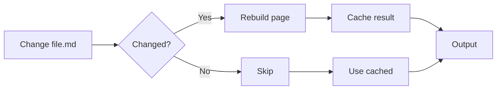

# Optimize Build Performance

Speed up Bengal with incremental builds, parallel processing, and smart caching.

## Do I Need This?

:::{note}
**Skip this if**: Your site builds in under 10 seconds.  
**Read this if**: You have 500+ pages or builds feel slow.
:::

## Quick Wins

Bengal optimizes builds automatically — no configuration required:

- **Parallel processing**: Auto-enabled based on page count and CPU cores
- **Incremental builds**: Auto-enabled when build cache exists
- **Smart caching**: Tracks file changes, dependencies, and parsed content
- **Fast mode**: Skips HTML formatting for faster builds (`--fast` or `build.fast_mode`)
- **Render-time asset tracking**: Tracks assets during template rendering (no HTML parsing)
- **Autodoc AST caching**: Caches parsed Python modules to skip AST parsing on subsequent builds

```toml
# bengal.toml — only needed to override defaults
[build]
max_workers = 8      # Limit parallel workers (default: auto-detect)
```

## How Builds Get Faster



## Performance Strategies

| Strategy | Effort | Speedup | Best For |
|----------|--------|---------|----------|
| **Incremental** | Zero | 15-50x | Development |
| **Parallel** | Zero | 2-8x | Large sites, multi-core |
| **Fast Mode** | Zero | 10-15% | CI/CD (skips HTML formatting) |
| **Asset Tracking** | Zero | 20-25% | Sites with many assets |
| **Autodoc Caching** | Zero | 30-40% | Sites with autodoc (caches AST parsing) |
| **Memory Optimized** | Zero | N/A | 5K+ pages |

:::{note}
**Parallel speedup** depends on Python version: 2-3x with standard Python, 6-8x with free-threaded Python 3.14+.
:::

## Common Commands

```bash
# Fast mode: quiet output, auto-parallel
bengal build --fast

# Force full rebuild (skip cache)
bengal build --no-incremental

# Clear build cache
bengal clean --cache

# Profile build time (saves to .bengal/profiles/)
bengal build --perf-profile

# Profile template rendering
bengal build --profile-templates
```

:::{tip}
**Development workflow**: Keep `bengal serve` running — it uses all optimizations automatically. Full builds are only needed for production.
:::
