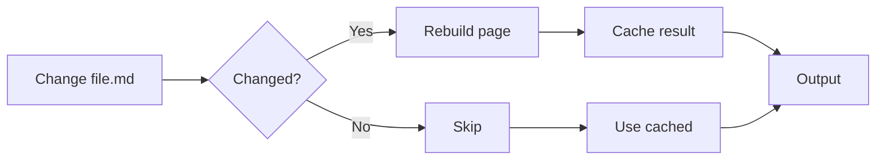

# Optimize Build Performance

Speed up Bengal with incremental builds, parallel processing, and smart caching.

## Do I Need This?

:::{note}
**Skip this if**: Your site builds in under 10 seconds.  
**Read this if**: You have 500+ pages or builds feel slow.
:::

## Quick Wins

```toml
# bengal.toml
[build]
parallel = true      # Enabled by default
incremental = true   # Enabled by default
```

These settings are enabled by default and handle most performance needs automatically.

## How Builds Get Faster



## Performance Strategies

| Strategy | Effort | Speedup | Best For |
|----------|--------|---------|----------|
| **Incremental** | Zero | 10-50x | Development |
| **Parallel** | Zero | 2-8x | Large sites |
| **Fast Mode** | Zero | 2-3x | CI/CD |
| **Memory Optimized** | Zero | N/A | 5K+ pages |

## Common Commands

```bash
# Maximum performance (quiet, parallel)
bengal build --fast

# Force full rebuild
bengal build --no-incremental

# Clear all caches
bengal clean --cache

# Profile build time
bengal build --perf-profile

# Profile template rendering
bengal build --profile-templates
```

:::{tip}
**Development workflow**: Keep `bengal serve` running — it uses all optimizations automatically. Full builds are only needed for production.
:::
