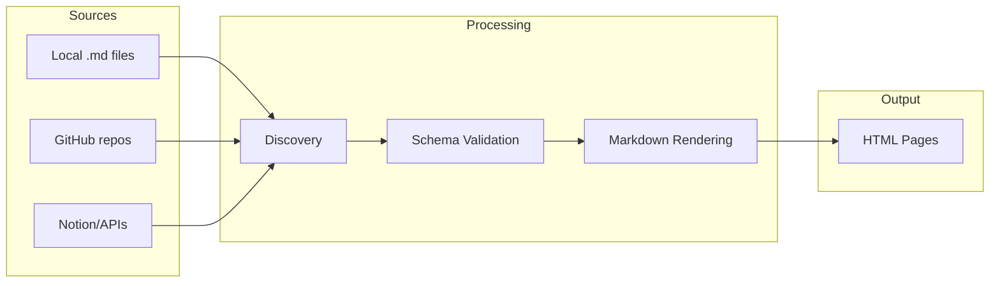

# The Content System

Bengal turns your Markdown files into a structured, validated documentation site.

## What Do You Need?

::::{cards}
:columns: 2
:gap: medium

:::{card}
:link: ./organization/
:pull: title, description
:color: green
:::

:::{card}
:link: ./authoring/
:pull: title, description
:color: blue
:::

:::{card}
:link: ./collections/
:pull: title, description
:color: purple
:::

:::{card}
:link: ./sources/
:pull: title, description
:color: orange
:::

:::{card}
:link: ./reuse/
:pull: title, description
:color: teal
:::
::::

## How Content Flows

:::{tip}
**New to Bengal content?** Start with [Organization](./organization/) to understand how files become pages, then explore [Authoring](./authoring/) for writing syntax.
:::
