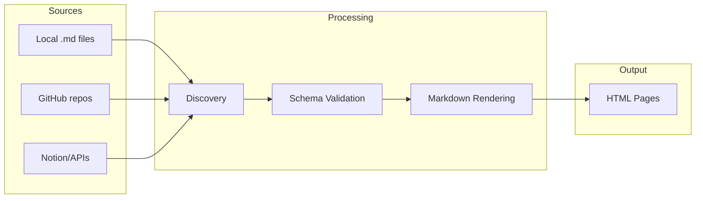

# The Content System

Bengal turns your Markdown files into a structured, validated documentation site.

## What Do You Need?

:::{child-cards}
:columns: 2
:include: sections
:fields: title, description, icon
:::

## How Content Flows

:::{tip}
**New to Bengal content?** Start with [Organization](./organization/) to understand how files become pages, then explore [Authoring](./authoring/) for writing syntax.

**Larger sites?** Check out [Analysis](./analysis/) to optimize internal linking and [Validation](./validation/) for automated quality checks.
:::
