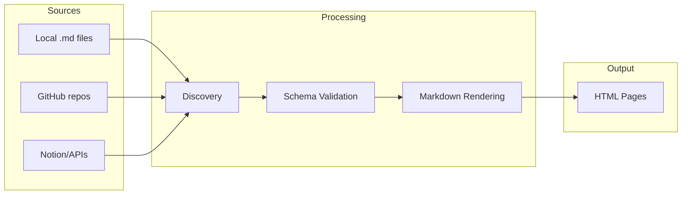

# The Content System

Bengal turns your Markdown files into a structured, validated documentation site.

## What Do You Need?

::::{cards}
:columns: 2
:gap: medium

:::{card} 📁 Organize Content
:link: ./organization/
:color: green

Understand pages, sections, bundles, and how your folder structure becomes your site structure.
:::

:::{card} ✍️ Write Content
:link: ./authoring/
:color: blue

Markdown, MyST directives, admonitions, tabs, and code blocks for rich documentation.
:::

:::{card} ✅ Validate Content
:link: ./collections/
:color: purple

Define schemas for your frontmatter. Catch typos and missing fields at build time.
:::

:::{card} 🔗 Connect Sources
:link: ./sources/
:color: orange

Pull content from GitHub repos, Notion databases, or REST APIs alongside local files.
:::

:::{card} ♻️ Reuse Content
:link: ./reuse/
:color: teal

Snippets, data files, and filtering to write once and publish everywhere.
:::
::::

## How Content Flows

:::{tip}
**New to Bengal content?** Start with [Organization](./organization/) to understand how files become pages, then explore [Authoring](./authoring/) for writing syntax.
:::
