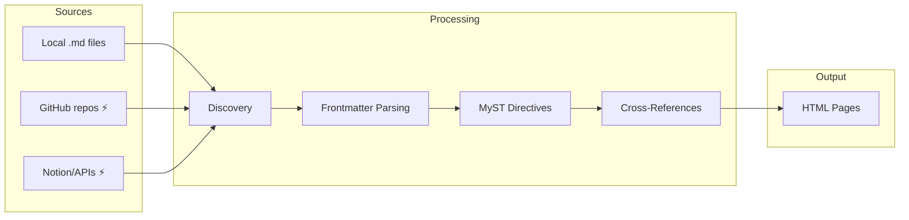

# The Content System

Bengal transforms Markdown files into structured, validated documentation sites with rich directives, cross-references, and automated validation.

## What Do You Need?

:::{child-cards}
:columns: 2
:include: sections
:fields: title, description, icon
:::

## How Content Flows

:::{note}
⚡ Remote sources require optional dependencies. Install with `pip install bengal[all-sources]` or individually: `bengal[github]`, `bengal[notion]`, `bengal[rest]`.
:::

## Key Features

| Feature | Description |
|---------|-------------|
| **Component Model** | `type`, `variant`, and `props` define page identity, appearance, and data |
| **MyST Directives** | Tabs, cards, admonitions, code blocks, and 60+ directives |
| **Cross-References** | `[[path]]` syntax with O(1) lookups and auto-title resolution |
| **Validation** | `bengal validate` checks links, directives, and frontmatter |
| **Graph Analysis** | `bengal graph report` finds orphan pages and suggests links |

:::{tip}
**New to Bengal?** Start with [Organization](./organization/) to understand how files become pages, then explore [Authoring](./authoring/) for MyST syntax.

**Working on a larger site?** Use [Analysis](./analysis/) to optimize internal linking and [Validation](./validation/) for automated quality checks.
:::
