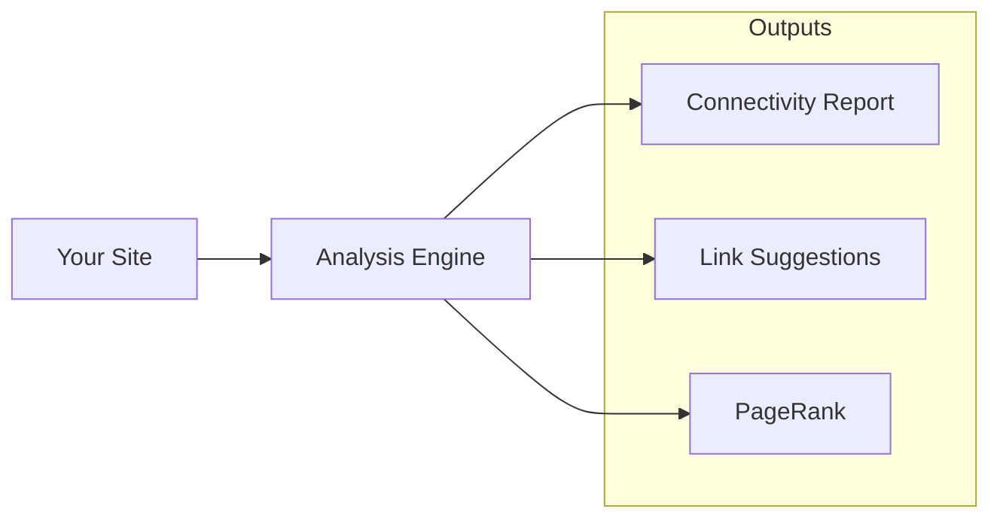

# Site Analysis

Analyze your site's structure to improve navigation and discoverability.

## Do I Need This?

:::{note}
**Skip this if**: Your site has under 50 pages.  
**Read this if**: You have a large site and want to optimize internal linking and find orphan pages.
:::

## Analysis Tools



## Quick Start

:::{tab-set}
:::{tab-item} Report
```bash
# Unified connectivity report
bengal graph report

# Brief output for CI
bengal graph report --brief

# CI mode with thresholds
bengal graph report --ci --threshold-isolated 5
```

Shows:
- Connectivity distribution
- Isolated/lightly-linked pages
- Bridge pages
- Actionable recommendations
:::

:::{tab-item} Orphans
```bash
# Find isolated pages
bengal graph orphans

# Find lightly-linked pages
bengal graph orphans --level lightly

# JSON output for processing
bengal graph orphans --format json

# Paths only (for scripting)
bengal graph orphans --format paths
```

Identifies pages by connectivity level:
- 🔴 Isolated (score < 0.25)
- 🟠 Lightly linked (0.25-1.0)
- 🟡 Adequately linked (1.0-2.0)
- 🟢 Well-connected (≥ 2.0)
:::

:::{tab-item} PageRank
```bash
bengal graph pagerank --top-n 20
```

Identifies:
- Most important pages
- Underlinked valuable content
- Navigation priorities
:::
:::{/tab-set}

## Use Cases

| Goal | Command | Output |
|------|---------|--------|
| Get site health overview | `bengal graph report` | Connectivity distribution and recommendations |
| Find isolated pages | `bengal graph orphans` | Pages needing attention |
| Find bridge pages | `bengal graph bridges` | Navigation bottlenecks |
| Identify key content | `bengal graph pagerank --top-n 20` | Pages ranked by importance |

:::{tip}
**Start with `bengal graph report`** for a unified view of your site structure. Use `--ci` mode in pipelines to fail builds when connectivity thresholds are exceeded.
:::
