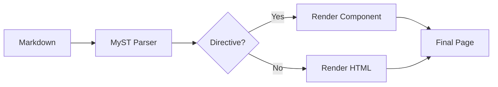

# Writing Content

Bengal uses CommonMark Markdown with [MyST](https://myst-parser.readthedocs.io/) extensions for rich documentation.

## Quick Reference

::::{tab-set}
:::{tab-item} Text
```markdown
**bold** and *italic*
~~strikethrough~~
`inline code`
```
:::

:::{tab-item} Links
```markdown
[External](https://example.com)
[Internal](/docs/getting-started/)
[Relative](../other-page/)
```
:::

:::{tab-item} Images
```markdown


```
:::

:::{tab-item} Code
````markdown
```python
def hello():
    print("Hello!")
```
````

With line highlighting:
````markdown
```python {hl_lines="2"}
def hello():
    print("Highlighted!")
```
````
:::
::::

## MyST Directives

Directives add rich components to your Markdown:

::::{tab-set}
:::{tab-item} Admonitions
```markdown
:::{note}
Informational callout.
:::

:::{warning}
Important warning!
:::

:::{tip}
Helpful suggestion.
:::
```
:::

:::{tab-item} Tabs
```markdown
::::{tab-set}
:::{tab-item} Python
print("Hello")
:::
:::{tab-item} JavaScript
console.log("Hello")
:::
::::
```
:::

:::{tab-item} Cards
```markdown
::::{cards}
:::{card} Title
:link: ./path/
Description here
:::
::::
```
:::

:::{tab-item} Dropdowns
```markdown
:::{dropdown} Click to expand
Hidden content here.
:::
```
:::
::::

## Syntax Overview



:::{tip}
**Most common**: Admonitions (`note`, `warning`, `tip`) and code blocks with syntax highlighting. Start there, add tabs and cards as needed.
:::
