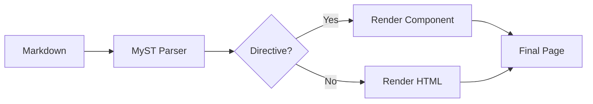

# Writing Content

Bengal uses CommonMark Markdown with MyST-style directive extensions for rich documentation. Write in standard Markdown and extend with 40+ built-in directives.

## What Do You Need?

:::{cards}
:columns: 2

:::{card} Links & Cross-References
:icon: link
:link: ./linking/

Create internal links, cross-references, and anchor links.
:::{/card}

:::{card} External References
:icon: external-link
:link: ./external-references/

Link to Python stdlib, NumPy, and other Bengal sites.
:::{/card}

:::{card} Code Blocks
:icon: code
:link: ./code-blocks/

Syntax highlighting, line numbers, and file includes.
:::{/card}

:::{card} Images & Media
:icon: image
:link: ./images-media/

Add images, figures, videos, and embeds.
:::{/card}

:::{card} Tables
:icon: layers
:link: ./tables/

Simple pipe tables and complex list-tables.
:::{/card}

:::{card} Callouts & Admonitions
:icon: info
:link: ./callouts/

Notes, warnings, tips, and collapsible sections.
:::{/card}

:::{card} Interactive Elements
:icon: layers
:link: ./interactive/

Tabs, dropdowns, steps, and cards.
:::{/card}

:::{/cards}

## Quick Reference

::::{tab-set}
:::{tab-item} Text
```markdown
**bold** and *italic*
~~strikethrough~~
`inline code`
```
:::

:::{tab-item} Links
```markdown
[External](https://example.com)
[Internal](/docs/get-started/)
[[Cross-reference]] docs/page
[[#heading]] Anchor link
[[ext:python:pathlib.Path]]
```
:::

:::{tab-item} Code
````markdown
```python
def hello():
    print("Hello!")
```
````

With line highlighting:
````markdown
```python {hl_lines="2"}
def hello():
    print("Highlighted!")
```
````
:::

:::{tab-item} Callouts
```markdown
:::{note}
Informational callout.
:::

:::{warning}
Important warning!
:::

:::{tip}
Helpful suggestion.
:::
```
:::
::::

## How Content Flows



## Variable Substitution

Use `{{ variable }}` syntax to insert frontmatter values directly into your content:

```markdown
---
product_name: Bengal
version: 1.0.0
beta: true
---

Welcome to **{{ product_name }}** version {{ version }}.


:::{warning}
This is a beta release.
:::

```

:::{note}
Bengal uses Kida templating which supports both `` (unified syntax) and `` (Jinja-compatible). Use whichever you prefer.
:::

### Available Variables

| Variable | Source | Example |
|----------|--------|---------|
| `{{ page.title }}` | Current page | `{{ page.title }}` |
| `{{ page.description }}` | Current page | `{{ page.description }}` |
| `{{ product_name }}` | Frontmatter | Direct access to any frontmatter key |
| `{{ params.key }}` | Frontmatter | Hugo-style access via `params` |
| `{{ site.title }}` | Site config | `{{ site.title }}` |
| `{{ site.baseurl }}` | Site config | `{{ site.baseurl }}` |

### Cascaded Variables

Variables cascade from parent sections. Set them once in a section's `_index.md`:

```yaml
# docs/api/_index.md
---
title: API Reference
cascade:
  api_version: v2
  deprecated: false
---
```

Then use in any child page:

```markdown
# docs/api/users.md
This endpoint uses API {{ api_version }}.
```

:::{tip}
**Common use cases**: Product names, version numbers, feature flags, environment-specific values, and cascaded metadata like API versions or status badges.
:::

## Available Directives

Bengal provides 40+ directives organized by category:

| Category | Directives |
|----------|------------|
| **Admonitions** | `note`, `tip`, `warning`, `danger`, `error`, `info`, `example`, `success`, `caution`, `seealso` |
| **Layout** | `tabs`, `tab-set`, `cards`, `card`, `child-cards`, `grid`, `container`, `steps`, `step`, `dropdown` |
| **Tables** | `list-table`, `data-table` |
| **Code** | `code-tabs`, `literalinclude` |
| **Media** | `youtube`, `vimeo`, `tiktok`, `video`, `audio`, `figure`, `gallery` |
| **Embeds** | `gist`, `codepen`, `codesandbox`, `stackblitz`, `asciinema`, `spotify`, `soundcloud` |
| **Navigation** | `breadcrumbs`, `siblings`, `prev-next`, `related` |
| **Versioning** | `since`, `deprecated`, `changed` |
| **Utilities** | `badge`, `button`, `icon`, `rubric`, `target`, `include`, `glossary`, `checklist`, `marimo` |

::::{seealso}
- [[docs/reference/directives|Directives Reference]] — Complete directive documentation
- [[docs/reference/icons|Icon Reference]] — Available icons
::::
