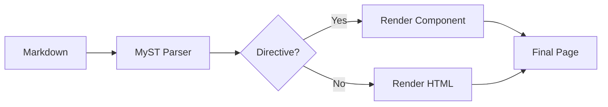

# Writing Content

Bengal uses CommonMark Markdown with [MyST](https://myst-parser.readthedocs.io/) extensions for rich documentation.

## Quick Reference

::::{tab-set}
:::{tab-item} Text
```markdown
**bold** and *italic*
~~strikethrough~~
`inline code`
```
:::

:::{tab-item} Links
```markdown
[External](https://example.com)
[Internal](/docs/get-started/)
[Relative](../other-page/)
```
:::

:::{tab-item} Images
```markdown


```
:::

:::{tab-item} Code
````markdown
```python
def hello():
    print("Hello!")
```
````

With line highlighting:
````markdown
```python {hl_lines="2"}
def hello():
    print("Highlighted!")
```
````
:::
::::

## MyST Directives

Directives add rich components to your Markdown:

:::{tab-set}
:::{tab} Admonitions
```markdown
:::{note}
Informational callout.
:::

:::{warning}
Important warning!
:::

:::{tip}
Helpful suggestion.
:::
```
:::{/tab}

:::{tab} Tabs
```markdown
:::{tab-set}
:::{tab} Python
print("Hello")
:::{/tab}
:::{tab} JavaScript
console.log("Hello")
:::{/tab}
:::{/tab-set}
```
:::{/tab}

:::{tab} Cards
```markdown
:::{cards}
:::{card} Title
:link: ./path/
Description here
:::{/card}
:::{/cards}
```
:::{/tab}

:::{tab} Dropdowns
```markdown
:::{dropdown} Click to expand
Hidden content here.
:::
```
:::{/tab}

:::{tab} Media
```markdown
:::{youtube} dQw4w9WgXcQ
:title: Video Title
:::

:::{figure} /images/diagram.png
:alt: Architecture diagram
:caption: System overview
:::
```
:::{/tab}
:::{/tab-set}

## Syntax Overview



:::{tip}
**Most common**: Admonitions (`note`, `warning`, `tip`) and code blocks with syntax highlighting. Start there, add tabs and cards as needed. For visual elements, see the [Icon Reference](/docs/reference/icons/) for inline SVG icons.
:::

## Variable Substitution

Use `{{ variable }}` syntax to insert frontmatter values directly into your content:

```markdown
---
product_name: Bengal
version: 1.0.0
beta: true
---

Welcome to **{{ product_name }}** version {{ version }}.


:::{warning}
This is a beta release.
:::

```

### Available Variables

| Variable | Source | Example |
|----------|--------|---------|
| `{{ page.title }}` | Current page | `{{ page.title }}` |
| `{{ page.description }}` | Current page | `{{ page.description }}` |
| `{{ product_name }}` | Frontmatter | Direct access to any frontmatter key |
| `{{ params.key }}` | Frontmatter | Hugo-style access via `params` |
| `{{ site.title }}` | Site config | `{{ site.title }}` |
| `{{ config.baseurl }}` | Site config | `{{ config.baseurl }}` |

### Cascaded Variables

Variables cascade from parent sections. Set them once in a section's `_index.md`:

```yaml
# docs/api/_index.md
---
title: API Reference
cascade:
  api_version: v2
  deprecated: false
---
```

Then use in any child page:

```markdown
# docs/api/users.md
This endpoint uses API {{ api_version }}.
```

:::{tip}
**Common use cases**: Product names, version numbers, feature flags, environment-specific values, and cascaded metadata like API versions or status badges.
:::
