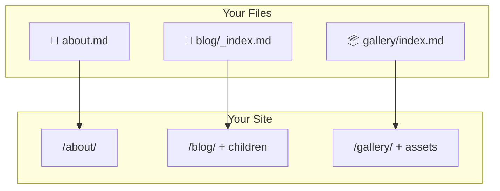

# How Content is Organized

Your folder structure becomes your site structure. No configuration required.

## The Three Content Types



:::{tab-set}
:::{tab-item} 📄 Page
A single `.md` file → a single HTML page.

```tree
content/
└── about.md  →  /about/
```

Use for: standalone pages like About, Contact, Privacy Policy.
:::

:::{tab-item} 📁 Section
A folder with `_index.md` → a list page with children.

```tree
content/
└── blog/
    ├── _index.md     →  /blog/ (list page)
    ├── post-1.md     →  /blog/post-1/
    └── post-2.md     →  /blog/post-2/
```

Use for: blog posts, documentation chapters, any collection.
:::

:::{tab-item} 📦 Bundle
A folder with `index.md` → a page with co-located assets.

```tree
content/
└── gallery/
    ├── index.md      →  /gallery/
    ├── photo-1.jpg   (private to this page)
    └── photo-2.jpg   (private to this page)
```

Use for: pages with images, data files, or other assets.
:::
:::{/tab-set}

## Quick Reference

| Pattern | File | Creates | Assets |
|---------|------|---------|--------|
| **Page** | `name.md` | Single page | Use `static/` |
| **Section** | `name/_index.md` | List + children | Use `static/` |
| **Bundle** | `name/index.md` | Single page | Co-located |

:::{tip}
**Key difference**: `_index.md` creates a section (with children). `index.md` creates a bundle (with assets). The underscore matters!
:::

:::{dropdown} Advanced: Nesting and Cascades
:icon: settings
Sections can nest to any depth:

```
docs/
├── _index.md
├── getting-started/
│   ├── _index.md
│   └── installation.md
└── advanced/
    ├── _index.md
    └── plugins.md
```

Configuration cascades from parent to children:

```yaml
---
title: Docs
cascade:
  type: doc
  toc: true
---
```

All pages under `docs/` inherit `type: doc` and `toc: true` unless they override it.
:::

::::{seealso}
- [[docs/content/organization/component-model|Component Model]] — Understanding type, variant, and props
- [[docs/content/organization/frontmatter|Frontmatter Reference]] — All frontmatter fields
- [[docs/content/organization/menus|Menu Configuration]] — Navigation menus
::::
